# Openstack 应用

## 云平台预科知识

无论你将来想使用的是哪一种云平台， Openstack，cloudstack， vsphere 等。它们的底层都是基于 Linux Kernel Virtual Machine（KVM）内核虚拟化技术的。所以让我们先从一台单机环境下掌握 KVM技术。之后再通过对Openstack的了解和深度的学习完成企业云平台的架构。

### KVM 内核虚拟化


#### kvm初始化

#### kvm 底层存储

#### kvm 网络

#### virt-manager 安装系统

#### kvm 命令行工具

* virsh
* qemu-img
*  qemu-system-x86_64

#### QEMU 使用指南

Qemu 是一个成熟且历史悠久（相对计算机的发展）的利用操作系统实现虚拟化技术. 如果你之前使用过 `VMWARE` 、 `VIRTUAL PC`这类的产品软件. 当你切换到 KVM Qemu时，你的第一感触就是觉得非常的快，因为它使用的是基于硬件下的虚拟化技术. QEMU扮演的是计算机硬件角色而 KVM 指的就是 CPU. 虽然这样，我们还是要对它做小小的配置.

##### qemu-kvm or qemu or qemu-system-x86_64

Qemu是一个历史悠久的大项目. Qemu 基于Linux Kernel Virtualization 项目的名称就命名为KVM.不同的版本基于不同的处理器类型.比如 `qemu-system-x86_64` 就是基于 Intel 框架下64-bit x86结构的虚拟机二进制程序.

##### 安装 Qemu

我们可以安装不同版本的Qemu，有针对于当前流行的处理器类型的多个版本

##### 在 Ubuntu, Debian, Mint, Kali 下安装

```
$ sudo apt install qemu
```

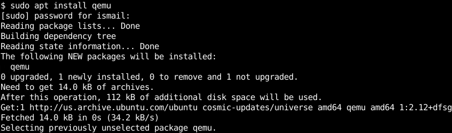

##### 在 Fedora, CentOS, Red Hat 下安装

我们可以使用 `dnf` 或者 `yum`的安装方式

```
$ sudo dnf install qemu
```

或者

```
$ sudo yum install qemu
```

##### qemu 命令帮助

我们可以获得 `qemu` 帮助信息，通过 `-h` 选项即可.

```
$ qemu-system-x86_64 -h
```

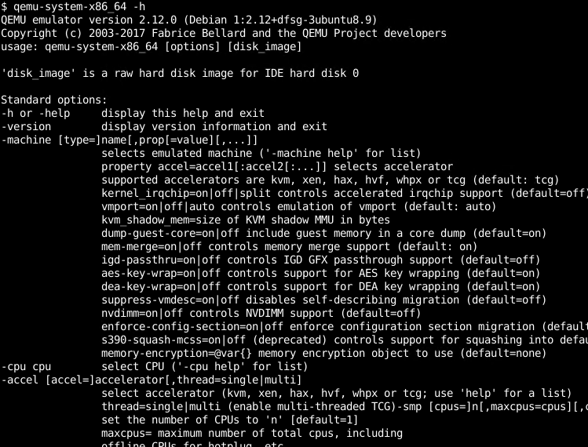

##### qemu 命令语法

绝大多数的命令操作都基于下面的格式

```
qemu-system-x86_64 OPTIONS IMAGE
```

- `OPTIONS` 提供VM 硬件环境，比如内存大小, CPU核的数量，图形等.
- `IMAGE` 就是运行的镜像的名称.

[**参考文档** How To Install VMware Tools To The Linux Debian, Ubuntu, Kali, Mint, Fedora, CentOS, RHEL Distributions](https://www.poftut.com/install-vmware-tools-to-the-linux-debian-ubuntu-kali-mint-fedora-centos-rhel-distributions/)

##### 下载云镜像

市场上流行的 Linux 有 Fedora, CentOS, Debian, Ubuntu, RedHat 它们都提供了不同格式的虚拟机镜像比如  raw, qcow2, vmdk.

```shell
$ wget https://download.fedoraproject.org/pub/fedora/linux/releases/33/Cloud/x86_64/images/Fedora-Cloud-Base-33-1.2.x86_64.qcow2
```

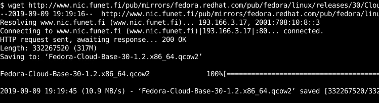

##### 

设置  CPU 核 的数量

CPU也是一个重要的部分， 我们可以通过 `-smp` 选项开启多 CPU核模式再通过 `core=2`这样的方式设定 VM 启动环境下 CPU 的数量.

```
$ qemu-system-x86_64 -smp cores=2
```

##### 从 PXE 网络环境引导

如果公司内部有着网络PXE的安装环境，我们可以指定 `-boot order=nc` 选项.

```shell
$ qemu-system-x86_64 -boot order=nc
```

##### 为虚拟机设置内存大小

内存是VM的一个重要的组件.默认为128M大小，我们可以通过 `-m` 选项指定VM启动的大小.下面例子中指定为256M.

```shell
$ qemu-system-x86_64 -m 256
```


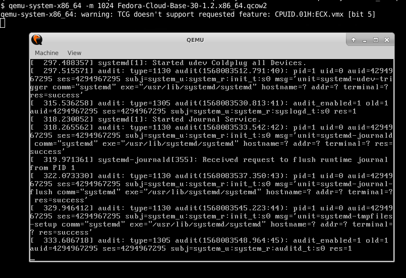

##### 设置虚拟机的名称

我们可以通过 `-name` 选项提供 VM 名称.

```
$ qemu-system-x86_64 -name poftut.com
```

##### 为 Qemu VM 指定文件

我们可以指定磁盘/镜像的文件，通过 `-drive` 选项.同样 `if` 用来配置网卡 NIC 类型

```
$ qemu-system-x86_64 -drive file=fedoraraw.qcow2,if=virtio
```

##### 配置虚拟机网络

默认虚拟机启动存在单一一个网卡而且不连接任何地方，因而无法通过网络访问. 我们可以添加一个网络接口并且将其连接到宿主主机上的一个桥接`bridge`设备。 下面的例子，我们将连接到一个类型为 `virtio` 网卡并模拟网络连线到虚拟交换机 `virbr0`上 .

```shell
$ qemu-system-x86_64 -drive file=fedoraraw.qcow2,if=virtio -display none -net bridge,br=virbr0 -net nic,model=virtio
```

##### Qemu运行远程镜像

下面的例子使用远程的磁盘镜像，采用SSH登录验证的方式

```shell
$ qemu-system-x86_64 -drive file=ssh://ismail@baydan.com/disk.img
```


#### 利用逻辑卷快照快速安装第二套系统

安装自己一套系统或者对系统调优的过程是重复、耗时、枯燥的。很多的云平台对新用户安装系统，只是点击几下，选择几下，系统在短短的时间就创建成功了，这要怎么实现？

答案是逻辑卷的**快照**。


#### 单机环境kvm的弊端

* 宿主主机硬件上限

  宿主主机内存再大，CPU再多，也不能满足企业集团数以百计的不同的应用所需要的虚拟化环境，比如 256G 内存， 32 core的服务器下，每个VM使用4G来计算，（256 / 4）  -  1（宿主需要的内存）

* 宿主主机硬件维修或宕机

  服务器需要检修，或者宕机，那么跑在其上的虚拟机将团灭。

* 底层存储

  单机的硬盘再大也会遇到瓶颈，而多个虚拟机运行的数据获取来自同一块硬盘不可取。

* 多服务的维护

  如果有十多台服务器的中小企业环境，每台服务器上运行三到四个不多的VM，这种场景都会让你每天疲于奔命的找那个宿主主机上运行了什么VM的过程

* 底层网络的配置

    特别在多服务器的场景中，给每台VM做网络配置，并且保证地址不冲突，跨宿主主机之间的通信又是一个挑战。

而这一切都将在开源云平台 openstack 上完美解决


## Openstack 组件结构图

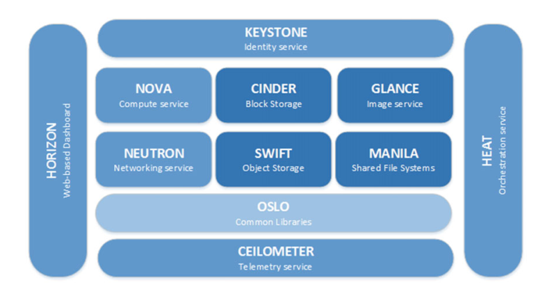


## devstack 安装的服务

* c-\*的服务代表 cinder
* g-\*的服务代表 glance
* n-\*的服务代表 nova

```shell
$ sudo systemctl |grep devstack
devstack@c-api.service                                                                   loaded active running   Devstack devstack@c-api.service                                                      
devstack@c-sch.service                                                                   loaded active running   Devstack devstack@c-sch.service                                                      
devstack@c-vol.service                                                                   loaded active running   Devstack devstack@c-vol.service                                                      
devstack@dstat.service                                                                   loaded active running   Devstack devstack@dstat.service                                                      
devstack@etcd.service                                                                    loaded active running   Devstack devstack@etcd.service                                                       
devstack@g-api.service                                                                   loaded active running   Devstack devstack@g-api.service                                                      
devstack@keystone.service                                                                loaded active running   Devstack devstack@keystone.service                                                   
devstack@n-api-meta.service                                                              loaded active running   Devstack devstack@n-api-meta.service                                                 
devstack@n-api.service                                                                   loaded active running   Devstack devstack@n-api.service                                                      
devstack@n-cond-cell1.service                                                            loaded active running   Devstack devstack@n-cond-cell1.service                                               
devstack@n-cpu.service                                                                   loaded active running   Devstack devstack@n-cpu.service                                                      
devstack@n-novnc-cell1.service                                                           loaded active running   Devstack devstack@n-novnc-cell1.service                                              
devstack@n-sch.service                                                                   loaded active running   Devstack devstack@n-sch.service                                                      
devstack@n-super-cond.service                                                            loaded active running   Devstack devstack@n-super-cond.service                                               
devstack@placement-api.service                                                           loaded active running   Devstack devstack@placement-api.service                                              
devstack@q-agt.service                                                                   loaded active running   Devstack devstack@q-agt.service                                                      
devstack@q-dhcp.service                                                                  loaded active running   Devstack devstack@q-dhcp.service                                                     
devstack@q-l3.service                                                                    loaded active running   Devstack devstack@q-l3.service                                                       
devstack@q-meta.service                                                                  loaded active running   Devstack devstack@q-meta.service                                                     
devstack@q-svc.service                                                                   loaded active running   Devstack devstack@q-svc.service                                                      
system-devstack.slice                                                                    loaded active active    system-devstack.slice
```


##### systemctl 服务

重启所有 devstack 相关的服务

```shell
$ sudo systemctl restart devstack@*
```

重启 nova 相关的服务

```shell
$ sudo systemctl status devstack@n-*
```

##### 查看单个服务日志信息

```shell
$ sudo journalctl  -f --unit devstack@n-cpu.service
```


## 镜像管理


### 云生态镜像下载地址

CirrOS http://download.cirros-cloud.net/
Ubuntu http://cloud-images.ubuntu.com/
Debian http://cdimage.debian.org/cdimage/openstack/
Fedora https://getfedora.org/cloud/download/
CentOS http://cloud.centos.org/centos/7/
Windows Server 2012 R2 Evaluation for OpenStack https://cloudbase.it/windows-cloud-images/  

### 面板下添加镜像

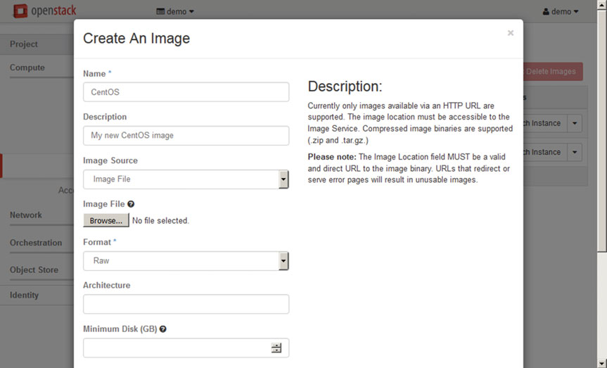

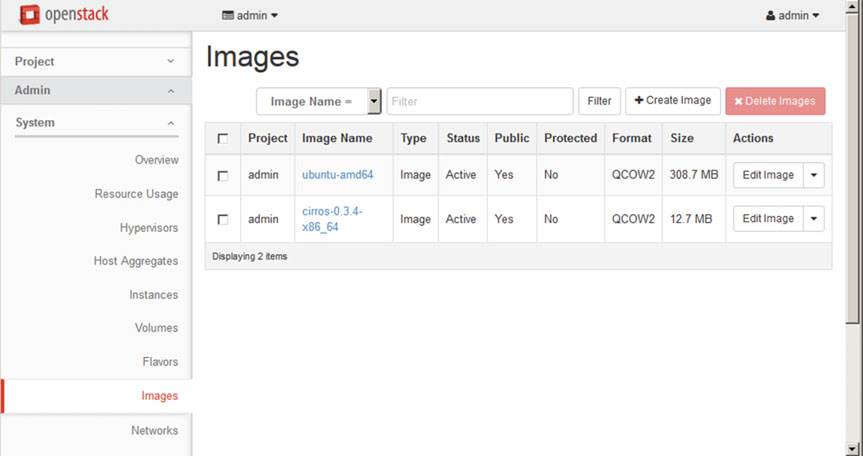

### 下载镜像

通过下载工具下载到manager主机的临时文件夹下

```shell
$ wget -P /tmp http://download.cirros-cloud.net/0.3.4/cirros-0.3.4-x86_64-disk.img
```


### 了解镜像格式信息

```shell
$ qemu-img info /tmp/wily-server-cloudimg-amd64-disk1.img
image: /tmp/wily-server-cloudimg-amd64-disk1.img
file format: qcow2
virtual size: 2.2G (2361393152 bytes)
disk size: 309M
cluster_size: 65536
Format specific information:
compat: 0.10
```


### 镜像管理的指令集

* **openstack** image create 或者  **glance** image-create
  用于创建和上传镜像

* **openstack** image delete 或者 glance image-delete

  删除镜像

* **openstack** image list 或者 **glance** image-list
  罗列镜像 

* **openstack** image save 或者 **glance** image-download
  将惊醒保存到本地

* **openstack** image show 或者 **glance** image-show

  > `glance` 命令将会淘汰，将来只有统一的 `openstack` 命令

  


### 命令行部署云系统镜像

Web页面上传镜像速度过慢，有可能因为镜像过大超时失败，通过命令行API接口直接上传更加快捷。

```shell
$ openstack image create --file /tmp/cirros-0.3.4-x86_64-disk.img --disk-format qcow2
--container-format bare --public cirros-0.3.4-x86_64
+------------------+------------------------------------------------------+
| 		Field 	   | 							Value 					  |
+------------------+------------------------------------------------------+
| checksum         | 				ee1eca47dc88f4879d8a229cc70a07c6	  |
| container_format | 						bare 						  |
| created_at	   | 				2016-03-12T18:24:59Z 				  |
...
```

> **--public** 意味着镜像可以用在各个项目之间


### 查看镜像

```shell
$ openstack image list
```


### 下载镜像到本地

```shell
$ openstack image save ubuntu-amd64 > local_image.img
$ ls -l local_image.img
-rw-rw-r-- 1 andrey andrey 323682816 Mar 13 18:36 local_image.img
```


### 自定义镜像的属性

通过 **glance** 命令 `--property`属性添加自定义属性，方面镜像的管理

```shell
$ glance image-update f42295b8-d600-4a67-86b7-dcda07652db4 --property os_name=linux
--property contact_person="andrey.markelov@ericsson.com"
```


### 管理镜像后台

通过查看 `/etc/glance/glance-api.conf` 

```shel
$ vim /etc/glance/glance-api.conf

[glance_store]
...
default_store = file
filesystem_store_datadir = /var/lib/glance/imag
```

通过修改`filesystem_store_datadir`你可以指定存储后台镜像的位置，比如 `NFS`，`Ceph` , `iScsi` 分布系统等其他挂载点 

修改之后别忘了重启服务

```shell
$ systemctl restart openstack-glance-api
```


## Openstack网络

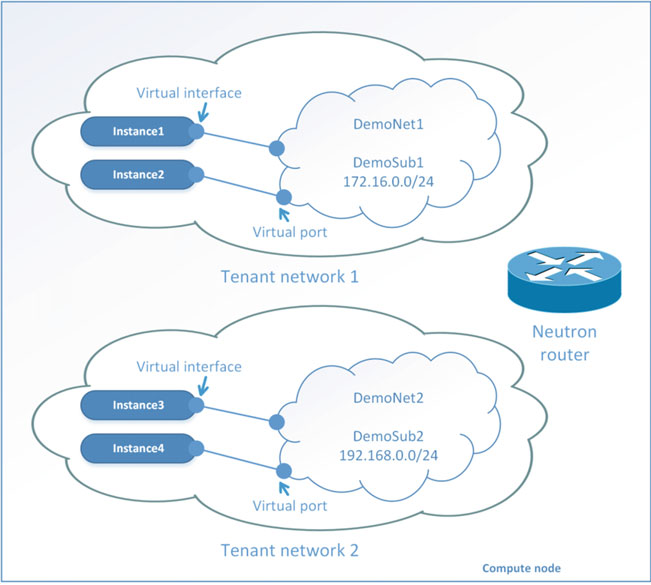

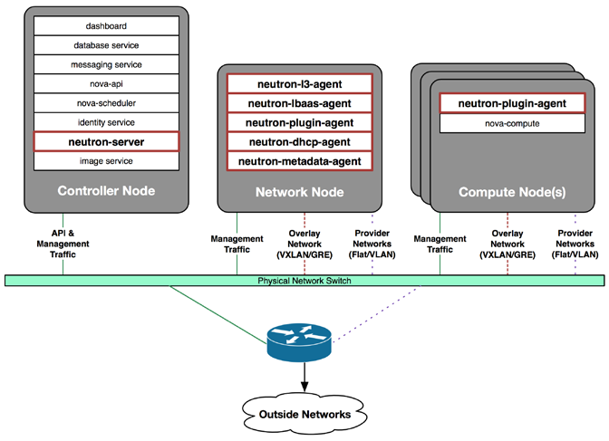

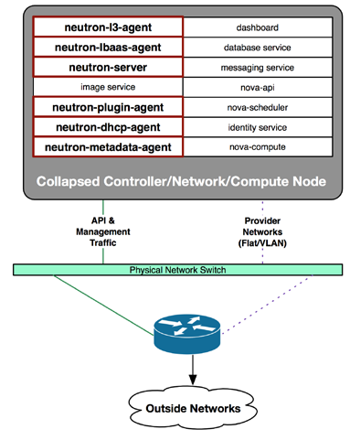

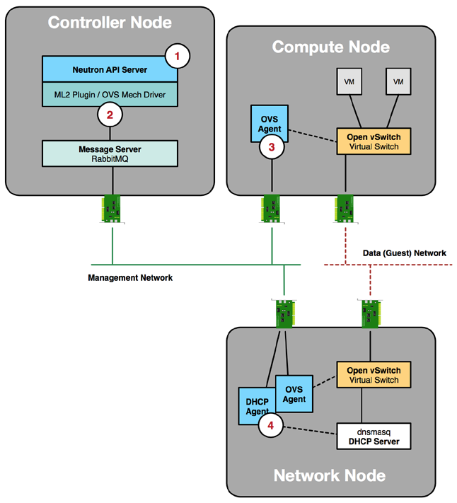


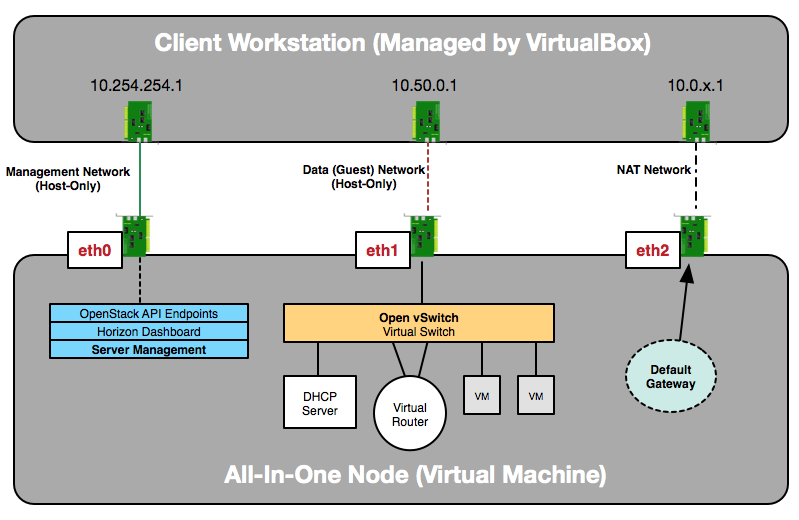


### Openstack 网络组件

* Tenant（租赁）网络：
* Router路由：
* Security Group 安全分组：
* Floating IP address 浮动IP地址：
* Port 端口：
* vNIC虚拟网卡：


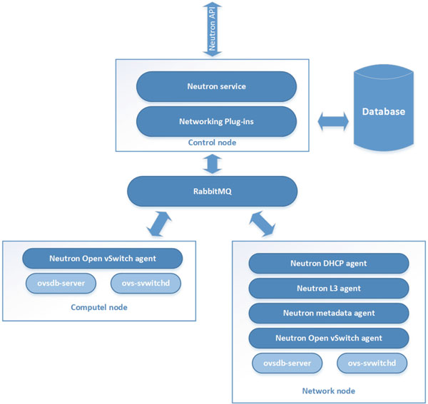

### 网络核心虚拟交换机 open vSwitch

虚拟交换机支持众多的Linux核心网络技术：OpenFlow，GRE， VLAN， VXLAN 等等， 它也有几部分组成，掌握网络虚拟交换机方能排错网络底层故障。每当启动一个实例，将建立一个vNIC并且通过虚拟交换机桥接，模拟插入网线到对应的端口。

* Linux内核模块： **openswtich_mod.ko**

* ovs-vswitchd 进程：

* ovsdb-server 进程：

```shell
$ systemctl | grep .*ovs.*
sys-devices-virtual-net-ovs\x2dsystem.device                                             loaded active plugged   /sys/devices/virtual/net/ovs-system                             
sys-subsystem-net-devices-ovs\x2dsystem.device                                           loaded active plugged   /sys/subsystem/net/devices/ovs-system                                                
ovs-vswitchd.service                                                                     loaded active running   Open vSwitch Forwarding Unit                                                         
ovsdb-server.service                                                                     loaded active running   Open vSwitch Database Unit 
```

  

1. 版本检查
```shell
$ ovs-vsctl -v 
  ovs-vsctl (Open vSwitch) 2.4.0
  Compiled Oct 7 2015 18:01:06
  DB Schema 7.12.1
```
2. 添加/删除虚拟交换机
```shell
$ ovs-vsctl add-br br-new
$ ovs-vsctl del-br br-new
```
3. 添加/删除物理的端口到虚拟交换机上
```shell
$ ovs-vsctl add-port br-ex enp0s3
$ ovs-vsctl del-port br-ex enp0s3
```
4. 交换信息的查看
```shell
$ ovs-vsctl show
22a0e0a2-7ac2-493a-9398-65e5683835e9
	Bridge br-int
		fail_mode: secure
		Port br-int
			Interface br-int
			type: internal
		Port "tap7fd27c60-32"
			tag: 1
			Interface "tap7fd27c60-32"
			type: internal
		Port patch-tun
			Interface patch-tun
			type: patch
			options: {peer=patch-int}
		Port int-br-ex
			Interface int-br-ex
            type: patch
			options: {peer=phy-br-ex}
			...
	Bridge br-ex
		Port "eth1"
			Interface "eth1"
		Port br-ex
			Interface br-ex
			type: internal
		Port "qg-dbd535f0-05"
			Interface "qg-dbd535f0-05"
			type: internal
		Port phy-br-ex
			Interface phy-br-ex
			type: patch
			options: {peer=int-br-ex}
			...
```


可以通过监控日志文件，看到虚拟交换的设定是否有故障

```shell
$ tail -f /var/log/openswitch/ovs-vswitch.log
```

> 如若连接不成功，虚拟交换机的日志将会弹出很多 `timeout` 或者 `refused` 信息
>
> ```shell
> 2020-08-18T14:25:06.633Z|00885|rconn|INFO|br-int<->tcp:127.0.0.1:6633: connecting...
> 2020-08-18T14:25:06.633Z|00886|rconn|WARN|br-int<->tcp:127.0.0.1:6633: connection failed (Connection refused)
> 2020-08-18T14:25:06.633Z|00887|rconn|INFO|br-int<->tcp:127.0.0.1:6633: waiting 2 seconds before reconnect
> 2020-08-18T14:25:06.633Z|00888|rconn|INFO|br-tun<->tcp:127.0.0.1:6633: connecting...
> 2020-08-18T14:25:06.634Z|00889|rconn|WARN|br-tun<->tcp:127.0.0.1:6633: connection failed (Connection refused)
> 2020-08-18T14:25:06.634Z|00890|rconn|INFO|br-tun<->tcp:127.0.0.1:6633: waiting 2 seconds before reconnect
> 2020-08-18T14:25:06.634Z|00891|rconn|INFO|br-ex<->tcp:127.0.0.1:6633: connecting...
> 2020-08-18T14:25:06.634Z|00892|rconn|WARN|br-ex<->tcp:127.0.0.1:6633: connection failed (Connection refused)
> 2020-08-18T14:25:06.634Z|00893|rconn|INFO|br-ex<->tcp:127.0.0.1:6633: waiting 2 seconds before reconnect
> 
> ```
>
> 


### 让虚拟实例访问到互联网

对于初学者开发者而言，很多场景都是使用的 All-in-one 模式，计算节点和网络节点管理端都是同一台主机搭建，而网络连接有两块网卡（有线和无线）

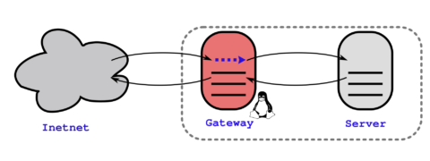

遇到这种场景有可能使用 `devstack` 脚本安装完之后无法让内部实例主机访问到互联网，此时可以通过Linux 下的 router + NAT 功能解决

#### 设置好宿主主机上网

```shell
# ip route add 192.168.0.0/16 dev eth0
```

或者

```shell
# route add -net 192.168.0.0/16 dev eth0
```

#### 开启Linux内核路由转发功能

```
# sysctl -w net.ipv4.ip_forward=1
```

或者

```
# echo 1 > /proc/sys/net/ipv4/ip_forward
```

如若让其永久生效你需要添加到  ``/etc/sysctl.conf` 配置文件中:

```
net.ipv4.ip_forward = 1
```

#### 设置 SNAT *iptables*

修改出方向的包（来源于**除了**内部网络接口本省的网段的任何数据） 的数据包的**源地址**. 你无须担心数据包回来到原始的主机， `iptables` 对自动的将回应的数据包的目的地址修改成原始出去数据包的原来的IP.

```
# iptables -t nat -A POSTROUTING ! -d 192.168.0.0/16 -o eth1 -j SNAT --to-source 198.51.100.1
```

> 上面例子中的 `198.51.100.1`为公网接口地址

另一种也是更为常见的使用方法，用来取代上面这种一对一转换的`SNAT`模式, 叫做 `MASQUERADE`:

```
# iptables -t nat -A POSTROUTING ! -d 192.168.0.0/16 -o wlx00f140830e1f -j MASQUERADE
```

> 上面例子中的 `wlx00f140830e1f` 为USB接口的WIFI接口名称


### Openstack 存储

作为底层存储，Openstack支持近乎所有的底层存储技术，缺省 devstack 使用的 `iscci`的`target`。最为最少硬件环境 `All-in-one`，你可以将本地磁盘模拟存储的空间，这和现实的应用几乎一样。

1. 首先可以在不分区的前提下，创建一个用来模拟底层存储的大文件。`qemu-image create <filename> <size>`

   ```shell
   # cd /opt/stack/data
   # qemu-img create stack-volumes-lvmdriver-1-backing-file 800G
   ```

   

2. 接着将此文件转换成逻辑存储设备, 使用命令 `losetup`

   ```shell
   # losetup -f stack-volumes-lvmdriver-1-backing-file 
   ```

   这将产生一个 /dev/loop*x* 的设备

3. 剩下的步骤就和正式场景一模一样了

   a) 转换成 PV

   ```shell
   # pvcreate /dev/loop0
   ```

   b) 生成对应的 VG

   > 此步骤额外重要


## 备注和其他注意事项

### Openstack 管理指令

* 登录到VM中

  ```shell
  $ openstack server list
  $ openstack server ssh --login ubuntu demo-bionic
  ```

  > `demo-bionic` 为VM实例的名称


### 通过 devstack 安装 Openstack

本节按照以下步骤部署 DevStack 实验环境，包括控制节点和计算节点

**创建虚拟机**

按照物理资源需求创建 devstack-controller 和 devstak-compute 虚拟机

#### 安装操作系统

安装 Ubuntu 18.04，并配置 enp2s0f1 的 IP devstack-controller  192.168.104.10 devstak-compute   192.168.104.11

#### 下载代码

下载 devstack 代码，并切换到 stable/liberty 分支

```shell
$ apt-get install git -y 
$ git clone https://gitclone.com/github.com/openstack/devstack
```

#### 配置 stack 用户

创建 stack 用户

```shell
$ devstack/tools/create-stack-user.sh
```

为方便起见，将devstack目录放到/opt/stack下，并设置权限

```shell
$ mv devstack /opt/stack 
$ chown -R stack:stack /opt/stack/devstack
```

切换到 stack 用户

```shell
$ su – stack 
$ cd devstack
```

##### 编写运行配置文件

在 /opt/stack/devstack 目录下，创建 local.conf。最小安装环境的配置

```shell
[[local|localrc]]
ADMIN_PASSWORD=redhat
DATABASE_PASSWORD=$ADMIN_PASSWORD
RABBIT_PASSWORD=$ADMIN_PASSWORD
SERVICE_PASSWORD=$ADMIN_PASSWORD
HOST_IP=192.168.2.102

```

> 如果不设置此文件，会提示你所需的密码问题,一旦输入问题回答后，将会保存到 `devstack/.localrc.password` 方便卸载和重装

另外，为了加快安装速度，还可以加上下面的配置使用国内的 devstack 镜像站点


#### 将python3安装源设置为国内镜像

```shell
$ pip3 config list
global.cache-dir='/opt/stack/.cache/pip'
global.index-url='http://pypi.douban.com/simple'
global.trusted-host='pypi.douban.com'

$ pip3 config set global.cache-dir '/opt/stack/.cache/pip'
```


> \# use TryStack git mirror 
> GIT_BASE=http://git.trystack.cn 
> NOVNC_REPO=http://git.trystack.cn/kanaka/noVNC.git 
> SPICE_REPO=http://git.trystack.cn/git/spice/spice-html5.git

#### 开始部署

分别在 devstack-controller 和 devstak-compute 上执行命令

```shell
$ ./stack.sh
```

会输出各项操作的结果。 日志会写到 stack.sh.log 文件。 
整个过程需要连接Internet，网速慢可能会花较长时间，成功后最后会打印出相关信息。

#### 最终输出

```shell
=========================
DevStack Component Timing
 (times are in seconds)  
=========================
run_process           36
test_with_retry        5
apt-get-update        10
osc                  325
wait_for_service      30
dbsync               387
pip_install          166
apt-get               16
-------------------------
Unaccounted time     1126
=========================
Total runtime        21
```


#### 验证 OpenStack

下面验证 OpenStack 已经正常运行 浏览器访问 http://192.168.104.10/（devstack-controller 的 IP） admin/admin 登录


#### 启动 OpenStack

如果重启了系统，OpenStack 不会自动启动，可以运行下面命令

> 早期版本
>
> ```shell
> cd devstack ./rejoin-stack.sh
> ```
>
> 

运行成功后，OpenStack 的每个服务都在一个 screen 中以进程方式运行。 使用 screen 有几个好处：

1. 可以方便的在不同服务之间切换和查看日志。 因为OpenStack的服务很多，每个服务都有自己的日志文件。 查找日志是一件非常麻烦的事情，screen可以帮我们提高效率。
2. 当我们修改了某个服务的配置文件需要重启服务时，只需在该服务的 screen 窗口 Ctrl+C，然后在命令行中找到上一个命令（Up键）执行就行，这个命令就是启动服务的命令。


下面是 screen 常用命令 
在 screen 中执行 
Ctrl+a+n 切换到下一个窗口 
Ctrl+a+p 切换到前一个窗口(与 Ctrl+a+n 相对) 
Ctrl+a+0..9 切换到窗口 0..9 
Ctrl+a+d 暂时断开（detach）当前 screen 会话，但不中断 screen 窗口中程序的运行

在 shell 中执行 
screen -ls  列出当前所有的 session 
screen -r stack  回到 devstack 这个 session


##### 安装报错

1. 如果遇到 /opt/stack/.cache `Permission denied`, 可以粗暴的使用

   ```shell
   $ sudo chmod 777 -Rv /opt/stack/.cache
   ```

   把权限设置为最大

2. 


### 云系统镜像密码修改

需要通过安装 `guestfish` 工具加载云镜像进而进行编辑

```shell
apt-get install guestfish
```

将下载了的镜像用 `guestfish`命令打开

```shell
# guestfish --rw -a centos63_desktop.img

Welcome to guestfish, the libguestfs filesystem interactive shell for
editing virtual machine filesystems.

Type: 'help' for help on commands
'man' to read the manual
'quit' to quit the shell

><fs>

```

> `><fs>`即为 guestfish的命令行提示符


1. 首先我们的运行 **run** 命令，它运行一个虚拟机环境

   

2. jiezh查看云系统镜像中的文件系统, 使用**list-filesystem**

   ```shell
   ><fs> list-filesystems
   /dev/vda1: ext4
   /dev/vg_centosbase/lv_root: ext4
   /dev/vg_centosbase/lv_swap: swap
   ```

   > 上面的例子，可以看出来 `lv_root`逻辑卷即为云系统镜像的根设备

3. 挂载后切换到系统中

   ```shell
   ><fs> mount /dev/vg_centosbase/lv_root /
   ```

   

4. 对系统内部做修改，云系统都有一个配置文件 **/etc/cloud/cloud.cfg**, 目的就是让云平台加载时和镜像交互的，如果你需要使用随机密码，可以写入以下内容：

   ```shell
   #cloud-config
   password: RANDOM
   chpasswd: { expire: False }
   ssh_pwauth: True
   ```

   > *RANDOM* 全大写，代表随机生成密码
   >
   > chpasswd 密码永不失效
   >
   > ssh_pwauth: 默认不允许root账户登录，此操作将修改 /etc/ssh/sshd_config中 `PermitRootLogin yes`

5. 退出即可

   ```shell
   ><fs> exit
   ```

   

6. 之后使用 openstack 导入镜像，启动实例时， 密码将打印在实例的控制台上


#### 单机环境下 /etc/rc.local 最终内容

/etc/rc.local 为 `sysV` 系统在开机初始化过程的最后一个步骤，如果不会编写shell脚本或者仅仅需要一次性执行的情况下，可以直接添加内容到此文件中

```shell
#!/bin/sh

# Keep openstack use local stoage
losetup -f /opt/stack/data/stack-volumes-lvmdriver-1-backing-file
losetup -f /opt/stack/data/stack-volumes-default-backing-file

pvscan
vgscan
lvscan


# Keep openstack instances access to internet via wifi NIC using NAT masquerade

IPT4='iptables'

$IPT4 -A POSTROUTING ! -d 172.24.4.0/24 -o wlx00f140830e1f -j MASQUERADE
```

