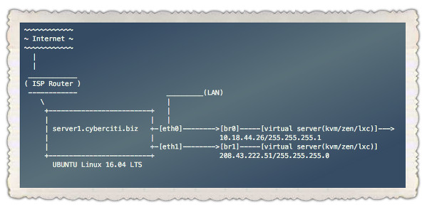
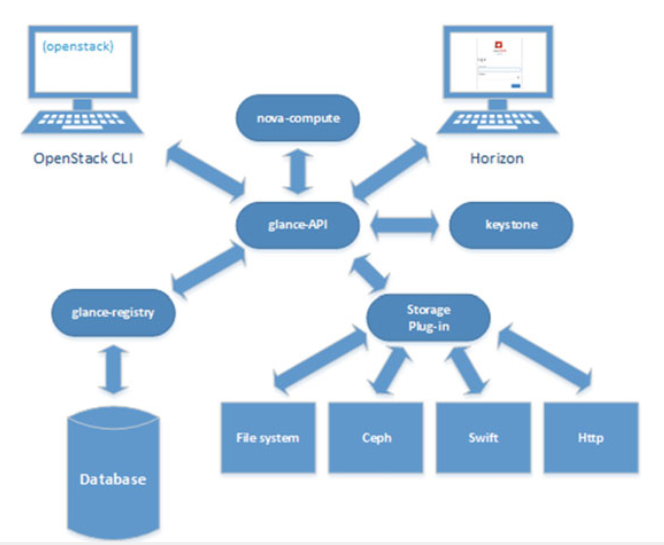

# Openstack 应用

## 云平台预科知识

无论你将来想使用的是哪一种云平台， Openstack，cloudstack， vsphere 等。它们的底层都是基于 Linux Kernel Virtual Machine（KVM）内核虚拟化技术的。所以让我们先从一台单机环境下掌握 KVM技术。之后再通过对Openstack的了解和深度的学习完成企业云平台的架构。


------

### KVM 内核虚拟化


------

#### kvm初始化

红帽系统环境安装虚拟化

```shell
$ yum install virt-manager libvirt libvirt-python python-virtinst libvirt-client qemu-kvm qemu-img
```

Ubuntu系统虚拟化初始化

```shell
$ apt-get install virt-manager libvirt libvirt-python python-virtinst libvirt-client qemu-kvm qemu-img
```

检查安装是否将模块加载

```shell
$ modprobe -l | grep kvm
kernel/arch/x86/kvm/kvm.ko
kernel/arch/x86/kvm/kvm-intel.ko
kernel/arch/x86/kvm/kvm-amd.ko
```

根据CPU加载模块

```shell
$ modprobe kvm kvm-intel
$ lsmode | grep kvm
```

------

#### 使用 qemu-img 和 qemu-kvm 命令行方式安装

（1）创建一个空的qcow2格式的镜像文件

```shell
qemu-img create -f qcow2 windows-master.qcow2 10G
```

（2）启动一个虚机，将系统安装盘挂到 cdrom，安装操作系统

```shell
qemu-kvm  -hda  windows-master.qcow2  -m  512  -boot d  -cdrom /home/user/isos/en_winxp_pro_with_sp2.iso
```

（3）现在你就拥有了一个带操作系统的镜像文件。你可以以它为模板创建新的镜像文件。使用模板的好处是，它会被设置为只读所以可以免于破坏。

```shell
qemu-img create -b windows-master.qcow2 -f  qcow2   windows-clone.qcow2
```

（4）你可以在新的镜像文件上启动虚机了

```shell
qemu-kvm  -hda  windows-clone.qcow2  -m 400
```

-------

#### kvm 底层存储

上述 `qemu-img`生成的存储有弊病，这里打下伏笔，此处建议使用 LVM逻辑卷。


------

#### kvm 网络

KVM 网络有三种方式

* **Bridge**
* NAT
* host-only

每台机器安装完虚拟机之后都产生一个 `192.168.122.0/24` 网段，此接口自动生成 `NAT` 防火墙规则



Linux环境下，为什么要给网桥配置地址？而物理接口不需要了？

这有点像Cisco交换机一样，我们给VLAN管理地址配置IP地址，然后将对应的接口插入到交换机上。

-------

##### 红帽系统下设置桥接接口

红帽系统的物理接口配置`BRIDGE`参数来实现接口的渤接。

```shell
 [root@localhost ~]# vim /etc/sysconfig/network-scripts/ifcfg-eth1
 DEVICE=eth1
 ONBOOT=yes
 TYPE=Ethernet
 BRIDGE=br0
 
 [root@localhost ~]# vim /etc/sysconfig/network-scripts/ifcfg-br0
 DEVICE=br0
 BOOTPROTO=static
 ONBOOT=yes
 IPADDR=192.168.1.187
 NETMASK=255.255.255.0
 TYPE=Bridge
 
 [root@localhost ~]# service network restart
```

> 物理接口一定要指定 `TYPE=Bridge` 变量，而且大小写一定要注意

------

##### Ubuntu系统下设置桥接接口

Ubuntu 系统下通过设置 `bridge_ports`指定物理接口接入 

```shell
# vim /etc/network/interfaces
auto br1 eth1
iface br1 inet static
	address 208.43.222.51
    netmask 255.255.255.0
    gateway 208.43.222.49
    bridge_ports eth1
    dns-nameservers 10.0.80.11 10.0.80.12
```

> `auto br1 eth1` 别忘了物理接口也要自动激活

------

#### virt-manager 安装系统


------

#### kvm 命令行工具

* virsh

* qemu-img

*  qemu-system-x86_64

------


#### QEMU 使用指南

Qemu 是一个成熟且历史悠久（相对计算机的发展）的利用操作系统实现虚拟化技术. 如果你之前使用过 `VMWARE` 、 `VIRTUAL PC`这类的产品软件. 当你切换到 KVM Qemu时，你的第一感触就是觉得非常的快，因为它使用的是基于硬件下的虚拟化技术. QEMU扮演的是计算机硬件角色而 KVM 指的就是 CPU. 虽然这样，我们还是要对它做小小的配置.

##### qemu-kvm 或者 qemu 又或者 qemu-system-x86_64

Qemu是一个历史悠久的大项目. Qemu 基于Linux Kernel Virtualization 项目的名称就命名为KVM.不同的版本基于不同的处理器类型.比如 `qemu-system-x86_64` 就是基于 Intel 框架下64-bit x86结构的虚拟机二进制程序.

##### 安装 Qemu

我们可以安装不同版本的Qemu，有针对于当前流行的处理器类型的多个版本

##### 在 Ubuntu, Debian, Mint, Kali 下安装

```
$ sudo apt install qemu
```


##### 在 Fedora, CentOS, Red Hat 下安装

我们可以使用 `dnf` 或者 `yum`的安装方式

```
$ sudo dnf install qemu
```

或者

```
$ sudo yum install qemu
```

##### qemu 命令帮助

我们可以获得 `qemu` 帮助信息，通过 `-h` 选项即可.

```
$ qemu-system-x86_64 -h
```


##### qemu 命令语法

绝大多数的命令操作都基于下面的格式

```
qemu-system-x86_64 OPTIONS IMAGE
```

- `OPTIONS` 提供VM 硬件环境，比如内存大小, CPU核的数量，图形等.
- `IMAGE` 就是运行的镜像的名称.

[**参考文档** How To Install VMware Tools To The Linux Debian, Ubuntu, Kali, Mint, Fedora, CentOS, RHEL Distributions](https://www.poftut.com/install-vmware-tools-to-the-linux-debian-ubuntu-kali-mint-fedora-centos-rhel-distributions/)

##### 下载云镜像

市场上流行的 Linux 有 Fedora, CentOS, Debian, Ubuntu, RedHat 它们都提供了不同格式的虚拟机镜像比如  raw, qcow2, vmdk.

```shell
$ wget https://download.fedoraproject.org/pub/fedora/linux/releases/33/Cloud/x86_64/images/Fedora-Cloud-Base-33-1.2.x86_64.qcow2
```


##### 设置  CPU 核 的数量

CPU也是一个重要的部分， 我们可以通过 `-smp` 选项开启多 CPU核模式再通过 `core=2`这样的方式设定 VM 启动环境下 CPU 的数量.

```
$ qemu-system-x86_64 -smp cores=2
```

##### 从 PXE 网络环境引导

如果公司内部有着网络PXE的安装环境，我们可以指定 `-boot order=nc` 选项.

```shell
$ qemu-system-x86_64 -boot order=nc
```

##### 为虚拟机设置内存大小

内存是VM的一个重要的组件.默认为128M大小，我们可以通过 `-m` 选项指定VM启动的大小.下面例子中指定为256M.

```shell
$ qemu-system-x86_64 -m 256
```


##### 设置虚拟机的名称

我们可以通过 `-name` 选项提供 VM 名称.

```
$ qemu-system-x86_64 -name poftut.com
```

##### 为 Qemu VM 指定文件

我们可以指定磁盘/镜像的文件，通过 `-drive` 选项.同样 `if` 用来配置网卡 NIC 类型

```
$ qemu-system-x86_64 -drive file=fedoraraw.qcow2,if=virtio
```

##### 配置虚拟机网络

默认虚拟机启动存在单一一个网卡而且不连接任何地方，因而无法通过网络访问. 我们可以添加一个网络接口并且将其连接到宿主主机上的一个桥接`bridge`设备。 下面的例子，我们将连接到一个类型为 `virtio` 网卡并模拟网络连线到虚拟交换机 `virbr0`上 .

```shell
$ qemu-system-x86_64 -drive file=fedoraraw.qcow2,if=virtio -display none -net bridge,br=virbr0 -net nic,model=virtio
```

##### Qemu运行远程镜像

下面的例子使用远程的磁盘镜像，采用SSH登录验证的方式

```shell
$ qemu-system-x86_64 -drive file=ssh://ismail@baydan.com/disk.img
```


#### 利用逻辑卷快照快速安装第二套系统

安装自己一套系统或者对系统调优的过程是重复、耗时、枯燥的。很多的云平台对新用户安装系统，只是点击几下，选择几下，系统在短短的时间就创建成功了，这要怎么实现？

答案是逻辑卷的**快照**。


通过命令创建快照

```shell
lvcreate -s -n <snapshot> -L <size> <original>
```


------

#### 单机环境kvm的弊端

* 宿主主机硬件上限

  宿主主机内存再大，CPU再多，也不能满足企业集团数以百计的不同的应用所需要的虚拟化环境，比如 256G 内存， 32 core的服务器下，每个VM使用4G来计算，（256 / 4）  -  1（宿主需要的内存）

* 宿主主机硬件维修或宕机

  服务器需要检修，或者宕机，那么跑在其上的虚拟机将团灭。

* 底层存储

  单机的硬盘再大也会遇到瓶颈，而多个虚拟机运行的数据获取来自同一块硬盘不可取。

* 多服务的维护

  如果有十多台服务器的中小企业环境，每台服务器上运行三到四个不多的VM，这种场景都会让你每天疲于奔命的找那个宿主主机上运行了什么VM的过程

* 底层网络的配置

    特别在多服务器的场景中，给每台VM做网络配置，并且保证**地址不冲突**，跨宿主主机之间的通信又是一个挑战。

* 如何对资源的控制？

    

而这一切都将在开源云平台 `openstack` 上完美解决

------

### Linux 下 Control Group(CG)


#### cgroups 的主要作用

实现 cgroups 的主要目的是为不同用户层面的资源管理提供一个统一化的接口。从单个任务的资源控制到操作系统层面的虚拟化，cgroups 提供了四大功能：

- 资源限制：cgroups 可以对任务是要的资源总额进行限制。比如设定任务运行时使用的内存上限，一旦超出就发 OOM。
- 优先级分配：通过分配的 CPU 时间片数量和磁盘 IO 带宽，实际上就等同于控制了任务运行的优先级。
- 资源统计：cgoups 可以统计系统的资源使用量，比如 CPU 使用时长、内存用量等。这个功能非常适合当前云端产品按使用量计费的方式。
- 任务控制：cgroups 可以对任务执行挂起、恢复等操作。

#### 相关概念

**Task(任务)** 在 linux 系统中，内核本身的调度和管理并不对进程和线程进行区分，只是根据 clone 时传入的参数的不同来从概念上区分进程和线程。这里使用 task 来表示系统的一个进程或线程。

**Cgroup(控制组)** cgroups 中的资源控制以 cgroup 为单位实现。Cgroup 表示按某种资源控制标准划分而成的任务组，包含一个或多个子系统。一个任务可以加入某个 cgroup，也可以从某个 cgroup 迁移到另一个 cgroup。

**Subsystem(子系统)** cgroups 中的子系统就是一个资源调度控制器(又叫 controllers)。比如 CPU 子系统可以控制 CPU 的时间分配，内存子系统可以限制内存的使用量。以笔者使用的 Ubuntu 16.04.3 为例，其内核版本为 4.10.0，支持的 subsystem 如下( cat /proc/cgroups)：
 **blkio**     对块设备的 IO 进行限制。
 **cpu**      限制 CPU 时间片的分配，与 cpuacct 挂载在同一目录。
 **cpuacct**   生成 cgroup 中的任务占用 CPU 资源的报告，与 cpu 挂载在同一目录。
 **cpuset**    给 cgroup 中的任务分配独立的 CPU(多处理器系统) 和内存节点。
 **devices**   允许或禁止 cgroup 中的任务访问设备。
 **freezer**   暂停/恢复 cgroup 中的任务。
 **hugetlb**   限制使用的内存页数量。        
 **memory**  对 cgroup 中的任务的可用内存进行限制，并自动生成资源占用报告。
 **net_cls**   使用等级识别符（classid）标记网络数据包，这让 Linux 流量控制器（tc 指令）可以识别来自特定 cgroup 任务的数据包，并进行网络限制。
 **net_prio**  允许基于 cgroup 设置网络流量(netowork traffic)的优先级。
 **perf_event** 允许使用 perf 工具来监控 cgroup。
 **pids**     限制任务的数量。

**Hierarchy(层级)** 层级有一系列 cgroup 以一个树状结构排列而成，每个层级通过绑定对应的子系统进行资源控制。层级中的 cgroup 节点可以包含零个或多个子节点，子节点继承父节点挂载的子系统。一个操作系统中可以有多个层级。

#### cgroups 的文件系统接口

cgroups 以文件的方式提供应用接口，我们可以通过 mount 命令来查看 cgroups 默认的挂载点：

```shell
$ mount | grep cgroup
```

------

安装所需的包

```shell
$ sudo apt-get install cgroup-bin cgroup-lite libcgroup1
```

------

让我们做几个简单的小实验，了解Linux是如何通过CG对资源进行限制的。

首先建立一个用来做资源限制的分组

```shell
$ cgcreate -a root -t davin -g cpu,memory:limitgroup 
```

------

上面执行后将有以下目录夹的变化

```shell
$ ls /sys/fs/cgroup/cpu
$ ls /sys/fs/cgroup/memory
```

-------

我们将看到两个非常大的数值

```shell
$ head /sys/fs/cgroup/cpu/limitgroup/cpu.shares /sys/fs/cgroup/memory/limitgroup/memory.limit_in_bytes
==> /sys/fs/cgroup/cpu/limitgroup/cpu.shares <==
1024

==> /sys/fs/cgroup/memory/limitgroup/memory.limit_in_bytes <==
9223372036854771712
```

> cpu.shares 为最大CPU核使用的数量

-------

接着我们可以通过 `cgexec` 命令测试资源组

```shell
$ cgexec -g cpu,memory:limitgroup cat /dev/urandom > /dev/null
```

 此程序将运行在资源受限组中运行，你可以通过 `top`命令查看，该程序直接消耗接近 100% CPU

```shell
Tasks: 175 total,   2 running, 173 sleeping,   0 stopped,   0 zombie
%Cpu(s):  0.0 us,100.0 sy,  0.0 ni,  0.0 id,  0.0 wa,  0.0 hi,  0.0 si,  0.0 st
KiB Mem :  2030184 total,  1411528 free,    86400 used,   532256 buff/cache
KiB Swap:  1003516 total,  1003516 free,        0 used.  1752632 avail Mem 

   PID USER      PR  NI    VIRT    RES    SHR S %CPU %MEM     TIME+ COMMAND                     
  2852 root      20   0    7440    676    612 R 99.9  0.0   1:05.74 cat                         
  2719 oracle    20   0   92828   4224   3264 S  0.3  0.2   0:00.24 sshd   
```

------

生成一个配置文件 `/etc/cgconfig.conf` 资源分组的定义

```shell
group limitgroup {
     cpu {
         cpu.cfs_quota_us=10000;
     }
     memory {
         memory.limit_in_bytes = 1024m;
     }
}
```

`cpu.cfs_quota_us` = 10000 等同于 10% cpu 使用率
`memory.limit_in_bytes` = 1024 等于 1G 的系统内存

-------

可以使用`cgconfigparser`应用测试下规则

```shell
$ /usr/sbin/cgconfigparser -l /etc/cgconfig.conf
```

------

此处我们切换到其他终端再次测试命令`cgexec`,你可以看到此时关于CPU资源被限制在 10% ，同理可以用在 CPU数量和内存大小上。

[更多请参考文档](https://www.cnblogs.com/sparkdev/p/8296063.html)

[Ubuntu基于用户的cgroup设置](http://www.litrin.net/2016/11/18/ubuntu%E5%9F%BA%E4%BA%8E%E7%94%A8%E6%88%B7%E7%9A%84cgroup%E8%AE%BE%E7%BD%AE/)

------

#### 针对用户的 CGroup

首先一样需要配置资源的配额 `/etc/cgconfig.conf`

```shell
group web2 {
     cpu {
         cpu.cfs_quota_us=10000;
     }
     memory {
         memory.limit_in_bytes = 1024m;
     }
}
```

------

接着多配置一个文件，它决定了用户请求哪些资源的时候应用什么配额规则 /etc/cgrules.conf

```shell
#<user>    <controllers>           <destination>
davin       cpu,memory              web2
```

上面的例子限制了用户`davin` 10% CPU 和 1G 的内存.

------

测试则需要：

```shell
# /usr/sbin/cgconfigparser -l /etc/cgconfig.conf
# /usr/sbin/cgrulesengd -vvv
```

------

可以通过文件系统方式查看对应的值

```shell
cat /sys/fs/cgroup/cpu/web2/tasks
cat /sys/fs/cgroup/memory/web2/tasks
```

撤销CGroup的限制

```shell
$ cgdelete -g cpu:web2 
```

> 此时资源的消耗立刻变大


### Network Address Translate (NAT)网络地址转换


 *IPtables*中可以灵活的做各种网络地址转换（*NAT*），网络地址转换主要有两种：*SNAT*和*DNAT*。

***\*SNAT\****是*source networkaddress translation*的缩写，即源地址目标转换。比如，多个*PC*机使用*ADSL*路由器共享上网，每个*PC*机都配置了内网*IP*，*PC*机访问外部网络的时候，路由器将数据包的报头中的源地址替换成路由器的*ip*，当外部网络的服务器比如网站*web*服务器接到访问请求的时候，他的日志记录下来的是路由器的*ip*地址，而不是*pc*机的内网*ip*，这是因为，这个服务器收到的数据包的报头里边的“源地址”，已经被替换了，所以叫做*SNAT*，基于源地址的地址转换。

***\*DNAT\****是*destination networkaddress translation*的缩写，即目标网络地址转换，典型的应用是，有个*web*服务器放在内网配置内网*ip*，前端有个防火墙配置公网*ip*，互联网上的访问者使用公网*ip*来访问这个网站，当访问的时候，客户端发出一个数据包，这个数据包的报头里边，目标地址写的是防火墙的公网*ip*，防火墙会把这个数据包的报头改写一次，将目标地址改写成*web*服务器的内网*ip*，然后再把这个数据包发送到内网的*web*服务器上，这样，数据包就穿透了防火墙，并从公网*ip*变成了一个对内网地址的访问了，即*DNAT*，基于目标的网络地址转换。

------

**MASQUERADE**，地址伪装，算是snat中的一种特例，可以实现自动化的snat。

在iptables中有着和SNAT相近的效果，但也有一些区别，但使用SNAT的时候，出口ip的地址范围可以是一个，也可以是多个，例如：

如下命令表示把所有10.8.0.0网段的数据包SNAT成192.168.5.3的ip然后发出去，

```shell
iptables-t nat -A POSTROUTING -s 10.8.0.0/255.255.255.0 -o eth0 -j SNAT --to-source192.168.5.3
```

如下命令表示把所有10.8.0.0网段的数据包SNAT成192.168.5.3/192.168.5.4/192.168.5.5等几个ip然后发出去

```shell
iptables-t nat -A POSTROUTING -s 10.8.0.0/255.255.255.0 -o eth0 -j SNAT --to-source192.168.5.3-192.168.5.5
```

这就是SNAT的使用方法，即可以NAT成一个地址，也可以NAT成多个地址，但是，对于SNAT，不管是几个地址，必须明确的指定要SNAT的ip，假如当前系统用的是ADSL动态拨号方式，那么每次拨号，出口ip192.168.5.3都会改变，而且改变的幅度很大，不一定是192.168.5.3到192.168.5.5范围内的地址，这个时候如果按照现在的方式来配置iptables就会出现问题了，因为每次拨号后，服务器地址都会变化，而iptables规则内的ip是不会随着自动变化的，每次地址变化后都必须手工修改一次iptables，把规则里边的固定ip改成新的ip，这样是非常不好用的。

MASQUERADE就是针对这种场景而设计的，他的作用是，从服务器的网卡上，自动获取当前ip地址来做NAT。

比如下边的命令：

```shell
$ iptables -t nat -A POSTROUTING -s 10.8.0.0/255.255.255.0 -o eth0 -j MASQUERADE
```

如此配置的话，不用指定SNAT的目标ip了，不管现在eth0的出口获得了怎样的动态ip，MASQUERADE会自动读取eth0现在的ip地址然后做SNAT出去，这样就实现了很好的动态SNAT地址转换。


------


## Openstack 组件结构

为什要用云？

一.简单的说就是对资源更加合理的分配，使用，比如硬件的数量，带宽等等这些，因为你不能机器买来不需要了再卖掉（当然也可以），带宽跟机房签合同得来一年的，中间不够了也不能加，超了也不退钱

二.还有就是可以有一个可以统一管理的操作平台，可以快速的对基础设施进行建设配置等等，方便了许多

云计算是个什么鬼？

资源可以循环利用的一个过程（PS：没有虚拟化就没有云，因此这两者没什么可比性）

 现有云模式（复制大神的）：

一、**IaaS**：基础设施即服务（个人比较习惯的）：用户通过网络获取虚机、存储、网络，然后用户根据自己的需求操作获取的资源

二、**PaaS**：平台即服务：将软件研发平台作为一种服务， 如Eclipse/Java编程平台，服务商提供编程接口/运行平台等

三、**SaaS**：软件即服务  ：将软件作为一种服务通过网络提供给用户，如web的电子邮件、HR系统、订单管理系统、客户关系系统等。用户无需购买软件，而是向提供商租用基于web的软件，来管理企业经营活动

`OpenStack` 架构由大量**开源项目**组成。其中包含 6 个稳定可靠的核心服务，用于处理**计算、网络、存储、身份和镜像**； 同时，还为用户提供了十多种开发成熟度各异的可选服务。`OpenStack` 的 6 个核心服务主要担纲系统的基础架构，其余项目则负责管理控制面板、编排、裸机部署、信息传递、容器及统筹管理等操作。


###  Openstack比较重要的组件

* **==Horizon==**：提供web界面的Horizon（华为提供web组件的是cps）；
* **==Nova==**：openstack项目里的最为重要的一个组件，主要负责计算资源；
* **==Neutron==**：是提供网络的组件,L2-L7；
* **==Swift==** 是对象存储
* **==Cinder==**是块存储。
* **==Glance==**：镜像组件，默认放在Swift，Cinder是给VM应用的。
* **==Keystone==**：所有组件运行都得经过Keystone验证，验证通过后才能运行，可以跨Openstack管理，是通过网络或域名对接的。

### 在Openstack创建一台虚拟机需要哪些步骤

1. 在web界面创建Vm任务
2. 通过`MQ`转发给Nova-api
3. `Nova-api` 接收rest消息
4. `Nova-conducto`r 进行数据库操作
5. `Nova-schedule` 选择合适的主机
6. `Nova-computer` 虚拟机生命周期管理
7. `netutron-server` 接受rest消息 想keystone鉴权 与数据库交互 提供网络对象API
8. `neutron-dhcp-agent` 提供网络功能
9. `cinder-api` 接受rest消息
10. `cinder-schedule` 选择合适的存储后端
11. `cinder-volume` 负责与后端存储对接 创建存储卷
12. `glance-api` 接受rest消息
13. `glance-registry` 用于与guass DB数据库进行交互 用于存储或获取镜像
14. `image store` 存储的接口层
    


------

### 使用 devstack 安装Openstack系统下的服务

了解了 devstack 安装的服务，以便于在系统故障时查看日志排错，甚至重启单个服务，以保证Openstack运行。

* c-\*的服务代表 cinder
* g-\*的服务代表 glance
* n-\*的服务代表 nova
* **q**-\*的服务代表 **==neutron==** 服务

```shell
$ sudo systemctl |grep devstack
devstack@c-api.service                                                                   loaded active running   Devstack devstack@c-api.service                                                      
devstack@c-sch.service                                                                   loaded active running   Devstack devstack@c-sch.service                                                      
devstack@c-vol.service                                                                   loaded active running   Devstack devstack@c-vol.service                                                      
devstack@dstat.service                                                                   loaded active running   Devstack devstack@dstat.service                                                      
devstack@etcd.service                                                                    loaded active running   Devstack devstack@etcd.service                                                       
devstack@g-api.service                                                                   loaded active running   Devstack devstack@g-api.service                                                      
devstack@keystone.service                                                                loaded active running   Devstack devstack@keystone.service                                                   
devstack@n-api-meta.service                                                              loaded active running   Devstack devstack@n-api-meta.service                                                 
devstack@n-api.service                                                                   loaded active running   Devstack devstack@n-api.service                                                      
devstack@n-cond-cell1.service                                                            loaded active running   Devstack devstack@n-cond-cell1.service                                               
devstack@n-cpu.service                                                                   loaded active running   Devstack devstack@n-cpu.service                                                      
devstack@n-novnc-cell1.service                                                           loaded active running   Devstack devstack@n-novnc-cell1.service                                              
devstack@n-sch.service                                                                   loaded active running   Devstack devstack@n-sch.service                                                      
devstack@n-super-cond.service                                                            loaded active running   Devstack devstack@n-super-cond.service                                               
devstack@placement-api.service                                                           loaded active running   Devstack devstack@placement-api.service                                              
devstack@q-agt.service                                                                   loaded active running   Devstack devstack@q-agt.service                                                      
devstack@q-dhcp.service                                                                  loaded active running   Devstack devstack@q-dhcp.service                                                     
devstack@q-l3.service                                                                    loaded active running   Devstack devstack@q-l3.service                                                       
devstack@q-meta.service                                                                  loaded active running   Devstack devstack@q-meta.service                                                     
devstack@q-svc.service                                                                   loaded active running   Devstack devstack@q-svc.service                                                      
system-devstack.slice                                                                    loaded active active    system-devstack.slice
```

------

##### systemctl 服务

重启所有 devstack 相关的服务

```shell
$ sudo systemctl restart devstack@*
```

重启 nova 相关的服务

```shell
$ sudo systemctl status devstack@n-*
```

-----

##### 查看单个服务日志信息

```shell
$ sudo journalctl  -f --unit devstack@n-cpu.service
```

------

## Openstack 管理使用步骤

1. 安装

2. 设置存储空间

3. 安装实例

   

   安装实例需要指定

   * `instance name`等基本信息

   * `Flavor`主机运行硬件模版

   * `network`实例接入的网络网段

   * `Security Groups`安全策略分组相当于预定义的防火墙模版

   * `Key pair`管理级的公钥私钥，用于免密钥登录系统，以及云系统注入信息

     以上几个重点的配置

4. 配置网络

   

   网络的配置可以说是`Openstack`一个亮点，配置思路为

   `subnet pool`  ---- `subnet` ---- `network` ---- `router` 

   而当实例启动后，再根据访问的需求在`security groups`添加访问规则

5. 添加浮动地址

   为了能让实例主机访问到外网需要添加`Floating IP`，让系统`iptables`的 `NAT`网络地址转化私有地址到开放网络

6. 掌握命令

   通过Web图形管理固然方便，但很多需求需要通过 `shell` 命令实现管理，在了解了图形界面，掌握了维护云平台的思路之后，进一步深入就是掌握更多的命令。最为简单的启停实例，查看IP地址的分配，ssh连接到实例，上传/下载镜像等

------

   

## 镜像管理




### 云生态镜像下载地址

市场上流行的云镜像：

* [CirrOS](http://download.cirros-cloud.net/)
* [Ubuntu](http://cloud-images.ubuntu.com/)
* [Debian](http://cdimage.debian.org/cdimage/openstack/)
* [Fedora](https://getfedora.org/cloud/download/)
* [CentOS](http://cloud.centos.org/centos/7/)
* [Windows Server 2012 R2 Evaluation for OpenStack](https://cloudbase.it/windows-cloud-images/)  

### 面板下添加镜像


### 下载镜像

通过下载工具下载到manager主机的临时文件夹下

```shell
$ wget -P /tmp http://download.cirros-cloud.net/0.3.4/cirros-0.3.4-x86_64-disk.img
```


### 了解镜像格式信息

```shell
$ qemu-img info /tmp/wily-server-cloudimg-amd64-disk1.img
image: /tmp/wily-server-cloudimg-amd64-disk1.img
file format: qcow2
virtual size: 2.2G (2361393152 bytes)
disk size: 309M
cluster_size: 65536
Format specific information:
compat: 0.10
```


### 镜像管理的指令集


* **openstack** image create 或者  **glance** image-create
  用于创建和上传镜像

* **openstack** image delete 或者 glance image-delete

  删除镜像

* **openstack** image list 或者 **glance** image-list
  罗列镜像 

* **openstack** image save 或者 **glance** image-download
  将惊醒保存到本地

* **openstack** image show 或者 **glance** image-show

  > `glance` 命令将会淘汰，将来只有统一的 `openstack` 命令

  

### 命令行部署云系统镜像

Web页面上传镜像速度过慢，有可能因为镜像过大超时失败，通过命令行API接口直接上传更加快捷。


```shell
$ openstack image create --file /tmp/cirros-0.3.4-x86_64-disk.img --disk-format qcow2
--container-format bare --public cirros-0.3.4-x86_64
+------------------+------------------------------------------------------+
| 		Field 	   | 							Value 					  |
+------------------+------------------------------------------------------+
| checksum         | 				ee1eca47dc88f4879d8a229cc70a07c6	  |
| container_format | 						bare 						  |
| created_at	   | 				2016-03-12T18:24:59Z 				  |
...
```

> **--public** 意味着镜像可以用在各个项目之间
>
> 如果使用 `glance image-create` 命令上传镜像，需要指定 `container-format`选项才能以及结合`file`选项一起使用。比如可以支持容器 docker 环境。默认使用 `bare`
>
```shell
--container-format <container-format>
Image container format. The supported options are:
ami, ari, aki, bare, docker, ova, ovf. The default
format is: bare
```
------

### 查看镜像

```shell
$ openstack image list
```


### 下载镜像到本地

```shell
$ openstack image save ubuntu-amd64 > local_image.img
$ ls -l local_image.img
-rw-rw-r-- 1 andrey andrey 323682816 Mar 13 18:36 local_image.img
```


### 自定义镜像的属性

通过 **glance** 命令 `--property`属性添加自定义属性，方面镜像的管理

```shell
$ glance image-update f42295b8-d600-4a67-86b7-dcda07652db4 --property os_name=linux
--property contact_person="andrey.markelov@ericsson.com"
```


### 管理镜像后台

通过查看 `/etc/glance/glance-api.conf` 

```shel
$ vim /etc/glance/glance-api.conf

[glance_store]
...
default_store = file
filesystem_store_datadir = /var/lib/glance/imag
```

通过修改`filesystem_store_datadir`你可以指定存储后台镜像的位置，比如 `NFS`，`Ceph` , `iScsi` 分布系统等其他挂载点 

修改之后别忘了重启服务

```shell
$ systemctl restart openstack-glance-api
```


## Openstack网络


### Linux 网络名称空间namespace

下面这张图描绘了 Openstack 以及 其他云平台产统一用的底层网络技术，在之前预科知识我们已经了解了Linux Bridge 桥接，而到了这里我们有带来一个新名词**namespace**，将由它生成所需要的虚拟接口 vNIC。


------

#### namespace 介绍

namespace 是 Linux 内核用来**隔离内核资源**的方式。通过 `namespace` 可以让一些进程只能看到与自己相关的一部分资源，而另外一些进程也只能看到与它们自己相关的资源，这两拨进程根本就感觉不到对方的存在。具体的实现方式是把一个或多个进程的相关资源指定在同一个 `namespace` 中。

`Linux namespaces` 是对全局系统资源的一种封装隔离，使得处于不同 `namespace` 的进程拥有独立的全局系统资源，改变一个 namespace 中的系统资源只会影响当前 `namespace` 里的进程，对其他 namespace 中的进程没有影响。

让我们通过下面的例子来理解 Linux 网络的 `namespace`


#### 创建Linux下网桥

首先我们需要建立一个网桥桥接物理网络。

```shell
$ ip link add name br0 type bridge
$ ip link set br0 up
$ ip link set eth0 up
$ ip link set eth0 master br0
```

> 以上做法为临时实现，它和我们之前使用配置文件建立Linux网桥一样。当然你也可以通过 `brctl`命令管理

-------


#### 创建名称空间

接着我们创建名称空间，为其注入 `veth` 虚拟设备，让其有着自己的路由和独立的 NAT 规则。这样我们实现隔离的多个(nat1, nat2)私有网络的NAT功能

```shell
$ ip netns add nat1
$ ip netns list
nat1
```
------

#### 第一个 veth 虚拟对接设备

> 这里要假设一下虚拟对接设备，你可以把它看成网线的两端，模拟插网线的过程。特别是要给网线贴上工程标签。

我们的第一个 veth 对接的接口,它用于连接**名称空间**到**上游的网桥** (`br0`). 它的名字起得稍微有意义点。 这里 `peer1-br0` 将连接到上游 `br0` ， `peer1-gw1` 将来配置成名称空间中我们物理路由网路中的IP。

```shell
$ ip link add peer1-br0 type veth peer name peer1-gw1
$ ip link show
...
6: peer1-gw1@peer1-br0: <BROADCAST,MULTICAST,M-DOWN> mtu 1500 qdisc noop state DOWN mode DEFAULT group default qlen 1000
    link/ether 1a:fa:9e:20:3c:10 brd ff:ff:ff:ff:ff:ff
7: peer1-br0@peer1-gw1: <BROADCAST,MULTICAST,M-DOWN> mtu 1500 qdisc noqueue master br0 state DOWN mode DEFAULT group default qlen 1000
    link/ether 86:5d:76:a8:d4:cb brd ff:ff:ff:ff:ff:ff
...
```
> 注意这里是添加链路

------

#### 添加 veth 到Linux下网桥

先让我们检查下Linux下的桥接信息

```shell
$brctl show
bridge name	bridge id		STP enabled	interfaces
br0		8000.000c29f82b57	no		ens33
virbr0		8000.525400747409	yes		virbr0-nic
```

现在我们需要将 `peer1-br0` 接口加入到上游 `br0` Linux 网桥并激活它

```shell
$ brctl addif br0 peer1-br0
$ brctl show
bridge name	bridge id		STP enabled	interfaces
br0		8000.000c29f82b57	no		ens33
							peer1-br0
virbr0		8000.525400747409	yes		virbr0-nic

$ ip link set peer1-br0 up
```
此时接口处于未连接的状态 `NO-CARRIER`，因为另外一端还没有激活

```shell
$ ip link show
...
6: peer1-gw1@peer1-br0: <BROADCAST,MULTICAST> mtu 1500 qdisc noop state DOWN mode DEFAULT group default qlen 1000
    link/ether 1a:fa:9e:20:3c:10 brd ff:ff:ff:ff:ff:ff
7: peer1-br0@peer1-gw1: <NO-CARRIER,BROADCAST,MULTICAST,UP,M-DOWN> mtu 1500 qdisc noqueue master br0 state LOWERLAYERDOWN mode DEFAULT group default qlen 1000
    link/ether 86:5d:76:a8:d4:cb brd ff:ff:ff:ff:ff:ff
```


> 注意，这里我们并没有给它配置IP地址，它只是相当于网线的插入过程，而配置IP地址的是连接到名称空间的另外一端。怎么记？**Linux网桥就是 `Switch`, Namespace名称空间则是`Router`**

------

#### 第一个名称空间的网关接口

接下来我们添加上面创建好的 `peer1-gw1` 设备到名称空间中, 赋予它一个可以连接**现有路由网络**的IP地址。 设置好默认网关并且将设备激活。这里我们没有通过DHCP，而是将其设置为IP地址 `192.168.0.100` ，网关为 `192.168.0.1`.

```shell
$ ip link set peer1-gw1 netns nat1
$ ip netns exec nat1 ip addr add 192.168.0.100/24 dev peer1-gw1
$ ip netns exec nat1 ip link set peer1-gw1 up
$ ip netns exec nat1 ip route add default via 192.168.0.1  
```
让我们检查下名称空间下的信息

```shell
$ ip netns exec nat1 ip add show
ip netns exec nat1 ip add show
1: lo: <LOOPBACK> mtu 65536 qdisc noop state DOWN group default qlen 1
    link/loopback 00:00:00:00:00:00 brd 00:00:00:00:00:00
6: peer1-gw1@if7: <BROADCAST,MULTICAST,UP,LOWER_UP> mtu 1500 qdisc noqueue state UP group default qlen 1000
    link/ether 1a:fa:9e:20:3c:10 brd ff:ff:ff:ff:ff:ff link-netnsid 0
    inet 192.168.2.200/24 scope global peer1-gw1
       valid_lft forever preferred_lft forever
    inet6 fe80::18fa:9eff:fe20:3c10/64 scope link 
       valid_lft forever preferred_lft forever     
```


而这是我们Linux全局环境下的信息

```shell
$ ip add show
...
2: ens33: <BROADCAST,MULTICAST,UP,LOWER_UP> mtu 1500 qdisc pfifo_fast master br0 state UP group default qlen 1000
    link/ether 00:0c:29:f8:2b:57 brd ff:ff:ff:ff:ff:ff
    inet6 fe80::20c:29ff:fef8:2b57/64 scope link 
       valid_lft forever preferred_lft forever
3: virbr0: <NO-CARRIER,BROADCAST,MULTICAST,UP> mtu 1500 qdisc noqueue state DOWN group default qlen 1000
    link/ether 52:54:00:74:74:09 brd ff:ff:ff:ff:ff:ff
4: virbr0-nic: <BROADCAST,MULTICAST> mtu 1500 qdisc pfifo_fast master virbr0 state DOWN group default qlen 1000
    link/ether 52:54:00:74:74:09 brd ff:ff:ff:ff:ff:ff
5: br0: <BROADCAST,MULTICAST,UP,LOWER_UP> mtu 1500 qdisc noqueue state UP group default qlen 1000
    link/ether 00:0c:29:f8:2b:57 brd ff:ff:ff:ff:ff:ff
    inet 192.168.2.105/24 scope global br0
       valid_lft forever preferred_lft forever
    inet6 fe80::af:9cff:fef4:aa27/64 scope link 
       valid_lft forever preferred_lft forever
7: peer1-br0@if6: <BROADCAST,MULTICAST,UP,LOWER_UP> mtu 1500 qdisc noqueue master br0 state UP group default qlen 1000
    link/ether 86:5d:76:a8:d4:cb brd ff:ff:ff:ff:ff:ff link-netnsid 0
    inet6 fe80::845d:76ff:fea8:d4cb/64 scope link 
       valid_lft forever preferred_lft forever
```

从这里可以看出**隔离**的效果

------

#### 创建第二个 veth 虚拟对接设备

现在我们创建第二个线路连接名称空间到私有网。在这个例子中，我们连接到 我们第一个运行的VM的`virbr0` 网络。

```shell
$ ip link add peer1-virbr0 type veth peer name peer1-gw2
```
------

#### 添加 veth 到私有网桥中

现在我们需要添加 `peer1-virbr0` 接口到 `virbr0` 私有虚拟网桥。Note that we do not set an IP on this, it’s a patch lead. The IP will be on the other end in the namespace.


```shell
$ brctl addif virbr0 peer1-virbr0
$ ip link set peer1-virbr0 up
```
接着我们检查下桥接信息，我们可以看到`br0`下的接口，已经将物理网卡 `ens33` 和 `peer1-br0` 插接到一台交换机上。

```shell
$ brctl show
bridge name	bridge id		STP enabled	interfaces
br0			8000.000c29f82b57	no		ens33
										peer1-br0
virbr0		8000.1aaa332d6a54	yes		peer1-virbr0
										virbr0-nic
```

> 注意：我们同样没有设置IP给它，我们只在名称空间的那端设置 IP 地址

------

#### 第二个名称空间的网关接口

接下来我们想添加一个 `peer1-gw2` 的设备到名称空间中,赋予它IP地址到它的私有网络并且将接口激活。在这里我们它设置的IP地址也就是VM的**默认网关** `10.0.0.1`.

```shell
$ ip link set peer1-gw2 netns nat1
$ ip netns exec nat1 ip addr add 10.0.0.1/24 dev peer1-gw2
$ ip netns exec nat1 ip link set up dev peer1-gw2
```
------

### 开启名称空间的 NAT

在我们对名称空间针对各自的网络注入网桥和IP地址后，最后一步就是开启 NAT 网络地址转换了.

```shell
$ ip netns exec nat1 iptables -t nat -A POSTROUTING -o peer1-gw1 -j MASQUERADE
$ ip netns exec nat1 iptables -A FORWARD -i peer1-gw1 -o peer1-gw2 -m state --state RELATED,ESTABLISHED -j ACCEPT
$ ip netns exec nat1 iptables -A FORWARD -i peer1-gw2 -o peer1-gw1 -j ACCEP
```

最终我们可以在网络名称空间下看到标准的 `iptables` 规则.

```shell
$ ip netns exec nat1 iptables -t nat -L -n
```
------

### Openstack 网络组件

* Tenant（租赁）网络
* Router路由
* Security Group 安全分组
* Floating IP address 浮动IP地址
* Port 端口
* vNIC虚拟网卡


### 网络核心虚拟交换机 open vSwitch

虚拟交换机支持众多的Linux核心网络技术：OpenFlow，GRE， VLAN， VXLAN 等等， 它也有几部分组成，掌握网络虚拟交换机方能排错网络底层故障。每当启动一个实例，将建立一个vNIC并且通过虚拟交换机桥接，模拟插入网线到对应的端口。

* Linux内核模块： **openswtich_mod.ko**

* ovs-vswitchd 进程：

* ovsdb-server 进程：

```shell
$ systemctl | grep .*ovs.*
sys-devices-virtual-net-ovs\x2dsystem.device                                             loaded active plugged   /sys/devices/virtual/net/ovs-system                             
sys-subsystem-net-devices-ovs\x2dsystem.device                                           loaded active plugged   /sys/subsystem/net/devices/ovs-system                                                
ovs-vswitchd.service                                                                     loaded active running   Open vSwitch Forwarding Unit                                                         
ovsdb-server.service                                                                     loaded active running   Open vSwitch Database Unit 
```

  

1. 版本检查
```shell
$ ovs-vsctl -v 
  ovs-vsctl (Open vSwitch) 2.4.0
  Compiled Oct 7 2015 18:01:06
  DB Schema 7.12.1
```
2. 添加/删除虚拟交换机
```shell
$ ovs-vsctl add-br br-new
$ ovs-vsctl del-br br-new
```
3. 添加/删除物理的端口到虚拟交换机上
```shell
$ ovs-vsctl add-port br-ex enp0s3
$ ovs-vsctl del-port br-ex enp0s3
```
4. 交换信息的查看
```shell
$ ovs-vsctl show
22a0e0a2-7ac2-493a-9398-65e5683835e9
	Bridge br-int
		fail_mode: secure
		Port br-int
			Interface br-int
			type: internal
		Port "tap7fd27c60-32"
			tag: 1
			Interface "tap7fd27c60-32"
			type: internal
		Port patch-tun
			Interface patch-tun
			type: patch
			options: {peer=patch-int}
		Port int-br-ex
			Interface int-br-ex
            type: patch
			options: {peer=phy-br-ex}
			...
	Bridge br-ex
		Port "eth1"
			Interface "eth1"
		Port br-ex
			Interface br-ex
			type: internal
		Port "qg-dbd535f0-05"
			Interface "qg-dbd535f0-05"
			type: internal
		Port phy-br-ex
			Interface phy-br-ex
			type: patch
			options: {peer=int-br-ex}
			...
```


可以通过监控日志文件，看到虚拟交换的设定是否有故障

```shell
$ tail -f /var/log/openswitch/ovs-vswitch.log
```

> 如若连接不成功，虚拟交换机的日志将会弹出很多 `timeout` 或者 `refused` 信息

```shell
2020-08-18T14:25:06.633Z|00885|rconn|INFO|br-int<->tcp:127.0.0.1:6633: connecting...
2020-08-18T14:25:06.633Z|00886|rconn|WARN|br-int<->tcp:127.0.0.1:6633: connection failed (Connection refused)
2020-08-18T14:25:06.633Z|00887|rconn|INFO|br-int<->tcp:127.0.0.1:6633: waiting 2 seconds before reconnect
2020-08-18T14:25:06.633Z|00888|rconn|INFO|br-tun<->tcp:127.0.0.1:6633: connecting...
2020-08-18T14:25:06.634Z|00889|rconn|WARN|br-tun<->tcp:127.0.0.1:6633: connection failed (Connection refused)
2020-08-18T14:25:06.634Z|00890|rconn|INFO|br-tun<->tcp:127.0.0.1:6633: waiting 2 seconds before reconnect
2020-08-18T14:25:06.634Z|00891|rconn|INFO|br-ex<->tcp:127.0.0.1:6633: connecting...
2020-08-18T14:25:06.634Z|00892|rconn|WARN|br-ex<->tcp:127.0.0.1:6633: connection failed (Connection refused)
2020-08-18T14:25:06.634Z|00893|rconn|INFO|br-ex<->tcp:127.0.0.1:6633: waiting 2 seconds before reconnect

```

------

### 让虚拟实例访问到互联网

对于初学者开发者而言，很多场景都是使用的 All-in-one 模式，计算节点和网络节点管理端都是同一台主机搭建，而网络连接有两块网卡（有线和无线）


遇到这种场景有可能使用 `devstack` 脚本安装完之后无法让内部实例主机访问到互联网，此时可以通过Linux 下的 router + NAT 功能解决

#### 设置好宿主主机上网

```shell
# ip route add 192.168.0.0/16 dev eth0
```

或者

```shell
# route add -net 192.168.0.0/16 dev eth0
```

#### 开启Linux内核路由转发功能

```
# sysctl -w net.ipv4.ip_forward=1
```

或者

```
# echo 1 > /proc/sys/net/ipv4/ip_forward
```

如若让其永久生效你需要添加到  ``/etc/sysctl.conf` 配置文件中:

```
net.ipv4.ip_forward = 1
```

#### 设置 SNAT *iptables*

修改出方向的包（来源于**除了**内部网络接口本省的网段的任何数据） 的数据包的**源地址**. 你无须担心数据包回来到原始的主机， `iptables` 对自动的将回应的数据包的目的地址修改成原始出去数据包的原来的IP.

```
# iptables -t nat -A POSTROUTING ! -d 192.168.0.0/16 -o eth1 -j SNAT --to-source 198.51.100.1
```

> 上面例子中的 `198.51.100.1`为公网接口地址

另一种也是更为常见的使用方法，用来取代上面这种一对一转换的`SNAT`模式, 叫做 `MASQUERADE`:

```
# iptables -t nat -A POSTROUTING ! -d 192.168.0.0/16 -o wlx00f140830e1f -j MASQUERADE
```

> 上面例子中的 `wlx00f140830e1f` 为USB接口的WIFI接口名称


## Openstack 存储

作为底层存储，Openstack支持近乎所有的底层存储技术，缺省 devstack 使用的 `iscci`的`target`。最为最少硬件环境 `All-in-one`，你可以将本地磁盘模拟存储的空间，这和现实的应用几乎一样。

1. 首先可以在不分区的前提下，创建一个用来模拟底层存储的大文件。`qemu-image create <filename> <size>`

```shell
# cd /opt/stack/data
# qemu-img create stack-volumes-lvmdriver-1-backing-file 800G
```

   

2. 接着将此文件转换成逻辑存储设备, 使用命令 `losetup`

```shell
   # losetup -f stack-volumes-lvmdriver-1-backing-file 
```

   这将产生一个 /dev/loop*x* 的设备

3. 剩下的步骤就和正式场景一模一样了

   a) 转换成 PV

```shell
   # pvcreate /dev/loop0
```

   b) 生成对应的 VG

   > 此步骤额外重要


### Openstack 存储服务

#### glance 镜像存储


 

## Openstack 实例管理 Nova 计算命令集

1. 查看openstack版本

```shell
$ nova-manage version
```

2. 查看节点
```shell
$ nova host-list
```

3. 查看计算节点
```shell
$ nova hypervisor-list
```

4. 查看虚拟机列表
```shell
$ nova list
```

5. 查看镜像列表
```shell
$ nova image-list
```

6. 查看卷列表
```shell
$ nova volume-list
```

7. 查看密钥对列表
```shell
$ nova keypair-list
```

8. 查看flavor列表
```shell
$ nova flavor-list
```

9. 查看浮动ip列表
```shell
$ nova floating-ip-list
```

10. 查看安全组列表
```shell
$ nova secgroup-list
```

11. 查看安全组规则列表
```shell
$ nova secgroup-list-rules default
```

12. 查看浮动ip
```shell
$ nova floating-ip-list
```

13. 查看虚拟机
```shell
$ nova show ID
```

14. 挂起/恢复/启动/关闭/删除虚拟机
```shell
nova suspend/resume/srart/stop/delete ID
```

15.（硬）重启虚拟机
```shell
nova reboot (--hard) ID
```

16a. 救援模式
```shell
$ nova rescue VM_ID
```

16b.重启虚拟机，由救援模式进入正常模式
```shell
$ nova unrescue VM_ID
```

16c.使用指定镜像进入救援模式

```shell
nova rescue --rescue_image_ref IMAGE_ID VM_ID
```

17.在线迁移

```shell
nova live-migration ID compute1
```

18.创建密钥
```shell
$ nova keypair-add oskey > oskey.priv
$ chmod 600 oskey.priv
```

19.创建/删除浮动ip池

> nova floating-ip-bulk-create/delete 192.168.0.200/29

20.创建浮动ip

> nova floating-ip-create

21.删除浮动ip

> nova floating-ip-delete xxx.xxx.xxx.xxx

22.绑定/解绑浮动ip

> nova floating-ip-associate ID xxx.xxx.xxx.xxx

23.新建虚拟机

> nova boot --image image-ID --flavor m1.medium --key_name abc --availability_zone nova:compute1.cloud.internal vmname

23a.通过块设备新建虚拟机

> cinder create --image-id IMAGE_ID --name VOLUME_NAME SIZE_IN_GB
>
> nova boot --falvor FLAVOR_IDsource=volume,id=VOLUME_ID,dest=volume,shutdown=preserve,bootindex=0 VMNAME

24.添加/删除浮动ip

> nova add/remove-floating-ip ID xxx.xxx.xxx.xxx

25.挂载云硬盘

> nova volume-attach ID VOLNAME /dev/sdb

26.卸载云硬盘

> nova volume-detach ID VOLNAME

27.创建快照

> nova image-create ID "snapshot 1"

调整虚拟机资源

> nova resize VM_NAME FLAVOR_ID --poll

确认调整虚拟机资源

> nova resize-confirm VM_ID

如果资源调整失败，则回滚

> nova resize-revert VM_ID

数据库同步

> nova-manage db sync

查看错误日志

> nova-manage logs errors

------


## 备注和其他注意事项

### Openstack 管理指令

* 登录到VM中

```shell
$ openstack server list
$ openstack server ssh --login ubuntu demo-bionic
```

  > `demo-bionic` 为VM实例的名称

#### 认证(keystone)[¶](https://docs.openstack.org/ocata/user-guide/cli-cheat-sheet.html#identity-keystone)

列出所有的用户

```shell
$ openstack user list
```

列举认证服务目录信息

```shell
$ openstack catalog list
```

#### 镜像 (glance)[¶](https://docs.openstack.org/ocata/user-guide/cli-cheat-sheet.html#images-glance)

列举你可以访问的镜像

```shell
$ openstack image list
```

删除指定的镜像

```shell
$ openstack image delete IMAGE
```

查看指定镜像的描述信息

```shell
$ openstack image show IMAGE
```

上传镜像

```shell
$ openstack image set IMAGE
```

上传具有内核镜像，`aki`格式

```shell
$ openstack image create "cirros-threepart-kernel" \
  --disk-format aki --container-format aki --public \
  --file ~/images/cirros-0.3.5-x86_64-kernel
```

上传初始化内存镜像，`ari`格式

```shell
$ openstack image create "cirros-threepart-ramdisk" \
  --disk-format ari --container-format ari --public \
  --file ~/images/cirros-0.3.5-x86_64-initramfs
```

上传根文件系统镜像,`ami`

```shell
$ openstack image create "cirros-threepart" --disk-format ami \
  --container-format ami --public \
  --property kernel_id=$KID-property ramdisk_id=$RID \
  --file ~/images/cirros-0.3.5-x86_64-rootfs.img
```

注册原生镜像 ，`bare`

```shell
$ openstack image create "cirros-raw" --disk-format raw \
  --container-format bare --public \
  --file ~/images/cirros-0.3.5-x86_64-disk.img
```

#### 云计算组件 Compute (nova)[¶](https://docs.openstack.org/ocata/user-guide/cli-cheat-sheet.html#compute-nova)

列举实例,检查实例的状态

```shell
$ openstack server list
```

罗列镜像

```shell
$ openstack image list
```

创建一个 flavor 实例运行硬件环境模版，名字为 `m1.tiny`

```shell
$ openstack flavor create --ram 512 --disk 1 --vcpus 1 m1.tiny
```

罗列 flavors

```shell
$ openstack flavor list
```

引导一个实例使用指定的 flavor 和镜像 

```shell
$ openstack server create --image IMAGE --flavor FLAVOR INSTANCE_NAME
$ openstack server create --image cirros-0.3.5-x86_64-uec --flavor m1.tiny \
  MyFirstInstance
```

从Linux登录到实例 

> **ip** 命令仅仅只在Linux下可用。这里之所以使用 **ip netns** ，因为它提供了将你的环境复制现有网络栈，这样有着隔离的自己的路由，防火墙规则和网络设备，方便排错。

```shell
# ip netns
# ip netns exec NETNS_NAME ssh USER@SERVER
# ip netns exec qdhcp-6021a3b4-8587-4f9c-8064-0103885dfba2 \
  ssh cirros@10.0.0.2
```

> 对于`CirrOS`, 用户名 `cirros` 的密码为 `cubswin:)`.而其他的操作系统，需要使用 `SSH key` 连接.

登录到实例使用外部IP地址

```shell
$ ssh cloud-user@128.107.37.150
```

展示实例的详细信息

```shell
$ openstack server show NAME
$ openstack server show MyFirstInstance
```

查看实例控制台日志

```shell
$ openstack console log show MyFirstInstance
```

创建一个实例的快照

```shell
$ openstack image create volumeTwoImage snapshotOfVolumeImage
$ openstack image show snapshotOfVolumeImage
```

##### 暂停，挂起，恢复, 停止, 救援, 重建，重启一个[¶](https://docs.openstack.org/ocata/user-guide/cli-cheat-sheet.html#pause-suspend-stop-rescue-resize-rebuild-reboot-an-instance)

暂停

```shell
$ openstack server pause NAME
$ openstack server pause volumeTwoImage
```

恢复暂停

```shell
$ openstack server unpause NAME
```

挂起

```shell
$ openstack server suspend NAME
```

恢复之前的挂起

```shell
$ openstack server resume NAME
```

停止

```shell
$ openstack server stop NAME
```

启动

```shell
$ openstack server start NAME
```

救援

```shell
$ openstack server rescue NAME
$ openstack server rescue NAME --rescue_image_ref RESCUE_IMAGE
```

改变实例的硬件环境，**只能升级，不能降级**

```shell
$ openstack server resize NAME FLAVOR
$ openstack server resize my-pem-server m1.small
$ openstack server resize --confirm my-pem-server1
```

重建

```shell
$ openstack server rebuild NAME IMAGE
$ openstack server rebuild newtinny cirros-qcow2
```

重启

```shell
$ openstack server reboot NAME
$ openstack server reboot newtinny
```

注入用户数据和文件到实例中

```shell
$ openstack server create --user-data FILE INSTANCE
$ openstack server create --user-data userdata.txt --image cirros-qcow2 \
  --flavor m1.tiny MyUserdataInstance2
```

为了验证文件是否注入，使用 ssh 连接到实例中，查看放在 `/var/lib/cloud` 下的文件.

注入公钥私钥到实例中并使用它访问到实例中

创建密钥对

```shell
$ openstack keypair create test > test.pem
$ chmod 600 test.pem
```

启动实例 (引导)

```shell
$ openstack server create --image cirros-0.3.5-x86_64 --flavor m1.small \
  --key-name test MyFirstServer
```

使用 ssh 到实例中

```shell
# ip netns exec qdhcp-98f09f1e-64c4-4301-a897-5067ee6d544f \
  ssh -i test.pem cirros@10.0.0.4
```

管理安全分组

添加规则到默认安全分组，允许 `ping` 和`SSH` 到实例中

```shell
$ openstack security group rule create default \
    --remote-group default --protocol icmp
$ openstack security group rule create default \
    --remote-group default --dst-port 22
```

#### 网络 (neutron)[¶](https://docs.openstack.org/ocata/user-guide/cli-cheat-sheet.html#networking-neutron)

创建网络

```shell
$ openstack network create NETWORK_NAME
```

创建子网

```shell
$ openstack subnet create --subnet-pool SUBNET --network NETWORK SUBNET_NAME
$ openstack subnet create --subnet-pool 10.0.0.0/29 --network net1 subnet1
```

#### 块存储 (cinder)[¶](https://docs.openstack.org/ocata/user-guide/cli-cheat-sheet.html#block-storage-cinder)

用于管理连接到实例的卷和卷快照。

创建新的卷

```shell
$ openstack volume create --size SIZE_IN_GB NAME
$ openstack volume create --size 1 MyFirstVolume
```

引导实例并加载上卷

```shell
$ openstack server create --image cirros-qcow2 --flavor m1.tiny MyVolumeInstance
```

列举所有卷，关注卷的状态

```shell
$ openstack volume list
```

对一个启动活跃的实例中加载新的卷

```
$ openstack server add volume INSTANCE_ID VOLUME_ID
$ openstack server add volume MyVolumeInstance 573e024d-5235-49ce-8332-be1576d323f8
```

------


### 通过 devstack 安装 Openstack

本节按照以下步骤部署 DevStack 实验环境，包括控制节点和计算节点

**创建虚拟机**

按照物理资源需求创建 devstack-controller 和 devstak-compute 虚拟机

#### 安装操作系统

安装 Ubuntu 18.04，并配置 enp2s0f1 的 IP devstack-controller  192.168.104.10 devstak-compute   192.168.104.11

#### 下载代码

下载 devstack 代码，并切换到 stable/liberty 分支

```shell
$ apt-get install git -y 
$ git clone https://gitclone.com/github.com/openstack/devstack
```

#### 配置 stack 用户

创建 stack 用户

```shell
$ devstack/tools/create-stack-user.sh
```

为方便起见，将devstack目录放到/opt/stack下，并设置权限

```shell
$ mv devstack /opt/stack 
$ chown -R stack:stack /opt/stack/devstack
```

切换到 stack 用户

```shell
$ su – stack 
$ cd devstack
```

##### 编写运行配置文件

在 /opt/stack/devstack 目录下，创建 local.conf。最小安装环境的配置

```shell
[[local|localrc]]
ADMIN_PASSWORD=redhat
DATABASE_PASSWORD=$ADMIN_PASSWORD
RABBIT_PASSWORD=$ADMIN_PASSWORD
SERVICE_PASSWORD=$ADMIN_PASSWORD
HOST_IP=192.168.2.102

```

> 如果不设置此文件，会提示你所需的密码问题,一旦输入问题回答后，将会保存到 `devstack/.localrc.password` 方便卸载和重装

另外，为了加快安装速度，还可以加上下面的配置使用国内的 devstack 镜像站点


#### 将python3安装源设置为国内镜像

```shell
$ pip3 config list
global.cache-dir='/opt/stack/.cache/pip'
global.index-url='http://pypi.douban.com/simple'
global.trusted-host='pypi.douban.com'

$ pip3 config set global.cache-dir '/opt/stack/.cache/pip'
```


> \# use TryStack git mirror 
> GIT_BASE=http://git.trystack.cn 
> NOVNC_REPO=http://git.trystack.cn/kanaka/noVNC.git 
> SPICE_REPO=http://git.trystack.cn/git/spice/spice-html5.git

#### 开始部署

分别在 devstack-controller 和 devstak-compute 上执行命令

```shell
$ ./stack.sh
```

会输出各项操作的结果。 日志会写到 stack.sh.log 文件。 
整个过程需要连接Internet，网速慢可能会花较长时间，成功后最后会打印出相关信息。

#### 最终输出

```shell
=========================
DevStack Component Timing
 (times are in seconds)  
=========================
run_process           36
test_with_retry        5
apt-get-update        10
osc                  325
wait_for_service      30
dbsync               387
pip_install          166
apt-get               16
-------------------------
Unaccounted time     1126
=========================
Total runtime        21
```


#### 验证 OpenStack

下面验证 OpenStack 已经正常运行 浏览器访问 http://192.168.104.10/（devstack-controller 的 IP） admin/admin 登录


#### 启动 OpenStack

如果重启了系统，OpenStack 不会自动启动，可以运行下面命令

> 早期版本
>
```shell
$ cd devstack ./rejoin-stack.sh
```

运行成功后，OpenStack 的每个服务都在一个 screen 中以进程方式运行。 使用 screen 有几个好处：

1. 可以方便的在不同服务之间切换和查看日志。 因为OpenStack的服务很多，每个服务都有自己的日志文件。 查找日志是一件非常麻烦的事情，screen可以帮我们提高效率。
2. 当我们修改了某个服务的配置文件需要重启服务时，只需在该服务的 screen 窗口 Ctrl+C，然后在命令行中找到上一个命令（Up键）执行就行，这个命令就是启动服务的命令。


下面是 screen 常用命令 
在 screen 中执行 
Ctrl+a+n 切换到下一个窗口 
Ctrl+a+p 切换到前一个窗口(与 Ctrl+a+n 相对) 
Ctrl+a+0..9 切换到窗口 0..9 
Ctrl+a+d 暂时断开（detach）当前 screen 会话，但不中断 screen 窗口中程序的运行

在 shell 中执行 
screen -ls  列出当前所有的 session 
screen -r stack  回到 devstack 这个 session


##### 安装报错

1. 如果遇到 /opt/stack/.cache `Permission denied`, 可以粗暴的使用

```shell
$ sudo chmod 777 -Rv /opt/stack/.cache
```

把权限设置为最大

------

### 通过 cloud-init 初始化用户密码

`cloud-init`是行业的标准，各大云系统都支持这种初始化的方式，比如 `ubuntu cloud-image`，他的配置沿用一种 `yaml`[官方文档](https://yaml.org/)的配置格式，缩进非常严格，其内容请参考网站[cloud-init](https://cloudinit.readthedocs.io/)，由于这不是课程的重点，我们只针对初始化密码需求来实践, [了解更多cloud-init 模块](https://cloudinit.readthedocs.io/en/latest/topics/modules.html)

1. 首先你得编写一个yaml结构的配置文件

```shell
$ vim init_bionic.txt
#cloud-config
password: mysecret
chpasswd: { expire: False }
ssh_pwauth: True
```

> ==#cloud-config== 非常关键，它等同于 `Content-Type: text/cloud-config`,一定写在第一行，它代表着下面的内容格式
>
> `password`: 修改默认账户密码，ubuntu系统默认`ubuntu`, fedora则为`fedora`
>
> `chpasswd`: 这将 **/etc/shadow** 设置该账号为 **99999**, 永不过期
>
> `ssh_pwauth`: 默认只能用系统注入的公钥私钥验证，而设置为 True， 将可以使用密码 ssh 到系统中

接着通过 nova 命令运行你初建的实例

```shell
$ nova flavor-list
$ glance image-list
$ nova boot --flavor ds1G --user-data ./init_bionic.txt --image 7ae9ad51-94fc-4ede-ab8a-c194adfb12ae  --nic net-name=public test-cloud-config-binoic
```

------

### 云系统镜像密码修改

##### 初建实例时，指定密码的方法


------

#####  定制云系统的密码

需要通过安装 `guestfish` 工具加载云镜像进而进行编辑

```shell
apt-get install guestfish
```

将下载了的镜像用 `guestfish`命令打开

```shell
# guestfish --rw -a centos63_desktop.img

Welcome to guestfish, the libguestfs filesystem interactive shell for
editing virtual machine filesystems.

Type: 'help' for help on commands
'man' to read the manual
'quit' to quit the shell

><fs>

```

> `><fs>`即为 guestfish的命令行提示符


1. 首先我们的运行 **run** 命令，它运行一个虚拟机环境

   

2. jiezh查看云系统镜像中的文件系统, 使用**list-filesystem**

```shell
><fs> list-filesystems
/dev/vda1: ext4
/dev/vg_centosbase/lv_root: ext4
/dev/vg_centosbase/lv_swap: swap
```

   > 上面的例子，可以看出来 `lv_root`逻辑卷即为云系统镜像的根设备

3. 挂载后切换到系统中

```shell
><fs> mount /dev/vg_centosbase/lv_root /
```

   

4. 对系统内部做修改，云系统都有一个配置文件 **/etc/cloud/cloud.cfg**, 目的就是让云平台加载时和镜像交互的，如果你需要使用随机密码，可以写入以下内容：

```shell
   #cloud-config
   password: RANDOM
   chpasswd: { expire: False }
   ssh_pwauth: True
```

   > *RANDOM* 全大写，代表随机生成密码
   >
   > chpasswd 密码永不失效
   >
   > ssh_pwauth: 默认不允许root账户登录，此操作将修改 /etc/ssh/sshd_config中 `PermitRootLogin yes`

5. 退出即可

```shell
   ><fs> exit
```

   

6. 之后使用 openstack 导入镜像，启动实例时， 密码将打印在实例的控制台上

------

##### 忘记密码的实例

如果忘记密码的实例，我们不可能按照上面的方法重新修改镜像，其实云系统镜像中都有和Openstack的结合技术。其实很简单就是在云系统启动是有一个可以注入的脚本/etc/cloud-init.sh [参考文档](https://help.ubuntu.com/community/CloudInit)。而对应`Openstack` 可以通过 `nova rescue`注入新的密码到脚本中让其初始化。

但前提条件是要对 ==Nova compute== 组件中 配置文件做修改, 在 `libvirt`断中添加以下配置,否则无效。

```shell
# vim /etc/nova/nova-cpu.conf
[libvirt]
...
inject_partition = -1
inject_password = true
```

`inject_partition` 选项

- ==-2 => 默认值，屏蔽注入数据==，所以一定添加这个选项方能修改密码

- -1 => 查找 文件系统 root 分区并且将它 使用 `libguestfs` 挂载

  

然后重启 `Nova` 服务

```shell
$  systemctl restart devstack@n*
```

然后运行

```shell
$ nova rescue demo-bionic
+-----------+--------------+
| Property  | Value        |
+-----------+--------------+
| adminPass | 6RZTb9hKxt6t |
+-----------+--------------+

```

等待实例启动后用提示的密码连接

------

### 单机环境下 /etc/rc.local 最终内容

/etc/rc.local 为 `sysV` 系统在开机初始化过程的最后一个步骤，如果不会编写shell脚本或者仅仅需要一次性执行的情况下，可以直接添加内容到此文件中

```shell
#!/bin/sh

# Keep openstack use local stoage
losetup -f /opt/stack/data/stack-volumes-lvmdriver-1-backing-file
losetup -f /opt/stack/data/stack-volumes-default-backing-file

pvscan
vgscan
lvscan


# Keep openstack instances access to internet via wifi NIC using NAT masquerade

IPT4='iptables'

$IPT4 -t nat -A POSTROUTING ! -d 172.24.4.0/24 -o wlx00f140830e1f -j MASQUERADE
```


