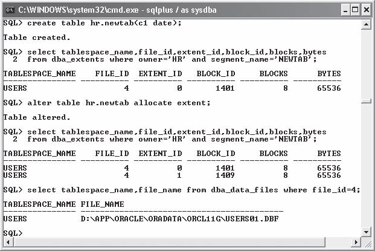

# Oracle应用和调优

## Oracle PL/SQL 入门

关系型SQL

#### 表

关系型数据库中的表存放的数据可以看待为行与列，其中还包括了表与表之间的关系，比如下图中描述了一个作者可以发布多篇文章的结构


##### DDL (Data Definition Language)数据定义语言

```plsql
CREATE TABLE <table_name> (
	<column_name_1> <data_type_1>,
	<column_name_2> <data_type_2>,
	<column_name_N> <data_type_N> );
```


#### 索引

索引为数据访问的核心快捷方式，假想一本没有目录的字典会是多么糟糕的事情，这正如同数据库的表没有索引。当你翻阅字典你只能从第一页开始将字典从头到尾的查看一遍，才能保证不错过信息。同样没有了索引的表中找数据，就得从第一行开始对比直到最后一行。这对大数据的表来说是件恐怖的事情。

```plsql
CREATE [UNIQUE] INDEX <index_name>
	on <table_name> (
		<column_name_1>,
		<column_name_2>,
		<column_name_N> );
```


#### 约束

##### 列的约束

* NULL
* NOT NULL

##### 表的约束

* 唯一索引的约束

  正如其名一样，此约束了表中的数据要遵循唯一的特性

```plsql
ALTER TABLE authors ADD
CONSTRAINT authors_uk1
UNIQUE (
 name,
 birth_date,
 gender );
```

* 主键的约束

  它和唯一索引的约束非常接近，不过它还不允许`NULL`数据的插入

```plsql
ALTER TABLE <table_name> ADD
CONSTRAINT <constraint_name>
PRIMARY KEY (
	<column_name_1>,
	<column_name_2>,...
	<column_name_N> );
```

> 如果想查找出主键的信息，可以查询 `all_constraints`以及`all_cons_columns`表中的信息。

```plsql
SELECT cols.table_name, cols.column_name, cols.position, cons.status, cons.owner
FROM all_constraints cons, all_cons_columns cols
WHERE cons.constraint_type = 'P'
AND cons.constraint_name = cols.constraint_name
AND cons.owner = cols.owner
AND cons.owner = 'HR'
ORDER BY cols.table_name, cols.position;
```

* 外键的约束

  此约束决定了，表的数据的由来一定是来自于参照的表

  1. 从表不能添加主表不存在的数据

  2. 主表删除数据时，如果从表已经关联了此条数据将不让删除，必须先处理从表的记录，方能删除主表对应的信息

     

```plsql
ALTER TABLE <table_name> ADD
CONSTRAINT <constraint_name>
FOREIGN KEY (
	<column_name_1>,
	<column_name_2>,...
	<column_name_N> )
REFERENCES <referenced_table_name> (
	<column_name_1>,
	<column_name_2>,...
	<column_name_N> );
```


#### 触发器

触发器是一种表操作事件的响应的PL/SQL语句，根据定义在表上产生 `BEFORE`,`AFTER`,`INSTEAD OF`,`UPDATE`,`DELETE`操作事件时触发执行。


```plsql
CREATE [OR REPLACE] TRIGGER <trigger_name>
BEFORE INSERT ON <table_name>
FOR EACH ROW
BEGIN
<pl/sql>
END;
```

下面的范例对数据做检测，当插入到`authors`表中的数据(们)，如果为大写`JONATHAN GENNICK`将弹出一个错误信息

```plsql
SQL> CREATE OR REPLACE TRIGGER authors_bir
	BEFORE INSERT ON authors
 FOR EACH ROW

 BEGIN
 if upper(:new.name) = 'JONATHAN GENNICK' then
 	raise_application_error(20000, 'Sorry, that genius is not allowed.');
 end if;
 END;
 /
```


#### 视图

视图代表着通过 SQL 查询的结果，而且支持`INSERT`，`UPDATE`, `DELETE`和`SELECT`的操作。一般用于以下几个场景

* 转换多个表的查询数据为单一的表
* 当单条的`SELECT`语句无法使用嵌套式的 JOIN 语句时
* 可以实现用户级安全，封装显示特定的列的数据

```plsql
CREATE OR REPLACE VIEW authors_publications as
SELECT authors.id,
	authors.name,
	author_publications.title,
	author_publications.written_date
FROM authors,
	author_publications
WHERE authors.id = author_publications.author_id;
```


#### 插入数据

1. 插入数据有口头提供的值的形式

```plsql
INSERT INTO <table_name> (
	<column_name_1>,
	<column_name_2>, ...
	<column_name_N> )
VALUES (
	<column_value_1>,
	<column_value_2>,...
	<column_value_N> );
```

2. 插入由`select`语句筛选出来数据

```plsql
INSERT INTO <table_name> (
   	<column_name_1>,
   	<column_name_2>, ...
   	<column_name_N> )
   SELECT <column_value_1>,
   	<column_value_2>,...
   	<column_value_N>
   FROM <from_table_name> ...;
```

   > 另外可以使用 `where not exists`

```plsql
   SQL> INSERT INTO authors (
   	id,
   	name,
   	birth_date,
   	gender )
   SELECT 300,
   	'Hugh Darwen',
   	to_date('19430101', 'YYYYMMDD')09 'MALE'
   FROM dual d
   WHERE not exists (
   SELECT 1
   	FROM authors x
   	WHERE x.id = 300 );
   
   COMMIT;
```

​    

#### 更新数据

更新数据可以使用子查询的模式，通过子查询的结果来提供要更新的数据

1. 更新单个列的值

```plsql
UPDATE <table_name> U
SET U.<column_name_N> = (
	SELECT S.<subquery_column_name_N>
	FROM <subquery_table_name> S
	WHERE S.<column_name_N> = U.<column_name_N>
	AND ...)
WHERE u.<column_name_N> = <some_value>...;
```

2. 更新多列对应于子查询结果的相同列的值

```plsql
UPDATE <table_name> U
SET (U.<column_name_1>,
	U.<column_name_2>, ...
	U.<column_name_N> ) = (
		SELECT S.<subquery_column_name_1>,
			S.<subquery_column_name_2>, ...
			S.<subquery_column_name_N>
		FROM <subquery_table_name> S
		WHERE S.<column_name_N> = U.<column_name_N>
		AND ...)
WHERE u.<column_name_N> = <some_value>...;
```


#### 删除数据

语法

```plsql
DELETE FROM <table_name>
WHERE <column_name_N> = <column_value_N>...;
```

#### 筛选数据

关系型数据库最强大的部分就是对数据的挖掘，将数据从定义的语句中查询出来。

```plsql
SELECT <column_name_1>,
	<column_name_2>,
	<column_name_N>
FROM <table_name>
[ORDER BY <order_by_column_name_N>]
```

##### JOIN 查询

1. 传统的在 `WHERE` 语句中连接

```plsql
SELECT a.id,
	a.name,
	p.title,
	p.written_date
FROM authors a,
	author_publications p
WHERE a.id = p.author_id
ORDER BY a.name,
	p.written_date,
	p.title;
```

2. ANSI 标准的在 `FROM`中`JOIN`

```plsql
SELECT a.id,
	a.name,
	p.title,
	p.written_date
FROM authors a JOIN
	author_publications p
ON a.id = p.author_id
ORDER BY a.name,
	p.written_date,
	p.title;
```


##### top-N 查询

12c 以后的版本给我引入了雷同于MySQL中的 LIMIT 语句

```plsql
SELECT * FROM <table_name>
[ OFFSET offset { ROW | ROWS } ]
[ FETCH { FIRST | NEXT } [ { rowcount | percent PERCENT } ]
    { ROW | ROWS } { ONLY | WITH TIES } ]
```

```plsql
SQL> select * from hr.employees 
     order by employee_id asc 
     offset 120000 rows 
     FETCH FIRST 5 rows ONLY;
```

------

### 代码块

作为 SQL的扩展，Oracle定义了PL/SQL，其中就包括了代码块。执行代码块中的代码，就如同`Java`，`PHP`,`Javascript`的 `try...catch`, `Python`中的`try...except`一样。

它有着四个关键字

* **DECLEAR**: 每一个PL/SQL都有一个`DECLEAR`段，用来分配游标的内存，数据类型的定义，变量，以及内嵌的函数等

* **BEGIN**： PL/SQL逻辑的开始

* **EXCEPTION**： 用来捕获 PL/SQL 的错误，即使你没有使用对异常的处理的定义，它依然存在

* **END**

#### 匿名的代码段

如果你仅仅想执行代码，而不想它保存到数据库中就可以使用这种没有名字的代码段。

```plsql
-- This is an anonymous procedure, so it has no name
DECLARE
/*
You declare local cursors, variables, and methods here,
but you don't need to have a declaration section.
*/
BEGIN
-- You write your executable code here
NULL; -- Ahhh, you've got to have at least one command!
EXCEPTION
when NO_DATA_FOUND then
	raise_application_error(-20000,
'Hey, This is in the exception-handling section!');
END;
/
-- the forward slash on a line by itself says execute this procedure
```

> `BEGIN`之后至少有一条语句，即使`NULL`也好。

```plsql
set serveroutput on size 1000000
begin
	SYS.DBMS_OUTPUT.put_line('Hi there genius!');
end;
/
```

------


### 异常

数据中出现异常，数据库将抛出异常不会执行后续代码，我们需要接管异常。PL/SQL定义了约莫 20 个异常。我们平时只会用到几个常见异常

* **NO_DATA_FOUND**: 用于`SELECT`语句中查询不到任何记录

* **TOO_MANY_ROWS**: 如果在`INSERT...SELECT`中期待的一行数据但实际获取到多行

* **OTHERS**：泛指没有接管的异常

  

### 函数

函数也是一种代码块，它返回(仅仅)一个值。

```plsql
n_value := to_number('123.45')
```

#### 创建函数

```plsql
CREATE [OR REPLACE] FUNCTION <function_name> [(
	<parameter_name_1> [IN] [OUT] <parameter_data_type_1>,
	<parameter_name_2> [IN] [OUT] <parameter_data_type_2>,...
	<parameter_name_N> [IN] [OUT] <parameter_data_type_N> )]
RETURN <return_data_type> IS
--the declaration section
BEGIN
-- the executable section
	return <return_data_type>;
EXCEPTION
-- the exception-handling section
END;
/
```

范例

```plsql
CREATE OR REPLACE FUNCTION to_number_or_null (
aiv_number IN varchar2 )
return number is
/*
to_number_or_null.fun
by Donald J. Bales on 2014-10-20
An errorless to_number( ) method
*/
begin
	return to_number(aiv_number);
exception
	when OTHERS then
	return NULL;
end to_number_or_null;
/
@fe.sql to_number_or_null;
```


### 存储过程

存储过程除了不会返回值，其他和函数相差无异。

```plsql
CREATE [OR REPLACE] PROCEDURE <procedure_name> [(
<parameter_name_1> [IN] [OUT] <parameter_data_type_1>,
<parameter_name_2> [IN] [OUT] <parameter_data_type_2>,...
<parameter_name_N> [IN] [OUT] <parameter_data_type_N> )] IS
--the declaration section
BEGIN
-- the executable section
EXCEPTION
-- the exception-handling section
END;
/
```

范例

```plsql
CREATE OR REPLACE PROCEDURE wait(
ain_seconds IN number) is
/*
wait.prc
by Donald J. Bales on 2014-10-20
Wrapper for SYS.DBMS_LOCK.sleep()
*/
begin
	SYS.DBMS_LOCK.sleep(ain_seconds);
end wait;
/
@pe.sql wait
```

> 存储过程的调用，如果在代码块中使用，直接使用存储过程名字即可，如果单独执行则通过 `EXECUTE <procedure_name>` 语句

------

### 包

前面我们学会了单个函数和存储的定义，接下来我们将使用包来组织和管理相关的函数和存储过程。可以看待为PL/SQL**库**。

它包括了两部分：

* 包的定义
* 包的 Body

#### 创建一个包

首先创建一个包的定义，其中包括常量，游标，函数，存储过程，或者变量的声明，其中没有逻辑代码，逻辑代码则交给包的`body`来具体实现。

其语法

```plsql
CREATE [OR REPLACE] PACKAGE <package_name> AS
-- one or more: constant, cursor, function, procedure, or variable declarations
END <package_name>;
```

范例

```plsql
create or replace package NUMBER_ as
/*
number_.pks
by Donald J. Bales on 2014-10-20
A utility package for the data type NUMBER
*/
/*
Returns the passed varchar2 as a number if it represents a number,
otherwise, it returns NULL
*/
FUNCTION to_number_or_null (
	aiv_number in varchar2 )
return number;
end NUMBER_;
/
@se.sql
```

#### 创建包体

```plsql
CREATE [OR REPLACE] PACKAGE BODY <package_name> AS
-- one or more constant, cursor, or variable declarations
-- one or more function, or procedure implementations
[BEGIN]
-- you can code a PL/SQL block called an initialization section that is
-- executed only once per session, when the package is first instantiated
-- into memory
[EXCEPTION]
-- you can code an exception-handling section for the initialization section
END <package_name>;
```

让我们完成上面`NUMBER_`包的包体定义

```plsql
create or replace package body NUMBER_ as
/*
number_.pkb
by Donald J. Bales on 2014-10-20
A utility package for the data type NUMBER
*/
	FUNCTION to_number_or_null (
		aiv_number in varchar2 )
	return number is
	begin
		return to_number(aiv_number);
	exception
		when OTHERS then
			return NULL;
	end to_number_or_null;
end NUMBER_;
/
@be.sql
```

最后我们总结下使用包最大的好处

 *  函数和存储过程的名字不用冲突，因为调用时`package1.function1`和`package2.function1`将不会冲突，不会因为 `CREATE OR REPLACE FUNCTION `将先前别的相同函数定义的给覆盖替换了 

    

-------


### 类型

DDL语言中的类型同样可以使用在PL/SQL中，比如`VARCHAR2`,`NUMBER`,`DATE`。PL/SQL同样还有着 **BOOLEAN**, `TRUE`和`FALSE`类型


### 变量

```plsql
declare
	n_id number;
	v_name varchar2(100);
	d_birth_date date;
	v_gender varchar2(30);
begin
	...
end;
```

比如下面的一段用于测试压力的代码

```plsql
declare 
   l_cnt number ;
begin
for i in 1 .. 100000
  loop
    execute immediate 'select count(*) from t where x = ' || i into l_cnt;
  end loop;
end;

```

> 通过 `select ... into`语句将查询结果设置给变量

------


### 单行数据处理

初学者，一开始使用较慢的方法，一次插入一行，一次更新一行。下面的例子中将处理单行的数据


#### 插入

```plsql
rem insert.sql
rem by Donald J. Bales on 2014-10-20
rem An anonymous PL/SQL procedure to insert
rem values using PL/SQL literals and variables
set serveroutput on size 1000000;
declare
-- I declared these variables so I can get
-- the required ID values before I insert.
	n_id WORKERS.id%TYPE;
	n_worker_type_id WORKERS.worker_type_id%TYPE;
	v_external_id WORKERS.external_id%TYPE;
	n_gender_type_id WORKERS.gender_type_id%TYPE;
-- I'll use this variable to hold the result
-- of the SQL insert statement.
	n_count number;
begin
-- First, let's get the WORKER_TYPES id for a contractor
	begin
		select id
		into n_worker_type_id
		from WORKER_TYPES
		where code = 'C';
	exception
		when OTHERS then
			raise_application_error(-20002, SQLERRM||
			' on select WORKER_TYPES'||
			' in filename insert.sql');
	end;
-- Next, let's get the GENDER_TYPES id for a male
	begin
		select id
		into n_gender_type_id
		from GENDER_TYPES
		where code = 'M';
	exception
		when OTHERS then
			raise_application_error(-20004, SQLERRM||
			' on select GENDER_TYPES'||
			' in filename insert.sql');
	end;
-- Now, let's get the next WORKERS id sequence
	begin
		select WORKERS_ID.nextval
		into n_id
		from SYS.DUAL;
	exception
		when OTHERS then
			raise_application_error(-20001, SQLERRM||
			' on select WORKERS_ID.nextval'||
			' in filename insert.sql');
	end;
-- And then, let's get the next external_id sequence
	begin
		select lpad(to_char(EXTERNAL_ID_SEQ.nextval), 9, '0')
		into v_external_id
		from SYS.DUAL;
	exception
		when OTHERS then
			raise_application_error(-20003, SQLERRM||
			' on select EXTERNAL_ID_SEQ.nextval'||
		' in filename insert.sql');
	end;
-- Now that we have all the necessary ID values
-- we can finally insert a row!
	begin
		insert into WORKERS (
			id,
			worker_type_id,
			external_id,
			first_name,
			middle_name,
			last_name,
			name,
			birth_date,
			gender_type_id )
		values (
			n_id, -- a variable
			n_worker_type_id, -- a variable
			v_external_id, -- a variable
			'JOHN', -- a literal
			'J.', -- a literal
			'DOE', -- a literal
			'DOE, JOHN J.', -- a literal
			to_date('19800101', 'YYYYMMDD'), -- a function
			n_gender_type_id ); -- a variable

		n_count := sql%rowcount;
	exception
		when OTHERS then
			raise_application_error(-20005, SQLERRM||
			' on insert WORKERS'||
			' in filename insert.sql');
	end;

pl(to_char(n_count)||' row(s) inserted.');
end;
/
commit;
```

> 如果以上脚本反复执行，有可能会因为主键或者唯一所以重复而冲突报错。最好是捕捉 `DUP_VAL_ON_INDEX`异常

插入的语法

```plsql
INSERT INTO <table_name> (
<column_name_1>,
<column_name_2>,...
<column_name_N> )
VALUES (
<column_value_1>,
<column_value_2>,...
<column_value_N> );
```


##### DUP_VAL_INDEX 异常的处理

```plsql
-- Now that we have all the necessary ID values
-- we can finally insert a row!
begin
	insert into WORKERS (
		id,
		worker_type_id,
		external_id,
		first_name,
		middle_name,
		last_name,
		name,
		birth_date,
		gender_type_id )
	values (
		n_id, -- a variable
		n_worker_type_id, -- a variable
		v_external_id, -- a variable
		'JOHN', -- a literal
		'J.', -- a literal
		'DOE', -- a literal
		'DOE, JOHN J.', -- a literal
		to_date('19800101', 'YYYYMMDD'), -- a function
		n_gender_type_id ); -- a variable
	n_count := sql%rowcount;
exception
	when DUP_VAL_ON_INDEX then
		n_count := 0;
		pl('Caught a DUP_VAL_ON_INDEX exception');
	when OTHERS then
		raise_application_error(-20005, SQLERRM||
		' on insert WORKERS'||
		' in filename insert_with_handled_exception.sql');
end;
/
```

##### 使用 SQL 语句提前检测重复

先行使用 `WHERE`中的`EXISTS`方法检测数据是否存在，不存在再插入

```plsql
rem insert_the_doe_family.sql
rem by Donald J. Bales on 2014-10-20
rem An anonymous PL/SQL procedure to insert
rem values using PL/SQL literals and variables
set serveroutput on size 1000000;
declare
-- I'll use this variable to hold the result
-- of the SQL insert statement.
n_count number := 0;
-- I've declared this local (or embedded) function to
-- do the actual work of inserting values. It uses
-- SQL detection to prevent DUP_VAL_ON_INDEX exceptions.
FUNCTION add_worker(
aiv_first_name WORKERS.first_name%TYPE,
aiv_middle_name WORKERS.middle_name%TYPE,
aiv_last_name WORKERS.last_name%TYPE,
aid_birth_date WORKERS.birth_date%TYPE,
aiv_gender_code GENDER_TYPES.code%TYPE,
aiv_worker_type_code WORKER_TYPES.code%TYPE)
return number is
	v_name WORKERS.name%TYPE;
begin
	v_name := rtrim(aiv_last_name||', '||aiv_first_name||' '||aiv_middle_name);
-- Now I can just let SQL do all the work. Who needs PL/SQL!
	begin
		insert into WORKERS (
			id,
			worker_type_id,
			external_id,
			first_name,
			middle_name,
			last_name,
			name,
			birth_date,
			gender_type_id )
		select WORKERS_ID.nextval,
			c1.id,
			lpad(to_char(EXTERNAL_ID_SEQ.nextval), 9, '0'),
			aiv_first_name,
			aiv_middle_name,
			aiv_last_name,
			v_name,
			aid_birth_date,
			c2.id
		from WORKER_TYPES c1,
			GENDER_TYPES c2
		where c1.code = aiv_worker_type_code
			and c2.code = aiv_gender_code
			and not exists (
				select 1
				from WORKERS x
				where x.name = v_name
				and x.birth_date = aid_birth_date
				and x.gender_type_id = c2.id );
		return sql%rowcount;
	exception
	when OTHERS then
		raise_application_error(-20001, SQLERRM||
		' on insert WORKERS'||
		' in add_worker');
	end;
end add_worker;

begin
-- All I have to do now, is call the add_worker function
-- four times with each Doe family member's values.
	n_count := n_count + add_worker('JOHN', 'J.', 'DOE', to_date('19800101', 'YYYYMMDD'), 'M', 'C');
	n_count := n_count + add_worker('JANE', 'J.', 'DOE', to_date('19800101', 'YYYYMMDD'), 'F', 'E');
	n_count := n_count + add_worker('JOHNNY', 'E.', 'DOE', to_date('19980101', 'YYYYMMDD'), 'M', 'E');
	n_count := n_count + add_worker('JANIE', 'E.', 'DOE', to_date('19980101', 'YYYYMMDD'), 'F', 'E');
	pl(to_char(n_count)||' row(s) inserted.');
end;
/
commit;
```

上面的PL/SQL 插入时使用的技巧就是将要插入的数据先行从表中筛选一次，接着使用 `INSERT...SELECT...FROM`语句中的`WHERE`条件`NOT EXISTS`判断是否存在，不存在自然插入新数据，其语法：

```plsql
INSERT INTO <insert_table_name> (
	<column_name_1>,
	<column_name_2>,...
	<column_name_N> )
SELECT <column_name_or_value_1>,
	<column_name_or_value_2>,...
	<column_name_or_value_N>
FROM <select_table_name_1> <select_table_alias_1>,
	<select_table_name_2> <select_table_alias_2>,...
	<select_table_name_N> <select_table_alias_N>
WHERE <where _clause>;
```


#### 更新一行数据

```plsql
begin
	update WORKERS
	set worker_type_id = n_worker_type_id
	where id = n_id;
	n_updated := sql%rowcount;
exception
	when OTHERS then
		raise_application_error(-20007, SQLERRM||
		' on update WORKERS'||
		' in filename insert_with_plsql_detection_for_update.sql');
end;
```

更新的语法：

```plsql
UPDATE <table_name>
SET <column_name_1> = <column_value_1>,
	<column_name_2> = <column_value_2>,...
	<column_name_N> = <column_value_N>
WHERE <where_clause>;
```


##### 使用 SQL 子查询执行一个较为复杂的更新

```plsql
update WORKERS u
set ( u.worker_type_id, u.gender_type_id ) = (
	select c1.id, c2.id
	from WORKER_TYPES c1,
		GENDER_TYPES c2
	where c1.code = decode(instr(u.first_name, 'JOHN'), 0, 'E', 'C')
		and c2.code = decode(instr(u.first_name, 'JOHN'), 0, 'F', 'M') )
where u.last_name = 'DOE';
```

其语法：

```plsql
UPDATE <update_table_name>
SET ( <update_column_name_1>, <update_column_name_2>,... <update_column_name_N> ) =
(SELECT <select_column_name_1>, <select_column_name_2>,... <select_column_name_N>
	FROM <select_table_name_1>,
		<select_table_name_2>,...
		<select_table_name_N>
	WHERE <select_column_name_3> = <update_column_name_3>
		AND <select_column_name_4> = <update_column_name_4>
		AND <select_column_name_N> = <update_column_name_N> )
WHERE <update_column_name_4> = ... ;
```


#### 删除

```plsql
rem delete.sql
rem by Donald J. Bales on 2014-10-20
rem An anonymous PL/SQL procedure to delete
rem rows using PL/SQL literals and variables
set serveroutput on size 1000000;
declare
-- I'll use this variable to hold the result
-- of the SQL delete statement.
	n_count number;
	v_code GENDER_TYPES.code%TYPE := 'M';
begin
	begin
		delete from WORKERS d
		where d.name = 'DOE, JOHN J.' -- a literal
			and d.birth_date = to_date('19800101', 'YYYYMMDD') -- a function
			and d.gender_type_id = ( -- a sub-query
		select c.id
			from GENDER_TYPES c
			where c.code = v_code ); -- a variable
		n_count := sql%rowcount;
	exception
		when OTHERS then
			raise_application_error(-20001, SQLERRM||
			' on delete WORKERS'||
			' in filename delete.sql');
	end;
	pl(to_char(n_count)||' row(s) deleted.');
end;
/
commit;
```

### 筛选

```plsql
SELECT <column_name_1>,
	<column_name_2>,...
	<column_name_N>
INTO <plsql_variable_1>,
	<plsql_variable_2>,...
	<plsql_variable_N>
FROM <table_name_1>,
	<table_name_2>,...
	<table_name_N>
WHERE <where_clause>... ;
```

#### NO_DATA_FOUND

筛选不到数据，不会报错，但是依旧形成异常`NO_DATA_FOUND`。

```plsql
begin
	select id
	into n_id
	from WORKERS
	where name = v_name
		and birth_date = d_birth_date
		and gender_type_id = n_gender_type_id;
exception
	when NO_DATA_FOUND then
		n_id := NULL; -- Is this really needed?
	when OTHERS then
		raise_application_error(-20003, SQLERRM||
		' on select WORKERS'||
		' in filename insert_with_plsql_detection_for_update.sql');
end;
```

**sql%rowcount** 可以获得查询语句的行数

```plsql
begin
	select id
	into n_id
	from WORKERS
	where name = v_name
		and birth_date = d_birth_date
		and gender_type_id = n_gender_type_id;
	n_selected := sql%rowcount;
exception
	when NO_DATA_FOUND then
		n_selected := sql%rowcount;
		pl('Caught raised exception NO_DATA_FOUND');
	when OTHERS then
		raise_application_error(-20002, SQLERRM||
		' on select WORKERS'||
		' in filename select_no_data_found.sql');
end;
```

##### TOO_MANY_ROWS 

以上的语句使用`SELECT`语句我们期待的仅仅一条记录，如果多于一条以上的被筛选出来，将产生`TOO_MANY_ROWS`异常,同样需要捕捉处理

```plsql
begin
	select id
	into n_id
	from WORKERS;
-- Let's comment the WHERE clause so I get all the rows
-- where name = v_name
-- and birth_date = d_birth_date
-- and gender_type_id = n_gender_type_id;
	n_selected := sql%rowcount;
exception
	when NO_DATA_FOUND then
		n_selected := sql%rowcount;
		pl('Caught raised exception NO_DATA_FOUND');
	when TOO_MANY_ROWS then
		n_selected := sql%rowcount;
		pl('Caught raised exception TOO_MANY_ROWS');
	when OTHERS then
		raise_application_error(-20002, SQLERRM||
		' on select WORKERS'||
		' in filename select_too_many_rows.sql');
end;
```


------

### 多行数据处理

#### 游标

```plsql
rem cursor_the_doe_family.sql
rem by Donald J. Bales on 2014-10-20
rem An anonymous PL/SQL procedure to select
rem the first names for the Doe family from
rem the Worker table.

set serveroutput on size 1000000;
declare
	cursor c_workers(
		aiv_last_name in WORKERS.last_name%TYPE) is
	select first_name
	from WORKERS
	where last_name like aiv_last_name||'%'
	order by id;
v_first_name WORKERS.first_name%TYPE;
begin
	open c_workers('DOE');
	loop
		fetch c_workers into v_first_name;
		if c_workers%notfound then
			close c_workers;
			exit;
		end if;
		pl(v_first_name);
	end loop;
end;
/
```

首先是申明游标的语法

```plsql
CURSOR <cursor_name> [(
	<parameter_name_1> [IN] <parameter_data_type_1>,
	<parameter_name_2> [IN] <parameter_data_type_2>,...
	<parameter_name_N> [IN] <parameter_data_type_N> )] IS
	<select_statement>;
```

接着手工把一行行数据从游标中取出

```plsql
OPEN <cursor_name> [(
<parameter_value_1,
<parameter_value_2>,...
<parameter_value_N> )];
LOOP
	-- loop until you manually EXIT;
	FETCH <cursor_name> INTO
		<variable_name_1>,
		<variable_name_2>,...
		<variable_name_N>;
END LOOP;
CLOSE <cursor_name>;
EXIT;
```

##### 游标数据

在获取游标的行数据时，你同样可以使用关键字`%ROWTYPE`,在`LOOP`语句中保存获取的行数据

```plsql
r_worker		c_worker%ROWTYPE;	
```


##### 自动获取游标的行数据

```plsql
rem cursor_for_loop_the_doe_family.sql
rem by Donald J. Bales on 2014-10-20
rem An anonymous PL/SQL procedure to select
rem the first names for the Doe family from
rem the Workers table.

set serveroutput on size 1000000;
declare
	cursor c_workers(
		aiv_last_name in WORKERS.last_name%TYPE) is
	select first_name
	from WORKERS
	where last_name like aiv_last_name||'%'
	order by id;
begin
	for r_worker in c_workers('DOE') loop
		pl(r_worker.first_name);
	end loop;
end;
/
```

通过 `for...in...`循环的方式获取游标的每一行数据

```plsql
FOR <record_name> IN <cursor_name> [(<cursor_parameters>)] LOOP
	-- Put your PL/SQL to be executed for each row here
END LOOP;
```

##### Bulk Collect

`BULK COLLECT`用来减少事务处理的数量，而且 SQL 引擎用它提高你的PL/SQL 程序的执行效率和速度 。

这个思路很简单。 每一次你从你的PL/SQL程序中执行 SQL 语句, PL/SQL 必须先传递SQL语句给 Oracle 数据库的 SQL 引擎。当 **SQL engine** 完成后再由它将结果返回给**PL/SQL引擎**。 如此反复的折腾很多次。
从 Oracle 8 开始, 你可以使用`BULK COLLECT`语句减少 PL/SQL和SQL引擎之间传输的次数。 与其一次从 SQL 引擎获取一行的不便, 你可以一次获取大约 100 条到一个 PL/SQL 集合中，可以是定义的PL/SQL表或者数组类型。  

```plsql
rem cursor_bulk_collect_the_doe_family.sql
rem by Donald J. Bales on 2014-10-20
rem An anonymous PL/SQL procedure to select
rem the first names for the Doe family from
rem the Workers table.
set serveroutput on size 1000000;
declare
	cursor c_workers(
	aiv_last_name in WORKERS.last_name%TYPE) is
	select first_name
	from WORKERS
	where last_name like aiv_last_name||'%'
	order by id;

TYPE c_worker_table is table of c_workers%ROWTYPE
index by binary_integer;
t_workers c_worker_table;
begin
	open c_workers('DOE');
	loop
		fetch c_workers bulk collect into t_workers limit 2;
		exit when t_workers.count = 0;
		for i in t_workers.first..t_workers.last loop
			pl(t_workers(i).first_name);
		end loop;
	end loop;
end;
/
```

其语法

```plsql
FETCH <cursor_name> BULK COLLECT INTO <plsql_table_name> LIMIT <limit>;
```

BULK COLLECT游标将数据获取到`plsql_table_name`中，可以接着通过`FOR LOOP`获取行数据

```plsql
FOR <index> IN <from_index>..<through_index> LOOP
-- Put your PL/SQL code to execute during the loop here.
END LOOP
```

######  从 SELECT 语句中形成Bulk collect

```plsql
rem bulk_collect_the_doe_family.sql
rem by Donald J. Bales on 2014-10-20
rem An anonymous PL/SQL procedure to select
rem the first names for the Doe family from
rem the Workers table.
set serveroutput on size 1000000;
declare
	TYPE worker_table is table of WORKERS.first_name%TYPE
	index by binary_integer;
	t_workers worker_table;	

begin
	select first_name
	BULK COLLECT
	into t_workers
	from WORKERS
	where last_name like 'DOE%'
	order by id;
	for i in t_workers.first..t_workers.last loop
		pl(t_workers(i));
	end loop;
end;
/
```

其语法：

```plsql
SELECT <column_list>
BULK COLLECT
INTO <plsql_table_name>
FROM <table_name>
WHERE <where_clause>
ORDER BY <order_by_colunmn_list>;
```


------


## Oracle 逻辑结构和物理结构


* 操作系统块: Windows/Linux 缺省为 4096, 4K
* Oracle 数据块： 2-32K ， 默认为8K，Windows/Linux 仅仅支持 2-16K， 参数 DB_BLOCK_SIZE
* 扩展段: 一系列Oracle数据块组成，在数据文件中一定是**连续**的
* 分段: 由一个或多个扩展段组成，也是连续的数字化

###　查看每个在数据库中的分段信息

```plsql
SQL>  select segment_type,count(1) from dba_segments group by segment_type
    order by segment_type;

SEGMENT_TYPE         COUNT(1)
------------------ ----------
CLUSTER                    10
INDEX                    3449
INDEX PARTITION           104
LOB PARTITION               1
LOBINDEX                  771
LOBSEGMENT                771
NESTED TABLE               26
ROLLBACK                    1
TABLE                    2210
TABLE PARTITION            88
TYPE2 UNDO                 10

11 rows selected.
```




```plsql
define tb=&tablespace;

select t.tablespace_name name, d.allocated, u.used, f.free,
t.status, d.cnt, contents, t.extent_management extman,
t.segment_space_management segman
from dba_tablespaces t,
(select sum(bytes) allocated, count(file_id) cnt from dba_data_files
where tablespace_name='&&tb') d,
(select sum(bytes) free from dba_free_space
where tablespace_name='&&tb') f,
(select sum(bytes) used from dba_segments
where tablespace_name='&&tb') u
where t.tablespace_name='&&tb';
```


```plsql
CREATE SMALLFILE TABLESPACE "NEWTS"
DATAFILE 'D:\APP\ORACLE\ORADATA\ORCL11G\newts01.dbf'
SIZE 100M AUTOEXTEND ON NEXT 10M MAXSIZE 200M
LOGGING
EXTENT MANAGEMENT LOCAL
SEGMENT SPACE MANAGEMENT AUTO
DEFAULT NOCOMPRESS;
```


```plsql
SELECT t.name tablespace_name,
       d.name filename,
       d.bytes / 1024 / 1024 size_MB,
       d.create_bytes / 1024 / 1024 create_size_MB
FROM v$tablespace t JOIN v$tempfile d USING ( ts# )
WHERE t.name = 'TEMP';
```


* 查看segments 如何管理 bitmaps

```plsql
select tablespace_name,segment_space_management from dba_tablespaces;
```


* 将手工分段管理的模式的表修改为自动管理的步骤示例

```plsql
create tablespace manualsegs segment space management manual;

select segment_space_management from dba_tablespaces
where tablespace_name='MANUALSEGS';

create table mantab (c1 number) tablespace manualsegs;
create index mantabi on mantab(c1) tablespace manualsegs;

create tablespace autosegs;

alter table mantab move tablespace autosegs;
alter index mantabi rebuild online tablespace autosegs;

select tablespace_name from dba_segments
where segment_name like 'MANTAB%';

drop tablespace manualsegs including contents and datafiles;

alter tablespace autosegs rename to manualsegs;

drop tablespace manualsegs;

drop tablespace manualsegs including contents and datafiles;
```


### 管理文件


* 显示控制文件存储信息

```plsql
SQL> select distinct type from v$controlfile_record_section;  
TYPE
----------------------------
FILENAME
TABLESPACE
RMAN CONFIGURATION
BACKUP CORRUPTION
PROXY COPY
FLASHBACK LOG
...
```

* 常看数据库相关信息

```plsql
SQL> select name, open_mode, created, current_scn from v$database;
NAME OPEN_MODE CREATED CURRENT_SCN
--------- -------------------- --------- -----------
O12C READ WRITE 27-SEP-14 319781
```

* 常看控制文件名字和位置

  1.方法一

```plsql
SQL> show parameter control_files;
```

2. 方法二

```plsql
SQL> select name from v$controlfile;
```

3. 方法三

查看spfile中的字符串信息（仅仅适用于Linux）

```shell
$ strings $ORACLE_HOME/dbs/spfileO12C.ora | grep -i control_files -A 5
```

​    

### 在线重做日志

* 显示online redo log 信息

  从 `v$log` 和 `v$logfile` 动态视图表中查询

```plsql
COL group# FORM 99999
COL thread# FORM 99999
COL grp_status FORM a10
COL member FORM a30
COL mem_status FORM a10
COL mbytes FORM 999999
--
SELECT
a.group#
,a.thread#
,a.status grp_status
,b.member member
,b.status mem_status
,a.bytes/1024/1024 mbytes
FROM v$log a,
v$logfile b
WHERE a.group# = b.group#
ORDER BY a.group#, b.member;

GROUP# THREAD# GRP_STATUS MEMBER MEM_STATUS MBYTES
------ ------- ---------- ------------------------------ ---------- -------
1 1 CURRENT /u01/oraredo/O12C/redo01a.rdo 50
1 1 CURRENT /u02/oraredo/O12C/redo01b.rdo 50
2 1 INACTIVE /u01/oraredo/O12C/redo02a.rdo 50
2 1 INACTIVE /u02/oraredo/O12C/redo02b.rdo 50
3 1 INACTIVE /u01/oraredo/O12C/redo03a.rdo 50
3 1 INACTIVE /u02/oraredo/O12C/redo03b.rdo 50
```

* 是否启用归档日志方式

```plsql
SELECT log_mode, name FROM v$database;

LOG_MODE     NAME
------------ ---------
ARCHIVELOG   ORADB11G

```


* 判断 Online redo log 分组大小

分析时间段

```plsql
select count(*)
,to_char(first_time,'YYYY-MM-DD HH24')
from v$log_history
group by to_char(first_time,'YYYY-MM-DD HH24')
order by 2;

COUNT(*) TO_CHAR(FIRST
---------- -------------
2 2014:09:24:04
80 2014:09:24:05
44 2014:09:24:06
10 2014:09:24:12
```

查看建议优化的日志文件大小

```plsql
SQL> select optimal_logfile_size from v$instance_recovery;
```


* 添加日志分组

```plsql
alter database add logfile group 3
('/u01/oraredo/O12C/redo03a.rdo',
'/u02/oraredo/O12C/redo03b.rdo') SIZE 50M;
```

* 改变日志分组大小

```plsql
alter database add logfile group 4
('/u01/oraredo/O12C/redo04a.rdo',
'/u02/oraredo/O12C/redo04b.rdo') SIZE 200M;
```

```plsql
SQL> select group#, status, archived, thread#, sequence# from v$log;
```

* 删除分组

```plsql
SQL> alter database drop logfile group <group #>;
```

> [切换日志文件](#switch_logfile)
>
> 删除日志分组，并不会将系统的日志分组文件删除，需要手工删除。
>
> 删除日志分组，分组的状态必须为 **INACTIVE** ，如果删除当前在用的分组，`ORA-01623` 报错。
>
> - 切换日志文件
>

```plsql
SQL> alter system switch logfile;
```
>
>- `ORA-01624` 报错，意味着日志分组需要做灾难恢复
>
```plsql
SQL> alter system checkpoint;
```
>

```plsql
SQL> select member from v$logfile;
SQL> alter system switch logfile;
SQL> /
SQL> /
```

* 添加日志文件到分组中

```plsql
SQL> alter database add logfile member '/u02/oraredo/O12C/redo01b.rdo' to group 1;
```

* 移除分组中的日志文件

```plsql
SELECT a.group#, a.member, b.status, b.archived, SUM(b.bytes)/1024/1024 mbytes
FROM v$logfile a, v$log b
WHERE a.group# = b.group#
GROUP BY a.group#, a.member, b.status, b.archived
ORDER BY 1, 2;

SQL> alter database drop logfile member '/u01/oraredo/O12C/redo04a.rdo';
```

> 如果出现 `ORA-01623` 错误，需要切换日志，处理方式[如上](#switch_logfile)

* 移动日志文件或者改其名称

```plsql
SQL> shutdown immediate;

$ mv /u02/oraredo/O12C/redo02b.rdo /u01/oraredo/O12C/redo02b.rdo

SQL> startup mount;

SQL> alter database rename file '/u02/oraredo/O12C/redo02b.rdo'
to '/u01/oraredo/O12C/redo02b.rdo';

SQL> alter database open;
```


### 归档日志文件

#### 开启归档日志

如果先前安装时没有开启 `archivelog`,可以将数据库置入 `mount`模式修改系统归档配置

1. 1
2. 2
3. 3
4. 4
5. 5
6. 6
7. 7

安装时，选择 USE_DB_RECOVERY_FILE_DEST

```plsql
SQL> archive log list
Database log mode	       Archive Mode
Automatic archival	       Enabled
Archive destination	       USE_DB_RECOVERY_FILE_DEST
Oldest online log sequence     9
Next log sequence to archive   11
Current log sequence	       11


SQL> show parameter db_recovery_file_dest;

NAME				     TYPE	 VALUE
------------------------------------ ----------- ------------------------------
db_recovery_file_dest		     string	 /u01/app/oracle/flash_recovery
						 _area
db_recovery_file_dest_size	     big integer 3882M
```


* 设置归档日志位置

```plsql
SQL> alter system set log_archive_dest_1='location=/u01/oraarch/O12C' scope=both;
SQL> alter system set log_archive_format='O12C_%t_%s_%r.arc' scope=spfile;
```

> 在Linux下可以使用下面的命令检查
>
```shell
$ cd $ORACLE_HOME/dbs
$ strings spfile$ORACLE_SID.ora
```

>你可以通过 LOG_ARCHIVE_DESC_*N* 参数设置 
>
>```plsql
>SQL> show parameter log_archive_dest
>
>NAME TYPE VALUE
>---------------------- ----------- --------------------------
>log_archive_dest string
>log_archive_dest_1 string location=/u01/oraarch/O12C
>log_archive_dest_10 string
>```

* 查看详细的归档日志信息

```plsql
SQL> select dest_name, destination, status, binding from v$archive_dest;

DEST_NAME DESTINATION STATUS BINDING
-------------------- -------------------- --------- ---------
LOG_ARCHIVE_DEST_1 /u01/archive/O12C VALID OPTIONAL
LOG_ARCHIVE_DEST_2 INACTIVE OPTIONAL
...
```

### 日志文件 FRA 区域

开启FRA，设置以下两个参数

```plsql
SQL> alter system set db_recovery_file_dest_size=200g scope=both;

SQL> alter system set db_recovery_file_dest='/u01/fra' scope=both;

SQL> archive log list;

Database log mode Archive Mode
Automatic archival Enabled
Archive destination USE_DB_RECOVERY_FILE_DEST

SQL> show parameter db_recovery_file_dest

```

> 如果想同时设置FRA和非FRA位置
>
```plsql
SQL> alter system set log_archive_dest_1='location=/u01/oraarch/O12C';
SQL> alter system set log_archive_dest_2='location=USE_DB_RECOVERY_FILE_DEST';
```

> 关闭FRA
>
```plsql
SQL> alter system set db_recovery_file_dest='';
```


### 归档日志

* 开启归档日志并检查

```plsql
SQL> shutdown immediate;
SQL> startup mount;
SQL> alter database archivelog;
SQL> alter database open;

SQL> archive log list;

SQL> select log_mode from v$database;
LOG_MODE
------------
ARCHIVELOG
```

* 关闭归档日志

```plsql
SQL> shutdown immediate;
SQL> startup mount;
SQL> alter database noarchivelog;
SQL> alter database open;
```

### 表空间和数据文件


* 创建表空间

```plsql
create tablespace tools datafile '/u01/dbfile/O12C/tools01.dbf'
size 100m
segment space management auto;
--- OR
create tablespace tools datafile '/u01/dbfile/O12C/tools01.dbf'
size 100m
autoextend on maxsize 1000m
segment space management auto;
```

也可以使用变量的形式创建表空间

```plsql
define tbsp_large=5G
define tbsp_med=500M
--
create tablespace reg_data datafile '/u01/dbfile/O12C/reg_data01.dbf'
size &&tbsp_large segment space management auto;
--
create tablespace reg_index datafile '/u01/dbfile/O12C/reg_index01.dbf'
size &&tbsp_med segment space management auto;
```

> 上面的定义的变量在调用时使用 `&&` 

也可以写入到SQL脚本中

```plsql
define tbsp_large=&1
define tbsp_med=&2
--
create tablespace reg_data datafile '/u01/dbfile/O12C/reg_data01.dbf'
size &&tbsp_large segment space management auto;
--
create tablespace reg_index datafile '/u01/dbfile/O12C/reg_index01.dbf'
size &&tbsp_med segment space management auto;

SQL> @cretbsp 5G 500M
```

> 上面的 `&1` , `&2` 将作为位置参数
>
> 如果 `&varname` 将会提示你输入varname变量

* 查看已有的表空间是如何创建的

  使用 **DBMS_METADATA** 包中的函数

```plsql
SQL> set long 1000000

SQL> select dbms_metadata.get_ddl('TABLESPACE',tablespace_name) from dba_tablespaces;
```

* 修改表空间

```plsql
SQL> alter tablespace tools rename to tools_dev;
```

* 控制 redo 日志的生成

```plsql
create tablespace inv_mgmt_data
datafile '/u01/dbfile/O12C/inv_mgmt_data01.dbf' size 100m
segment space management auto
nologging;

SQL> select tablespace_name, logging from dba_tablespaces;
```

> 如果已有的表空间
>
```plsql
SQL> alter tablespace inv_mgmt_data nologging;
```

* 改变表空间/表的读写模式

```plsql
SQL> alter tablespace inv_mgmt_rep read only;

SQL> alter tablespace inv_mgmt_rep read write;

SQL> alter table my_tab read only;

SQL> alter table my_tab read write;
```

* 删除表空间
  1. 先将表空间离线

```plsql
SQL> alter tablespace inv_data offline;
```

		2.  删除表空间包括内容和表空间中的数据文件

```plsql
SQL> drop tablespace inv_data including contents and datafiles;
```

> 如果遇到 ORA-02449: unique/primary keys in table referenced by foreign keys  错误
>
```plsql
select p.owner,
p.table_name,
p.constraint_name,
f.table_name referencing_table,
f.constraint_name foreign_key_name,
f.status fk_status
from dba_constraints p,
dba_constraints f,
dba_tables t
where p.constraint_name = f.r_constraint_name
and f.constraint_type = 'R'
and p.table_name = t.table_name
and t.tablespace_name = UPPER('&tablespace_name')
order by 1,2,3,4,5;
```
>
>可以先行查询下 *inv_data* 表空间下存放表是否有外键参考的数据，查看表空间下表的约束
>
>确定数据无关重要性后，可以使用 `CASCADE` 递归式删除
>
```plsql
> SQL> drop tablespace inv_data including contents and data files cascade constraints;
```


### 索引

* 唯一索引 VS 非唯一索引

```plsql
SQL> CREATE UNIQUE INDEX employee_i1 ON employee(employee_ID)
```

* 联合索引

  基于多个列的组合建立索引，索引列分先后，如果你只用单个列作为搜索的条件，那么==只有第一个索引列生效==。

```plsql
SQL> CREATE INDEX automobile_i1 ON automobile(state, color)
SQL> SELECT * FROM automobile WHERE state = 'CA';
SQL> SELECT * FROM automobile WHERE color = 'RED';
```

> 注意：第三行的查询（最后的查询）不会使用到索引，此查询依旧使用全表搜索模式。因为它==不是放在最前的索引列==。

* 函数索引

```plsql
SQL> CREATE INDEX employee_i3 ON (salary + bonus)
```


* 索引结构

  

### 分区

对于基于两张表的`JOIN` 操作可以实现数据平行处理。
Oracle可以实现join操作的同时，每一个表分区加入到相关联的其他表，其结果被缓存。这种技术适合于当你处理大数据的时候; 它需要更多的计算资源，但是它可以减少处理SQL查询的过程。

*  对表做分区可以更加简单的裁剪不需要的数据。简简单单的删除一个分区操作即可；而没有分区的表删除大量的数据则对系统资源请求很高。

* 对一个大的数据仓库备份是一个非常耗时的、消耗资源的操作。如果数据在老分区中不再做修改，而且分区所在处于专用的表空间中, 这个表空间可以置入``read-only`模式，这样最后的备份所复制的表空间可以实现归档的目的。换句话说，此表空间不需要包含在备份操作。

* 如果一个老分区从数据库中移除, 可以替换到一个较慢且廉价的存储中。高大上的存储可以保留给当前经常被查询的数据使用。

* 维护操作可以针对单个分区操作，这样不会影响到表中剩余数据的使用。比如：老分区可以在搬迁到廉价的设备过程中不影响剩余的表数据访问
  

-------

#### 分区的方式

* 列表分区：分区的基于数据中所提供的值

```plsql
SQL> CREATE TABLE sales
(
	item# INTEGER,
	quantity INTEGER,
	store_name VARCHAR(30),
	sale_date DATA
)
PARTITION BY LIST(state_code)
(
	PARTITION california VALUES('CA'),
	PARTITION oregon VALUES('OR'),
	PARTITION washington VALUES('WA')
	
)
```

* 范围分区

* 周期间隔分区：基于每个月增加表的分区

```plsql
CREATE TABLE sales
(
	item# INTEGER,
	quantity INTEGER,
	store_name VARCHAR(30),
	state_code VARCHAR(2),
	sale_date DATE
)
PARTITION BY RANGE (sale_date)
INTERVAL(NUMTOYMINTERVAL(1, 'MONTH'))
(
	PARTITION olddata VALUES LESS THAN (TO_DATE('01-JAN-2008','DD-MON-YYYY'))
)
```

  

* HASH分区

* 参照分区： 从表参照主表的分区形式

```plsql
  CREATE TABLE Orders
  (
  PONo NUMBER(5),
  Custno NUMBER(3),
  OrderDate DATE,
  ShipDate DATE,
  ToStreet VARCHAR2(20),
  ToCity VARCHAR2(20),
  ToState CHAR(2),
  ToZip VARCHAR2(10),
  CONSTRAINT Orders_PK PRIMARY KEY (PONo),
  CONSTRAINT Orders_FK1 FOREIGN KEY (CustNo) REFERENCES Customers
  )
  PARTITION BY RANGE (OrderDate)
  (
  PARTITION olddata VALUES LESS THAN (TO_DATE('01-JAN-2008','DD-MON-YYYY')),
  PARTITION jan2008 VALUES LESS THAN (TO_DATE('01-FEB-2008','DD-MON-YYYY')),
  PARTITION feb2008 VALUES LESS THAN (TO_DATE('01-MAR-2008','DD-MON-YYYY')),
  PARTITION mar2008 VALUES LESS THAN (TO_DATE('01-APR-2008','DD-MON-YYYY')),
  PARTITION apr2008 VALUES LESS THAN (TO_DATE('01-MAY-2008','DD-MON-YYYY')),
  PARTITION may2008 VALUES LESS THAN (TO_DATE('01-JUN-2008','DD-MON-YYYY')),
  PARTITION jun2008 VALUES LESS THAN (TO_DATE('01-JUL-2008','DD-MON-YYYY')),
  PARTITION jul2008 VALUES LESS THAN (TO_DATE('01-AUG-2008','DD-MON-YYYY')),
  PARTITION aug2008 VALUES LESS THAN (TO_DATE('01-SEP-2008','DD-MON-YYYY')),
  PARTITION sep2008 VALUES LESS THAN (TO_DATE('01-OCT-2008','DD-MON-YYYY')),
  PARTITION oct2008 VALUES LESS THAN (TO_DATE('01-NOV-2008','DD-MON-YYYY')),
  PARTITION nov2008 VALUES LESS THAN (TO_DATE('01-DEC-2008','DD-MON-YYYY')),
  PARTITION dec2008 VALUES LESS THAN (TO_DATE('01-JAN-2009','DD-MON-YYYY'))
  );
  CREATE TABLE LineItems
  (
  	LineNo NUMBER(2),
  	PONo NUMBER(5) NOT NULL,
  	StockNo NUMBER(4),
  	Quantity NUMBER(2),
  	Discount NUMBER(4,2),
  	CONSTRAINT LineItems_PK PRIMARY KEY (LineNo, PONo),
  	CONSTRAINT LineItems_FK1 FOREIGN KEY (PONo) REFERENCES Orders,
  	CONSTRAINT LineItems_FK2 FOREIGN KEY (StockNo) REFERENCES StockItems
  )
  PARTITION BY REFERENCE (LineItems_FK1); 
```
> 上面的例子中主表`Orders`订单依然按照*订单时间*实现列表分区，而从表`LineItems`则参照主表中外键分区，主表数据怎么存放，从表也是按照相同的方式


------


## 账户管理

用户管理的属性

* 用户名
* 验证方法
* 默认表空间

```plsql
ALTER DATABASE DEFAULT TABLESPACE tablespace_name ;
```

* 表空间配额

```plsql
SELECT tablespace_name, bytes, max_bytes FROM dba_ts_quotas
WHERE username='john';
```


* 临时表空间

```plsql
ALTER USER username TEMPORARY TABLESPACE tablespace_name;
```

> 无需对用户的临时表空间配额

* 用户配置模版

  	

  [详细请参考](https://docs.oracle.com/cd/E11882_01/server.112/e41084/statements_6010.htm#SQLRF01310)

  以下是两个Profile范例

```plsql
  CREATE PROFILE app_user LIMIT 
     SESSIONS_PER_USER          UNLIMITED 
     CPU_PER_SESSION            UNLIMITED 
     CPU_PER_CALL               3000 
     CONNECT_TIME               45 
     LOGICAL_READS_PER_SESSION  DEFAULT 
     LOGICAL_READS_PER_CALL     1000 
     PRIVATE_SGA                15K
     COMPOSITE_LIMIT            5000000; 
     
  CREATE PROFILE app_user2 LIMIT
     FAILED_LOGIN_ATTEMPTS 5
     PASSWORD_LIFE_TIME 60
     PASSWORD_REUSE_TIME 60
     PASSWORD_REUSE_MAX 5
     PASSWORD_VERIFY_FUNCTION verify_function
     PASSWORD_LOCK_TIME 1/24
     PASSWORD_GRACE_TIME 10;        
```

  


* 账户状态

  * OPEN

  * LOCKED

  * EXPIRED

  * EXPIRED & LOCKED

  * EXPIRED(GRACE)

  * LOCKED(TIMED)

  * EXPIRED & LOCKED(TIMED)

  * EXPIRED(GRACE) & LOCKED

  * EXPIRED(GRACE) & LOCKED(TIMED)

    + 修改用户锁定状态

```plsql
SQL> ALTER USER username ACCOUNT LOCK ;
SQL> ALTER USER username ACCOUNT UNLOCK ;
```

  * 修改用户密码状态

```plsql
SQL> ALTER USER username PASSWORD EXPIRE;
```

> 这里没有`unexpire`的设置，只有通过重置密码的唯一方法

* 创建账户并分配其使用的表空间示例

```plsql
SQL> create user scott identified by tiger
default tablespace users temporary tablespace temp
quota 100m on users, quota unlimited on example
profile developer_profile
password expire
account unlock;
```

* 启用操作系统用户和密码验证时角色的二选一

```plsql
GRANT [sysdba | sysoper ] TO username ;

CONNECT username / password [@db_alias] AS [ SYSOPER | SYSDBA ] ;

CONNECT / AS [ SYSOPER | SYSDBA ] ;
```

* 修改账户示例

  * 修改密码

```plsql
SQL> alter user scott identified by lion;
```

  * 修改默认表空间和临时表空间:

```plsql
SQL> alter user scott default tablespace store_data temporary tablespace temp;
```

  * 修改配额:

```plsql
SQL> alter user scott quota unlimited on store_data, quota 0 on users;
```

  * 修改配置模版:

```plsql
SQL> alter user scott profile prod_profile;
```

  * 强制用户修改密码:

```plsql
SQL> alter user scott password expire;
```

  * 锁定账户

```plsql
SQL> alter user scott account lock;
```

  * 删除账户

```plsql
SQL> drop user scott;
SQL> drop user scott cascade;
```
------


## 加载数据

## 数据库监控

### 监控数据的修改

### 监控安全

默认没有开始对安全的审计，需要提前使用`AUDIT CREATE SESSION`命令记录所有连接和断开连接的会话。

```plsql
SQL> SELECT userhost,
	os_username,
	username,
	COUNT (*)
FROM dba_audit_session
GROUP BY userhost,
	os_username,
	username
ORDER BY userhost,
	os_username,
	username;
```

> 审计中记录的为非系统管理级的账户登录信息，因而不包括`sys`和`system`

### 监控备份

### 监控数据文件的增长

### 监控性能

------


## 数据备份

### 备份的类型

* 全库备份 VS 部分备份
* Level 0 备份 VS Level 1 备份
*  物理备份 VS 逻辑备份
*  热备份 VS 冷备份
* Oralce管理的备份 VS 用户管理的备份

#### 物理备份演示

#### 逻辑备份演示

### RMAN 备份


* 查看备份集信息

```plsql
SET LINES 132 PAGESIZE 100
BREAK ON REPORT ON bs_key ON completion_time ON bp_name ON file_name
COL bs_key FORM 99999 HEAD "BS Key"
COL bp_name FORM a40 HEAD "BP Name"
COL file_name FORM a40 HEAD "Datafile"
--
SELECT
s.recid bs_key
,TRUNC(s.completion_time) completion_time
,p.handle bp_name
,f.name file_name
FROM v$backup_set s
,v$backup_piece p
,v$backup_datafile d
,v$datafile f
WHERE p.set_stamp = s.set_stamp
AND p.set_count = s.set_count
AND d.set_stamp = s.set_stamp
AND d.set_count = s.set_count
AND d.file# = f.file#
ORDER BY
s.recid
,p.handle
,f.name;
```

------

#### 删除 online redo log

此种场景需要 media recovery, 如果没有备份，可以采用下面步骤

1. 首先数据库无法处于 `open`, 但可以在`mount`模式下查询,

```plsql
SQL> select file#, status, fuzzy, error, checkpoint_change#,
       to_char(checkpoint_time,'dd-mon-rrrr hh24:mi:ss') as checkpoint_time
       from v$datafile_header;
       
     FILE# STATUS  FUZ
---------- ------- ---
ERROR
-----------------------------------------------------------------
CHECKPOINT_CHANGE# CHECKPOINT_TIME
------------------ -----------------------------
	 1 ONLINE  NO

	    458378 05-oct-2020 17:56:21

	 2 ONLINE  NO

	    458378 05-oct-2020 17:56:21

     FILE# STATUS  FUZ
---------- ------- ---
ERROR
-----------------------------------------------------------------
CHECKPOINT_CHANGE# CHECKPOINT_TIME
------------------ -----------------------------

	 3 ONLINE  NO

	    458378 05-oct-2020 17:56:21

	 4 ONLINE  NO


     FILE# STATUS  FUZ
---------- ------- ---
ERROR
-----------------------------------------------------------------
CHECKPOINT_CHANGE# CHECKPOINT_TIME
------------------ -----------------------------
	    458378 05-oct-2020 17:56:21

	 5 ONLINE  NO

	    458378 05-oct-2020 17:56:21
```

 > 需要先还原数据库

```plsql
RMAN > conn target /
RMAN > shutdown immediate;
RMAN > startup nomount;
RMAN > restore database;
```


2. 上面的操作可以得到 `checkpoint SCN`,接着实现不完整数据恢复

```plsql
   RMAN> recover database until sequence 458378;
```

   > 如果不能执行第一步骤（数据库不处于`open`模式）,也可以通过

```plsql
RMAN> list backup;
List of Backup Sets
===================

BS Key  Type LV Size       Device Type Elapsed Time Completion Time
------- ---- -- ---------- ----------- ------------ ---------------
42      Incr 0  792.70M    DISK        00:01:06     05-OCT-20      
BP Key: 42   Status: AVAILABLE  Compressed: NO  Tag: TAG20201005T175006
Piece Name: E:\ORACLEXE\APP\ORACLE\FAST_RECOVERY_AREA\XE\BACKUPSET\2020_10_05\O1_MF_NNND0_TAG20201005T175006_HQOV2H73_.BKP
List of Datafiles in backup set 42
File LV Type Ckp SCN    Ckp Time  Name
---- -- ---- ---------- --------- ----
1    0  Incr 458110     05-OCT-20 E:\ORACLEXE\APP\ORACLE\ORADATA\XE\SYSTEM.DBF
2    0  Incr 458110     05-OCT-20 E:\ORACLEXE\APP\ORACLE\ORADATA\XE\SYSAUX.DBF
3    0  Incr 458110     05-OCT-20 E:\ORACLEXE\APP\ORACLE\ORADATA\XE\UNDOTBS1.DBF
4    0  Incr 458110     05-OCT-20 E:\ORACLEXE\APP\ORACLE\ORADATA\XE\USERS.DBF
5    0  Incr 458110     05-OCT-20 E:\ORACLEXE\APP\ORACLE\ORADATA\XE\RECCAT01.DBF

BS Key  Size       Device Type Elapsed Time Completion Time
------- ---------- ----------- ------------ ---------------
43      57.00K     DISK        00:00:01     05-OCT-20      
BP Key: 43   Status: AVAILABLE  Compressed: NO  Tag: TAG20201005T175122
Piece Name: E:\ORACLEXE\APP\ORACLE\FAST_RECOVERY_AREA\XE\BACKUPSET\2020_10_05\O1_MF_ANNNN_TAG20201005T175122_HQOV4V8H_.BKP

List of Archived Logs in backup set 43
Thrd Seq     Low SCN    Low Time  Next SCN   Next Time
---- ------- ---------- --------- ---------- ---------
1    2       458097     05-OCT-20 458180     05-OCT-20
 
BS Key  Size       Device Type Elapsed Time Completion Time
------- ---------- ----------- ------------ ---------------
45      1.08M      DISK        00:00:00     05-OCT-20      
BP Key: 45   Status: AVAILABLE  Compressed: NO  Tag: TAG20201005T175533
Piece Name: E:\ORACLEXE\APP\ORACLE\FAST_RECOVERY_AREA\XE\BACKUPSET\2020_10_05\O1_MF_ANNNN_TAG20201005T175533_HQOVDPFF_.BKP

List of Archived Logs in backup set 45
Thrd Seq     Low SCN    Low Time  Next SCN   Next Time
---- ------- ---------- --------- ---------- ---------
1    1       454933     05-OCT-20 458097     05-OCT-20
1    2       458097     05-OCT-20 458180     05-OCT-20
1    3       458180     05-OCT-20 458351     05-OCT-20

BS Key  Type LV Size       Device Type Elapsed Time Completion Time
------- ---- -- ---------- ----------- ------------ ---------------
46      Incr 1  752.00K    DISK        00:00:40     05-OCT-20      
BP Key: 46   Status: AVAILABLE  Compressed: NO  Tag: TAG20201005T175535
Piece Name: E:\ORACLEXE\APP\ORACLE\FAST_RECOVERY_AREA\XE\BACKUPSET\2020_10_05\O1_MF_NNND1_TAG20201005T175535_HQOVDRZ0_.BKP
List of Datafiles in backup set 46
File LV Type Ckp SCN    Ckp Time  Name
---- -- ---- ---------- --------- ----
1    1  Incr 458357     05-OCT-20 E:\ORACLEXE\APP\ORACLE\ORADATA\XE\SYSTEM.DBF
2    1  Incr 458357     05-OCT-20 E:\ORACLEXE\APP\ORACLE\ORADATA\XE\SYSAUX.DBF
3    1  Incr 458357     05-OCT-20 E:\ORACLEXE\APP\ORACLE\ORADATA\XE\UNDOTBS1.DBF
4    1  Incr 458357     05-OCT-20 E:\ORACLEXE\APP\ORACLE\ORADATA\XE\USERS.DBF
5    1  Incr 458357     05-OCT-20 E:\ORACLEXE\APP\ORACLE\ORADATA\XE\RECCAT01.DBF

...

RMAN> recover database until sequence 458351;
```
   >
   >查看某个备份的归档日志的 `SCN`

3. 最后需要重置日志，让其重新产生缺失的 online redo log 文件

```plsql
   RMAN> alter database open resetlogs;
```
------


#### RMAN-06149

当你尝试在你自己的开发环境使用 `RMAN`备份时，出现 "RMAN-06149: cannot BACKUP DATABASE in NOARCHIVELOG mode"的错误信息.

```
RMAN> backup database tag 'BEFORE-IMPORT-PRODUCTION-2018Q1';Starting backup at 18-APR-18using target database control file instead of recovery catalogallocated channel: ORA_DISK_1channel ORA_DISK_1: SID=352 device type=DISKRMAN-00571: ===========================================================RMAN-00569: =============== ERROR MESSAGE STACK FOLLOWS ===============RMAN-00571: ===========================================================RMAN-03002: failure of backup command at 04/18/2018 11:08:26RMAN-06149: cannot BACKUP DATABASE in NOARCHIVELOG mode
```

这是什么原因？这是因为你自己的开发环境没有置入到对日志归档的模式，通过下面的步骤解决


如果你处在`ARCHIVELOG` 模式下， 我们可以对数据库备份同时进行数据库读写访问，即使备份这一时刻用户仍产生千变万化的数据。这就是不一致备份的形态。尽管如此在备份过程中，那些每秒都在变化的数据填充到所需的归档日志中去了。所以我们不用担心是否有数据的遗漏。这种备份模式是最高效的。

然而你的开发模式处于`NOARCHIVELOG`,就无法对变化的数据记录到归档日志中,因此 RMAN 无条件决绝了备份操作.

更多请查看 *[How to Make a Self-Contained and Consistent Full Backup Set](https://logic.edchen.org/how-to-make-a-self-contained-and-consistent-full-backup-set/)*

##### 解决方法

可以通过[切换到 ARCHIVELOG 模式](https://logic.edchen.org/how-to-enable-archivelog-mode-in-oracle/), 接着在备份

1. 首先你需要停掉数据库再将其置入挂载状态：

2. ```plsql
   SQL> shutdown immediate;
   SQL> startup mount;
   SQL> alter database archivelog;
   SQL> alter system archivelog start;
   SQL> alter system set log_archive_start = true scope = spfile;
   SQL> alter database open;
   ```

3. 通过以上修改，就不会再出现RMAN备份时的 **RMAN-06149: cannot BACKUP DATABASE in NOARCHIVELOG mode**, 报错了。

4. 

5. 但如果你不想改变现有的 `NOARCHIVELOG` 模式，你可以采用下面两种方法

6. * 数据库 **READ ONLY** 模式下备份

7. ```plsql
   RMAN> shutdown immediate;
   RMAN> startup open read only;
   RMAN> backup database tag 'BEFORE-IMPORT-PRODUCTION-2018Q1';
   RMAN> shutdown immediate;
   RMAN> startup;
   ```

8. * 还有一种方法，将数据库置入到`mount`模式而不将数据库打开，这样也不会生成变化的数据。 而等你备份完之后再将数据库置入到读写模式，这就是冷备份模式

9. ```plsql
   RMAN> shutdown immediate;
   
   database closed
   database dismounted
   Oracle instance shut down
   
   RMAN> startup mount;
   
   connected to target database (not started)
   Oracle instance started
   database mounted
   
   Total System Global Area   20199768064 bytes
   
   Fixed Size                     3721224 bytes
   Variable Size              10133440504 bytes
   Database Buffers            9999220736 bytes
   Redo Buffers                  63385600 bytes
   ```

10. 执行备份

11. ```plsql
    RMAN> backup database tag 'BEFORE-IMPORT-PRODUCTION-2018Q1';
    
    Starting backup at 18-APR-18
    allocated channel: ORA_DISK_1
    channel ORA_DISK_1: SID=701 device type=DISK
    channel ORA_DISK_1: starting full datafile backup set
    channel ORA_DISK_1: specifying datafile(s) in backup set
    input datafile file number=00003 name=/oradata/ORCL/undotbs01.dbf
    input datafile file number=00002 name=/oradata/ORCL/sysaux01.dbf
    input datafile file number=00001 name=/oradata/ORCL/system01.dbf
    input datafile file number=00004 name=/oradata/ORCL/users01.dbf
    channel ORA_DISK_1: starting piece 1 at 18-APR-18
    ...
    RMAN> list backup of database summary;
    
    
    List of Backups
    ===============
    Key     TY LV S Device Type Completion Time #Pieces #Copies Compressed Tag
    ------- -- -- - ----------- --------------- ------- ------- ---------- ---
    ...
    87      B  F  A DISK        18-APR-18       1       1       NO         BEFORE-IMPORT-PRODUCTION-2018Q1
    ```

12. 这样也不会出现 **RMAN-06149: cannot BACKUP DATABASE in NOARCHIVELOG mode**.错误

13. 接下来，打开数据库

14. ```plsql
    RMAN> alter database open;
    
    Statement processed
    ```

### 配置自动备份控制文件

```plsql
RMAN> show controlfile autobackup;
RMAN> configure controlfile autobackup on;
```

------


## 数据恢复

### 数据恢复的类型

* 数据还原 VS 数据恢复
* 完整恢复 VS 部分恢复
* 传统模式 VS 数据闪回
* 物理恢复 VS 逻辑恢复

### 闪回技术

1. 查询闪回

2. 版本闪回

3. 数据表闪回

4. 误删闪回

5. 数据归档闪回

6. 数据库闪回

   

### DRA - Data Recovery Advisor
物理恢复通常用`RMAN`. `RMAN`中具有两条强大的指令`RESTORE DATABASE`和`RECOVER DATABASE`。第一条命令从最后一次备份中恢复所有的数据文件，第二条命令使用`redo log`恢复备份之后数据库中数据发生的变化。但是对所有的数据来一个完全的恢复是耗时且没有必要的，又是甚至需要建数据块脱机到`mount`状态。而Oracle从12c引入了DRA功能，简化了管理工作。

下面让我们演示一个使用DRA修复数据文件破损的例子，由DRA建议你恢复特定的数据块，这样就会大大提高了数据恢复的时间


1.让我们反其道来做一个实验，第一步，我们先找到 `HR.exmployees` 表存放的数据段中的块的位置

```plsql
SQL> select block_id from dba_extents where segment_name='SALES' and owner = 'SH';

  BLOCK_ID
----------
       200
```

2. 接着获得更多的扩充段的信息

```plsql
SQL> select extent_id, file_id , block_id, bytes, blocks from dba_extents
     where segment_name = 'SALES' and owner= 'SH';

 EXTENT_ID    FILE_ID   BLOCK_ID      BYTES     BLOCKS
---------- ---------- ---------- ---------- ----------
         0          5        200      65536          8
```

3.找到对应的数据文件，并且关闭数据库，搞破坏。

```plsql
SQL> column file_name format a80;
SQL> set linesize 80;
SQL> select file_name from dba_data_files where file_id=5;
FILE_NAME
--------------------------------------------------------------------------------
/u01/app/oracle/oradata/testing/example01.dbf

SQL> shutdown immediate;
```

4. 我们使用Linux disk dump 命令直接对数据文件特定的位置（seek）写入数据块，这样就破坏了原来的数据，==注意：conv=notrunc一定不要忘了==，否则会将`seek`后写入信息即刻关闭文件，造成文件被截断。

```shell
oracle@oracle11g:~$ sudo dd if=/dev/urandom of=/u01/app/oracle/oradata/testing/example01.dbf ibs=8192 obs=8192 seek=200 count=1 conv=notrunc
[sudo] password for oracle:
0+0 records in
0+0 records out
0 bytes copied, 0.00305605 s, 0.0 kB/s
```

5. 接着对 `SH.SALES`表做一个全表查询，这将涉及到此表所有的数据块。

```plsql
SQL> select * from sh.sales;

...
        26     100225 30-APR-98          9         33             1      149.99
       116     100226 30-APR-98          9         33             1       11.99
        35     100226 30-APR-98          9         33             1       49.99
ORA-01578: ORACLE data block corrupted (file # 5, block # 8337)
ORA-01110: data file 5: '/u01/app/oracle/oradata/testing/example01.dbf'


79440 rows selected.

SQL> select count(*) from sh.sales;

  COUNT(*)
----------
    918843
```
> 从上面的例子可以看到数据访问到 79440 行时报错，而通过count(*)统计索引中的信息远远不止这些记录。


6. （可选）可以通过 `oerr`对错误代码做详细的解释

```shell
oracle@oracle11g:~$ oerr ora 1578
01578, 00000, "ORACLE data block corrupted (file # %s, block # %s)"
// *Cause:  The data block indicated was corrupt. This was a physical
//          corruption, also called a media corruption. The cause is unknown
//          but is most likely external to the database. If ORA-26040 is also
//          signaled, the corruption is due to NOLOGGING or UNRECOVERABLE
//          operations.
// *Action: The general method to repair a media corrupt block is to restore
//          a backup and recover the backup. For databases in ARCHIVELOG
//          mode, use block media recovery or media recovery. In some situations,
//          you can also drop the segment and re-create it. For example, you can
//          drop an index and re-create the index.
```

7. 首先使用`RMAN`连接到目的数据库，此处省略`VALIDATE DATABASE`对数据库验证的过程，此操作实质上是执行 `          SYS.DBMS_BACKUP_RESTORE.BACKUPVALIDATE#4        `存储过程循环的对数据文件的每个数据库检验。由于我们已经在之前查询`SH.SALES`表时报错了，数据库已经标记了问题所在，可以直接`LIST FAILURE`列出来。

```plsql
RMAN> connect target;

connected to target database: TESTING (DBID=402000462)
using target database control file instead of recovery catalog

RMAN> list failure;

Database Role: PRIMARY

List of Database Failures
=========================

Failure ID Priority Status    Time Detected Summary
---------- -------- --------- ------------- -------
62         HIGH     OPEN      28-NOV-20     Datafile 5: '/u01/app/oracle/oradata/testing/example01.dbf' contains one or more corrupt blocks
```

8. 现在有`DAR`告知我们怎么修复问题所在。`ADVISE FAILURE`

```plsql
RMAN> advise failure;

Database Role: PRIMARY

List of Database Failures
=========================

Failure ID Priority Status    Time Detected Summary
---------- -------- --------- ------------- -------
62         HIGH     OPEN      28-NOV-20     Datafile 5: '/u01/app/oracle/oradata/testing/example01.dbf' contains one or more corrupt blocks


analyzing automatic repair options; this may take some time
allocated channel: ORA_DISK_1
channel ORA_DISK_1: SID=39 device type=DISK
analyzing automatic repair options complete

Mandatory Manual Actions
========================
no manual actions available

Optional Manual Actions
=======================
no manual actions available

Automated Repair Options
========================
Option Repair Description
------ ------------------
1      Restore and recover datafile 5
  Strategy: The repair includes complete media recovery with no data loss
  Repair script: /u01/app/oracle/diag/rdbms/testing/testing/hm/reco_2362913816.hm
```

9. （可选）让我们模拟看看修复的步骤所使用的脚本

```plsql
RMAN> repair failure preview;

Strategy: The repair includes complete media recovery with no data loss
Repair script: /u01/app/oracle/diag/rdbms/testing/testing/hm/reco_2362913816.hm

contents of repair script:
   # restore and recover datafile
   sql 'alter database datafile 5 offline';
   restore ( datafile 5 );
   recover datafile 5;
   sql 'alter database datafile 5 online';
```

10. 最后，可以真正的开始修复数据的工作了,`REPAIR FAILURE`

```plsql
RMAN> repair failure;

Strategy: The repair includes complete media recovery with no data loss
Repair script: /u01/app/oracle/diag/rdbms/testing/testing/hm/reco_2362913816.hm

contents of repair script:
   # restore and recover datafile
   sql 'alter database datafile 5 offline';
   restore ( datafile 5 );
   recover datafile 5;
   sql 'alter database datafile 5 online';

Do you really want to execute the above repair (enter YES or NO)? YES
executing repair script

sql statement: alter database datafile 5 offline


repair failure complete

Starting restore at 28-NOV-20
using channel ORA_DISK_1

channel ORA_DISK_1: starting datafile backup set restore
channel ORA_DISK_1: specifying datafile(s) to restore from backup set
channel ORA_DISK_1: restoring datafile 00005 to /u01/app/oracle/oradata/testing/example01.dbf
channel ORA_DISK_1: reading from backup piece /u01/app/oracle/recovery_area/TESTING/backupset/2020_11_16/o1_mf_nnndf_TAG20201116T095804_hv3q5dsd_.bkp
channel ORA_DISK_1: piece handle=/u01/app/oracle/recovery_area/TESTING/backupset/2020_11_16/o1_mf_nnndf_TAG20201116T095804_hv3q5dsd_.bkp tag=TAG20201116T095804
channel ORA_DISK_1: restored backup piece 1
channel ORA_DISK_1: restore complete, elapsed time: 00:03:35
Finished restore at 28-NOV-20

Starting recover at 28-NOV-20
using channel ORA_DISK_1

starting media recovery

archived log for thread 1 with sequence 15 is already on disk as file /u01/app/oracle/recovery_area/TESTING/archivelog/2020_11_21/o1_mf_1_15_hvjwo00f_.arc
archived log for thread 1 with sequence 16 is already on disk as file /u01/app/oracle/recovery_area/TESTING/archivelog/2020_11_21/o1_mf_1_16_hvjwqn23_.arc
...
archived log for thread 1 with sequence 1 is already on disk as file /u01/app/oracle/recovery_area/TESTING/archivelog/2020_11_28/o1_mf_1_1_hw2yp62y_.arc
archived log for thread 1 with sequence 2 is already on disk as file /u01/app/oracle/recovery_area/TESTING/archivelog/2020_11_28/o1_mf_1_2_hw30d7lx_.arc
archived log file name=/u01/app/oracle/recovery_area/TESTING/archivelog/2020_11_21/o1_mf_1_15_hvjwo00f_.arc thread=1 sequence=15
archived log file name=/u01/app/oracle/recovery_area/TESTING/archivelog/2020_11_21/o1_mf_1_16_hvjwqn23_.arc thread=1 sequence=16
...
archived log file name=/u01/app/oracle/recovery_area/TESTING/archivelog/2020_11_25/o1_mf_1_38_hvw9mhjo_.arc thread=1 sequence=38
archived log file name=/u01/app/oracle/recovery_area/TESTING/archivelog/2020_11_25/o1_mf_1_39_hvw9mhjt_.arc thread=1 sequence=39
media recovery complete, elapsed time: 00:00:31
Finished recover at 28-NOV-20

sql statement: alter database datafile 5 online
```

------


#### 查看 **checkpoint**, 决定哪些数据需要恢复

```plsql
SET LINES 132
COL name FORM a40
COL status FORM A8
COL file# FORM 9999
COL control_file_SCN FORM 999999999999999
COL datafile_SCN FORM 999999999999999
--
SELECT
a.name
,a.status
,a.file#
,a.checkpoint_change# control_file_SCN
,b.checkpoint_change# datafile_SCN
,CASE
WHEN ((a.checkpoint_change# - b.checkpoint_change#) = 0) THEN 'Startup Normal'
WHEN ((b.checkpoint_change#) = 0) THEN 'File Missing?'
WHEN ((a.checkpoint_change# - b.checkpoint_change#) > 0) THEN 'Media Rec. Req.'
WHEN ((a.checkpoint_change# - b.checkpoint_change#) < 0) THEN 'Old Control File'
ELSE 'what the ?'
END datafile_status
FROM v$datafile a -- control file SCN for datafile
,v$datafile_header b -- datafile header SCN
WHERE a.file# = b.file#
ORDER BY a.file#;
```

* 查看数据文件头信息

```plsql
SQL> select file#, status, error, recover from v$datafile_header;
```


### Flash Back

`Flashback`利用的是存储在 `undo segments`中的信息重构之前的数据。 存储在撤销段的信息局限于设置的空间大小和`UNDO_RETENTION`配置。默认 900 秒 (15 分钟)你可以调整为一个合理的值。


### Flashback 查询

看看一个简单的例子，首先让我们修改数据并提交：

```plsql
SQL> UPDATE employees SET salary = salary + 1000 WHERE employee_id = 101;

SQL> SELECT salary FROM employees WHERE employee_id = 101;

SQL> COMMIT;
```

接下来，让我们查看一个小时前的数据如何？

```plsql
SQL> SELECT salary FROM employees AS OF TIMESTAMP sysdate - 1/24 WHERE employee_id = 101;
```

确定数据时候，使用更新以及子查询语句修改回来

```plsql
SQL> UPDATE employees SET salary = ( 
    SELECT salary 
    FROM employees AS OF TIMESTAMP sysdate - 1/24 	  WHERE employee_id = 101 )
WHERE employee_id = 101;
```


首先确保设置和启用了 `FlashBack`, 我们可以通过对系统参数配置后，将数据库置入`mount`模式后，然后对数据库开启`flashback`,再将数据库开启。

```plsql
SQL> select log_mode from v$database;

SQL> alter system set db_recovery_file_dest='/flash_recovery_area';
SQL> alter system set db_recovery_file_dest_size=8G;

SQL> alter system set db_flashback_retention_target=240;

SQL> shutdown immediate;
SQL> startup mount;

SQL> alter database flashback on;

SQL> alter database open;
```

查看 flashback此时已经开启

```plsql
SQL> select flashback_on from v$database;

FLASHBACK_ON
------------------
YES
```

查看flashback日志信息

```plsql
SQL> select retention_target, flashback_size, oldest_flashback_time
  2  from v$flashback_database_log;

RETENTION_TARGET FLASHBACK_SIZE OLDEST_FL
---------------- -------------- ---------
            1440      104857600 25-NOV-20
```


```plsql
SQL> select * from v$sgastat where name = 'flashback generation buff';
POOL NAME BYTES
------------ -------------------------- ----------
shared pool flashback generation buff 3981204
```

在确定了`flashback`开启的前提下，我们就可以使用各种闪回的技术了，下面让我们一一做个范例演示


### Flashback 版本

如果一行数据被修改了N次，使用`VERSION BETWEEN`语句可以用来搜索这一行在撤销段中先前的多个版本。`VERSION_STARTTIME`和`VERSION_XID`都为**伪列**，其用来告知我们何时创建的一个事务处理和每个版本。而确实这两个信息的值代表着此内容早于`Flashback`保持窗口时间(`UNDO_RETENTION`的配置，默认900s)。

让我们对数据多次修改，并提交所做修改。接着使用`VERSION BETWEEN TIMESTAMP`语句列出所有的版本

```plsql
SQL> update hr.employees set salary = 19999 where employee_id = 101;
1 row updated.

SQL> commit;
Commit complete.

SQL> update hr.employees set salary = 9999 where employee_id = 101;
1 row updated.

SQL> commit;
Commit complete.

SQL> select versions_starttime,versions_xid, salary
  2  from hr.employees versions between timestamp sysdate - 1/24 * 1/4 and sysdate
  3  where employee_id = 101;

VERSIONS_STARTTIME               VERSIONS_XID         SALARY
-------------------------------- ---------------- ----------
25-NOV-20 06.34.05 PM            0700060034080000       9999
25-NOV-20 06.33.59 PM            040012000D080000      19999
25-NOV-20 06.33.47 PM            020020002F090000      29999
                                                       17000
```

确认了你想闪回的时间段之后，下一步就是通过`update`子查询修改到特定时间的原始数据

```plsql
update hr.employees set salary = (
    select salary from hr.employees versions between timestamp sysdate - 1/24 * 1/4 and sysdate
    where employee_id = 101 and versions_xid = '040012000D080000'
) where employee_id = 101;

commit;
```

这样的操作就将数据 xid 为 *040012000D080000* 的版本的数据，将数据恢复到`19999`的值。

> 注意： 基于sysdate - 1/24 \* 1/4 代表15分钟之前

而采用`to_timestamp`函数就直接使用时间装换

```plsql
SQL> select salary, versions_xid, versions_starttime
	from hr.employees versions between timestamp 
	to_timestamp('2020-11-25 19:00:00','yyyy-mm-dd hh24:mi:ss')
	and 
	to_timestamp('2020-11-25 19:15:00', 'yyyy-mm-dd hh24:mi:ss')
	where employee_id = 101;
```


### 使用PL/SQL FlashBack  Database

闪回到某个时间戳对应的数据库的状态。首先要脱机，不能让用户对数据库做访问。接着讲数据库置入`mount`状态，然后使用`flashback database`命令指定闪回到特定的时间。

```plsql
SQL> shutdown abort;

SQL> startup mount;
SQL> flashback database to timestamp
to_timestamp('20-12-08 10:00:00','dd-mm-yy hh24:mi:ss');
SQL> alter database open read only;

SQL> shutdown abort;
SQL> startup mount;
SQL> recover database until time '2008-12-20:10:02:00';
SQL> alter database open read only

SQL> shutdown abort;
SQL> startup mount;
SQL> alter database open resetlogs;
```

> 如果遇到`ERROR at line 1:
> ORA-38729: Not enough flashback database log data to do FLASHBACK.` 报错，是因为你指定的时间超出flashback 数据库的日志开启记录的时间，数据库没有闪回的日志数据。


### 使用 RMAN FlashBack Database

```plsql
RMAN> flashback database to time =
to_date('20-12-08 10:00:00','yy-mm-dd hh24:mi:ss');
RMAN> flashback database to scn=2728665;
RMAN> flashback database to sequence=2123 thread=1;
```


### 使用 Database Control FlashBack Database

```plsql
SQL> create table test as select * from all_users;
SQL> select count(*) from test;

```


### Flaskback DROP


#### Flashback DROP 示例

1. 使用 SYSTEM 账户连接到数据库

2. 建立一个测试账户

```plsql
SQL> create user dropper identified by dropper;
SQL> grant create session, resource to dropper;
SQL> commit;
SQL> connect dropper/dropper;
```

3. 建表，建索引，插入数据

```plsql
SQL> create table names (name varchar2(10));
SQL> create index name_idx on names(name);
SQL> alter table names add (constraint name_u unique(name));
SQL> insert into names values ('John');
SQL> commit;
```

4. 查看下你创建的对象

```plsql
SQL> select object_name,object_type from user_objects;
SQL> select constraint_name,constraint_type,table_name from
   user_constraints;
```

5. 模拟删除表

```plsql
SQL> drop table names;
```

6. 再重新查询下，执行第4步，此时对象已经从 user_objects中移除

7. 查询 user_recyclebin 表，查找对应的名字

```plsql
SQL> select object_name,original_name,type from user_recyclebin;
```

8. 下图显示

   

   > 注意名字需要使用 `""` 双引号扩起来

9. 恢复表

```plsql
SQL> flashback table names to before drop;
```

   > 表已恢复，但索引和约束没有

10. 重新运行第4步和第7步，注意表的名称和索引在回收站的名称

11. 重命名索引和约束名称

```plsql
SQL> alter index "BIN$YXigM3puQNTgQAB/AQBmSQ==$0" rename to name_idx;
SQL> alter table names rename constraint
    "BIN$YXigM3ptQNTgQAB/AQBmSQ==$0" to name_u;
```

12. 重新执行第10步骤，再次查看

13. 再次使用 SYSTEM 连接，并且删除用户

```plsql
SQL> connect system/oracle;
SQL> drop user dropper cascade;
```

14. 这次所有属于测试账户的对象全部消失

```plsql
SQL> select count(*) from dba_recyclebin where owner='DROPPER';
```


------

## Oracle 实例的配置

### Linux 下环境变量设置

```shell
$ export ORACLE_HOME=/orahome/app/oracle/product/12.1.0.1/db_1
$ export ORACLE_SID=O12C
$ export LD_LIBRARY_PATH=/usr/lib:$ORACLE_HOME/lib
$ export PATH=$ORACLE_HOME/bin:$PATH  
```

默认Oracle数据搜索查询中区分字符的大小写，可以建立会话后设定两个变量

```plsql
SQL> ALTER SESSION SET NLS_COMP=LINGUISTIC;
SQL> ALTER SESSION SET NLS_SORT = BINARY_CI;

SQL> set sqlprompt "_user'@'_connect_identifier>"
SYSTEM@orcl11g>
```


### 侦听实例状态

可以使用 `lsnrctl status` 查看实例启动状态

```shell
C:\Users\yangwawa>lsnrctl status

LSNRCTL for 64-bit Windows: Version 11.2.0.1.0 - Production on 02-SEP-2020 19:10:25

Copyright (c) 1991, 2010, Oracle.  All rights reserved.

Connecting to (DESCRIPTION=(ADDRESS=(PROTOCOL=IPC)(KEY=EXTPROC1521)))
STATUS of the LISTENER
------------------------
Alias                     LISTENER
Version                   TNSLSNR for 64-bit Windows: Version 11.2.0.1.0 - Production
Start Date                29-AUG-2020 23:23:57
Uptime                    3 days 19 hr. 46 min. 27 sec
Trace Level               off
Security                  ON: Local OS Authentication
SNMP                      OFF
Listener Parameter File   E:\app\yangwawa\product\11.2.0\dbhome_1\network\admin\listener.ora
Listener Log File         e:\app\yangwawa\diag\tnslsnr\DESKTOP-08E761I\listener\alert\log.xml
Listening Endpoints Summary...
  (DESCRIPTION=(ADDRESS=(PROTOCOL=ipc)(PIPENAME=\\.\pipe\EXTPROC1521ipc)))
  (DESCRIPTION=(ADDRESS=(PROTOCOL=tcp)(HOST=127.0.0.1)(PORT=1521)))
Services Summary...
Service "orcl" has 1 instance(s).
  Instance "orcl", status READY, has 1 handler(s) for this service...
Service "orclXDB" has 1 instance(s).
  Instance "orcl", status READY, has 1 handler(s) for this service...
Service "rcat" has 1 instance(s).
  Instance "rcat", status READY, has 1 handler(s) for this service...
Service "rcatXDB" has 1 instance(s).
  Instance "rcat", status READY, has 1 handler(s) for this service...
The command completed successfully
```

* 也可以交互式查询

```shell
C:\Users\yangwawa>lsnrctl

LSNRCTL for 64-bit Windows: Version 11.2.0.1.0 - Production on 02-SEP-2020 19:11:35

Copyright (c) 1991, 2010, Oracle.  All rights reserved.

Welcome to LSNRCTL, type "help" for information.

LSNRCTL> services listener
Connecting to (DESCRIPTION=(ADDRESS=(PROTOCOL=IPC)(KEY=EXTPROC1521)))
Services Summary...
Service "orcl" has 1 instance(s).
  Instance "orcl", status READY, has 1 handler(s) for this service...
    Handler(s):
      "DEDICATED" established:3344 refused:0 state:ready
         LOCAL SERVER
Service "orclXDB" has 1 instance(s).
  Instance "orcl", status READY, has 1 handler(s) for this service...
    Handler(s):
      "D000" established:0 refused:0 current:0 max:1022 state:ready
         DISPATCHER <machine: DESKTOP-08E761I, pid: 7112>
         (ADDRESS=(PROTOCOL=tcp)(HOST=DESKTOP-08E761I)(PORT=50731))
Service "rcat" has 1 instance(s).
  Instance "rcat", status READY, has 1 handler(s) for this service...
    Handler(s):
      "DEDICATED" established:0 refused:0 state:ready
         LOCAL SERVER
Service "rcatXDB" has 1 instance(s).
  Instance "rcat", status READY, has 1 handler(s) for this service...
    Handler(s):
      "D000" established:0 refused:0 current:0 max:1022 state:ready
         DISPATCHER <machine: DESKTOP-08E761I, pid: 10752>
         (ADDRESS=(PROTOCOL=tcp)(HOST=DESKTOP-08E761I)(PORT=56243))
The command completed successfully
```

* 使用自带工具管理 **Oracle Net Manager** 


* 建立数据库链接

  如果需要在不同的数据库之间查询数据，可以在当前实例中建立其他实例的数据库链接

  


```plsql
 SQL>　CREATE DATABASE LINK orclInst
 2  　　CONNECT TO hr IDENTIFIED BY redhat USING 'orcl';
 SQL> DESC user_tables@orclInst;
```

> 建立链接之后在查询表后添加 `@linkname`  , 设置可以通过其他数据库的结构建表以及插入数据
>
```plsql
SQL> CREATE TABLE orcl_user_tables AS SELECT * FROM user_tables@orclInst;
SQL> INSERT INTO orcl_user_tables AS SELECT * FROM user_tables@orclInst;
```


------

## 范例数据库查询

首先安装范例数据库

```plsql
@?/demo/schema/mksample
```

> "?" 代表 $ORACLE_HOME
>
> "@"用以执行外部 sql 脚本


### 销售APP表结构

```plsql
SQL> desc sales
 Name                                      Null?    Type
 ----------------------------------------- -------- ----------------------------
 PROD_ID                                   NOT NULL NUMBER
 CUST_ID                                   NOT NULL NUMBER
 TIME_ID                                   NOT NULL DATE
 CHANNEL_ID                                NOT NULL NUMBER
 PROMO_ID                                  NOT NULL NUMBER
 QUANTITY_SOLD                             NOT NULL NUMBER(10,2)
 AMOUNT_SOLD                               NOT NULL NUMBER(10,2)

SQL> desc customers;
 Name                                      Null?    Type
 ----------------------------------------- -------- ----------------------------
 CUST_ID                                   NOT NULL NUMBER
 CUST_FIRST_NAME                           NOT NULL VARCHAR2(20)
 CUST_LAST_NAME                            NOT NULL VARCHAR2(40)
 CUST_GENDER                               NOT NULL CHAR(1)
 CUST_YEAR_OF_BIRTH                        NOT NULL NUMBER(4)
 CUST_MARITAL_STATUS                                VARCHAR2(20)
 CUST_STREET_ADDRESS                       NOT NULL VARCHAR2(40)
 CUST_POSTAL_CODE                          NOT NULL VARCHAR2(10)
 CUST_CITY                                 NOT NULL VARCHAR2(30)
 CUST_CITY_ID                              NOT NULL NUMBER
 CUST_STATE_PROVINCE                       NOT NULL VARCHAR2(40)
 CUST_STATE_PROVINCE_ID                    NOT NULL NUMBER
 COUNTRY_ID                                NOT NULL NUMBER
 CUST_MAIN_PHONE_NUMBER                    NOT NULL VARCHAR2(25)
 CUST_INCOME_LEVEL                                  VARCHAR2(30)
 CUST_CREDIT_LIMIT                                  NUMBER
 CUST_EMAIL                                         VARCHAR2(30)
 CUST_TOTAL                                NOT NULL VARCHAR2(14)
 CUST_TOTAL_ID                             NOT NULL NUMBER
 CUST_SRC_ID                                        NUMBER
 CUST_EFF_FROM                                      DATE
 CUST_EFF_TO                                        DATE
 CUST_VALID                                         VARCHAR2(1)

```


```plsql
conn sh;
select table_name from user_tables;

select cust_first_name || ' ' || cust_last_name customer , p.prod_name from sales s inner join customers  c using(cust_id) inner join products p using(prod_id) where cust_id = 2273;
```

### 函数

* 语法

```plsql
CREATE [OR REPLACE] FUNCTION function_name
   [ (parameter [,parameter]) ]
   RETURN return_datatype
IS | AS
   [declaration_section]
BEGIN
   executable_section
[EXCEPTION
   exception_section]
END [function_name];
```

* 示例

```plsql
CREATE OR REPLACE Function FindCourse
   ( name_in IN varchar2 )
   RETURN number
IS
   cnumber number;

   cursor c1 is
   SELECT course_number
     FROM courses_tbl
     WHERE course_name = name_in;
BEGIN
   open c1;
   fetch c1 into cnumber;
   if c1%notfound then
      cnumber := 9999;
   end if;
   close c1;
RETURN cnumber;

EXCEPTION
WHEN OTHERS THEN
   raise_application_error(-20001,'An error was encountered - '||SQLCODE||' -ERROR- '||SQLERRM);
END;

```

* 调用

```plsql
SELECT course_name, FindCourse(course_name) AS course_id
FROM courses
WHERE subject = 'Mathematics';
```


### 存储过程

* 语法

```plsql
CREATE [OR REPLACE] PROCEDURE procedure_name
    [ (parameter [,parameter]) ]
IS
    [declaration_section]
BEGIN
    executable_section
[EXCEPTION
    exception_section]
END [procedure_name];
```

* **%ROWTYPE** 一行数据

```plsql
CREATE OR REPLACE PROCEDURE print_contact(
    in_customer_id NUMBER 
)
IS
  r_contact contacts%ROWTYPE;
BEGIN
  -- get contact based on customer id
  SELECT *
  INTO r_contact
  FROM contacts
  WHERE customer_id = p_customer_id;

  -- print out contact's information
  dbms_output.put_line( r_contact.first_name || ' ' ||
  r_contact.last_name || '<' || r_contact.email ||'>' );

EXCEPTION
   WHEN OTHERS THEN
      dbms_output.put_line( SQLERRM );
END;
```

* 返回表

  首先要创建和表结构一样的`type`

  ```plsql
  SQL> create or replace type emp_dets as object (
    2  empno number,
    3  ename varchar2(30),
    4  job varchar2(20));
    5  /
  
  Type created.
  
  SQL> create or replace type emp_dets_nt as table of emp_dets;
    2  /
  
  Type created.
  
  ```

  接着在存储过程中定义返回的`bulk collect`数据类型为`emp_dest`类型

  ```plsql
  create or replace function get_emp_dets (p_dno in emp.deptno%type)
      return emp_dets_nt
  is
      return_value emp_dets_nt;
  begin
      select emp_dets(empno, ename, job)
      bulk collect into return_value
      from emp
      where deptno = p_dno;
      return return_value;
  end;
  /
  ```

  最后可以使用select \* from table()语句

  ```plsql
  SQL> select * 
    2  from table(get_emp_dets(10))
    3  /
  
       EMPNO ENAME                          JOB
  ---------- ------------------------------ --------------------
        7782 CLARK                          MANAGER
        7839 KING                           PRESIDENT
        7934 MILLER                         CLERK
  
  SQL> 
  ```

  

* 使用别名

```plsql
SQL> BEGIN
      FOR item IN
        (SELECT (first_name || ' ' || last_name) complete_name
          FROM employees
             WHERE ROWNUM < 11
        ) LOOP
          DBMS_OUTPUT.PUT_LINE
            ('Employee name: ' || item.complete_name);
        END LOOP;
   END;
   /
```

* 使用子程序名称, 

```plsql
DECLARE
      FUNCTION get_prod_name (prod_id IN NUMBER)
        RETURN products.prod_name%TYPE  -- 返回products表中prod_name字段相同类型
      IS
        product_name  products.prod_name%TYPE;
      BEGIN
        SELECT prod_name INTO get_prod_name.product_name
          --   ^column              ^local variable
          FROM products
           WHERE prod_id = get_prod_name.prod_id; -- 带入prod_name 函数进来的参数
           --    ^column         ^formal parameter 
       RETURN product_name;
     END;
   BEGIN
     FOR item IN (SELECT prod_id FROM products)
     LOOP
       DBMS_OUTPUT.PUT_LINE
         ('product: ' || get_prod_name(item.prod_id));
     END LOOP;
   END;
   /
```

> 把函数名当成一种变量对象，get_prod_name.**prod_id** 就是带入进来的参数属性，get_prod_name.**product_name** 额外添加的新属性

* **CONSTANT**

* **%TYPE** 复用的类型

```plsql
SQL> DECLARE
     credit  PLS_INTEGER RANGE 1000..25000;
     debit   credit%TYPE;  -- inherits data type
  
     name        VARCHAR2(20) := 'JoHn SmItH';
     upper_name  name%TYPE;  -- inherits data type and default value
     lower_name  name%TYPE;  -- inherits data type and default value
     init_name   name%TYPE;  -- inherits data type and default value
    BEGIN
     DBMS_OUTPUT.PUT_LINE ('name: ' || name);
     DBMS_OUTPUT.PUT_LINE ('upper_name: ' || UPPER(name));
     DBMS_OUTPUT.PUT_LINE ('lower_name: ' || LOWER(name));
     DBMS_OUTPUT.PUT_LINE ('init_name:  ' || INITCAP(name));
   END;
   /
name: JoHn SmItH
upper_name: JOHN SMITH
lower_name: john smith
init_name:  John Smith
 
PL/SQL procedure successfully completed.
 
SQL> 
```


### 灾难恢复

####　redo log 破损修复

1. 查询每个分组中的状态

```plsql
   SELECT
   a.group#
   ,a.thread#
   ,a.status grp_status
   ,b.member member
   ,b.status mem_status
   ,a.bytes/1024/1024 mbytes
   FROM v$log a,
   v$logfile b
   WHERE a.group# = b.group#
   ORDER BY a.group#, b.member;
   
   GROUP# THREAD# GRP_STATUS MEMBER MEM_STA MBYTES
   ------ -------- ---------- ------------------------------ ------- --------
   1 1 INACTIVE /u01/oraredo/O12C/redo01a.rdo 50
   1 1 INACTIVE /u02/oraredo/O12C/redo01b.rdo 50
   2 1 CURRENT /u01/oraredo/O12C/redo02a.rdo 50
   2 1 CURRENT /u02/oraredo/O12C/redo02b.rdo 50
   3 1 INACTIVE /u01/oraredo/O12C/redo03a.rdo 50
   3 1 INACTIVE /u02/oraredo/O12C/redo03b.rdo 50
```


### RMAN


------


### 附录

安装 sample schema

```plsql
@?/demo/schema/human_resources/hr_main.sql
```


### 版本差异

12c开始引入一些新的特性，比如排序

*  [11G实现输出的限制](https://blogs.oracle.com/oraclemagazine/on-rownum-and-limiting-results), 利用伪列 `ROWNUM`实现

```plsql
  select * 
    from orders 
   where ROWNUM <= 5 
   order by order_id desc;
```

  而要实现分页查询结果，就非常麻烦 **三个套娃** 实现：

  1. 先执行查询排序，给这个查询起个别名，比如"a"

  2. 将上面的查询结果作为子查询，画上一道线，截取最大值`MAX_ROW_TO_FETCH`的条目，此查询又将变成临时表，将作为其他语句的子查询

      > **此时要将ROWNUM变量定义个别名**

  3. 最后将上面的子查询结果跳过`MIN_ROW_TO_FETCH`条,剩余就是去尾去头的结果。

```plsql
  select * 
    from ( select /*+ FIRST_ROWS(n) */ 
    a.*, ROWNUM rnum 
        from ( your_query_goes_here, 
        with order by ) a 
        where ROWNUM <= 
        :MAX_ROW_TO_FETCH ) 
  where rnum  >= :MIN_ROW_TO_FETCH;
```

  例子：

```plsql
  select * 
    from ( select /*+ FIRST_ROWS(n) */ 
    sa.*, ROWNUM rnum 
        from ( SELECT * FROM sales order by cust_id ) sa 
        where ROWNUM <= 
        20 ) 
  where rnum  > 10;
```

  

* 12c 引入新的功能 `OFFSET` 跳过 `N` 条，`FETCH NEXT`接下来的 `N` 条记录

```plsql
  select * form orders OFFSET 20 ROWS FETCH NEXT 10 ROWS ONLY;
```

* 12c 版本以前的 Oracle，在RMAN中执行管理任务需要用到 `sql` 命令

```plsql
RMAN> sql 'alter system switch logfile';
```


## 监控Oracle数据库

### DBMS_MONITOR使用

dbms_monitor方法提供了4种开启/关闭trace文件的功能+ 2种开启/关闭会话统计信息功能 (其中，统计信息功能类似`V$MYSTAT`视图)；

**4种方法开启/关闭trace文件：**

1. SESSION_TRACE_ENABLE/SESSION_TRACE_DISABLE:
    通过指定会话的SID和SERIAL#开启/关闭trace，实现异步跟踪；
2. DATABASE_TRACE_ENABLE/DATABASE_TRACE_DISABLE过程:
    设置数据库实例上所有会话的trace 开启/关闭，不建议这样做；
3. CLIENT_ID_TRACE_ENABLE/CLIENT_ID_TRACE_DISABLE:
    通过客户端ID开启/关闭指定客户端的TRACE，如果会话客户端ID为空，可以通过程序设置：`DBMS_SESSION.SET_IDENTIFIER('YYC_TEST');`
4. SERV_MOD_ACT_TRACE_ENABLE/SERV_MOD_ACT_TRACE_DISABLE:
    通过SERVICE_NAME, MODULE_NAME和ACTION_NAME开启/关闭trace；

**2种方法开启/关闭会话的统计信息功能：**

1. SERV_MOD_ACT_STAT_ENABLE/SERV_MOD_ACT_STAT_DISABLE:
    和trace方法4一样，都是通过SERVICE_NAME, MODULE_NAME和ACTION_NAME开启/关闭对应会话的统计信息，对应统计视图：`V$SERV_MOD_ACT_STATS`；
2. CLIENT_ID_STAT_ENABLE/ CLIENT_ID_STAT_DISABLE:
    和trace方法3一样，通过通过客户端ID开启/关闭指定客户端的统计信息，对应统计视图： `V$CLIENT_STATS`;

### Session级跟踪，基于会话ID和序列号

先获得会话ID

```plsql
SQL> select sid from v$mystat where rownum = 1
```

然后获得序列号

```plsql
SQL> select serial# from V$session where sid = (select sid from v$mystat where rownum = 1)
```

接着根据 SID，SERIAL# 开启会话跟踪

```plsql
exec DBMS_MONITOR.SESSION_TRACE_ENABLE(46,1103, TRUE, FALSE)
```

> 上面例子中的SID=46，SERIAL#=1103

那么，生成的跟踪文件是哪一个了？通过查询 v$process 和 v$session 获得

```plsql
SQL> select p.tracefile from v$process p , v$session s
  2  where p.addr = s.paddr
  3  and s.sid = 46;
  
TRACEFILE
--------------------------------------------------------------------------------
/u01/app/oracle/diag/rdbms/demo/demo/trace/demo_ora_70719.trc
```

有了`trace`文件的位置后，再通过专用命令行工具 **tkprof** 将某时刻的内容转换成文本格式

```shell
shell> tkprof /u01/app/oracle/diag/rdbms/demo/demo/trace/demo_ora_70719.trc ~/demo_ora.txt sort="execpu"
```

> tkprof 参数众多，直接执行命令不加参数可以显示帮助

最终关闭 trace

```plsql
exec DBMS_MONITOR.SESSION_TRACE_DISABLE(46,1103);
```


### 创建测试压力包

先激活 `SH` 账户,重新登录

```plsql
SQL> alter user "hr" identified by "redhat" account unlock;
SQL> exit


shell> sqlplus hr@demo/redhat
```

复制下面这段SQL，创建 `WORKBENCH` 包

```plsql
CREATE OR REPLACE PACKAGE sh.WORKBENCH AS
  PROCEDURE WORKLOAD_NOBIND;
  PROCEDURE WORKLOAD_BIND;
  PROCEDURE WORKLOAD_BIND_STATIC;
  PROCEDURE TEST_INJECTION(NAME IN sh.customers.cust_last_name%TYPE);
  PROCEDURE TEST_INJECTION2(NAME IN sh.customers.cust_last_name%TYPE);
END;
/
```

添加对应的存储过程

```plsql
CREATE OR REPLACE PACKAGE BODY sh.WORKBENCH AS
	PROCEDURE TEST_NOBIND(CUSTID IN sh.customers.cust_id%TYPE)
	IS
		BEGIN
			DECLARE aRow sh.customers%ROWTYPE;
			l_stmt VARCHAR2(2000);
			BEGIN
				l_stmt := 'SELECT * FROM sh.customers s WHERE s.cust_id=' || TO_CHAR (CUSTID);
				EXECUTE IMMEDIATE l_stmt INTO aRow;
			END;
	END TEST_NOBIND;


	PROCEDURE TEST_BIND(CUSTID IN sh.customers.cust_id%TYPE) IS
	BEGIN
		DECLARE aRow sh.customers%ROWTYPE;
		l_stmt VARCHAR2(2000);
		BEGIN
			l_stmt := 'SELECT * FROM sh.customers s WHERE s.cust_id = :p_cust_id';
			EXECUTE IMMEDIATE l_stmt INTO aRow USING CUSTID;
		END;
	END TEST_BIND;


	PROCEDURE TEST_BIND_STATIC(CUSTID IN sh.customers.cust_id%TYPE) IS
	BEGIN
		DECLARE aRow sh.customers%ROWTYPE;
		BEGIN
			SELECT * INTO aROW FROM sh.customers s WHERE s.cust_id = CUSTID;
			EXCEPTION
			WHEN NO_DATA_FOUND THEN NULL;
		END;
	END TEST_BIND_STATIC;
	
	PROCEDURE WORKLOAD_NOBIND IS
	BEGIN
		FOR i IN 1..50000
		LOOP
			TEST_NOBIND(i);
		END LOOP;
	END WORKLOAD_NOBIND;
	
	PROCEDURE WORKLOAD_BIND IS
	BEGIN
		FOR i IN 1..50000
		LOOP
			TEST_BIND(i);
		END LOOP;
	END WORKLOAD_BIND;

	PROCEDURE WORKLOAD_BIND_STATIC IS
	BEGIN
		FOR i IN 1..50000
		LOOP
			TEST_BIND_STATIC(i);
		END LOOP;
	END WORKLOAD_BIND_STATIC;

	PROCEDURE TEST_INJECTION(NAME IN
		sh.customers.cust_last_name%TYPE) IS
	BEGIN
		DECLARE l_stmt VARCHAR2(2000); res NUMBER;
		BEGIN
			l_stmt := 'SELECT COUNT(*) FROM sh.customers s WHERE
				s.cust_last_name = ''' || NAME || '''';
			EXECUTE IMMEDIATE l_stmt INTO res;
			DBMS_OUTPUT.PUT_LINE('Count: ' || TO_CHAR(res));
		END;
	END TEST_INJECTION;

	PROCEDURE TEST_INJECTION2(NAME IN
		sh.customers.cust_last_name%TYPE) IS
	BEGIN
		DECLARE l_stmt VARCHAR2(2000);
		BEGIN
			l_stmt := 'BEGIN DBMS_OUTPUT.PUT_LINE (''You passed ' || NAME || '''); END;';
			EXECUTE IMMEDIATE l_stmt;
		END;
	END TEST_INJECTION2;

END;
/
```

最后，通过包中的存储过程测试，在此之前可以开启各种分析监控手段

```plsql
SQL> alter system flush shared_pool;
SQL> exec sh.workbench.workload_nobind;

PL/SQL procedure successfully completed.
Elapsed: 00:00:51.09
```

------

## 性能调优 

* 性能规划
  * Understanding Investment Options  
  * 理解可扩展性
  * 系统的架构
  * 应用程序设计的方案
  * 负荷的测试，建模并实现
  * 部署新的应用程序
* 实例调优
  * 分配内存给数据库框架
  * 判断不同数据库组件的 I/O 需求
  * 调整操作系统来优化数据库
* SQL语句调优


### DBMS_ADVISOR 数据库分析推荐

DBMS_ADVISOR 包提供了一系列的数据库分析推荐存储过程和函数

下面给出一个 `QUICK_TUNE`作为范例：

1. 首先以普通用户登录，从`user_objects`表创建一张山寨的测试表

```plsql
SQL> conn hr/redhat;
SQL> ALTER SESSION SET NLS_COMP=LINGUISTIC;
SQL> ALTER SESSION SET NLS_SORT = BINARY_CI;

-- 
SQL> CREATE TABLE test_user_objects as select * from user_objects;
```

2. 接着利用存储过程创建分析的任务

```plsql
-- create a quick tune task, `attr1` is the SQL statement
-- which one to be analyzed.
SQL> BEGIN 
  dbms_advisor.quick_tune(
      advisor_name => dbms_advisor.sqlaccess_advisor,
      task_name => 'QUICK_TUNE',
      attr1  => 'SELECT * FROM test_user_objects  WHERE object_id = 47');
END;
/
```

3. 执行此任务并且直接输出结果

```plsql
-- run task and get report
SQL> select dbms_advisor.get_task_script('QUICK_TUNE') from dual;

Rem  SQL Access Advisor: Version 12.1.0.2.0 - Production
Rem  
Rem  Username:        HR
Rem  Task:            QUICK_TUNE
Rem  Execution date:   
Rem  

CREATE INDEX "HR"."TEST_USER_OBJEC_IDX$$_01350000"
    ON "HR"."TEST_USER_OBJECTS"
    ("OBJECT_ID")
    COMPUTE STATISTICS;
```
> 以上分析结果，告知我们需要使用下面语句给山寨的表所使用的列`object_id`创建一个索引，并打印输出`DDL`语句


4. 删除任务

```plsql
EXEC DBMS_ADVISOR.delete_task('QUICK_TUNE');
```


### Statspack 统计信息包

`statspack`通过对系统统计信息拍快照，可以实现更为准确的数据分析，关于如何安装和使用文档放在文本中：

`$ORACLE_HOME/rdbms/admin/spdoc.txt`

默认情况下，`statspack`包没有导入，需要使用`spcreate.sql`管理脚本导入。导入的前部分自动创建了==PERFSTAT==用户，提问你设置其密码，接着需要指定表空间（默认`SYSAUX`）和临时表空间 (默认`TEMP`), 。

```plsql
SQL> @?/rdbms/admin/spcreate

Choose the PERFSTAT user's password
-----------------------------------
Not specifying a password will result in the installation FAILING

Enter value for perfstat_password: redhat
redhat


Choose the Default tablespace for the PERFSTAT user
---------------------------------------------------
Below is the list of online tablespaces in this database which can
store user data.  Specifying the SYSTEM tablespace for the user's
default tablespace will result in the installation FAILING, as
using SYSTEM for performance data is not supported.

Choose the PERFSTAT users's default tablespace.  This is the tablespace
in which the STATSPACK tables and indexes will be created.

TABLESPACE_NAME                CONTENTS  STATSPACK DEFAULT TABLESPACE
------------------------------ --------- ----------------------------
EXAMPLE                        PERMANENT
SYSAUX                         PERMANENT *
USERS                          PERMANENT

Pressing <return> will result in STATSPACK's recommended default
tablespace (identified by *) being used.

Enter value for default_tablespace:

Using tablespace SYSAUX as PERFSTAT default tablespace.


Choose the Temporary tablespace for the PERFSTAT user
-----------------------------------------------------
Below is the list of online tablespaces in this database which can
store temporary data (e.g. for sort workareas).  Specifying the SYSTEM
tablespace for the user's temporary tablespace will result in the
installation FAILING, as using SYSTEM for workareas is not supported.

Choose the PERFSTAT user's Temporary tablespace.

TABLESPACE_NAME                CONTENTS  DB DEFAULT TEMP TABLESPACE
------------------------------ --------- --------------------------
TEMP                           TEMPORARY *

Pressing <return> will result in the database's default Temporary
tablespace (identified by *) being used.

Enter value for temporary_tablespace:

Using tablespace TEMP as PERFSTAT temporary tablespace.
...
```

> 内容过长，略过


一旦安装好包之后，登录`perfstat`账户，开始拍快照收集系统统计信息。

```plsql
SQL> CONN perfstat/redhat;
SQL> EXEC STATSPACK.snap;

PL/SQL procedure successfully completed.
```

伺候你可以对系统再拍其他的快照,取决于你分析的起始和结束的时间。可以让 `DBMS_JOB` 包自动的定时拍快照 。 `spauto.sql` 脚本能用来规划系统每个小时（整点）拍一个快照。

运行管理脚本`$ORACLE_HOME/rdbms/admin/spauto.sql`

```plsql
SQL> @?/rdbms/admin/spauto

PL/SQL procedure successfully completed.


Job number for automated statistics collection for this instance
~~~~~~~~~~~~~~~~~~~~~~~~~~~~~~~~~~~~~~~~~~~~~~~~~~~~~~~~~~~~~~~~
Note that this job number is needed when modifying or removing
the job:

     JOBNO
----------
         1


Job queue process
~~~~~~~~~~~~~~~~~
Below is the current setting of the job_queue_processes init.ora
parameter - the value for this parameter must be greater
than 0 to use automatic statistics gathering:

NAME                                 TYPE        VALUE
------------------------------------ ----------- ------------------------------
job_queue_processes                  integer     1000


Next scheduled run
~~~~~~~~~~~~~~~~~~
The next scheduled run for this job is:

       JOB NEXT_DATE NEXT_SEC
---------- --------- --------------------------------
         1 24-NOV-20 22:00:00

```

如果你使用自动化拍快照收集信息，当你需要删除部分快照时。你可以登录`PERFSTAT`账户通过运行`sppurge.sql` 管理脚本实现. 这个脚本通过系统开始和结束点删除一段范围的快照

`$ORACLE_HOME/rdbms/admin/sppurge.sql`


一旦你有了至少两个快照，你可以运行`statspack`报告并找出两个快照之间的分析统计数据。这个脚本提示你**开始**和**结束**的快照根据文件名输出报告。
`$ORACLE_HOME/rdbms/admin/spreport.sql`

```plsql
SQL> @?/rdbms/admin/spreport.sql
STATSPACK report for

Database    DB Id    Instance     Inst Num  Startup Time   Release     RAC
~~~~~~~~ ----------- ------------ -------- --------------- ----------- ---
           402000462 testing             1 24-Nov-20 10:18 12.1.0.2.0  NO

Host Name             Platform                CPUs Cores Sockets   Memory (G)
~~~~ ---------------- ---------------------- ----- ----- ------- ------------
     oracle11g        Linux x86 64-bit           1     1       1          1.9

Snapshot       Snap Id     Snap Time      Sessions Curs/Sess Comment
~~~~~~~~    ---------- ------------------ -------- --------- ------------------
Begin Snap:          1 24-Nov-20 21:40:17       43       1.8
  End Snap:          2 24-Nov-20 21:50:36       41       1.9
   Elapsed:      10.32 (mins) Av Act Sess:       0.0
   DB time:       0.03 (mins)      DB CPU:       0.02 (mins)

Cache Sizes            Begin        End
~~~~~~~~~~~       ---------- ----------
    Buffer Cache:       216M              Std Block Size:         8K
     Shared Pool:       264M                  Log Buffer:     5,068K

Load Profile              Per Second    Per Transaction    Per Exec    Per Call
~~~~~~~~~~~~      ------------------  ----------------- ----------- -----------
      DB time(s):                0.0                0.1        0.00        0.03
```

> 内容过多，略

点 [这里](https://oracle-base.com/articles/8i/sp_demo.lst).可以查看关于`statspack`报告的范例


更多资料请查看：

- [Performance Tuning with Statspack](http://www.oracle.com/technetwork/database/performance/statspack-tuning-otn-new-128500.pdf)
- [Oracle Statspack Survival Guide](http://www.akadia.com/services/ora_statspack_survival_guide.html)

### 性能分析时所用到的视图

* v$sesstat: 会话的统计信息
* v$sysstat：系统级的统计信息
* v$session_event：会话级的事件

* v$system_event： 系统级的事件

```plsql
  SQL> col event for a40;
  SQL> select event, total_waits,time_waited from v$system_event;
  
  EVENT					 TOTAL_WAITS TIME_WAITED
  ---------------------------------------- ----------- -----------
  pmon timer				       12408	 3723062
  Parameter File I/O				1773	     204
  rdbms ipc message			      223347	66800024
  Disk file operations I/O		       10947	      78
  direct path sync				1841	    1768
  Data file init write				  68	      32
  Log archive I/O 				 223	     150
  VKRM Idle					   1	 3722992
  class slave wait				1699	  149886
  DIAG idle wait				       74386	 7443944
  SGA: MMAN sleep for component shrink		1682	    3052
  
  ... 
  
  EVENT					 TOTAL_WAITS TIME_WAITED
  ---------------------------------------- ----------- -----------
  log file switch completion			   3	       7
  log file sync					 428	    2909
  heartbeat redo informer 		       37159	 3723211
  db file sequential read 		       30705	   16998
  db file scattered read				4037	    4094
  db file single write				  34	       1
  db file async I/O submit			8530	     534
  db file parallel read				  10	      30
  direct path read				 555	     309
  direct path write				 227	      48
  direct path write temp				1839	       7
  
  ...
  
  EVENT					 TOTAL_WAITS TIME_WAITED
  ---------------------------------------- ----------- -----------
  latch: enqueue hash chains			  20	      16
  asynch descriptor resize			4274	       3
  reliable message				 307	       5
  KSV master wait 				   1	       0
  enq: PV - syncstart				   8	      50
  latch: active service list			   2	       0
  oracle thread bootstrap 			2130	    9500
  os thread creation				2130	    1297
  SGA: allocation forcing component growth	 162	    3203
  control file heartbeat				   1	     400
  buffer exterminate				 534	     659
  
  EVENT					 TOTAL_WAITS TIME_WAITED
  ---------------------------------------- ----------- -----------
  latch: cache buffers lru chain			   5	       1
  latch: checkpoint queue latch			   3	       1
  enq: CR - block range reuse ckpt		   1	       5
  latch: object queue header operation		   4	       1
  get branch/thread/sequence enqueue		   5	       0
  Redo Transport Open				   5	       0
  LGWR wait for redo copy 			  54	       1
  latch: redo allocation				  53	      13
  latch: undo global data 			   1	       1
  instance state change				   1	       0
  kksfbc child completion 			   2	      10
  
  ... 
  109 rows selected.
  
```

* v$sess_time_model
```plsql
SQL> col stat_name for a30
SQL> SELECT * from v$sess_time_model ;

...
      SID    STAT_ID STAT_NAME 			  VALUE     CON_ID
---------- ---------- ------------------------------ ---------- ----------
		      tion cpu time

	49 2799640666 background IM trickle repopula	      0 	 0
		      tion cpu time

	54 2799640666 background IM trickle repopula	      0 	 0
		      tion cpu time

	57 2799640666 background IM trickle repopula	      0 	 0
		      tion cpu time


       SID    STAT_ID STAT_NAME 			  VALUE     CON_ID
---------- ---------- ------------------------------ ---------- ----------
	61 2799640666 background IM trickle repopula	      0 	 0
		      tion cpu time

	64 2799640666 background IM trickle repopula	      0 	 0
		      tion cpu time

	73 2799640666 background IM trickle repopula	      0 	 0
		      tion cpu time

	81 2799640666 background IM trickle repopula	      0 	 0
		      tion cpu time

       SID    STAT_ID STAT_NAME 			  VALUE     CON_ID
---------- ---------- ------------------------------ ---------- ----------

	83 2799640666 background IM trickle repopula	      0 	 0
		      tion cpu time

	88 2799640666 background IM trickle repopula	      0 	 0
		      tion cpu time


1218 rows selected.
```
* v$active_session_history： 包含`ASH`的信息
  * `SQL ID`
  * SQL `执行计划ID` 和 执行SQL语句的  `hash 值`
  * SQL 执行计划信息
  * 对象#，文件#，数据库#
  * 等待事件ID和参数
  * 会话ID和会话序列号
  * 模块和动作名称
  * 客户端ID
  * 服务 hash ID
  * 资源消耗组ID  

* v$osstat: CPU的统计信息

* v$iostat_consumer_group:

* v$iostat_file: 数据库文件IO信息

* v$iostat_function：数据库内部功能的IO信息（比如 LGWR 和 DBWR)

* v$iostat_network: 网络IO信息

### 可用于分析的Linux/Unix命令
安装 `sysstat` 软件包
```shell
$ sudo apt-get install sysstat
```


### sar 命令

Linux 下的性能分析，包括CPU使用情况，内存使用情况，IO状态等等与系统相关的状态，少不了要使用 sysstat  工具包中的命令，它包括：cifsiostat  iostat  mpstat  pidstat  sadf  sar  tapestat  七条命令。 sysstat 服务启动后，它会自动每个10分钟收集一次系统状态信息，并将它们存储到  /var/log/sa目录下。每天一个文件，文件名分别是sa01, sa02,... sa30..

#### 1）sar -u 查看CPU信息：

sar -u, sar -u ALL, sar -u 1 5, sar -u ALL 1 5

```cpp
[root@localhost ~]# sar -u 1 2
Linux 2.6.32-504.el6.i686 (localhost.localdomain)       10/20/2015      _i686_  (1 CPU)
11:02:27 AM     CPU     %user     %nice   %system   %iowait    %steal     %idle
11:02:28 AM     all      0.99      0.00      2.97      0.00      0.00     96.04
11:02:29 AM     all      0.00      0.00      3.03      0.00      0.00     96.97
Average:        all      0.50      0.00      3.00      0.00      0.00     96.50
```

#### 2）sar -r, sar -R 查看内存信息：

sar -r, sar -R, sar -r 1 5, sar -R 1 5

```cpp
[root@localhost ~]# sar -r  1 2
Linux 2.6.32-504.el6.i686 (localhost.localdomain)       10/20/2015      _i686_  (1 CPU)
11:05:31 AM kbmemfree kbmemused  %memused kbbuffers  kbcached  kbcommit   %commit
11:05:32 AM    824392    206156     20.00     71556     74584     82316      3.96
11:05:33 AM    824392    206156     20.00     71556     74584     82316      3.96
Average:       824392    206156     20.00     71556     74584     82316      3.96

[root@localhost ~]# sar -R  1 2
Linux 2.6.32-504.el6.i686 (localhost.localdomain)       10/20/2015      _i686_  (1 CPU)
11:05:56 AM   frmpg/s   bufpg/s   campg/s
11:05:57 AM    -11.11      0.00      0.00
11:05:58 AM      0.00      0.00      0.00
Average:        -5.56      0.00      0.00
```

#### 3）sar -S, sar -W 查看 swap:

sar -S, sar -S 1 5, sar -W, sar -W 1 5. sar -S 查看的是swap空间的使用情况，sar -W 是每秒发生的swap/page情况

```cpp
[root@localhost ~]# sar -S
Linux 2.6.32-504.el6.i686 (localhost.localdomain)       10/20/2015      _i686_  (1 CPU)
09:43:28 AM       LINUX RESTART
09:50:02 AM kbswpfree kbswpused  %swpused  kbswpcad   %swpcad
10:00:01 AM   1048572         0      0.00         0      0.00
10:10:02 AM   1048572         0      0.00         0      0.00
10:20:01 AM   1048572         0      0.00         0      0.00
10:30:01 AM   1048572         0      0.00         0      0.00
10:40:02 AM   1048572         0      0.00         0      0.00
10:50:01 AM   1048572         0      0.00         0      0.00
11:00:01 AM   1048572         0      0.00         0      0.00
Average:      1048572         0      0.00         0      0.00

[root@localhost ~]# sar -S 1 5
Linux 2.6.32-504.el6.i686 (localhost.localdomain)       10/20/2015      _i686_  (1 CPU)
11:07:29 AM kbswpfree kbswpused  %swpused  kbswpcad   %swpcad
11:07:30 AM   1048572         0      0.00         0      0.00
11:07:31 AM   1048572         0      0.00         0      0.00
11:07:32 AM   1048572         0      0.00         0      0.00
11:07:33 AM   1048572         0      0.00         0      0.00
11:07:34 AM   1048572         0      0.00         0      0.00
Average:      1048572         0      0.00         0      0.00

[root@localhost ~]# sar -W
Linux 2.6.32-504.el6.i686 (localhost.localdomain)       10/20/2015      _i686_  (1 CPU)
09:43:28 AM       LINUX RESTART
09:50:02 AM  pswpin/s pswpout/s
10:00:01 AM      0.00      0.00
10:10:02 AM      0.00      0.00
10:20:01 AM      0.00      0.00
10:30:01 AM      0.00      0.00
10:40:02 AM      0.00      0.00
10:50:01 AM      0.00      0.00
11:00:01 AM      0.00      0.00
Average:         0.00      0.00

[root@localhost ~]# sar -W 1 5
Linux 2.6.32-504.el6.i686 (localhost.localdomain)       10/20/2015      _i686_  (1 CPU)
11:09:51 AM  pswpin/s pswpout/s
11:09:52 AM      0.00      0.00
11:09:53 AM      0.00      0.00
11:09:54 AM      0.00      0.00
11:09:55 AM      0.00      0.00
11:09:56 AM      0.00      0.00
Average:         0.00      0.00
```

#### 4）sar -b, sar -B 查看磁盘IO：

sar -b, sar -b 1 5, sar -B, sar -B 1 5. sar -b 查看磁盘tps(iops)；sar -B 主要查看每秒磁盘 page/ fault

```cpp
[root@localhost ~]# sar -b 1 5
Linux 2.6.32-504.el6.i686 (localhost.localdomain)       10/20/2015      _i686_  (1 CPU)
11:12:58 AM       tps      rtps      wtps   bread/s   bwrtn/s
11:12:59 AM      0.00      0.00      0.00      0.00      0.00
11:13:00 AM      0.00      0.00      0.00      0.00      0.00
11:13:01 AM      0.00      0.00      0.00      0.00      0.00
11:13:02 AM      0.00      0.00      0.00      0.00      0.00
11:13:03 AM      0.00      0.00      0.00      0.00      0.00
Average:         0.00      0.00      0.00      0.00      0.00

[root@localhost ~]# sar -B
Linux 2.6.32-504.el6.i686 (localhost.localdomain)       10/20/2015      _i686_  (1 CPU)
09:43:28 AM       LINUX RESTART
09:50:02 AM  pgpgin/s pgpgout/s   fault/s  majflt/s  pgfree/s pgscank/s pgscand/s pgsteal/s    %vmeff
10:00:01 AM      0.00      0.05      3.29      0.00      0.86      0.00      0.00      0.00      0.00
10:10:02 AM      0.71      0.22     12.02      0.00      3.16      0.00      0.00      0.00      0.00
10:20:01 AM      0.00      0.05      3.43      0.00      0.85      0.00      0.00      0.00      0.00
10:30:01 AM      0.00      0.09      3.28      0.00      0.83      0.00      0.00      0.00      0.00
10:40:02 AM      2.42      0.44     59.48      0.02     14.86      0.00      0.00      0.00      0.00
10:50:01 AM    167.26     13.16   1580.24      0.09    336.45      0.00      0.00      0.00      0.00
11:00:01 AM      2.56      0.17     15.00      0.02      3.95      0.00      0.00      0.00      0.00
11:10:01 AM      0.00      0.09     25.18      0.00      9.43      0.00      0.00      0.00      0.00
Average:        21.57      1.78    212.26      0.02     46.20      0.00      0.00      0.00      0.00

[root@localhost ~]# sar -B 1 5
Linux 2.6.32-504.el6.i686 (localhost.localdomain)       10/20/2015      _i686_  (1 CPU)
11:13:09 AM  pgpgin/s pgpgout/s   fault/s  majflt/s  pgfree/s pgscank/s pgscand/s pgsteal/s    %vmeff
11:13:10 AM      0.00      0.00     45.45      0.00     59.60      0.00      0.00      0.00      0.00
11:13:11 AM      0.00      0.00     38.38      0.00     59.60      0.00      0.00      0.00      0.00
11:13:12 AM      0.00      0.00     30.30      0.00     59.60      0.00      0.00      0.00      0.00
11:13:13 AM      0.00      0.00     30.30      0.00     59.60      0.00      0.00      0.00      0.00
11:13:14 AM      0.00      0.00     30.00      0.00     59.00      0.00      0.00      0.00      0.00
Average:         0.00      0.00     34.88      0.00     59.48      0.00      0.00      0.00      0.00
```

#### 5）sar -d 查看磁盘IO活动：

```cpp
[root@localhost ~]# sar -d 1 3
Linux 2.6.32-504.el6.i686 (localhost.localdomain)       10/20/2015      _i686_  (1 CPU)
11:16:29 AM       DEV       tps  rd_sec/s  wr_sec/s  avgrq-sz  avgqu-sz     await     svctm     %util
11:16:30 AM   dev11-0      0.00      0.00      0.00      0.00      0.00      0.00      0.00      0.00
11:16:30 AM    dev8-0      0.00      0.00      0.00      0.00      0.00      0.00      0.00      0.00
11:16:30 AM       DEV       tps  rd_sec/s  wr_sec/s  avgrq-sz  avgqu-sz     await     svctm     %util
11:16:31 AM   dev11-0      0.00      0.00      0.00      0.00      0.00      0.00      0.00      0.00
11:16:31 AM    dev8-0      0.00      0.00      0.00      0.00      0.00      0.00      0.00      0.00
11:16:31 AM       DEV       tps  rd_sec/s  wr_sec/s  avgrq-sz  avgqu-sz     await     svctm     %util
11:16:32 AM   dev11-0      0.00      0.00      0.00      0.00      0.00      0.00      0.00      0.00
11:16:32 AM    dev8-0      0.00      0.00      0.00      0.00      0.00      0.00      0.00      0.00
Average:          DEV       tps  rd_sec/s  wr_sec/s  avgrq-sz  avgqu-sz     await     svctm     %util
Average:      dev11-0      0.00      0.00      0.00      0.00      0.00      0.00      0.00      0.00
Average:       dev8-0      0.00      0.00      0.00      0.00      0.00      0.00      0.00      0.00
```

#### 6）sar -n { keyword [,...] | ALL } 查看网络：

Possible keywords are DEV, EDEV, NFS, NFSD, SOCK, IP, EIP, ICMP,  EICMP, TCP,  ETCP,  UDP,  SOCK6,  IP6,  EIP6, ICMP6, EICMP6 and UDP6.

你想查看网络哪个方面的信息，就将 keyword 换成上面的那个选项。

sar -n DEV 查看网络设备上的数据包收发情况，sar -n EDEV 查看网络设备上发生的数据包收发错误的情况，sar -n DEV 1 5, sar -n EDEV 1 5.

```cpp
[root@localhost ~]# sar -n DEV 1 2

Linux 2.6.32-504.el6.i686 (localhost.localdomain)       10/20/2015      _i686_  (1 CPU)
11:20:05 AM     IFACE   rxpck/s   txpck/s    rxkB/s    txkB/s   rxcmp/s   txcmp/s  rxmcst/s
11:20:06 AM        lo      0.00      0.00      0.00      0.00      0.00      0.00      0.00
11:20:06 AM      eth0      0.00      0.00      0.00      0.00      0.00      0.00      0.00
11:20:06 AM      eth1      0.00      0.00      0.00      0.00      0.00      0.00      0.00
11:20:06 AM     IFACE   rxpck/s   txpck/s    rxkB/s    txkB/s   rxcmp/s   txcmp/s  rxmcst/s
11:20:07 AM        lo      0.00      0.00      0.00      0.00      0.00      0.00      0.00
11:20:07 AM      eth0      2.02      3.03      0.12      0.70      0.00      0.00      0.00
11:20:07 AM      eth1      0.00      0.00      0.00      0.00      0.00      0.00      0.00
Average:        IFACE   rxpck/s   txpck/s    rxkB/s    txkB/s   rxcmp/s   txcmp/s  rxmcst/s
Average:           lo      0.00      0.00      0.00      0.00      0.00      0.00      0.00
Average:         eth0      1.01      1.52      0.06      0.35      0.00      0.00      0.00
Average:         eth1      0.00      0.00      0.00      0.00      0.00      0.00      0.00

```

sar -n TCP, sar -n TCP 1 5 查看TCP；sar -n ETCP 查看tcp错误； sar -n SOCK, sar -n SOCK 1 5 查看socket；

#### 7）sar -q 查看系统load负载：

```cpp
[root@localhost ~]# sar -q

[root@localhost ~]# sar -q 1 3
Linux 2.6.32-504.el6.i686 (localhost.localdomain)       10/20/2015      _i686_  (1 CPU)
11:25:44 AM   runq-sz  plist-sz   ldavg-1   ldavg-5  ldavg-15
11:25:45 AM         0        80      0.00      0.00      0.00
11:25:46 AM         0        80      0.00      0.00      0.00
11:25:47 AM         0        80      0.00      0.00      0.00
Average:            0        80      0.00      0.00      0.00
```

runq-sz 表示在CPU上排队等待执行的任务；plist-sz系统所有任务。

#### 8）sar -w 每秒进程创建 和 进程切换：

```cpp
[root@localhost ~]# sar -w
Linux 2.6.32-504.el6.i686 (localhost.localdomain)       10/20/2015      _i686_  (1 CPU)
09:43:28 AM       LINUX RESTART
09:50:02 AM    proc/s   cswch/s
10:00:01 AM      0.01     25.14
10:10:02 AM      0.04     25.58
10:20:01 AM      0.01     25.01
10:30:01 AM      0.01     25.40
10:40:02 AM      0.19     27.64
10:50:01 AM      4.02    120.10
11:00:01 AM      0.04     41.77
11:10:01 AM      0.09     38.55
11:20:01 AM      0.23     50.63
Average:         0.51     42.18


[root@localhost ~]# sar -w 1 4
Linux 2.6.32-504.el6.i686 (localhost.localdomain)       10/20/2015      _i686_  (1 CPU)
11:28:07 AM    proc/s   cswch/s
11:28:08 AM      0.00     80.39
11:28:09 AM      0.00     90.82
11:28:10 AM      0.00     45.45
11:28:11 AM      0.00     60.00
Average:         0.00     69.17
```

#### 9）sar -W 每秒swap/page:

```cpp
[root@localhost ~]# sar -W
Linux 2.6.32-504.el6.i686 (localhost.localdomain)       10/20/2015      _i686_  (1 CPU)
09:43:28 AM       LINUX RESTART
09:50:02 AM  pswpin/s pswpout/s
10:00:01 AM      0.00      0.00
10:10:02 AM      0.00      0.00
10:20:01 AM      0.00      0.00
10:30:01 AM      0.00      0.00
10:40:02 AM      0.00      0.00
10:50:01 AM      0.00      0.00
11:00:01 AM      0.00      0.00
11:10:01 AM      0.00      0.00
11:20:01 AM      0.00      0.00
Average:         0.00      0.00

[root@localhost ~]# sar -W 1 4
Linux 2.6.32-504.el6.i686 (localhost.localdomain)       10/20/2015      _i686_  (1 CPU)
11:28:50 AM  pswpin/s pswpout/s
11:28:51 AM      0.00      0.00
11:28:52 AM      0.00      0.00
11:28:53 AM      0.00      0.00
11:28:54 AM      0.00      0.00
Average:         0.00      0.00
```

#### 10）sar -v 查看文件inode使用，缓存情况：

```cpp
[root@localhost ~]# sar -v
Linux 2.6.32-504.el6.i686 (localhost.localdomain)       10/20/2015      _i686_  (1 CPU)
09:43:28 AM       LINUX RESTART
09:50:02 AM dentunusd   file-nr  inode-nr    pty-nr
10:00:01 AM      1963       160      7250         0
10:10:02 AM      1988       160      7266         0
10:20:01 AM      1988       160      7266         0
10:30:01 AM      1988       160      7266         0
10:40:02 AM      2126       480      7418         5
10:50:01 AM     40677       448     43933         5
11:00:01 AM     40772       480     43952         5
11:10:01 AM     40894       480     43952         5
11:20:01 AM     41281       480     43953         5
Average:        19297       334     23584         3


[root@localhost ~]# sar -v 1 3
Linux 2.6.32-504.el6.i686 (localhost.localdomain)       10/20/2015      _i686_  (1 CPU)
11:29:49 AM dentunusd   file-nr  inode-nr    pty-nr
11:29:50 AM     41488       480     43945         5
11:29:51 AM     41488       480     43945         5
11:29:52 AM     41488       480     43945         5
Average:        41488       480     43945         5
```


------

### Thomas Kyte 的 runstats 工具包

runstats是由Thomas Kyte开发的脚本，该脚本能对做同一件事的两个不同方法进行比较，得出孰优孰劣的结果。也是优化时重要的依据。runstats只是测量3个要素：

1. 耗用的时间。

2. 系统统计结果：会并排地显示每个方法做某件事(如执行一个解析调用)的次数，并展示二者之差。

3. latching,这是报告关键的输出。

   

创建的步骤

1. 首先建一个测试账户，并授权

```plsql
SQL> create user test identified by test account unlock;
SQL> grant create session,create view,create table,  create procedure to test;
   
SQL> grant select on sys.v_$statname to test;
   
Grant succeeded.
   
SQL> grant select on sys.v_$mystat to test;
   
Grant succeeded.
   
SQL> grant select on sys.v_$timer to test;
   
Grant succeeded.
   
SQL> grant select on sys.v_$latch to test;
   
Grant succeeded.
```
> 注意，当一个普通用户需要使用 `v$`视图时，需要指定 `sys.v$` 的名称空间，否则出现
> `ORA-00942: table or view does not exist` 报错

2. 然后创建视图

```plsql
SQL> conn test/test
Connected.
SQL> create or replace view stats
      as select 'STAT...' || a.name name,b.value
      from v$statname a, v$mystat b
      where a.statistic# = b.statistic#
      union all
      select 'LATCH.' || name,gets
      from v$latch
      union all
      select 'STAT...Elapsed Time',hsecs from v$timer;
   
   View created.
```

3. 创建一个临时表用于存放统计的结果

```plsql
SQL> create global temporary table run_stats
      ( runid varchar2(15),
      name varchar2(80),
      value int)
      on commit preserve rows;
   
Table created.
```

4. 接着就是程序包的定义

   * `runstats`: 开始调用rs_start
   * `rs_middle`: 在中间调用
   * 完成时调用`rs_stop`，并打印报告

```plsql
SQL> create or replace package runstats_pkg
     as
        procedure rs_start;
        procedure rs_middle;
        procedure rs_stop(p_difference_threshold in number default 0);
     end;
     /
   
Package created.
```

5. 接下来就是关键部分包中的各个存储过程了

```plsql
[oracle@std ~]$ vi body_runstats_pkg.sql
   
create or replace package  body runstats_pkg
   as
       g_start number;
       g_run1 number;
       g_run2 number;

   procedure rs_start
   is
   begin
       delete from run_stats;
       insert into run_stats
       select 'before',stats.* from stats;
       g_start := dbms_utility.get_cpu_time;
   end;
   
   procedure rs_middle
   is
   begin
       g_run1 := (dbms_utility.get_cpu_time-g_start);
       insert into run_stats
       select 'after 1',stats.* from stats;
       g_start := dbms_utility.get_cpu_time;
   end;
   
   procedure rs_stop(p_difference_threshold in number default 0)
   is
   begin
       g_run2 := (dbms_utility.get_cpu_time-g_start);
   
       dbms_output.put_line
       ('Run1 ran in' || g_run1 ||'cpu hsecs');
       dbms_output.put_line
       ('Run2 ran in' || g_run2 ||'cpu hsecs');
       if (g_run2 <> 0) then
           dbms_output.put_line
           ('run 1 ran in' || round(g_run1/g_run2*100,2) ||'% of the time');
       end if;
   
       dbms_output.put_line(chr(9));
   
       insert into run_stats
       select 'after 2',stats.* from stats;
   
       dbms_output.put_line
       (rpad('Name',30)||lpad('Run1',12)||lpad('Run2',12)||lpad('Diff',12));
   
       for x in
       (select rpad(a.name,30)||
               to_char(b.value-a.value,'999,999,999')||
               to_char(c.value-b.value,'999,999,999')||
               to_char(((c.value-b.value)-(b.value-a.value)),'999,999,999') data
       from run_stats a,run_stats b,run_stats c
       where a.name = b.name
         and b.name = c.name
         and a.runid = 'before'
         and b.runid = 'after 1'
         and c.runid = 'after 2'
         and (c.value-a.value)>0
         and abs((c.value-b.value)-(b.value-a.value))>p_difference_threshold
        order by abs((c.value-b.value)-(b.value-a.value))
       )loop
           dbms_output.put_line(x.data);
       end loop;
   
       dbms_output.put_line(chr(9));
       dbms_output.put_line
       ('Run1 latches total versus runs -- difference and pct');
       dbms_output.put_line
       (lpad('Run1',12)||lpad('Run2',12)||lpad('Diff',12)||lpad('Pct',10));
   
       for x in
       (select
          to_char(run1,'9,999,999')||
          to_char(run2,'9,999,999')||
          to_char(diff,'9,999,999')||
          to_char(round(run1/decode(run2,0,to_number(0),run2*100,2)),'999.99')||'%' data
       from
       (select
        sum(b.value-a.value) run1,
        sum(c.value-b.value) run2,
        sum((c.value-b.value)-(b.value-a.value)) diff
       from run_stats a,run_stats b,run_stats c
       where a.name = b.name
         and b.name = c.name
         and a.runid = 'before'
         and b.runid = 'after 1'
         and c.runid = 'after 2'
         and a.name like 'LATCH%'
                 )
       )loop
        dbms_output.put_line(x.data);
     end loop;
     end;
   end;
   
   
   
   SQL> @body_runstats_pkg.sql
      /
   
   Package body created.
```

> `github`上下载[完整 runstats 包和表PLSQL脚本下载 ](https://github.com/yangwawa0323/oracle_plsql/blob/main/runstats_pkg.sql)

### 测试 runstats_pkg

这里用一个日常拼接参数的查询和使用`binding`参数的查询，用 runstats_pkg 分析出结果信息
```plsql
--测试过程的sql,如果存在`t` 表，先将其删除
BEGIN
   EXECUTE IMMEDIATE 'DROP TABLE t purge';
EXCEPTION
   WHEN OTHERS THEN
      IF SQLCODE != -942 THEN
         RAISE;
      END IF;
END;
/

create table t ( x int );
--无绑定变量
create or replace procedure p1
as l_cnt number;
begin
for i in 1 .. 10000
  loop
    execute immediate 'select count(*) from t where x = ' || i into l_cnt;
  end loop;
end;
/
--绑定变量 
create or replace procedure p2
as l_cnt number;
begin
for i in 1 .. 10000
  loop
    select count(*) into l_cnt from t where x = i;
  end loop;
end;
/ 
 
exec runStats_pkg.rs_start;
exec p1;
exec runStats_pkg.rs_middle;
set serveroutput on;
exec p2;
exec runStats_pkg.rs_stop(1000);
```

让我们来看看运行的结果

```plsql
Run1 ran in1084cpu hsecs
Run2 ran in50cpu hsecs
run 1 ran in2168% of the time
	
Name				      Run1	  Run2	      Diff
STAT...recursive cpu usage	     1,060	    54	    -1,006
STAT...parse time cpu		     1,028	     3	    -1,025
STAT...sorts (rows)		     1,056	    25	    -1,031
STAT...CPU used when call star	     1,093	    60	    -1,033
STAT...CPU used by this sessio	     1,092	    53	    -1,039
STAT...DB time			     1,132	    76	    -1,056
STAT...parse time elapsed	     1,071	     4	    -1,067
STAT...bytes received via SQL*	       642	 1,773	     1,131
LATCH.simulator hash latch	       255	 1,490	     1,235
STAT...bytes sent via SQL*Net	       358	 1,804	     1,446
STAT...table scan disk non-IMC	     9,630	 1,605	    -8,025
STAT...table scan rows gotten	     9,630	 1,605	    -8,025
STAT...CCursor + sql area evic	     9,896	    13	    -9,883
STAT...sql area evicted 	    10,010	    13	    -9,997
STAT...parse count (hard)	    10,036	    16	   -10,020
STAT...enqueue releases 	    10,037	    16	   -10,021
STAT...enqueue requests 	    10,038	    16	   -10,022
STAT...execute count		    20,269	10,084	   -10,185
STAT...opened cursors cumulati	    20,265	10,072	   -10,193
LATCH.enqueue hash chains	    20,993	 1,536	   -19,457
LATCH.call allocation		    20,238	   356	   -19,882
STAT...parse count (total)	    20,108	    59	   -20,049
STAT...calls to get snapshot s	    30,284	10,108	   -20,176
LATCH.cache buffers chains	     8,059	41,830	    33,771
LATCH.shared pool simulator	    40,962	 1,365	   -39,597
STAT...file io wait time	   102,813	55,333	   -47,480
STAT...recursive calls		    71,187	10,490	   -60,697
STAT...session uga memory max	    57,840     123,512	    65,672
STAT...cell physical IO interc	   114,688	40,960	   -73,728
STAT...physical read total byt	   114,688	40,960	   -73,728
STAT...physical read bytes	   114,688	40,960	   -73,728
STAT...session uga memory	   196,448	65,480	  -130,968
STAT...session pga memory	   196,608	65,536	  -131,072
LATCH.row cache objects 	   460,446	97,049	  -363,397
LATCH.shared pool		   456,291	39,023	  -417,268
STAT...logical read bytes from	 9,371,648   3,948,544	-5,423,104
	
Run1 latches total versus runs -- difference and pct
Run1	    Run2	Diff	   Pct
1,010,130   187,425  -822,705%

PL/SQL procedure successfully completed.
```

-----

### 执行计划

执行计划是一条查询语句在Oracle中的执行过程或访问路径的描述。

执行计划描述了SQL引擎为执行SQL语句进行的操作；分析SQL语句相关的性能问题或仅仅质疑查询优化器的决定时，必须知道执行计划；所以执行计划常用于sql调优。

首先在你要执行的语句前加上 `explain plan for`：

```plsql
SQL> explain plan for select * from sh.products;
```

然后调用`DBMS_XPLAN.DISPLAY`函数

```plsql
SQL> select * from table(DBMS_XPLAN.DISPLAY);

PLAN_TABLE_OUTPUT
--------------------------------------------------------------------------------
Plan hash value: 1954719464

------------------------------------------------------------------------------
| Id  | Operation	  | Name     | Rows  | Bytes | Cost (%CPU)| Time     |
------------------------------------------------------------------------------
|   0 | SELECT STATEMENT  |	     |	  72 | 12456 |	   3   (0)| 00:00:01 |
|   1 |  TABLE ACCESS FULL| PRODUCTS |	  72 | 12456 |	   3   (0)| 00:00:01 |
------------------------------------------------------------------------------

```

> 由上面的输出可以看出来，使用了`SELECT`语句，查询出72条数据，比较糟糕的是这是一个**全表的访问**


#### 查看真实全面的执行计划

以上的方法输出信息较为简单，如果想要查看全方面的执行计划信息，我们可以通过下面的方法实现

1. 首先修改当前统计级别的值

```plsql
SQL> alter session set statistics_level = ALL;
```

2. 然后执行业务SQL，其中采用`hits`方式加入监控

```plsql
SQL> select /*+monitor */ 
   * from sh.products;
```

3. 设置下输出的样式

```plsql
SQL> set linesize 200 pagesize 300;
```

4. 查看全面的执行计划
```plsql
SQL> select * from table(dbms_xplan.display_cursor(null, null, 'iostats last'));

PLAN_TABLE_OUTPUT
--------------------------------------------------------------------------------------------------------------------------------------------------------------------------------------------------------
SQL_ID	f2wud6bbsbm8m, child number 0
-------------------------------------
select /*+monitor */	* from sh.products

Plan hash value: 1954719464

----------------------------------------------------------------------------------------
| Id  | Operation	  | Name     | Starts | E-Rows | A-Rows |   A-Time   | Buffers |
----------------------------------------------------------------------------------------
|   0 | SELECT STATEMENT  |	     |	    1 |        |     72 |00:00:00.01 |	     9 |
|   1 |  TABLE ACCESS FULL| PRODUCTS |	    1 |     72 |     72 |00:00:00.01 |	     9 |
----------------------------------------------------------------------------------------

```
下面是一个更好的解决方案，它使用存储过程实现

```plsql
set serveroutput on size unlimit;
declare
  b1 date;
begin
  execute immediate 'alter session set statistics_level=ALL';
  
  b1 := sysdate - 1;
  for test in (
               /*业务SQL(sql后面不需要加";")*/
               select * from sh.products) loop
    null;
  end loop;
  for x in (select p.plan_table_output
              from table(dbms_xplan.display_cursor(null,
                                                   null,
                                                   'advanced -bytes -PROJECTION allstats last')) p) loop
    dbms_output.put_line(x.plan_table_output);
  end loop;
  rollback;
end;
/


```

将输出下面的信息

```plsql
SQL_ID	7qmfymkrtprca, child number 0
-------------------------------------
SELECT * FROM SH.PRODUCTS
Plan hash value: 1954719464
----------------------------------------------------------------------------------------------------------------
| Id  | Operation	  | Name     | Starts | E-Rows | Cost (%CPU)| E-Time   | A-Rows |   A-Time   | Buffers |
----------------------------------------------------------------------------------------------------------------
|   0 | SELECT STATEMENT  |	     |	    1 |        |     3 (100)|	       |     72 |00:00:00.01 |	     4 |
|   1 |  TABLE ACCESS FULL| PRODUCTS |	    1 |     72 |     3	 (0)| 00:00:01 |     72 |00:00:00.01 |	     4 |
----------------------------------------------------------------------------------------------------------------
Query Block Name / Object Alias (identified by operation id):
-------------------------------------------------------------
1 - SEL$1 / PRODUCTS@SEL$1
Outline Data
-------------
/*+
BEGIN_OUTLINE_DATA
IGNORE_OPTIM_EMBEDDED_HINTS
OPTIMIZER_FEATURES_ENABLE('12.1.0.2')
DB_VERSION('12.1.0.2')
ALL_ROWS
OUTLINE_LEAF(@"SEL$1")
FULL(@"SEL$1" "PRODUCTS"@"SEL$1")
END_OUTLINE_DATA
*/

PL/SQL procedure successfully completed.
```


------

### AWR（Automatic Workload Repository ）


#### 快照保留期的设置

快照保留期默认为7天，之后会被清理，以保证不会有过度的快照造成数据库存储空间的不足。如果你想保留30天一个月，你需要修改快照的设置

```plsql
BEGIN
  DBMS_WORKLOAD_REPOSITORY.modify_snapshot_settings(
    retention => 43200,        -- Minutes (= 30 Days). Current value retained if NULL.
    interval  => 30);          -- Minutes. Current value retained if NULL.
END;
/
```

#### 手工生成快照

```plsql
EXEC DBMS_WORKLOAD_REPOSITORY.create_snapshot;
```

#### 手工删除快照

对于非业务时间的快照可以手工删除。

```plsql
BEGIN
  DBMS_WORKLOAD_REPOSITORY.drop_snapshot_range (
    low_snap_id  => 22, 
    high_snap_id => 32);
END;
/
```

#### Baseline基准线

如果要分析臃肿和反映慢的现象的某些时间段，那么我们可以取正常业务的时间段作为参考***baseline***,以方便两个时间段的负荷对比。

```plsql
BEGIN
  DBMS_WORKLOAD_REPOSITORY.create_baseline (
    start_snap_id => 210, 
    end_snap_id   => 220,
    baseline_name => 'batch baseline');
END;
/
```

清理 baseline

```plsql
BEGIN
  DBMS_WORKLOAD_REPOSITORY.drop_baseline (
    baseline_name => 'batch baseline',
    cascade       => FALSE); -- Deletes associated snapshots if TRUE.
END;
/
```

> 注意，`cascade` 参数代表是否将 *baseline* 对应的快照也删除

### Workload Repository 报告

AWR工作负荷仓库报告的生成，你可以选择三种格式:`te	xt`,`html`,`active-html`,最后一种需要浏览器支持`Flash`,它将生成如同 EM 一样的动态交互网页

 

通过运行

```plsql
@$ORACLE_HOME/rdbms/admin/awrrpt.sql
@$ORACLE_HOME/rdbms/admin/awrrpti.sql
```


### ADDM（Automatic Database Diagnostic Monitor）

 Automatic Database Diagnostic Monitor (ADDM) 自动化数据库诊断监控工具用来分析在AWR的数据，可以用它识别出潜在的性能瓶颈和问题的根源。 一个 ADDM 分析任务的执行都是基于存在数据库中 `AWR 快照`而来，需要将 `STATISTICS_LEVEL` 参数设置为 `TYPICAL` 或者 `ALL`. 它中间的内容包括了以下资源：

- CPU load

- Memory usage

- I/O usage

- Resource intensive SQL

- Resource intensive PL/SQL and Java

- RAC issues

- Application issues

- Database configuration issues

- Concurrency issues

- Object contention

它首先生成一个报告，提供你以后分析，下面展示 `buffer cache 太小`的一个案例

```plsql
  FINDING 1: 59% impact (944 seconds)
  -----------------------------------
  The buffer cache was undersized causing significant additional read I/O.
  
     RECOMMENDATION 1: DB Configuration, 59% benefit (944 seconds)
        ACTION: Increase SGA target size by increasing the value of parameter
           "sga_target" by 28 M.
  
     SYMPTOMS THAT LED TO THE FINDING:
        Wait class "User I/O" was consuming significant database time. (83%
        impact [1336 seconds])
```

> 注意：Finding，如果实验环境没有压力负荷，将提示`There are no findings to report.`

首先运行由Oralce 提供的分析脚本 `addmrpt.sql`, 这类的脚本都放在 ==$ORACLE_HOME/**rdbms**/admin==目录下 ,(`rdbms`关系型数据库管理系统)

1. 运行 `addmrpt.sql` 检测并连接到`DBID`实例的名称

```plsql
SQL> @?/rdbms/admin/addmrpt.sql

Current Instance
~~~~~~~~~~~~~~~~

   DB Id    DB Name	 Inst Num Instance
----------- ------------ -------- ------------
  402000462 TESTING		1 testing
...
```

2. 通过以下列举出的时间上可以看到，数据库**每个一小时**拍了个==快照==。

```plsql
Listing the last 3 days of Completed Snapshots

							Snap
Instance     DB Name	    Snap Id    Snap Started    Level
------------ ------------ --------- ------------------ -----
testing      TESTING		  1 15 Nov 2020 20:00	   1
				  2 15 Nov 2020 21:00	   1
				  3 15 Nov 2020 22:00	   1
				  4 15 Nov 2020 23:00	   1
				  5 16 Nov 2020 00:00	   1
				  6 16 Nov 2020 01:00	   1
				  7 16 Nov 2020 02:00	   1
				  8 16 Nov 2020 03:00	   1
				  9 16 Nov 2020 04:00	   1
				 10 16 Nov 2020 05:00	   1
...
```

3. 通过指定`begin_snap`和`end_snap`来分析你要关注的时间段

```plsql
Specify the Begin and End Snapshot Ids
~~~~~~~~~~~~~~~~~~~~~~~~~~~~~~~~~~~~~~
Enter value for begin_snap: 7
Begin Snapshot Id specified: 7

Enter value for end_snap: 10
End   Snapshot Id specified: 10
...
```

4. 最后指出报告存放的位置，默认命名规则为 addmrpt_1_<*begin_snap_id*>\_<*end_snap_id*>.txt, 而存放的位置取决于你在哪里运行的 `sqlplus`,默认就是当前工作目录夹下

```plsql
Specify the Report Name
~~~~~~~~~~~~~~~~~~~~~~~
The default report file name is addmrpt_1_7_10.txt.  To use this name,
press <return> to continue, otherwise enter an alternative.

Enter value for report_name: 

Using the report name addmrpt_1_7_10.txt

Running the ADDM analysis on the specified pair of snapshots ...


Generating the ADDM report for this analysis ...


	  ADDM Report for Task 'TASK_30'
	  ------------------------------

Analysis Period
---------------
AWR snapshot range from 7 to 10.
Time period starts at 16-NOV-20 02.00.31 AM
Time period ends at 16-NOV-20 05.00.01 AM

Analysis Target
---------------
Database 'TESTING' with DB ID 402000462.
Database version 12.1.0.2.0.
ADDM performed an analysis of instance testing, numbered 1 and hosted at
oracle11g.

Activity During the Analysis Period
-----------------------------------
Total database time was 231 seconds.
The average number of active sessions was .02.

~~~~~~~~~~~~~~~~~~~~~~~~~~~~~~~~~~~~~~~~~~~~~~~~~~~~~~~~~~~~~~~~~~~~~~~~~~~~~~
~~~~~~~~~~~~~~~~~~~~~~~~~~~~~~~~~~~~~~~~~~~~~~~~~~~~~~~~~~~~~~~~~~~~~~~~~~~~~~

There are no findings to report.

~~~~~~~~~~~~~~~~~~~~~~~~~~~~~~~~~~~~~~~~~~~~~~~~~~~~~~~~~~~~~~~~~~~~~~~~~~~~~~
~~~~~~~~~~~~~~~~~~~~~~~~~~~~~~~~~~~~~~~~~~~~~~~~~~~~~~~~~~~~~~~~~~~~~~~~~~~~~~

	  Additional Information
	  ----------------------

Miscellaneous Information
-------------------------
There was no significant database activity to run the ADDM.


End of Report
Report written to addmrpt_1_7_10.txt
```

------


#### DBMS_ADVISOR 设置默认任务参数

因为硬件性能的差异化，比方我们的存储设备-硬盘，Oracle从不同产商的硬盘上读取数据块的时间大致在 5000 - 20000 microsecond。你可以针对你的硬件设定任务执行的常规值

```plsql
EXECUTE DBMS_ADVISOR.set_default_task_parameter('ADDM', 'DBIO_EXPECTED', 8000);
```

这样分析后的结果认定何为阻塞的参考值将不同。

------


#### DBMS_ADVISOR 包

 `DBMS_ADVISOR` 包用来创建和执行一个 `advisor`任务，它包括了 ADDM 任务。下面的例子将展示如何创建，执行和显示`ADDM` 报告.

1. 创建一个任务

```plsql
BEGIN
  -- Create an ADDM task.
  DBMS_ADVISOR.create_task (
    advisor_name      => 'ADDM',
    task_name         => '7_10_AWR_SNAPSHOT',
    task_desc         => 'Advisor for snapshots 7 to 10.');

```
> 为任务命名，按惯例都是<*begin_snap_id*>_<*end_snap_id*>方式，便于以后查看时的对号入座。

2. 设定快照开始，结束的`ID`

```plsql
 -- Set the start and end snapshots.
  DBMS_ADVISOR.set_task_parameter (
    task_name => '7_10_AWR_SNAPSHOT',
    parameter => 'START_SNAPSHOT',
    value     => 7);

  DBMS_ADVISOR.set_task_parameter (
    task_name => '7_10_AWR_SNAPSHOT',
    parameter => 'END_SNAPSHOT',
    value     => 10);

  -- Execute the task.
  DBMS_ADVISOR.execute_task(task_name => '7_10_AWR_SNAPSHOT');
END;
/
```

3. 通过报告名称获取并查看报告

```plsql
-- Display the report.
SET LONG 1000000 LONGCHUNKSIZE 1000000
SET LINESIZE 1000 PAGESIZE 0
SET TRIM ON TRIMSPOOL ON
SET ECHO OFF FEEDBACK OFF

SELECT DBMS_ADVISOR.get_task_report('7_10_AWR_SNAPSHOT') AS report
FROM   dual;

SET PAGESIZE 24
```

------

## SQL trace 语句跟踪和10046事件

最快的方法捕捉回话中执行的 SQL 语句的方法就是切换到 `Trace` 模式,又或者设置对特定时间段设置 ==10046== 号事件。结果将记录在trace文件中， 然后通过`tkprof`工具转换文件的格式读出来。如何解读trace文件中的内容这里就不做详细介绍，这个要通过工作经验积累花时间分析。我们重点放在以下：

- [生产SQL trace 文件](https://oracle-base.com/articles/misc/sql-trace-10046-trcsess-and-tkprof#generating_sql_trace_files)
- [跟踪单个SQL语句](https://oracle-base.com/articles/misc/sql-trace-10046-trcsess-and-tkprof#tracing_individual_sql_statements)
- [识别trace文件](https://oracle-base.com/articles/misc/sql-trace-10046-trcsess-and-tkprof#identifying_trace_files)
- [trcsess工具](https://oracle-base.com/articles/misc/sql-trace-10046-trcsess-and-tkprof#trcsess)
- [tkprof工具](https://oracle-base.com/articles/misc/sql-trace-10046-trcsess-and-tkprof#tkprof)
- [Trace范例](https://oracle-base.com/articles/misc/sql-trace-10046-trcsess-and-tkprof#trace_example)
- [Trace分析器](https://oracle-base.com/articles/misc/sql-trace-10046-trcsess-and-tkprof#trace_analyzer)
- [查询 Trace 文件中内容](https://oracle-base.com/articles/misc/sql-trace-10046-trcsess-and-tkprof#query_contents_of_trace_files)
- [SQL Developer](https://oracle-base.com/articles/misc/sql-trace-10046-trcsess-and-tkprof#sql-developer)

相关知识请参考：

- [DBMS_APPLICATION_INFO : For Code Instrumentation](https://oracle-base.com/articles/8i/dbms_application_info)
- [DBMS_SESSION : Managing Sessions From a Connection Pool in Oracle Databases](https://oracle-base.com/articles/misc/dbms_session)
- [Explain Plan Usage](https://oracle-base.com/articles/8i/explain-plan-usage)
- [DBMS_XPLAN : Display Oracle Execution Plans](https://oracle-base.com/articles/9i/dbms_xplan)
- [Real-Time SQL Monitoring using DBMS_SQLTUNE](https://oracle-base.com/articles/11g/real-time-sql-monitoring-11gr1)


### 生成Trace 文件

Oracle 10g 中使用 `DBMS_MONITOR` 包集中式的管理. 下面的例子显示在 Oracle 10g 中开启和关闭 SQL trace 的几种用法和参数。

```plsql
-- Oracle 10g

SQL> EXEC DBMS_MONITOR.session_trace_enable;

SQL> EXEC DBMS_MONITOR.session_trace_enable(waits=>TRUE, binds=>FALSE);

SQL> EXEC DBMS_MONITOR.session_trace_disable;

SQL> EXEC DBMS_MONITOR.session_trace_enable(session_id=>1234, serial_num=>1234);

SQL> EXEC DBMS_MONITOR.session_trace_enable(session_id =>1234, serial_num=>1234, waits=>TRUE, binds=>FALSE);

SQL> EXEC DBMS_MONITOR.session_trace_disable(session_id=>1234, serial_num=>1234);

SQL> EXEC DBMS_MONITOR.client_id_trace_enable(client_id=>'tim_hall');

SQL> EXEC DBMS_MONITOR.client_id_trace_enable(client_id=>'tim_hall', waits=>TRUE, binds=>FALSE);

SQL> EXEC DBMS_MONITOR.client_id_trace_disable(client_id=>'tim_hall');

SQL> EXEC DBMS_MONITOR.serv_mod_act_trace_enable(service_name=>'db10g', module_name=>'test_api', action_name=>'running');

SQL> EXEC DBMS_MONITOR.serv_mod_act_trace_enable(service_name=>'db10g', module_name=>'test_api', action_name=>'running', -> waits=>TRUE, binds=>FALSE);

SQL> EXEC DBMS_MONITOR.serv_mod_act_trace_disable(service_name=>'db10g', module_name=>'test_api', action_name=>'running');

```

首先，trace 可以在基于 `V$SESSION` 视图中`client_identifier`字段的值启用多个会话上。其次, trace 也可以在基于 `V$SESSION` 视图中`service_name`, `module`, `action`字段值的组合。

```plsql
-- All versions.
SQL> ALTER SESSION SET sql_trace=TRUE;
SQL> ALTER SESSION SET sql_trace=FALSE;

SQL> EXEC DBMS_SESSION.set_sql_trace(sql_trace => TRUE);
SQL> EXEC DBMS_SESSION.set_sql_trace(sql_trace => FALSE);

SQL> ALTER SESSION SET EVENTS '10046 trace name context forever, level 8';
SQL> ALTER SESSION SET EVENTS '10046 trace name context off';

SQL> EXEC DBMS_SYSTEM.set_sql_trace_in_session(sid=>123, serial#=>1234, sql_trace=>TRUE);
SQL> EXEC DBMS_SYSTEM.set_sql_trace_in_session(sid=>123, serial#=>1234, sql_trace=>FALSE);

SQL> EXEC DBMS_SYSTEM.set_ev(si=>123, se=>1234, ev=>10046, le=>8, nm=>'');
SQL> EXEC DBMS_SYSTEM.set_ev(si=>123, se=>1234, ev=>10046, le=>0, nm=>'');

-- Available from SQL*Plus since 8i (commandline utility prior to this.
SQL> CONN sys/password AS SYSDBA;  -- User must have SYSDBA.
SQL> ORADEBUG SETMYPID;            -- Debug current session.
SQL> ORADEBUG SETOSPID 1234;       -- Debug session with the specified OS process.
SQL> ORADEBUG SETORAPID 123456;    -- Debug session with the specified Oracle process ID.

SQL> ORADEBUG EVENT 10046 TRACE NAME CONTEXT FOREVER, LEVEL 12;
SQL> ORADEBUG TRACEFILE_NAME;      -- Display the current trace file.
SQL> ORADEBUG EVENT 10046 TRACE NAME CONTEXT OFF;
 
-- All versions, requires DBMS_SUPPORT package to be loaded.
SQL> EXEC DBMS_SUPPORT.start_trace(waits=>TRUE, binds=>FALSE);
SQL> EXEC DBMS_SUPPORT.stop_trace;

SQL> EXEC DBMS_SUPPORT.start_trace_in_session(sid=>123, serial=>1234, waits=>TRUE, binds=>FALSE);
SQL> EXEC DBMS_SUPPORT.stop_trace_in_session(sid=>123, serial=>1234);
```

> `DBMS_SUPPORT` 包默认不存在数据库中， 但是可以通过 SYS 以后执行 "dbmssupp.sql" 脚本导入.

```plsql
-- This.
@$ORACLE_HOME/rdbms/admin/dbmssupp.sql

-- Or this.
@?/rdbms/admin/dbmssupp.sql
```

For methods that require tracing levels the following are valid values.

- 0 - No trace. Like switching sql_trace off.
- 2 - The equivalent of regular sql_trace.
- 4 - The same as 2, but with the addition of bind variable values.
- 8 - The same as 2, but with the addition of wait events.
- 12 - The same as 2, but with both bind variable values and wait events.

The same combinations are possible for those methods with boolean parameters for `waits` and `binds`.


### Tracing Individual SQL Statements

SQL trace can be initiated for an individual SQL statement by substituting the required `SQL_ID` into the following statement.

```plsql
SQL> -- SQL Trace (10046)
SQL> ALTER SYSTEM SET EVENTS 'sql_trace [sql:&&sql_id] bind=true, wait=true';

SQL> -- 10053
SQL> ALTER SESSION SET EVENTS 'trace[rdbms.SQL_Optimizer.*][sql:sql_id]';
```

The `SQL_ID` of a statement can be found in the `V$SQL` or `V$SQLSTAT` view for recent SQL, or from the `DBA_HIST_SQLSTAT` view from the AWR repository for historical statements.


### Identifying Trace Files

Oracle allows you to set the `TRACEFILE_IDENTIFIER` parameter at session level, allowing you to include some recognizable text into the trace file name.

```plsql
ALTER SESSION SET TRACEFILE_IDENTIFIER = "MY_TEST_SESSION";
```

Even without this, we can easily identify the trace file for the current session using the `USER_DUMP_DEST` value with the instance name and the session's process id. The [identify_trace_file.sql](https://oracle-base.com/dba/script.php?category=monitoring&file=identify_trace_file.sql) script combines these values to produce the expected trace file name.

```plsql
SET LINESIZE 100
COLUMN trace_file FORMAT A60

SELECT s.sid,
       s.serial#,
       pa.value || '/' || LOWER(SYS_CONTEXT('userenv','instance_name')) ||    
       '_ora_' || p.spid || '.trc' AS trace_file
FROM   v$session s,
       v$process p,
       v$parameter pa
WHERE  pa.name = 'user_dump_dest'
AND    s.paddr = p.addr
AND    s.audsid = SYS_CONTEXT('USERENV', 'SESSIONID');
```

If you are using a windows environment you will need to alter the "/" to a "\" in the concatenated string.

Identification of trace files is simpler in Oracle 11g due to the introduction of diagnostic views. The Oracle 11g version of the [identify_trace_file.sql](https://oracle-base.com/dba/script.php?category=11g&file=identify_trace_file.sql) is shown below.

```plsql
SET LINESIZE 100
COLUMN value FORMAT A60

SELECT value
FROM   v$diag_info
WHERE  name = 'Default Trace File';
```

You can identify the trace file for a specific session using the `V$SESSION` and `V$PROCESS` views.

```plsql
SELECT p.tracefile
FROM   v$session s
       JOIN v$process p ON s.paddr = p.addr
WHERE  s.sid = 635;

TRACEFILE
------------------------------------------------------------------
/u01/app/oracle/diag/rdbms/db11g/db11g/trace/db11g_ora_9699.trc

SQL>
```


In Oracle 12.2 the `V$DIAG_TRACE_FILE` and `V$DIAG_TRACE_FILE_CONTENTS` views make it even easier. The `V$DIAG_TRACE_FILE` view identifies all trace files currently under the instances ADR home.

```plsql
SELECT trace_filename
FROM   v$diag_trace_file
WHERE  con_id = 3;
```

The `V$DIAG_TRACE_FILE_CONTENTS` allows you to query the contents of a trace file.

```plsql
SELECT payload
FROM   v$diag_trace_file_contents
WHERE  trace_filename = 'cdb1_j002_16830.trc'
ORDER BY line_number;
```


### trcsess

Activating trace on multiple sessions means that trace information is spread throughout many trace files. For this reason Oracle 10g introduced the `trcsess` utility, which allows trace information from multiple trace files to be identified and consolidated into a single trace file. The `trcsess` usage is listed below.

```
trcsess [output=<output file name >]  [session=<session ID>] [clientid=<clientid>]
        [service=<service name>] [action=<action name>] [module=<module name>] <trace file names>

output=<output file name> output destination default being standard output.
session=<session Id> session to be traced.
Session id is a combination of session Index & session serial number e.g. 8.13.
clientid=<clientid> clientid to be traced.
service=<service name> service to be traced.
action=<action name> action to be traced.
module=<module name> module to be traced.
<trace_file_names> Space separated list of trace files with wild card '*' supported.
```

With all these options the consolidated trace file can be as broad or as specific as needed.


### tkprof

The SQL trace files produced by the methods discussed previously can be read in their raw form, or they can be translated by the tkprof utility into a more human readable form. The output below lists the usage notes from the tkprof utility in Oracle 10g.

```shell
$ tkprof
Usage: tkprof tracefile outputfile [explain= ] [table= ]
              [print= ] [insert= ] [sys= ] [sort= ]
  table=schema.tablename   Use 'schema.tablename' with 'explain=' option.
  explain=user/password    Connect to ORACLE and issue EXPLAIN PLAN.
  print=integer    List only the first 'integer' SQL statements.
  aggregate=yes|no
  insert=filename  List SQL statements and data inside INSERT statements.
  sys=no           TKPROF does not list SQL statements run as user SYS.
  record=filename  Record non-recursive statements found in the trace file.
  waits=yes|no     Record summary for any wait events found in the trace file.
  sort=option      Set of zero or more of the following sort options:
    prscnt  number of times parse was called
    prscpu  cpu time parsing
    prsela  elapsed time parsing
    prsdsk  number of disk reads during parse
    prsqry  number of buffers for consistent read during parse
    prscu   number of buffers for current read during parse
    prsmis  number of misses in library cache during parse
    execnt  number of execute was called
    execpu  cpu time spent executing
    exeela  elapsed time executing
    exedsk  number of disk reads during execute
    exeqry  number of buffers for consistent read during execute
    execu   number of buffers for current read during execute
    exerow  number of rows processed during execute
    exemis  number of library cache misses during execute
    fchcnt  number of times fetch was called
    fchcpu  cpu time spent fetching
    fchela  elapsed time fetching
    fchdsk  number of disk reads during fetch
    fchqry  number of buffers for consistent read during fetch
    fchcu   number of buffers for current read during fetch
    fchrow  number of rows fetched
    userid  userid of user that parsed the cursor

$
```

The waits parameter was only added in Oracle 9i, so prior to this version wait information had to be read from the raw trace file. The values of bind variables must be read from the raw files as they are not displayed in the tkprof output.

The following section shows an example of gathering SQL trace for a session to give you an idea of the whole process.


### Trace 范例

下面的脚本生成一张测试表并生成测试数据：

```plsql
CREATE OR REPLACE TABLE sql_trace_test (
  id  NUMBER,
  description  VARCHAR2(50)
);

EXEC DBMS_STATS.gather_table_stats('sys', 'sql_trace_test');

CREATE OR REPLACE PROCEDURE populate_sql_trace_test (p_loops  IN  NUMBER) AS
  l_number  NUMBER;
BEGIN
  FOR i IN 1 .. p_loops LOOP
    INSERT INTO sql_trace_test (id, description)
    VALUES (i, 'Description for ' || i);
  END LOOP;
  
  SELECT COUNT(*)
  INTO   l_number
  FROM   sql_trace_test;
  
  COMMIT;
  
  DBMS_OUTPUT.put_line(l_number || ' rows inserted.');
END;
/
SHOW ERRORS
```

> 生成一张空表的统计信息不切实际，但是这并不会阻止动态采样数据记录到 trace 文件。

接下来，我们识别当前会话的 trace 文件,

```
SQL> @identify_trace_file.sql

       SID    SERIAL# TRACE_FILE
---------- ---------- ------------------------------------------------------------
       130      26739 /u01/app/oracle/admin/DEV/udump/dev1_ora_367660.trc

1 row selected.

SQL>
```

Now we know the name of the trace file we can enable tracing, execute the procedure and disable tracing.

```plsql
SQL> ALTER SESSION SET EVENTS '10046 trace name context forever, level 8';

Session altered.

SQL> SET SERVEROUTPUT ON
SQL> EXEC populate_sql_trace_test(p_loops => 5);
5 rows inserted.

PL/SQL procedure successfully completed.

SQL> ALTER SESSION SET EVENTS '10046 trace name context off';

Session altered.

SQL>
```

The contents of the file are listed below. The output looks a little confusing, but you can identify the individual statements and their associated waits and statistics.

```plsql
/u01/app/oracle/admin/DEV/udump/dev1_ora_367660.trc
Oracle Database 10g Enterprise Edition Release 10.1.0.3.0 - Production
With the Partitioning, Oracle Label Security, OLAP and Data Mining options
ORACLE_HOME = /u01/app/oracle/product/10.1.0/db_1
System name:	OSF1
Node name:	dbserver.oracle-base.com
Release:	V5.1
Version:	2650
Machine:	alpha
Instance name: DEV1
Redo thread mounted by this instance: 1
Oracle process number: 16
Unix process pid: 367660, image: oracleDEV1@dbserver.oracle-base.com

*** 2005-04-05 09:46:51.499
*** ACTION NAME:() 2005-04-05 09:46:51.499
*** MODULE NAME:(SQL*Plus) 2005-04-05 09:46:51.499
*** SERVICE NAME:(SYS$USERS) 2005-04-05 09:46:51.499
*** SESSION ID:(130.26739) 2005-04-05 09:46:51.499
=====================
PARSING IN CURSOR #29 len=68 dep=0 uid=180 oct=42 lid=180 tim=11746409761792 hv=3847243385 ad='2bb57798'
ALTER SESSION SET EVENTS '10046 trace name context forever, level 8'
END OF STMT
...
```

> 内容过长，略

下面的命令使用  `tkprof` 工具翻译 trace 文件, 将翻译输出到 *translated.txt* 文件. 其中`explain`和 `table`参数设置为允许显示执行计划, 而 `sys` 参数阻止显示`sys`用户执行的SQL            .

```shell
$ cd /u01/app/oracle/admin/DEV/udump/
$ tkprof dev1_ora_367660.trc translated.txt explain=test/test table=sys.plan_table sys=no waits=yes

TKPROF: Release 10.1.0.3.0 - Production on Tue Apr 5 09:22:43 2005

Copyright (c) 1982, 2004, Oracle.  All rights reserved.


```

内容将翻译成以下的格式 `less translate.txt`

```plsql
TKPROF: Release 10.1.0.3.0 - Production on Tue Apr 5 09:53:50 2005

Copyright (c) 1982, 2004, Oracle.  All rights reserved.

Trace file: dev1_ora_367660.trc
Sort options: default

********************************************************************************
count    = number of times OCI procedure was executed
cpu      = cpu time in seconds executing 
elapsed  = elapsed time in seconds executing
disk     = number of physical reads of buffers from disk
query    = number of buffers gotten for consistent read
current  = number of buffers gotten in current mode (usually for update)
rows     = number of rows processed by the fetch or execute call
********************************************************************************

ALTER SESSION SET EVENTS '10046 trace name context forever, level 8'


call     count       cpu    elapsed       disk      query    current        rows
------- ------  -------- ---------- ---------- ---------- ----------  ----------
Parse        0      0.00       0.00          0          0          0           0
Execute      1      0.00       0.00          0          0          0           0
Fetch        0      0.00       0.00          0          0          0           0
------- ------  -------- ---------- ---------- ---------- ----------  ----------
total        1      0.00       0.00          0          0          0           0

Misses in library cache during parse: 0
Optimizer mode: ALL_ROWS
Parsing user id: 180  (TEST)

Elapsed times include waiting on following events:
  Event waited on                             Times   Max. Wait  Total Waited
  ----------------------------------------   Waited  ----------  ------------
  SQL*Net message to client                       1        0.00          0.00
  SQL*Net message from client                     1        7.35          7.35
********************************************************************************

BEGIN DBMS_OUTPUT.ENABLE(2000); END;

...
```

> 内容过长，略

会话中每一个执行的语句,文件中都包含一条记录着解析、执行和获取的统计信息, 何处需要执行计划和等待会话的列表。


### 查询 trace 文件内容

这里有几种方法可以为开发者使用 trace 文件, 这里有一种简单的方法可以让他们通过 SQL*Plus 查询其中的内容并缓存到他们自己的电脑文件中。

下面的例子创建一个账户锁定状态的用户和用于读取指定文件的代码。这段代码让其公开并且创建一个字典对象指向的 trace 存放的位置。

```plsql
CONN / AS SYSDBA

-- Create locked user to hold code.
CREATE USER trace_user IDENTIFIED BY trace_user ACCOUNT LOCK;

-- Create a type and pipelined table function to read the specified trace file.
CREATE TYPE trace_user.t_trace_tab AS TABLE OF VARCHAR2(32767);
/

CREATE OR REPLACE FUNCTION trace_user.get_trace_file (p_trace_file IN VARCHAR2)
  RETURN trace_user.t_trace_tab PIPELINED
AS
  l_file UTL_FILE.file_type; 
  l_text VARCHAR2(32767);
BEGIN
  l_file := UTL_FILE.fopen('TRACE_DIR', p_trace_file, 'r', 32767);
  BEGIN
    LOOP
      UTL_FILE.get_line(l_file, l_text);
      PIPE ROW (l_text);
    END LOOP;
  EXCEPTION
    WHEN NO_DATA_FOUND THEN
      NULL;
  END;
  UTL_FILE.fclose(l_file);
  RETURN;
EXCEPTION
  WHEN OTHERS THEN
    PIPE ROW ('ERROR: ' || SQLERRM);
    IF UTL_FILE.is_open(l_file) THEN
      UTL_FILE.fclose(l_file);
    END IF;
    RETURN;
END;
/

-- Make the code accessible to PUBLIC.
GRANT EXECUTE ON trace_user.t_trace_tab TO PUBLIC;
GRANT EXECUTE ON trace_user.get_trace_file TO PUBLIC;
CREATE PUBLIC SYNONYM get_trace_file FOR trace_user.get_trace_file;

-- Create a directory object to the trace location.
CREATE OR REPLACE DIRECTORY trace_dir AS '/u01/app/oracle/diag/rdbms/testing/testing/trace/';
GRANT READ ON DIRECTORY trace_dir TO trace_user;
```

通过刚才的设置，接着我们可以看到开发者如何创建和返回 tracee 文件到他们自己的本地计算机。

1. 首先赋予执行`dbms_monitor`脚本的权限给测试用户

```plsql
-- Make sure the user has access to DBMS_MONITOR.
CONN / AS SYSDBA
GRANT EXECUTE ON dbms_monitor TO hr;
```

2. 使用测试账户登录，首先查询当前使用的 trace 文件，为以后调用之前写个读取 trace 文件的函数做前提准备。

```plsql
CONN hr/hr

-- Identify the current trace file.
SELECT value
FROM   v$diag_info
WHERE  name = 'Default Trace File';

VALUE
--------------------------------------------------------------------------------
/u01/app/oracle/diag/rdbms/db11g/DB11G/trace/DB11G_ora_6309.trc
```

3. 接着开始会话级的 trace，并且执行几个测试查询。最后将会话级的trace 关闭。

```plsql
SQL>

-- Turn on tracing.
EXEC DBMS_MONITOR.session_trace_enable(waits=>TRUE, binds=>FALSE);

-- Do something you wish to trace.
SET LINESIZE 100
COLUMN employee_name FORMAT A30
COLUMN department_name FORMAT A20
COLUMN manager_name FORMAT A30

SELECT e.first_name || ' '  || e.last_name AS employee_name,
       d.department_name,
       e2.first_name || ' ' || e2.last_name AS manager_name
FROM   employees e
       JOIN departments d ON e.department_id = d.department_id
       JOIN employees e2 ON e.manager_id = e2.employee_id
WHERE  d.department_name = 'Finance'
ORDER BY d.department_name;

EMPLOYEE_NAME                  DEPARTMENT_NAME      MANAGER_NAME
------------------------------ -------------------- ------------------------------
Nancy Greenberg                Finance              Neena Kochhar
Luis Popp                      Finance              Nancy Greenberg
Jose Manuel Urman              Finance              Nancy Greenberg
Ismael Sciarra                 Finance              Nancy Greenberg
John Chen                      Finance              Nancy Greenberg
Daniel Faviet                  Finance              Nancy Greenberg

6 rows selected.

SQL> 

-- Turn off tracing.
EXEC DBMS_MONITOR.session_trace_disable;
```

4. 最后使用系统缓存信息到文件中。


```plsql
-- Spool the contents of the relevant trace file to a local file.
SET PAGESIZE 0 FEEDBACK OFF TRIMSPOOL ON TAB OFF
SPOOL e:\tracefile.trc

SELECT *
FROM   TABLE(get_trace_file('DB11G_ora_6309.trc'));

SPOOL OFF
SET PAGESIZE 14 FEEDBACK ON
```

如今开发者可以在本地安装`TKPROF`或者通过`SQL Developer`来翻译 trace 文件。

只需把原始格式的 trace 文件拷贝到装有 `SQL developer`的主机上，拖拽或者文件打开的方式都有看到下面翻译过来的几种用于分析的格式。


------


## SQL developer DBA 工具

选择`View` -> `DBA`

 


开启DBA功能，从而不用在`sqlplus`下使用 `DBMS_MONITOR` 包


### 管理服务器结果集缓存的内存分配

使用 `DBMS_RESULT_CACHE` 包提供了关于结果集缓存的统计信息。

```plsql
SQL> SET SERVEROUTPUT ON
SQL> EXECUTE DBMS_RESULT_CACHE.MEMORY_REPORT
R e s u l t   C a c h e   M e m o r y	R e p o r t
[Parameters]
Block Size	    = 1K bytes
Maximum Cache Size  = 1952K bytes (1952 blocks)
Maximum Result Size = 97K bytes (97 blocks)
[Memory]
Total Memory = 169392 bytes [0.061% of the Shared Pool]
... Fixed Memory = 5440 bytes [0.002% of the Shared Pool]
... Dynamic Memory = 163952 bytes [0.059% of the Shared Pool]
....... Overhead = 131184 bytes
....... Cache Memory = 32K bytes (32 blocks)
........... Unused Memory = 26 blocks
........... Used Memory = 6 blocks
............... Dependencies = 2 blocks (2 count)
............... Results = 4 blocks
................... SQL     = 2 blocks (2 count)
................... PLSQL   = 2 blocks (2 count)

PL/SQL procedure successfully completed.

```

除了查看信息外，也可以使用`DBMS_RESULT_CACHE`操作缓存，比如

```plsql
SQL> EXECUTE DBMS_RESULT_CACHE.FLUSH
```

清空缓存。


#### 在SQL提示中结果集缓存

当结果集缓存模式设置为 `MANUAL`, **/\*+RESULT_CACHE \*/** 提示将告知数据库将数据块结果集缓存起来，以备将来使用

```plsql
SELECT /*+ RESULT_CACHE */ prod_id, SUM(amount_sold)
FROM sales
GROUP BY prod_id
ORDER BY prod_id;
```

与其对立的 /**\*+NO_RESULT_CACHE\ */**提示将不需要使用到缓存

* 下面的例子使用的内嵌视图的形式

```plsql
SELECT *
FROM ( SELECT /*+ RESULT_CACHE */ department_id, manager_id, count(*) count
	FROM hr.employees
	GROUP BY department_id, manager_id ) view1
WHERE department_id = 30;
```

* 下面的例子使用 `WITH VIEW` 格式
```plsql
WITH view2 AS
( SELECT /*+ RESULT_CACHE */ department_id, manager_id, count(*) count
	FROM hr.employees
	GROUP BY department_id, manager_id )
SELECT *
FROM view2
WHERE count BETWEEN 1 and 5;
```

#### 使用 RESULT_CACHE 表定义

我们也可以在`表定义`时控制结果集缓存。它只作用于整个表查询，好处是避免了在应用程序中到处使用 `SQL 提示`。

> `表定义`这种方式优先级低于 `SQL 提示`

它有两种设定值：

* **DEFAULT**

  如果查询中至少一个表设置为`DEFAULT`,那么都==不会==被缓存，除非`RESULT_CACHE_MODE`的初始化参数为 `FORCE`,又或者查询语句中使用了` SQL 提示`.

```plsql
SQL> show parameters RESULT_CACHE_MODE;

NAME				     TYPE	 VALUE
------------------------ ----------- ------------------------
result_cache_mode		     string	 MANUAL

SQL> CREATE TABLE sales (...) RESULT_CACHE (MODE DEFAULT);
  SELECT prod_id, SUM(amount_sold)
  FROM sales
  GROUP BY prod_id
  ORDER BY prod_id;
```


* FORCE
表定义中使用`FORCE`,它优先于初始化参数中`RESULT_CACHE_MODE`为`MANUAL`，查询将被缓存。
```plsql
ALTER TABLE sales RESULT_CACHE (MODE FORCE);
SELECT prod_id, SUM(amount_sold)
FROM sales
GROUP BY prod_id
HAVING prod_id=136;

SELECT /*+ NO_RESULT_CACHE */ *
FROM sales
ORDER BY time_id DESC;
```
> 上面例子中的第二个查询，使用`SQL 提示`方式仅仅对此查询禁用了缓存而已。

以下列永远不会被缓存

* `SYS`和`SYSTEM`中的临时表

* 序列`CURRVAL`和`NEXTVAL`这种伪列

* SQL函数`CURRENT_DATE`,`CURRENT_TIMESTAMP`,`LOCAL_TIMESTAMP`,`SYSDATE`,`USERENV/SYS_CONTEXT`,`SYSGID`,`SYS_TIMESTAMP`

```plsql
  SQL> SELECT current_date FROM dual;
  
  CURRENT_D
  ---------
  10-NOV-20
```


#### 测试和查看结果集缓存的汇总信息

可以在一个终端中使用其他账户登录，并做一个`SQL 提示`查询和`普通查询`

```plsql
SQL> conn hr/redhat
SQL> select /*+RESULT_CHACE */ 
   * from employees;
```

而在另一个终端中查询服务器采样的汇总信息

```plsql
SQL> col value for a20
SQL> COLUMN NAME FORMAT A20
SQL> SELECT NAME, VALUE
FROM V$RESULT_CACHE_STATISTICS

NAME		     VALUE
-------------------- --------------------
Block Size (Bytes)   1024
Block Count Maximum  1952
Block Count Current  32
Result Size Maximum  97
(Blocks)

Create Count Success 6
Create Count Failure 0
Find Count	     10
Invalidation Count   0
Delete Count Invalid 0

NAME		     VALUE
-------------------- --------------------
Delete Count Valid   0
Hash Chain Length    1
Find Copy Count      7
Latch (Share)	     0

```

> 当多次执行是关注 `Find Count`值是否变化。


-------


## Oracle 12c 新特性和11g差异 


### 12C配置OEM

同之前的版本差别较大，没有了emctl，而是直接使用如下方法配置：

```plsql
SQL*Plus: Release 12.1.0.2.0 Production on Tue Jul 19 07:19:33 2016
Copyright (c) 1982, 2014, Oracle.  All rights reserved.
Connected to:
Oracle Database 12c Enterprise Edition Release 12.1.0.2.0 - 64bit Production
With the Partitioning, OLAP, Advanced Analytics and Real Application Testing options
SQL> exec DBMS_XDB_CONFIG.SETHTTPPORT(8080);
PL/SQL procedure successfully completed.
SQL> 
```


配置成功后直接访问
http://hostname:8080/em就OK了

> 注：需要浏览器支持 Adobe Flash，目前这个技术已经过时被淘汰了，大多数浏览器不支持。

在Oracle 12c的版本中，引入了简化的EM版本，这一版本被称为：EM Database Express 12c。  Express版本的EM对之前的EM做出了大量的简化，使之更加轻量级（整个部署的空间需求在50M ~  100M左右），更加适合用于轻量级的数据库监控和性能管理。
EM Express配置非常简单，底层需要XML DB的支持，在Oracle 12c中，XDB是强制安装的，所以在数据库安装完成之后，只需要确认基本的XDB配置，设置端口即可启用EM Express,以下配置8080端口作为EM Express的监听端口：

```plsql
SQL> show parameter dispatchers
NAME                     TYPE     VALUE
------------------------------------ ----------- ------------------------------
dispatchers                 string     (PROTOCOL=TCP) (SERVICE=momoXDB)
SQL> exec DBMS_XDB_CONFIG.setHTTPPort(8080);

PL/SQL procedure successfully completed.
```

通过`lsnrctl status`可以看到所作修改的信息

```plsql
[oracle@enmodb12c db_2]$ lsnrctl status
LSNRCTL for Linux: Version 12.1.0.1.0 - Production on 26-JUN-2013 10:56:38
Copyright (c) 1991, 2013, Oracle.  All rights reserved.

Connecting to (ADDRESS=(PROTOCOL=tcp)(HOST=)(PORT=1521))
STATUS of the LISTENER
------------------------
Alias                     LISTENER
Version                   TNSLSNR for Linux: Version 12.1.0.1.0 - Production
Start Date                26-JUN-2013 10:23:48
Uptime                    0 days 0 hr. 32 min. 49 sec
Trace Level               off
Security                  ON: Local OS Authentication
SNMP                      OFF
Listener Log File         /u01/app/oracle/diag/tnslsnr/enmodb12c/listener/alert/log.xml
Listening Endpoints Summary...
  (DESCRIPTION=(ADDRESS=(PROTOCOL=tcp)(HOST=enmodb12c)(PORT=1521)))
(DESCRIPTION=(ADDRESS=(PROTOCOL=tcp)(HOST=enmodb12c)(PORT=8080))(Presentation=HTTP)(Session=RAW))
Services Summary...
Service "enmo" has 1 instance(s).
  Instance "momo", status READY, has 1 handler(s) for this service...
Service "momo" has 1 instance(s).
  Instance "momo", status READY, has 1 handler(s) for this service...
Service "momoXDB" has 1 instance(s).
  Instance "momo", status READY, has 1 handler(s) for this service...
The command completed successfully
```


接下来即可通过8080端口访问：http://hostname:8080/em . 以下是登录页面示范：


 登录之后的页面非常简洁，解决了之前EM对于简单应用的臃肿冗余问题：


在EM Express中可以实现对以下诸类信息的展现和管理：


在性能监控上，EM Express也提供了非常直观和简洁的纬度展现：


对于CDB来说，EM Express在CDB$ROOT中执行，缺省显示的是ROOT中的信息，由于PDB的AWR信息也存储在ROOT容器中，所以优化和性能信息在全局可见。
Express版本的EM对于企业环境的简单数据库管理和监控是非常实用和快捷的，这是12c对于用户反馈的一个功能简化和改进。


## 其他Oracle 资源 

* [Oracle 12c 在Ubuntu下安装](https://github.com/dsu-jdev/oracle-12c-install)

* 生成测试数据

  下面提供一段Python代码生成测试数据，你也可以依葫芦画瓢的自己进行扩展

  1. 首先初始化 VirtualEnv，避免和你现有的Python环境冲突      

```shell
$ mkdir generator
$ cd generator
$ python3 -m venv venv
```

  2. 激活虚拟环境

```shell
$ source venv/bin/activate                                  
```

  3. 接着安装 cx_Oracle 和其他开发库

```shell
$ pip3 install cx_Oracle sqlalchemy flask
```

> 如果安装总是中断，可以使用国内python pip库镜像源，下面使用国内清华镜像源

```shell
$ mkdir ~/.pip -pv
$ cat << ENDOF > ~/.pip/pip.conf
[global]
index-url = https://pypi.tuna.tsinghua.edu.cn/simple
[install]
trusted-host=mirrors.aliyun.com
ENDOF
```


  4. 接着编辑一个Python文件，内容如下

```python
# encoding: utf8
# generateTestData.py

import cx_Oracle
from sqlalchemy import ( create_engine,Table,text,MetaData,Column,
    Integer, String, Sequence )
from sqlalchemy.exc import DatabaseError
from faker import Faker
     
     
#############  BEGIN configuration #############
DB_USER = "hr"                  # Oracle connection username
DB_PASSWORD = "redhat"          # password
DB_SID = "demo"                 # oracle instance name
LOCALE="zh_CN"                  # zh_CN: to chinese fake data, en_US: to english fake data
TOTAL=200                       # how many faker user that you want to generated.
############# END configuration ###############
     
def createTables(metadata):
     # create `my_user` table, cache table structure to metadata
    my_user = Table("my_user", metadata, 
               Column("user_id", Integer, Sequence("user_id_seq"), primary_key=True),
               Column("username", String(16), nullable=False),
               Column("email", String(60),nullable=False),
         )
    return {"my_user": my_user}
     
     
def generateFakeUserData(connection, tables):
    fk = Faker(locale=LOCALE)
    # Oracle is different from MySQL, it has no auto_increment attribute for
    # an INTEGER field. you have create a sequence first, and call sequence.nextval
    #
    try:
        connection.execute(text("""
     CREATE SEQUENCE user_id_seq INCREMENT BY 1 NOCYCLE 
     """))
    except DatabaseError:
        # When run this program again , Oracle already has the `user_id_seq`
        # sequence, so it throw the ORA-xxxxx error.
        print("[WARNING]: `user_id_seq` sequence has been created.")
    while True:
        username = fk.name()
        address = fk.address()
        phone = fk.phone_number()
        email = fk.email()
          
        stmt = tables["my_user"].insert().values(username=username,address=address,phone=phone,email=email)
        connection.execute(stmt)
        yield (username,address,phone,email,)

engine = create_engine("oracle+cx_oracle://%s:%s@%s/?encoding=UTF-8&nencoding=UTF-8"
          % (DB_USER,DB_PASSWORD,DB_SID,)
     )
metadata = MetaData()
tables = createTables(metadata)
metadata.create_all(engine)
     
with engine.connect() as connection:
    gn = generateFakeUserData(connection,tables)
    connection = connection.execution_options(
                isolation_level="AUTOCOMMIT"
         )
    for i in range(TOTAL):
        print(next(gn))

print("You has been generate %d users" % TOTAL)

```

  5. 最后在Oracle服务器上运行该python脚本,即可
```shell
$ python generateTestData.py
```


* [PLSQL速查笔记](https://www.cnblogs.com/bingrong/p/4289924.html)

* 查看中文数据

  Oracle 中支持很多中语言字符集，为了显示正常的字符集，需要设置`NLS_LANG`环境变量

  如果你的系统一直使用中文，可以设置环境变量

```shell
$ export NLS_LANG="SIMPLIFIED CHINESE_CHINA.AL32UTF8"
$ sqlplus hr/redhat
```

  > 最好将上面的第一句写入 ``~/.profile` 或者 `~/.bash_profile`(Redhat)

  

  如果仅仅是临时使用可以在会话中设置

```plsql
SQL> select * from nls_instance_parameters; 
SQL> select * from nls_session_parameters;
SQL> ALTER SESSION SET NLS_LANGUAGE='SIMPLIFIED CHINESE';
SQL> ALTER SESSION SET NLS_TERRITORY='CHINA';
```

  > 12c 版本无效

* 雷同于`MySQL`中的 `DROP TABLE IF EXISTS`操作[Oracle处理异常](https://stackoverflow.com/questions/1799128/oracle-if-table-exists)

```plsql
BEGIN
   EXECUTE IMMEDIATE 'DROP TABLE ' || table_name;
EXCEPTION
   WHEN OTHERS THEN
      IF SQLCODE != -942 THEN
         RAISE;
      END IF;
END;
```

* 查找`alert log`文件

  查询 BACKGROUND_DUMP_DEST 参数

```plsql
SQL> show parameter background_dump_dest;

NAME				     TYPE	 VALUE
------------------------------------ ----------- ------------------------------
background_dump_dest		     string	 /u01/app/oracle/product/12.1.0
						 /dbhome_1/rdbms/log

```

  而 `alert log`命名规则总是 alert_$**ORACLE_SID**.log 

也可以用Linux命令查找

```shell
$ find $ORACLE_BASE -type f -name alert_$ORACLE_SID.log
/u01/app/oracle/diag/rdbms/demo/demo/trace/alert_demo.log
```

* [Oracle AWR 脚本解读1](https://www.dbconcepts.at/oracle-automatic-workload-respository-part1/)
* [Oracle AWR 脚本解读-2](https://www.dbconcepts.at/oracle-automatic-workload-respository-scripts-part-2/)