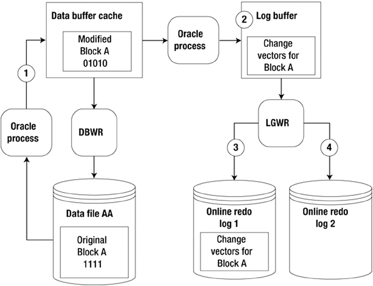

# Oracle应用和调优

## Oracle 结构

## 创建数据库

## Oracle物理结构

### 索引

### 分区

## 数据库用户管理

### 账户管理

用户管理的属性

* 用户名
* 验证方法
* 默认表空间

```plsql
ALTER DATABASE DEFAULT TABLESPACE tablespace_name ;
```

* 表空间配额

```plsql
SELECT tablespace_name, bytes, max_bytes FROM dba_ts_quotas
WHERE username='john';
```

s

* 临时表空间

```plsql
ALTER USER username TEMPORARY TABLESPACE tablespace_name;
```

> 无需对用户的临时表空间配额

* 用户配置模版

  	

  [详细请参考](https://docs.oracle.com/cd/E11882_01/server.112/e41084/statements_6010.htm#SQLRF01310)

  以下是两个Profile范例

```plsql
  CREATE PROFILE app_user LIMIT 
     SESSIONS_PER_USER          UNLIMITED 
     CPU_PER_SESSION            UNLIMITED 
     CPU_PER_CALL               3000 
     CONNECT_TIME               45 
     LOGICAL_READS_PER_SESSION  DEFAULT 
     LOGICAL_READS_PER_CALL     1000 
     PRIVATE_SGA                15K
     COMPOSITE_LIMIT            5000000; 
     
  CREATE PROFILE app_user2 LIMIT
     FAILED_LOGIN_ATTEMPTS 5
     PASSWORD_LIFE_TIME 60
     PASSWORD_REUSE_TIME 60
     PASSWORD_REUSE_MAX 5
     PASSWORD_VERIFY_FUNCTION verify_function
     PASSWORD_LOCK_TIME 1/24
     PASSWORD_GRACE_TIME 10;        
```

  

  

* 账户状态

  

  


* 账户状态

  * OPEN

  * LOCKED

  * EXPIRED

  * EXPIRED & LOCKED

  * EXPIRED(GRACE)

  * LOCKED(TIMED)

  * EXPIRED & LOCKED(TIMED)

  * EXPIRED(GRACE) & LOCKED

  * EXPIRED(GRACE) & LOCKED(TIMED)

    + 修改用户锁定状态

```plsql
    ALTER USER username ACCOUNT LOCK ;
    ALTER USER username ACCOUNT UNLOCK ;
```

    * 修改用户密码状态

```plsql
    ALTER USER username PASSWORD EXPIRE;
```

    > 这里没有`unexpire`的设置，只有通过重置密码的唯一方法

* 创建账户并分配其使用的表空间示例

```plsql
create user scott identified by tiger
default tablespace users temporary tablespace temp
quota 100m on users, quota unlimited on example
profile developer_profile
password expire
account unlock;
```

* 启用操作系统用户和密码验证时角色的二选一

```plsql
GRANT [sysdba | sysoper ] TO username ;

CONNECT username / password [@db_alias] AS [ SYSOPER | SYSDBA ] ;

CONNECT / AS [ SYSOPER | SYSDBA ] ;
```

* 修改账户示例

  * 修改密码

```plsql
    alter user scott identified by lion;
```

  * 修改默认表空间和临时表空间:

```plsql
    alter user scott default tablespace store_data temporary tablespace temp;
```

  * 修改配额:

```plsql
    alter user scott quota unlimited on store_data, quota 0 on users;
```

  * 修改配置模版:

```plsql
    alter user scott profile prod_profile;
```

  * 强制用户修改密码:

```plsql
    alter user scott password expire;
```

  * 锁定账户

```plsql
    alter user scott account lock;
```

  * 删除账户

```plsql
    drop user scott;
    drop user scott cascade;
```
------

## 加载数据

## 数据库监控

### 监控数据的修改

### 监控安全

### 监控备份

### 监控数据文件的增长

### 监控性能

## 备份

### 备份的类型

#### 全库备份 VS 部分备份

#### Level 0 备份 VS Level 1 备份

#### 物理备份 VS 逻辑备份

#### 热备份 VS 冷备份

#### Oralce管理的备份 VS 用户管理的备份

#### 物理备份演示

#### 逻辑备份演示

### RMAN 备份

* 查看备份集信息

```plsql
SET LINES 132 PAGESIZE 100
BREAK ON REPORT ON bs_key ON completion_time ON bp_name ON file_name
COL bs_key FORM 99999 HEAD "BS Key"
COL bp_name FORM a40 HEAD "BP Name"
COL file_name FORM a40 HEAD "Datafile"
--
SELECT
s.recid bs_key
,TRUNC(s.completion_time) completion_time
,p.handle bp_name
,f.name file_name
FROM v$backup_set s
,v$backup_piece p
,v$backup_datafile d
,v$datafile f
WHERE p.set_stamp = s.set_stamp
AND p.set_count = s.set_count
AND d.set_stamp = s.set_stamp
AND d.set_count = s.set_count
AND d.file# = f.file#
ORDER BY
s.recid
,p.handle
,f.name;
```

------


## 数据恢复

### 数据恢复的类型

#### 数据还原 VS 数据恢复

#### 完整恢复 VS 部分恢复

#### 传统模式 VS 数据闪回

#### 物理恢复 VS 逻辑恢复

### 闪回技术

#### 查询闪回

#### 版本闪回

#### 数据表闪回

#### 误删闪回

#### 数据归档闪回

#### 数据库闪回

### LogMiner


------

## Oracle 11g 常用管理查询语句


### Linux 下环境变量设置

```shell
$ export ORACLE_HOME=/orahome/app/oracle/product/12.1.0.1/db_1
$ export ORACLE_SID=O12C
$ export LD_LIBRARY_PATH=/usr/lib:$ORACLE_HOME/lib
$ export PATH=$ORACLE_HOME/bin:$PATH  
```

默认Oracle数据搜索查询中区分字符的大小写，可以建立会话后设定两个变量

```plsql
SQL> ALTER SESSION SET NLS_COMP=LINGUISTIC;
SQL> ALTER SESSION SET NLS_SORT = BINARY_CI;

SQL> set sqlprompt "_user'@'_connect_identifier>"
SYSTEM@orcl11g>
```


### 侦听实例状态

可以使用 `lsnrctl status` 查看实例启动状态

```shell
C:\Users\yangwawa>lsnrctl status

LSNRCTL for 64-bit Windows: Version 11.2.0.1.0 - Production on 02-SEP-2020 19:10:25

Copyright (c) 1991, 2010, Oracle.  All rights reserved.

Connecting to (DESCRIPTION=(ADDRESS=(PROTOCOL=IPC)(KEY=EXTPROC1521)))
STATUS of the LISTENER
------------------------
Alias                     LISTENER
Version                   TNSLSNR for 64-bit Windows: Version 11.2.0.1.0 - Production
Start Date                29-AUG-2020 23:23:57
Uptime                    3 days 19 hr. 46 min. 27 sec
Trace Level               off
Security                  ON: Local OS Authentication
SNMP                      OFF
Listener Parameter File   E:\app\yangwawa\product\11.2.0\dbhome_1\network\admin\listener.ora
Listener Log File         e:\app\yangwawa\diag\tnslsnr\DESKTOP-08E761I\listener\alert\log.xml
Listening Endpoints Summary...
  (DESCRIPTION=(ADDRESS=(PROTOCOL=ipc)(PIPENAME=\\.\pipe\EXTPROC1521ipc)))
  (DESCRIPTION=(ADDRESS=(PROTOCOL=tcp)(HOST=127.0.0.1)(PORT=1521)))
Services Summary...
Service "orcl" has 1 instance(s).
  Instance "orcl", status READY, has 1 handler(s) for this service...
Service "orclXDB" has 1 instance(s).
  Instance "orcl", status READY, has 1 handler(s) for this service...
Service "rcat" has 1 instance(s).
  Instance "rcat", status READY, has 1 handler(s) for this service...
Service "rcatXDB" has 1 instance(s).
  Instance "rcat", status READY, has 1 handler(s) for this service...
The command completed successfully
```

* 也可以交互式查询

```shell
C:\Users\yangwawa>lsnrctl

LSNRCTL for 64-bit Windows: Version 11.2.0.1.0 - Production on 02-SEP-2020 19:11:35

Copyright (c) 1991, 2010, Oracle.  All rights reserved.

Welcome to LSNRCTL, type "help" for information.

LSNRCTL> services listener
Connecting to (DESCRIPTION=(ADDRESS=(PROTOCOL=IPC)(KEY=EXTPROC1521)))
Services Summary...
Service "orcl" has 1 instance(s).
  Instance "orcl", status READY, has 1 handler(s) for this service...
    Handler(s):
      "DEDICATED" established:3344 refused:0 state:ready
         LOCAL SERVER
Service "orclXDB" has 1 instance(s).
  Instance "orcl", status READY, has 1 handler(s) for this service...
    Handler(s):
      "D000" established:0 refused:0 current:0 max:1022 state:ready
         DISPATCHER <machine: DESKTOP-08E761I, pid: 7112>
         (ADDRESS=(PROTOCOL=tcp)(HOST=DESKTOP-08E761I)(PORT=50731))
Service "rcat" has 1 instance(s).
  Instance "rcat", status READY, has 1 handler(s) for this service...
    Handler(s):
      "DEDICATED" established:0 refused:0 state:ready
         LOCAL SERVER
Service "rcatXDB" has 1 instance(s).
  Instance "rcat", status READY, has 1 handler(s) for this service...
    Handler(s):
      "D000" established:0 refused:0 current:0 max:1022 state:ready
         DISPATCHER <machine: DESKTOP-08E761I, pid: 10752>
         (ADDRESS=(PROTOCOL=tcp)(HOST=DESKTOP-08E761I)(PORT=56243))
The command completed successfully
```

* 使用自带工具管理 **Oracle Net Manager** 


* 建立数据库链接

  如果需要在不同的数据库之间查询数据，可以在当前实例中建立其他实例的数据库链接

  


```plsql
 SQL>　CREATE DATABASE LINK orclInst
 2  　　CONNECT TO hr IDENTIFIED BY redhat USING 'orcl';
 SQL> DESC user_tables@orclInst;
```

> 建立链接之后在查询表后添加 `@linkname`  , 设置可以通过其他数据库的结构建表以及插入数据
>
```plsql
SQL> CREATE TABLE orcl_user_tables AS SELECT * FROM user_tables@orclInst;
SQL> INSERT INTO orcl_user_tables AS SELECT * FROM user_tables@orclInst;
```


### 逻辑结构和物理结构


* 操作系统块: Windows/Linux 缺省为 4096, 4K
* Oracle 数据块： 2-32K ， 默认为8K，Windows/Linux 仅仅支持 2-16K， 参数 DB_BLOCK_SIZE
* 扩展段: 一系列Oracle数据块组成，在数据文件中一定是**连续**的
* 分段: 由一个或多个扩展段组成，也是连续的数字化

###　查看每个在数据库中的分段信息

```plsql
SQL>  select segment_type,count(1) from dba_segments group by segment_type
    order by segment_type;

SEGMENT_TYPE         COUNT(1)
------------------ ----------
CLUSTER                    10
INDEX                    3449
INDEX PARTITION           104
LOB PARTITION               1
LOBINDEX                  771
LOBSEGMENT                771
NESTED TABLE               26
ROLLBACK                    1
TABLE                    2210
TABLE PARTITION            88
TYPE2 UNDO                 10

11 rows selected.
```


```plsql
define tb=&tablespace;

select t.tablespace_name name, d.allocated, u.used, f.free,
t.status, d.cnt, contents, t.extent_management extman,
t.segment_space_management segman
from dba_tablespaces t,
(select sum(bytes) allocated, count(file_id) cnt from dba_data_files
where tablespace_name='&&tb') d,
(select sum(bytes) free from dba_free_space
where tablespace_name='&&tb') f,
(select sum(bytes) used from dba_segments
where tablespace_name='&&tb') u
where t.tablespace_name='&&tb';
```


```plsql
CREATE SMALLFILE TABLESPACE "NEWTS"
DATAFILE 'D:\APP\ORACLE\ORADATA\ORCL11G\newts01.dbf'
SIZE 100M AUTOEXTEND ON NEXT 10M MAXSIZE 200M
LOGGING
EXTENT MANAGEMENT LOCAL
SEGMENT SPACE MANAGEMENT AUTO
DEFAULT NOCOMPRESS;
```


```plsql
SELECT t.name tablespace_name,
       d.name filename,
       d.bytes / 1024 / 1024 size_MB,
       d.create_bytes / 1024 / 1024 create_size_MB
FROM v$tablespace t JOIN v$tempfile d USING ( ts# )
WHERE t.name = 'TEMP';
```


* 查看segments 如何管理 bitmaps

```plsql
select tablespace_name,segment_space_management from dba_tablespaces;
```


* 将手工分段管理的模式的表修改为自动管理的步骤示例

```plsql
create tablespace manualsegs segment space management manual;

select segment_space_management from dba_tablespaces
where tablespace_name='MANUALSEGS';

create table mantab (c1 number) tablespace manualsegs;
create index mantabi on mantab(c1) tablespace manualsegs;

create tablespace autosegs;

alter table mantab move tablespace autosegs;
alter index mantabi rebuild online tablespace autosegs;

select tablespace_name from dba_segments
where segment_name like 'MANTAB%';

drop tablespace manualsegs including contents and datafiles;

alter tablespace autosegs rename to manualsegs;

drop tablespace manualsegs;

drop tablespace manualsegs including contents and datafiles;
```


### 管理文件


* 显示控制文件存储信息

```plsql
SQL> select distinct type from v$controlfile_record_section;  
TYPE
----------------------------
FILENAME
TABLESPACE
RMAN CONFIGURATION
BACKUP CORRUPTION
PROXY COPY
FLASHBACK LOG
...
```

* 常看数据库相关信息

```plsql
SQL> select name, open_mode, created, current_scn from v$database;
NAME OPEN_MODE CREATED CURRENT_SCN
--------- -------------------- --------- -----------
O12C READ WRITE 27-SEP-14 319781
```

* 常看控制文件名字和位置

  + 方法一

```plsql
    SQL> show parameter control_files;
```

  + 方法二

```plsql
    SQL> select name from v$controlfile;
```

  + 方法三

    查看spfile中的字符串信息（仅仅适用于Linux）

```shell
    $ strings $ORACLE_HOME/dbs/spfileO12C.ora | grep -i control_files -A 5
```

​    

### 在线重做日志

* 显示online redo log 信息

  从 `v$log` 和 `v$logfile` 动态视图表中查询

```pl
COL group# FORM 99999
COL thread# FORM 99999
COL grp_status FORM a10
COL member FORM a30
COL mem_status FORM a10
COL mbytes FORM 999999
--
SELECT
a.group#
,a.thread#
,a.status grp_status
,b.member member
,b.status mem_status
,a.bytes/1024/1024 mbytes
FROM v$log a,
v$logfile b
WHERE a.group# = b.group#
ORDER BY a.group#, b.member;

GROUP# THREAD# GRP_STATUS MEMBER MEM_STATUS MBYTES
------ ------- ---------- ------------------------------ ---------- -------
1 1 CURRENT /u01/oraredo/O12C/redo01a.rdo 50
1 1 CURRENT /u02/oraredo/O12C/redo01b.rdo 50
2 1 INACTIVE /u01/oraredo/O12C/redo02a.rdo 50
2 1 INACTIVE /u02/oraredo/O12C/redo02b.rdo 50
3 1 INACTIVE /u01/oraredo/O12C/redo03a.rdo 50
3 1 INACTIVE /u02/oraredo/O12C/redo03b.rdo 50
```

* 是否启用归档日志方式

```plsql
SELECT log_mode, name FROM v$database;

LOG_MODE     NAME
------------ ---------
ARCHIVELOG   ORADB11G

```


* 判断 Online redo log 分组大小

分析时间段

```plsql
select count(*)
,to_char(first_time,'YYYY-MM-DD HH24')
from v$log_history
group by to_char(first_time,'YYYY-MM-DD HH24')
order by 2;

COUNT(*) TO_CHAR(FIRST
---------- -------------
2 2014:09:24:04
80 2014:09:24:05
44 2014:09:24:06
10 2014:09:24:12
```

查看建议优化的日志文件大小

```plsql
SQL> select optimal_logfile_size from v$instance_recovery;
```




* 添加日志分组

```plsql
alter database add logfile group 3
('/u01/oraredo/O12C/redo03a.rdo',
'/u02/oraredo/O12C/redo03b.rdo') SIZE 50M;
```

* 改变日志分组大小

```plsql
alter database add logfile group 4
('/u01/oraredo/O12C/redo04a.rdo',
'/u02/oraredo/O12C/redo04b.rdo') SIZE 200M;
```

```plsql
SQL> select group#, status, archived, thread#, sequence# from v$log;
```

* 删除分组

```plsql
SQL> alter database drop logfile group <group #>;
```

> [切换日志文件](#switch_logfile)
>
> 删除日志分组，并不会将系统的日志分组文件删除，需要手工删除。
>
> 删除日志分组，分组的状态必须为 **INACTIVE** ，如果删除当前在用的分组，`ORA-01623` 报错。
>
> - 切换日志文件
>

```plsql
SQL> alter system switch logfile;
```
>
> - `ORA-01624` 报错，意味着日志分组需要做灾难恢复
>
```plsql
SQL> alter system checkpoint;
```
>

```plsql
SQL> select member from v$logfile;
SQL> alter system switch logfile;
SQL> /
SQL> /
```

* 添加日志文件到分组中

```plsql
SQL> alter database add logfile member '/u02/oraredo/O12C/redo01b.rdo' to group 1;
```

* 移除分组中的日志文件

```plsql
SELECT a.group#, a.member, b.status, b.archived, SUM(b.bytes)/1024/1024 mbytes
FROM v$logfile a, v$log b
WHERE a.group# = b.group#
GROUP BY a.group#, a.member, b.status, b.archived
ORDER BY 1, 2;

SQL> alter database drop logfile member '/u01/oraredo/O12C/redo04a.rdo';
```

> 如果出现 `ORA-01623` 错误，需要切换日志，处理方式[如上](#switch_logfile)

* 移动日志文件或者改其名称

```plsql
SQL> shutdown immediate;

$ mv /u02/oraredo/O12C/redo02b.rdo /u01/oraredo/O12C/redo02b.rdo

SQL> startup mount;

SQL> alter database rename file '/u02/oraredo/O12C/redo02b.rdo'
to '/u01/oraredo/O12C/redo02b.rdo';

SQL> alter database open;
```


### 归档日志文件

#### 开启归档日志

如果先前安装时没有开启 `archivelog`,可以将数据库置入 `mount`模式修改系统归档配置

1. 1
2. 2
3. 3
4. 4
5. 5
6. 6
7. 7

安装时，选择 USE_DB_RECOVERY_FILE_DEST

```plsql
SQL> archive log list
Database log mode	       Archive Mode
Automatic archival	       Enabled
Archive destination	       USE_DB_RECOVERY_FILE_DEST
Oldest online log sequence     9
Next log sequence to archive   11
Current log sequence	       11


SQL> show parameter db_recovery_file_dest;

NAME				     TYPE	 VALUE
------------------------------------ ----------- ------------------------------
db_recovery_file_dest		     string	 /u01/app/oracle/flash_recovery
						 _area
db_recovery_file_dest_size	     big integer 3882M
```


* 设置归档日志位置

```plsql
SQL> alter system set log_archive_dest_1='location=/u01/oraarch/O12C' scope=both;
SQL> alter system set log_archive_format='O12C_%t_%s_%r.arc' scope=spfile;
```

> 在Linux下可以使用下面的命令检查
>
```shell
$ cd $ORACLE_HOME/dbs
$ strings spfile$ORACLE_SID.ora
```

>你可以通过 LOG_ARCHIVE_DESC_*N* 参数设置 
>
>```plsql
>SQL> show parameter log_archive_dest
>
>NAME TYPE VALUE
>---------------------- ----------- --------------------------
>log_archive_dest string
>log_archive_dest_1 string location=/u01/oraarch/O12C
>log_archive_dest_10 string
>```

* 查看详细的归档日志信息

```plsql
SQL> select dest_name, destination, status, binding from v$archive_dest;

DEST_NAME DESTINATION STATUS BINDING
-------------------- -------------------- --------- ---------
LOG_ARCHIVE_DEST_1 /u01/archive/O12C VALID OPTIONAL
LOG_ARCHIVE_DEST_2 INACTIVE OPTIONAL
...
```

### 日志文件 FRA 区域

开启FRA，设置以下两个参数

```plsql
SQL> alter system set db_recovery_file_dest_size=200g scope=both;

SQL> alter system set db_recovery_file_dest='/u01/fra' scope=both;

SQL> archive log list;

Database log mode Archive Mode
Automatic archival Enabled
Archive destination USE_DB_RECOVERY_FILE_DEST

SQL> show parameter db_recovery_file_dest

```

> 如果想同时设置FRA和非FRA位置
>
```plsql
SQL> alter system set log_archive_dest_1='location=/u01/oraarch/O12C';
SQL> alter system set log_archive_dest_2='location=USE_DB_RECOVERY_FILE_DEST';
```

> 关闭FRA
>
```plsql
SQL> alter system set db_recovery_file_dest='';
```


### 归档日志

* 开启归档日志并检查

```plsql
SQL> shutdown immediate;
SQL> startup mount;
SQL> alter database archivelog;
SQL> alter database open;

SQL> archive log list;

SQL> select log_mode from v$database;
LOG_MODE
------------
ARCHIVELOG
```

* 关闭归档日志

```plsql
SQL> shutdown immediate;
SQL> startup mount;
SQL> alter database noarchivelog;
SQL> alter database open;
```

### 表空间和数据文件


* 创建表空间

```plsql
create tablespace tools datafile '/u01/dbfile/O12C/tools01.dbf'
size 100m
segment space management auto;
--- OR
create tablespace tools datafile '/u01/dbfile/O12C/tools01.dbf'
size 100m
autoextend on maxsize 1000m
segment space management auto;
```

也可以使用变量的形式创建表空间

```plsql
define tbsp_large=5G
define tbsp_med=500M
--
create tablespace reg_data datafile '/u01/dbfile/O12C/reg_data01.dbf'
size &&tbsp_large segment space management auto;
--
create tablespace reg_index datafile '/u01/dbfile/O12C/reg_index01.dbf'
size &&tbsp_med segment space management auto;
```

> 上面的定义的变量在调用时使用 `&&` 

也可以写入到SQL脚本中

```plsql
define tbsp_large=&1
define tbsp_med=&2
--
create tablespace reg_data datafile '/u01/dbfile/O12C/reg_data01.dbf'
size &&tbsp_large segment space management auto;
--
create tablespace reg_index datafile '/u01/dbfile/O12C/reg_index01.dbf'
size &&tbsp_med segment space management auto;

SQL> @cretbsp 5G 500M
```

> 上面的 `&1` , `&2` 将作为位置参数
>
> 如果 `&varname` 将会提示你输入varname变量

* 查看已有的表空间是如何创建的

  使用 **DBMS_METADATA** 包中的函数

```plsql
SQL> set long 1000000

SQL> select dbms_metadata.get_ddl('TABLESPACE',tablespace_name) from dba_tablespaces;
```

* 修改表空间

```plsql
SQL> alter tablespace tools rename to tools_dev;
```

* 控制 redo 日志的生成

```plsql
create tablespace inv_mgmt_data
datafile '/u01/dbfile/O12C/inv_mgmt_data01.dbf' size 100m
segment space management auto
nologging;

SQL> select tablespace_name, logging from dba_tablespaces;
```

> 如果已有的表空间
>
```plsql
SQL> alter tablespace inv_mgmt_data nologging;
```

* 改变表空间/表的读写模式

```plsql
SQL> alter tablespace inv_mgmt_rep read only;

SQL> alter tablespace inv_mgmt_rep read write;

SQL> alter table my_tab read only;

SQL> alter table my_tab read write;
```

* 删除表空间
  1. 先将表空间离线

```plsql
SQL> alter tablespace inv_data offline;
```

		2.  删除表空间包括内容和表空间中的数据文件

```plsql
SQL> drop tablespace inv_data including contents and datafiles;
```

> 如果遇到 ORA-02449: unique/primary keys in table referenced by foreign keys  错误
>
```plsql
select p.owner,
p.table_name,
p.constraint_name,
f.table_name referencing_table,
f.constraint_name foreign_key_name,
f.status fk_status
from dba_constraints p,
dba_constraints f,
dba_tables t
where p.constraint_name = f.r_constraint_name
and f.constraint_type = 'R'
and p.table_name = t.table_name
and t.tablespace_name = UPPER('&tablespace_name')
order by 1,2,3,4,5;
```
>
> 可以先行查询下 *inv_data* 表空间下存放表是否有外键参考的数据，查看表空间下表的约束
>
> 确定数据无关重要性后，可以使用 `CASCADE` 递归式删除
>
```plsql
> SQL> drop tablespace inv_data including contents and data files cascade constraints;
```


## 数据恢复

* 查看 **checkpoint**, 决定哪些数据需要恢复

```plsql
SET LINES 132
COL name FORM a40
COL status FORM A8
COL file# FORM 9999
COL control_file_SCN FORM 999999999999999
COL datafile_SCN FORM 999999999999999
--
SELECT
a.name
,a.status
,a.file#
,a.checkpoint_change# control_file_SCN
,b.checkpoint_change# datafile_SCN
,CASE
WHEN ((a.checkpoint_change# - b.checkpoint_change#) = 0) THEN 'Startup Normal'
WHEN ((b.checkpoint_change#) = 0) THEN 'File Missing?'
WHEN ((a.checkpoint_change# - b.checkpoint_change#) > 0) THEN 'Media Rec. Req.'
WHEN ((a.checkpoint_change# - b.checkpoint_change#) < 0) THEN 'Old Control File'
ELSE 'what the ?'
END datafile_status
FROM v$datafile a -- control file SCN for datafile
,v$datafile_header b -- datafile header SCN
WHERE a.file# = b.file#
ORDER BY a.file#;
```

* 查看数据文件头信息

```plsql
SQL> select file#, status, error, recover from v$datafile_header;
```


### Flash Back

```plsql
SQL> select log_mode from v$database;

SQL> alter system set db_recovery_file_dest='/flash_recovery_area';
SQL> alter system set db_recovery_file_dest_size=8G;

SQL> alter system set db_flashback_retention_target=240;

SQL> shutdown immediate;
SQL> startup mount;

SQL> alter database flashback on;

SQL> alter database open;
```

```plsql
SQL> select flashback_on from v$database;
```


```plsql
SQL> select * from v$sgastat where name = 'flashback generation buff';
POOL NAME BYTES
------------ -------------------------- ----------
shared pool flashback generation buff 3981204
```

### 使用PL/SQL FlashBack  Database

```plsql
SQL> shutdown abort;

SQL> startup mount;
SQL> flashback database to timestamp
to_timestamp('20-12-08 10:00:00','dd-mm-yy hh24:mi:ss');
SQL> alter database open read only;

SQL> shutdown abort;
SQL> startup mount;
SQL> recover database until time '2008-12-20:10:02:00';
SQL> alter database open read only

SQL> shutdown abort;
SQL> startup mount;
SQL> alter database open resetlogs;
```

### 使用 RMAN FlashBack Database

```plsql
RMAN> flashback database to time =
to_date('20-12-08 10:00:00','yy-mm-dd hh24:mi:ss');
RMAN> flashback database to scn=2728665;
RMAN> flashback database to sequence=2123 thread=1;
```

### 使用 Database Control FlashBack Database

```plsql
SQL> create table test as select * from all_users;
SQL> select count(*) from test;

```


### Flaskback DROP


#### Flashback DROP 示例

1. 使用 SYSTEM 账户连接到数据库

2. 建立一个测试账户

```plsql
   SQL> create user dropper identified by dropper;
   SQL> grant create session, resource to dropper;
   SQL> commit;
   SQL> connect dropper/dropper;
```

3. 建表，建索引，插入数据

```plsql
   SQL> create table names (name varchar2(10));
   SQL> create index name_idx on names(name);
   SQL> alter table names add (constraint name_u unique(name));
   SQL> insert into names values ('John');
   SQL> commit;
```

4. 查看下你创建的对象

```plsql
   SQL> select object_name,object_type from user_objects;
   SQL> select constraint_name,constraint_type,table_name from
   user_constraints;
```

5. 模拟删除表

```plsql
   SQL> drop table names;
```

6. 再重新查询下，执行第4步，此时对象已经从 user_objects中移除

7. 查询 user_recyclebin 表，查找对应的名字

```plsql
   SQL> select object_name,original_name,type from user_recyclebin;
```

8. 下图显示

   

   > 注意名字需要使用 `""` 双引号扩起来

9. 恢复表

```plsql
   SQL> flashback table names to before drop;
```

   > 表已恢复，但索引和约束没有

10. 重新运行第4步和第7步，注意表的名称和索引在回收站的名称

11. 重命名索引和约束名称

```plsql
    SQL> alter index "BIN$YXigM3puQNTgQAB/AQBmSQ==$0" rename to name_idx;
    SQL> alter table names rename constraint
    "BIN$YXigM3ptQNTgQAB/AQBmSQ==$0" to name_u;
```

12. 重新执行第10步骤，再次查看

13. 再次使用 SYSTEM 连接，并且删除用户

```plsql
    SQL> connect system/oracle;
    SQL> drop user dropper cascade;
```

14. 这次所有属于测试账户的对象全部消失

```plsql
SQL> select count(*) from dba_recyclebin where owner='DROPPER';
```

------

## 范例数据库查询

首先安装范例数据库

```plsql
@?/demo/schema/mksample
```

> "?" 代表 $ORACLE_HOME
>
> "@"用以执行外部 sql 脚本


### 销售APP表结构

```plsql
SQL> desc sales
 Name                                      Null?    Type
 ----------------------------------------- -------- ----------------------------
 PROD_ID                                   NOT NULL NUMBER
 CUST_ID                                   NOT NULL NUMBER
 TIME_ID                                   NOT NULL DATE
 CHANNEL_ID                                NOT NULL NUMBER
 PROMO_ID                                  NOT NULL NUMBER
 QUANTITY_SOLD                             NOT NULL NUMBER(10,2)
 AMOUNT_SOLD                               NOT NULL NUMBER(10,2)

SQL> desc customers;
 Name                                      Null?    Type
 ----------------------------------------- -------- ----------------------------
 CUST_ID                                   NOT NULL NUMBER
 CUST_FIRST_NAME                           NOT NULL VARCHAR2(20)
 CUST_LAST_NAME                            NOT NULL VARCHAR2(40)
 CUST_GENDER                               NOT NULL CHAR(1)
 CUST_YEAR_OF_BIRTH                        NOT NULL NUMBER(4)
 CUST_MARITAL_STATUS                                VARCHAR2(20)
 CUST_STREET_ADDRESS                       NOT NULL VARCHAR2(40)
 CUST_POSTAL_CODE                          NOT NULL VARCHAR2(10)
 CUST_CITY                                 NOT NULL VARCHAR2(30)
 CUST_CITY_ID                              NOT NULL NUMBER
 CUST_STATE_PROVINCE                       NOT NULL VARCHAR2(40)
 CUST_STATE_PROVINCE_ID                    NOT NULL NUMBER
 COUNTRY_ID                                NOT NULL NUMBER
 CUST_MAIN_PHONE_NUMBER                    NOT NULL VARCHAR2(25)
 CUST_INCOME_LEVEL                                  VARCHAR2(30)
 CUST_CREDIT_LIMIT                                  NUMBER
 CUST_EMAIL                                         VARCHAR2(30)
 CUST_TOTAL                                NOT NULL VARCHAR2(14)
 CUST_TOTAL_ID                             NOT NULL NUMBER
 CUST_SRC_ID                                        NUMBER
 CUST_EFF_FROM                                      DATE
 CUST_EFF_TO                                        DATE
 CUST_VALID                                         VARCHAR2(1)

```


```plsql
conn sh;
select table_name from user_tables;

select cust_first_name || ' ' || cust_last_name customer , p.prod_name from sales s inner join customers  c using(cust_id) inner join products p using(prod_id) where cust_id = 2273;
```

### 函数

* 语法

```plsql
CREATE [OR REPLACE] FUNCTION function_name
   [ (parameter [,parameter]) ]
   RETURN return_datatype
IS | AS
   [declaration_section]
BEGIN
   executable_section
[EXCEPTION
   exception_section]
END [function_name];
```

* 示例

```plsql
CREATE OR REPLACE Function FindCourse
   ( name_in IN varchar2 )
   RETURN number
IS
   cnumber number;

   cursor c1 is
   SELECT course_number
     FROM courses_tbl
     WHERE course_name = name_in;
BEGIN
   open c1;
   fetch c1 into cnumber;
   if c1%notfound then
      cnumber := 9999;
   end if;
   close c1;
RETURN cnumber;

EXCEPTION
WHEN OTHERS THEN
   raise_application_error(-20001,'An error was encountered - '||SQLCODE||' -ERROR- '||SQLERRM);
END;

```

* 调用

```plsql
SELECT course_name, FindCourse(course_name) AS course_id
FROM courses
WHERE subject = 'Mathematics';
```


### 存储过程

* 语法

```plsql
CREATE [OR REPLACE] PROCEDURE procedure_name
    [ (parameter [,parameter]) ]
IS
    [declaration_section]
BEGIN
    executable_section
[EXCEPTION
    exception_section]
END [procedure_name];
```

* **%ROWTYPE** 一行数据

```plsql
CREATE OR REPLACE PROCEDURE print_contact(
    in_customer_id NUMBER 
)
IS
  r_contact contacts%ROWTYPE;
BEGIN
  -- get contact based on customer id
  SELECT *
  INTO r_contact
  FROM contacts
  WHERE customer_id = p_customer_id;

  -- print out contact's information
  dbms_output.put_line( r_contact.first_name || ' ' ||
  r_contact.last_name || '<' || r_contact.email ||'>' );

EXCEPTION
   WHEN OTHERS THEN
      dbms_output.put_line( SQLERRM );
END;
```

* 返回表

  首先要创建和表结构一样的`type`

  ```plsql
  SQL> create or replace type emp_dets as object (
    2  empno number,
    3  ename varchar2(30),
    4  job varchar2(20));
    5  /
  
  Type created.
  
  SQL> create or replace type emp_dets_nt as table of emp_dets;
    2  /
  
  Type created.
  
  ```

  接着在存储过程中定义返回的`bulk collect`数据类型为`emp_dest`类型

  ```plsql
  create or replace function get_emp_dets (p_dno in emp.deptno%type)
      return emp_dets_nt
  is
      return_value emp_dets_nt;
  begin
      select emp_dets(empno, ename, job)
      bulk collect into return_value
      from emp
      where deptno = p_dno;
      return return_value;
  end;
  /
  ```

  最后可以使用select \* from table()语句

  ```plsql
  SQL> select * 
    2  from table(get_emp_dets(10))
    3  /
  
       EMPNO ENAME                          JOB
  ---------- ------------------------------ --------------------
        7782 CLARK                          MANAGER
        7839 KING                           PRESIDENT
        7934 MILLER                         CLERK
  
  SQL> 
  ```

  

* 使用别名

```plsql
SQL> BEGIN
      FOR item IN
        (SELECT (first_name || ' ' || last_name) complete_name
          FROM employees
             WHERE ROWNUM < 11
        ) LOOP
          DBMS_OUTPUT.PUT_LINE
            ('Employee name: ' || item.complete_name);
        END LOOP;
   END;
   /
```

* 使用子程序名称, 

```plsql
DECLARE
      FUNCTION get_prod_name (prod_id IN NUMBER)
        RETURN products.prod_name%TYPE  -- 返回products表中prod_name字段相同类型
      IS
        product_name  products.prod_name%TYPE;
      BEGIN
        SELECT prod_name INTO get_prod_name.product_name
          --   ^column              ^local variable
          FROM products
           WHERE prod_id = get_prod_name.prod_id; -- 带入prod_name 函数进来的参数
           --    ^column         ^formal parameter 
       RETURN product_name;
     END;
   BEGIN
     FOR item IN (SELECT prod_id FROM products)
     LOOP
       DBMS_OUTPUT.PUT_LINE
         ('product: ' || get_prod_name(item.prod_id));
     END LOOP;
   END;
   /
```

> 把函数名当成一种变量对象，get_prod_name.**prod_id** 就是带入进来的参数属性，get_prod_name.**product_name** 额外添加的新属性

* **CONSTANT**

* **%TYPE** 复用的类型

```plsql
SQL> DECLARE
     credit  PLS_INTEGER RANGE 1000..25000;
     debit   credit%TYPE;  -- inherits data type
  
     name        VARCHAR2(20) := 'JoHn SmItH';
     upper_name  name%TYPE;  -- inherits data type and default value
     lower_name  name%TYPE;  -- inherits data type and default value
     init_name   name%TYPE;  -- inherits data type and default value
    BEGIN
     DBMS_OUTPUT.PUT_LINE ('name: ' || name);
     DBMS_OUTPUT.PUT_LINE ('upper_name: ' || UPPER(name));
     DBMS_OUTPUT.PUT_LINE ('lower_name: ' || LOWER(name));
     DBMS_OUTPUT.PUT_LINE ('init_name:  ' || INITCAP(name));
   END;
   /
name: JoHn SmItH
upper_name: JOHN SMITH
lower_name: john smith
init_name:  John Smith
 
PL/SQL procedure successfully completed.
 
SQL> 
```


### 灾难恢复

####　redo log 破损修复

1. 查询每个分组中的状态

```plsql
   SELECT
   a.group#
   ,a.thread#
   ,a.status grp_status
   ,b.member member
   ,b.status mem_status
   ,a.bytes/1024/1024 mbytes
   FROM v$log a,
   v$logfile b
   WHERE a.group# = b.group#
   ORDER BY a.group#, b.member;
   
   GROUP# THREAD# GRP_STATUS MEMBER MEM_STA MBYTES
   ------ -------- ---------- ------------------------------ ------- --------
   1 1 INACTIVE /u01/oraredo/O12C/redo01a.rdo 50
   1 1 INACTIVE /u02/oraredo/O12C/redo01b.rdo 50
   2 1 CURRENT /u01/oraredo/O12C/redo02a.rdo 50
   2 1 CURRENT /u02/oraredo/O12C/redo02b.rdo 50
   3 1 INACTIVE /u01/oraredo/O12C/redo03a.rdo 50
   3 1 INACTIVE /u02/oraredo/O12C/redo03b.rdo 50
```


### RMAN


### 配置自动备份控制文件

```plsql
RMAN> show controlfile autobackup;
RMAN> configure controlfile autobackup on;
```

------


#### 删除 online redo log

此种场景需要 media recovery, 如果没有备份，可以采用下面步骤

1. 首先数据库无法处于 `open`, 但可以在`mount`模式下查询,

```plsql
SQL> select file#, status, fuzzy, error, checkpoint_change#,
       to_char(checkpoint_time,'dd-mon-rrrr hh24:mi:ss') as checkpoint_time
       from v$datafile_header;
       
     FILE# STATUS  FUZ
---------- ------- ---
ERROR
-----------------------------------------------------------------
CHECKPOINT_CHANGE# CHECKPOINT_TIME
------------------ -----------------------------
	 1 ONLINE  NO

	    458378 05-oct-2020 17:56:21

	 2 ONLINE  NO

	    458378 05-oct-2020 17:56:21

     FILE# STATUS  FUZ
---------- ------- ---
ERROR
-----------------------------------------------------------------
CHECKPOINT_CHANGE# CHECKPOINT_TIME
------------------ -----------------------------

	 3 ONLINE  NO

	    458378 05-oct-2020 17:56:21

	 4 ONLINE  NO


     FILE# STATUS  FUZ
---------- ------- ---
ERROR
-----------------------------------------------------------------
CHECKPOINT_CHANGE# CHECKPOINT_TIME
------------------ -----------------------------
	    458378 05-oct-2020 17:56:21

	 5 ONLINE  NO

	    458378 05-oct-2020 17:56:21
```

 > 需要先还原数据库

```plsql
RMAN > conn target /
RMAN > shutdown immediate;
RMAN > startup nomount;
RMAN > restore database;
```


2. 上面的操作可以得到 `checkpoint SCN`,接着实现不完整数据恢复

```plsql
   RMAN> recover database until sequence 458378;
```

   > 如果不能执行第一步骤（数据库不处于`open`模式）,也可以通过

```plsql
RMAN> list backup;
List of Backup Sets
===================

BS Key  Type LV Size       Device Type Elapsed Time Completion Time
------- ---- -- ---------- ----------- ------------ ---------------
42      Incr 0  792.70M    DISK        00:01:06     05-OCT-20      
BP Key: 42   Status: AVAILABLE  Compressed: NO  Tag: TAG20201005T175006
Piece Name: E:\ORACLEXE\APP\ORACLE\FAST_RECOVERY_AREA\XE\BACKUPSET\2020_10_05\O1_MF_NNND0_TAG20201005T175006_HQOV2H73_.BKP
List of Datafiles in backup set 42
File LV Type Ckp SCN    Ckp Time  Name
---- -- ---- ---------- --------- ----
1    0  Incr 458110     05-OCT-20 E:\ORACLEXE\APP\ORACLE\ORADATA\XE\SYSTEM.DBF
2    0  Incr 458110     05-OCT-20 E:\ORACLEXE\APP\ORACLE\ORADATA\XE\SYSAUX.DBF
3    0  Incr 458110     05-OCT-20 E:\ORACLEXE\APP\ORACLE\ORADATA\XE\UNDOTBS1.DBF
4    0  Incr 458110     05-OCT-20 E:\ORACLEXE\APP\ORACLE\ORADATA\XE\USERS.DBF
5    0  Incr 458110     05-OCT-20 E:\ORACLEXE\APP\ORACLE\ORADATA\XE\RECCAT01.DBF

BS Key  Size       Device Type Elapsed Time Completion Time
------- ---------- ----------- ------------ ---------------
43      57.00K     DISK        00:00:01     05-OCT-20      
BP Key: 43   Status: AVAILABLE  Compressed: NO  Tag: TAG20201005T175122
Piece Name: E:\ORACLEXE\APP\ORACLE\FAST_RECOVERY_AREA\XE\BACKUPSET\2020_10_05\O1_MF_ANNNN_TAG20201005T175122_HQOV4V8H_.BKP

List of Archived Logs in backup set 43
Thrd Seq     Low SCN    Low Time  Next SCN   Next Time
---- ------- ---------- --------- ---------- ---------
1    2       458097     05-OCT-20 458180     05-OCT-20
 
BS Key  Size       Device Type Elapsed Time Completion Time
------- ---------- ----------- ------------ ---------------
45      1.08M      DISK        00:00:00     05-OCT-20      
BP Key: 45   Status: AVAILABLE  Compressed: NO  Tag: TAG20201005T175533
Piece Name: E:\ORACLEXE\APP\ORACLE\FAST_RECOVERY_AREA\XE\BACKUPSET\2020_10_05\O1_MF_ANNNN_TAG20201005T175533_HQOVDPFF_.BKP

List of Archived Logs in backup set 45
Thrd Seq     Low SCN    Low Time  Next SCN   Next Time
---- ------- ---------- --------- ---------- ---------
1    1       454933     05-OCT-20 458097     05-OCT-20
1    2       458097     05-OCT-20 458180     05-OCT-20
1    3       458180     05-OCT-20 458351     05-OCT-20

BS Key  Type LV Size       Device Type Elapsed Time Completion Time
------- ---- -- ---------- ----------- ------------ ---------------
46      Incr 1  752.00K    DISK        00:00:40     05-OCT-20      
BP Key: 46   Status: AVAILABLE  Compressed: NO  Tag: TAG20201005T175535
Piece Name: E:\ORACLEXE\APP\ORACLE\FAST_RECOVERY_AREA\XE\BACKUPSET\2020_10_05\O1_MF_NNND1_TAG20201005T175535_HQOVDRZ0_.BKP
List of Datafiles in backup set 46
File LV Type Ckp SCN    Ckp Time  Name
---- -- ---- ---------- --------- ----
1    1  Incr 458357     05-OCT-20 E:\ORACLEXE\APP\ORACLE\ORADATA\XE\SYSTEM.DBF
2    1  Incr 458357     05-OCT-20 E:\ORACLEXE\APP\ORACLE\ORADATA\XE\SYSAUX.DBF
3    1  Incr 458357     05-OCT-20 E:\ORACLEXE\APP\ORACLE\ORADATA\XE\UNDOTBS1.DBF
4    1  Incr 458357     05-OCT-20 E:\ORACLEXE\APP\ORACLE\ORADATA\XE\USERS.DBF
5    1  Incr 458357     05-OCT-20 E:\ORACLEXE\APP\ORACLE\ORADATA\XE\RECCAT01.DBF

...

RMAN> recover database until sequence 458351;
```
   >
   > 查看某个备份的归档日志的 `SCN`

3. 最后需要重置日志，让其重新产生缺失的 online redo log 文件

```plsql
   RMAN> alter database open resetlogs;
```
------

### 附录

安装 sample schema

```plsql
@?/demo/schema/human_resources/hr_main.sql
```


### 版本差异

12c开始引入一些新的特性，比如排序

*  [11G实现输出的限制](https://blogs.oracle.com/oraclemagazine/on-rownum-and-limiting-results), 利用伪列 `ROWNUM`实现

```plsql
  select * 
    from orders 
   where ROWNUM <= 5 
   order by order_id desc;
```

  而要实现分页查询结果，就非常麻烦 **三个套娃** 实现：

  1. 先执行查询排序，给这个查询起个别名，比如"a"

  2. 将上面的查询结果作为子查询，画上一道线，截取最大值`MAX_ROW_TO_FETCH`的条目，此查询又将变成临时表，将作为其他语句的子查询

      > **此时要将ROWNUM变量定义个别名**

  3. 最后将上面的子查询结果跳过`MIN_ROW_TO_FETCH`条,剩余就是去尾去头的结果。

```plsql
  select * 
    from ( select /*+ FIRST_ROWS(n) */ 
    a.*, ROWNUM rnum 
        from ( your_query_goes_here, 
        with order by ) a 
        where ROWNUM <= 
        :MAX_ROW_TO_FETCH ) 
  where rnum  >= :MIN_ROW_TO_FETCH;
```

  例子：

```plsql
  select * 
    from ( select /*+ FIRST_ROWS(n) */ 
    sa.*, ROWNUM rnum 
        from ( SELECT * FROM sales order by cust_id ) sa 
        where ROWNUM <= 
        20 ) 
  where rnum  > 10;
```

  

* 12c 引入新的功能 `OFFSET` 跳过 `N` 条，`FETCH NEXT`接下来的 `N` 条记录

```plsql
  select * form orders OFFSET 20 ROWS FETCH NEXT 10 ROWS ONLY;
```

* 12c 版本以前的 Oracle，在RMAN中执行管理任务需要用到 `sql` 命令

```plsql
RMAN> sql 'alter system switch logfile';
```


## 监控Oracle数据库

### DBMS_MONITOR使用

dbms_monitor方法提供了4种开启/关闭trace文件的功能+ 2种开启/关闭会话统计信息功能 (其中，统计信息功能类似`V$MYSTAT`视图)；

**4种方法开启/关闭trace文件：**

1. SESSION_TRACE_ENABLE/SESSION_TRACE_DISABLE:
    通过指定会话的SID和SERIAL#开启/关闭trace，实现异步跟踪；
2. DATABASE_TRACE_ENABLE/DATABASE_TRACE_DISABLE过程:
    设置数据库实例上所有会话的trace 开启/关闭，不建议这样做；
3. CLIENT_ID_TRACE_ENABLE/CLIENT_ID_TRACE_DISABLE:
    通过客户端ID开启/关闭指定客户端的TRACE，如果会话客户端ID为空，可以通过程序设置：`DBMS_SESSION.SET_IDENTIFIER('YYC_TEST');`
4. SERV_MOD_ACT_TRACE_ENABLE/SERV_MOD_ACT_TRACE_DISABLE:
    通过SERVICE_NAME, MODULE_NAME和ACTION_NAME开启/关闭trace；

**2种方法开启/关闭会话的统计信息功能：**

1. SERV_MOD_ACT_STAT_ENABLE/SERV_MOD_ACT_STAT_DISABLE:
    和trace方法4一样，都是通过SERVICE_NAME, MODULE_NAME和ACTION_NAME开启/关闭对应会话的统计信息，对应统计视图：`V$SERV_MOD_ACT_STATS`；
2. CLIENT_ID_STAT_ENABLE/ CLIENT_ID_STAT_DISABLE:
    和trace方法3一样，通过通过客户端ID开启/关闭指定客户端的统计信息，对应统计视图： `V$CLIENT_STATS`;

### Session级跟踪，基于会话ID和序列号

先获得会话ID

```plsql
SQL> select sid from v$mystat where rownum = 1
```

然后获得序列号

```plsql
SQL> select serial# from V$session where sid = (select sid from v$mystat where rownum = 1)
```

接着根据 SID，SERIAL# 开启会话跟踪

```plsql
exec DBMS_MONITOR.SESSION_TRACE_ENABLE(46,1103, TRUE, FALSE)
```

> 上面例子中的SID=46，SERIAL#=1103

那么，生成的跟踪文件是哪一个了？通过查询 v$process 和 v$session 获得

```plsql
SQL> select p.tracefile from v$process p , v$session s
  2  where p.addr = s.paddr
  3  and s.sid = 46;
  
TRACEFILE
--------------------------------------------------------------------------------
/u01/app/oracle/diag/rdbms/demo/demo/trace/demo_ora_70719.trc
```

有了`trace`文件的位置后，再通过专用命令行工具 **tkprof** 将某时刻的内容转换成文本格式

```shell
shell> tkprof /u01/app/oracle/diag/rdbms/demo/demo/trace/demo_ora_70719.trc ~/demo_ora.txt sort="execpu"
```

> tkprof 参数众多，直接执行命令不加参数可以显示帮助

最终关闭 trace

```plsql
exec DBMS_MONITOR.SESSION_TRACE_DISABLE(46,1103);
```


### 创建测试压力包

先激活 `SH` 账户,重新登录

```plsql
SQL> alter user "hr" identified by "redhat" account unlock;
SQL> exit


shell> sqlplus hr@demo/redhat
```

复制下面这段SQL，创建 `WORKBENCH` 包

```plsql
CREATE OR REPLACE PACKAGE sh.WORKBENCH AS
  PROCEDURE WORKLOAD_NOBIND;
  PROCEDURE WORKLOAD_BIND;
  PROCEDURE WORKLOAD_BIND_STATIC;
  PROCEDURE TEST_INJECTION(NAME IN sh.customers.cust_last_name%TYPE);
  PROCEDURE TEST_INJECTION2(NAME IN sh.customers.cust_last_name%TYPE);
END;
/
```

添加对应的存储过程

```plsql
CREATE OR REPLACE PACKAGE BODY sh.WORKBENCH AS
	PROCEDURE TEST_NOBIND(CUSTID IN sh.customers.cust_id%TYPE)
	IS
		BEGIN
			DECLARE aRow sh.customers%ROWTYPE;
			l_stmt VARCHAR2(2000);
			BEGIN
				l_stmt := 'SELECT * FROM sh.customers s WHERE s.cust_id=' || TO_CHAR (CUSTID);
				EXECUTE IMMEDIATE l_stmt INTO aRow;
			END;
	END TEST_NOBIND;


	PROCEDURE TEST_BIND(CUSTID IN sh.customers.cust_id%TYPE) IS
	BEGIN
		DECLARE aRow sh.customers%ROWTYPE;
		l_stmt VARCHAR2(2000);
		BEGIN
			l_stmt := 'SELECT * FROM sh.customers s WHERE s.cust_id = :p_cust_id';
			EXECUTE IMMEDIATE l_stmt INTO aRow USING CUSTID;
		END;
	END TEST_BIND;


	PROCEDURE TEST_BIND_STATIC(CUSTID IN sh.customers.cust_id%TYPE) IS
	BEGIN
		DECLARE aRow sh.customers%ROWTYPE;
		BEGIN
			SELECT * INTO aROW FROM sh.customers s WHERE s.cust_id = CUSTID;
			EXCEPTION
			WHEN NO_DATA_FOUND THEN NULL;
		END;
	END TEST_BIND_STATIC;
	
	PROCEDURE WORKLOAD_NOBIND IS
	BEGIN
		FOR i IN 1..50000
		LOOP
			TEST_NOBIND(i);
		END LOOP;
	END WORKLOAD_NOBIND;
	
	PROCEDURE WORKLOAD_BIND IS
	BEGIN
		FOR i IN 1..50000
		LOOP
			TEST_BIND(i);
		END LOOP;
	END WORKLOAD_BIND;

	PROCEDURE WORKLOAD_BIND_STATIC IS
	BEGIN
		FOR i IN 1..50000
		LOOP
			TEST_BIND_STATIC(i);
		END LOOP;
	END WORKLOAD_BIND_STATIC;

	PROCEDURE TEST_INJECTION(NAME IN
		sh.customers.cust_last_name%TYPE) IS
	BEGIN
		DECLARE l_stmt VARCHAR2(2000); res NUMBER;
		BEGIN
			l_stmt := 'SELECT COUNT(*) FROM sh.customers s WHERE
				s.cust_last_name = ''' || NAME || '''';
			EXECUTE IMMEDIATE l_stmt INTO res;
			DBMS_OUTPUT.PUT_LINE('Count: ' || TO_CHAR(res));
		END;
	END TEST_INJECTION;

	PROCEDURE TEST_INJECTION2(NAME IN
		sh.customers.cust_last_name%TYPE) IS
	BEGIN
		DECLARE l_stmt VARCHAR2(2000);
		BEGIN
			l_stmt := 'BEGIN DBMS_OUTPUT.PUT_LINE (''You passed ' || NAME || '''); END;';
			EXECUTE IMMEDIATE l_stmt;
		END;
	END TEST_INJECTION2;

END;
/
```

最后，通过包中的存储过程测试，在此之前可以开启各种分析监控手段

```plsql
SQL> alter system flush shared_pool;
SQL> exec sh.workbench.workload_nobind;

PL/SQL procedure successfully completed.
Elapsed: 00:00:51.09
```

------

## 性能调优 

* 性能规划
  * Understanding Investment Options  
  * 理解可扩展性
  * 系统的架构
  * 应用程序设计的方案
  * 负荷的测试，建模并实现
  * 部署新的应用程序
* 实例调优
  * 分配内存给数据库框架
  * 判断不同数据库组件的 I/O 需求
  * 调整操作系统来优化数据库
* SQL语句调优

### 性能分析时所用到的视图

* v$sesstat: 会话的统计信息
* v$sysstat：系统级的统计信息
* v$session_event：会话级的事件

* v$system_event： 系统级的事件

```plsql
  SQL> col event for a40;
  SQL> select event, total_waits,time_waited from v$system_event;
  
  EVENT					 TOTAL_WAITS TIME_WAITED
  ---------------------------------------- ----------- -----------
  pmon timer				       12408	 3723062
  Parameter File I/O				1773	     204
  rdbms ipc message			      223347	66800024
  Disk file operations I/O		       10947	      78
  direct path sync				1841	    1768
  Data file init write				  68	      32
  Log archive I/O 				 223	     150
  VKRM Idle					   1	 3722992
  class slave wait				1699	  149886
  DIAG idle wait				       74386	 7443944
  SGA: MMAN sleep for component shrink		1682	    3052
  
  ... 
  
  EVENT					 TOTAL_WAITS TIME_WAITED
  ---------------------------------------- ----------- -----------
  log file switch completion			   3	       7
  log file sync					 428	    2909
  heartbeat redo informer 		       37159	 3723211
  db file sequential read 		       30705	   16998
  db file scattered read				4037	    4094
  db file single write				  34	       1
  db file async I/O submit			8530	     534
  db file parallel read				  10	      30
  direct path read				 555	     309
  direct path write				 227	      48
  direct path write temp				1839	       7
  
  ...
  
  EVENT					 TOTAL_WAITS TIME_WAITED
  ---------------------------------------- ----------- -----------
  latch: enqueue hash chains			  20	      16
  asynch descriptor resize			4274	       3
  reliable message				 307	       5
  KSV master wait 				   1	       0
  enq: PV - syncstart				   8	      50
  latch: active service list			   2	       0
  oracle thread bootstrap 			2130	    9500
  os thread creation				2130	    1297
  SGA: allocation forcing component growth	 162	    3203
  control file heartbeat				   1	     400
  buffer exterminate				 534	     659
  
  EVENT					 TOTAL_WAITS TIME_WAITED
  ---------------------------------------- ----------- -----------
  latch: cache buffers lru chain			   5	       1
  latch: checkpoint queue latch			   3	       1
  enq: CR - block range reuse ckpt		   1	       5
  latch: object queue header operation		   4	       1
  get branch/thread/sequence enqueue		   5	       0
  Redo Transport Open				   5	       0
  LGWR wait for redo copy 			  54	       1
  latch: redo allocation				  53	      13
  latch: undo global data 			   1	       1
  instance state change				   1	       0
  kksfbc child completion 			   2	      10
  
  ... 
  109 rows selected.
  
```

* v$sess_time_model
```plsql
SQL> col stat_name for a30
SQL> SELECT * from v$sess_time_model ;

...
      SID    STAT_ID STAT_NAME 			  VALUE     CON_ID
---------- ---------- ------------------------------ ---------- ----------
		      tion cpu time

	49 2799640666 background IM trickle repopula	      0 	 0
		      tion cpu time

	54 2799640666 background IM trickle repopula	      0 	 0
		      tion cpu time

	57 2799640666 background IM trickle repopula	      0 	 0
		      tion cpu time


       SID    STAT_ID STAT_NAME 			  VALUE     CON_ID
---------- ---------- ------------------------------ ---------- ----------
	61 2799640666 background IM trickle repopula	      0 	 0
		      tion cpu time

	64 2799640666 background IM trickle repopula	      0 	 0
		      tion cpu time

	73 2799640666 background IM trickle repopula	      0 	 0
		      tion cpu time

	81 2799640666 background IM trickle repopula	      0 	 0
		      tion cpu time

       SID    STAT_ID STAT_NAME 			  VALUE     CON_ID
---------- ---------- ------------------------------ ---------- ----------

	83 2799640666 background IM trickle repopula	      0 	 0
		      tion cpu time

	88 2799640666 background IM trickle repopula	      0 	 0
		      tion cpu time


1218 rows selected.
```
* v$active_session_history： 包含`ASH`的信息
  * `SQL ID`
  * SQL `执行计划ID` 和 执行SQL语句的  `hash 值`
  * SQL 执行计划信息
  * 对象#，文件#，数据库#
  * 等待事件ID和参数
  * 会话ID和会话序列号
  * 模块和动作名称
  * 客户端ID
  * 服务 hash ID
  * 资源消耗组ID  

* v$osstat: CPU的统计信息

* v$iostat_consumer_group:

* v$iostat_file: 数据库文件IO信息

* v$iostat_function：数据库内部功能的IO信息（比如 LGWR 和 DBWR)

* v$iostat_network: 网络IO信息

### 可用于分析的Linux/Unix命令
安装 `sysstat` 软件包
```shell
$ sudo apt-get install sysstat
```


### sar 命令

Linux 下的性能分析，包括CPU使用情况，内存使用情况，IO状态等等与系统相关的状态，少不了要使用 sysstat  工具包中的命令，它包括：cifsiostat  iostat  mpstat  pidstat  sadf  sar  tapestat  七条命令。 sysstat 服务启动后，它会自动每个10分钟收集一次系统状态信息，并将它们存储到  /var/log/sa目录下。每天一个文件，文件名分别是sa01, sa02,... sa30..

#### 1）sar -u 查看CPU信息：

sar -u, sar -u ALL, sar -u 1 5, sar -u ALL 1 5

```cpp
[root@localhost ~]# sar -u 1 2
Linux 2.6.32-504.el6.i686 (localhost.localdomain)       10/20/2015      _i686_  (1 CPU)
11:02:27 AM     CPU     %user     %nice   %system   %iowait    %steal     %idle
11:02:28 AM     all      0.99      0.00      2.97      0.00      0.00     96.04
11:02:29 AM     all      0.00      0.00      3.03      0.00      0.00     96.97
Average:        all      0.50      0.00      3.00      0.00      0.00     96.50
```

#### 2）sar -r, sar -R 查看内存信息：

sar -r, sar -R, sar -r 1 5, sar -R 1 5

```cpp
[root@localhost ~]# sar -r  1 2
Linux 2.6.32-504.el6.i686 (localhost.localdomain)       10/20/2015      _i686_  (1 CPU)
11:05:31 AM kbmemfree kbmemused  %memused kbbuffers  kbcached  kbcommit   %commit
11:05:32 AM    824392    206156     20.00     71556     74584     82316      3.96
11:05:33 AM    824392    206156     20.00     71556     74584     82316      3.96
Average:       824392    206156     20.00     71556     74584     82316      3.96

[root@localhost ~]# sar -R  1 2
Linux 2.6.32-504.el6.i686 (localhost.localdomain)       10/20/2015      _i686_  (1 CPU)
11:05:56 AM   frmpg/s   bufpg/s   campg/s
11:05:57 AM    -11.11      0.00      0.00
11:05:58 AM      0.00      0.00      0.00
Average:        -5.56      0.00      0.00
```

#### 3）sar -S, sar -W 查看 swap:

sar -S, sar -S 1 5, sar -W, sar -W 1 5. sar -S 查看的是swap空间的使用情况，sar -W 是每秒发生的swap/page情况

```cpp
[root@localhost ~]# sar -S
Linux 2.6.32-504.el6.i686 (localhost.localdomain)       10/20/2015      _i686_  (1 CPU)
09:43:28 AM       LINUX RESTART
09:50:02 AM kbswpfree kbswpused  %swpused  kbswpcad   %swpcad
10:00:01 AM   1048572         0      0.00         0      0.00
10:10:02 AM   1048572         0      0.00         0      0.00
10:20:01 AM   1048572         0      0.00         0      0.00
10:30:01 AM   1048572         0      0.00         0      0.00
10:40:02 AM   1048572         0      0.00         0      0.00
10:50:01 AM   1048572         0      0.00         0      0.00
11:00:01 AM   1048572         0      0.00         0      0.00
Average:      1048572         0      0.00         0      0.00

[root@localhost ~]# sar -S 1 5
Linux 2.6.32-504.el6.i686 (localhost.localdomain)       10/20/2015      _i686_  (1 CPU)
11:07:29 AM kbswpfree kbswpused  %swpused  kbswpcad   %swpcad
11:07:30 AM   1048572         0      0.00         0      0.00
11:07:31 AM   1048572         0      0.00         0      0.00
11:07:32 AM   1048572         0      0.00         0      0.00
11:07:33 AM   1048572         0      0.00         0      0.00
11:07:34 AM   1048572         0      0.00         0      0.00
Average:      1048572         0      0.00         0      0.00

[root@localhost ~]# sar -W
Linux 2.6.32-504.el6.i686 (localhost.localdomain)       10/20/2015      _i686_  (1 CPU)
09:43:28 AM       LINUX RESTART
09:50:02 AM  pswpin/s pswpout/s
10:00:01 AM      0.00      0.00
10:10:02 AM      0.00      0.00
10:20:01 AM      0.00      0.00
10:30:01 AM      0.00      0.00
10:40:02 AM      0.00      0.00
10:50:01 AM      0.00      0.00
11:00:01 AM      0.00      0.00
Average:         0.00      0.00

[root@localhost ~]# sar -W 1 5
Linux 2.6.32-504.el6.i686 (localhost.localdomain)       10/20/2015      _i686_  (1 CPU)
11:09:51 AM  pswpin/s pswpout/s
11:09:52 AM      0.00      0.00
11:09:53 AM      0.00      0.00
11:09:54 AM      0.00      0.00
11:09:55 AM      0.00      0.00
11:09:56 AM      0.00      0.00
Average:         0.00      0.00
```

#### 4）sar -b, sar -B 查看磁盘IO：

sar -b, sar -b 1 5, sar -B, sar -B 1 5. sar -b 查看磁盘tps(iops)；sar -B 主要查看每秒磁盘 page/ fault

```cpp
[root@localhost ~]# sar -b 1 5
Linux 2.6.32-504.el6.i686 (localhost.localdomain)       10/20/2015      _i686_  (1 CPU)
11:12:58 AM       tps      rtps      wtps   bread/s   bwrtn/s
11:12:59 AM      0.00      0.00      0.00      0.00      0.00
11:13:00 AM      0.00      0.00      0.00      0.00      0.00
11:13:01 AM      0.00      0.00      0.00      0.00      0.00
11:13:02 AM      0.00      0.00      0.00      0.00      0.00
11:13:03 AM      0.00      0.00      0.00      0.00      0.00
Average:         0.00      0.00      0.00      0.00      0.00

[root@localhost ~]# sar -B
Linux 2.6.32-504.el6.i686 (localhost.localdomain)       10/20/2015      _i686_  (1 CPU)
09:43:28 AM       LINUX RESTART
09:50:02 AM  pgpgin/s pgpgout/s   fault/s  majflt/s  pgfree/s pgscank/s pgscand/s pgsteal/s    %vmeff
10:00:01 AM      0.00      0.05      3.29      0.00      0.86      0.00      0.00      0.00      0.00
10:10:02 AM      0.71      0.22     12.02      0.00      3.16      0.00      0.00      0.00      0.00
10:20:01 AM      0.00      0.05      3.43      0.00      0.85      0.00      0.00      0.00      0.00
10:30:01 AM      0.00      0.09      3.28      0.00      0.83      0.00      0.00      0.00      0.00
10:40:02 AM      2.42      0.44     59.48      0.02     14.86      0.00      0.00      0.00      0.00
10:50:01 AM    167.26     13.16   1580.24      0.09    336.45      0.00      0.00      0.00      0.00
11:00:01 AM      2.56      0.17     15.00      0.02      3.95      0.00      0.00      0.00      0.00
11:10:01 AM      0.00      0.09     25.18      0.00      9.43      0.00      0.00      0.00      0.00
Average:        21.57      1.78    212.26      0.02     46.20      0.00      0.00      0.00      0.00

[root@localhost ~]# sar -B 1 5
Linux 2.6.32-504.el6.i686 (localhost.localdomain)       10/20/2015      _i686_  (1 CPU)
11:13:09 AM  pgpgin/s pgpgout/s   fault/s  majflt/s  pgfree/s pgscank/s pgscand/s pgsteal/s    %vmeff
11:13:10 AM      0.00      0.00     45.45      0.00     59.60      0.00      0.00      0.00      0.00
11:13:11 AM      0.00      0.00     38.38      0.00     59.60      0.00      0.00      0.00      0.00
11:13:12 AM      0.00      0.00     30.30      0.00     59.60      0.00      0.00      0.00      0.00
11:13:13 AM      0.00      0.00     30.30      0.00     59.60      0.00      0.00      0.00      0.00
11:13:14 AM      0.00      0.00     30.00      0.00     59.00      0.00      0.00      0.00      0.00
Average:         0.00      0.00     34.88      0.00     59.48      0.00      0.00      0.00      0.00
```

#### 5）sar -d 查看磁盘IO活动：

```cpp
[root@localhost ~]# sar -d 1 3
Linux 2.6.32-504.el6.i686 (localhost.localdomain)       10/20/2015      _i686_  (1 CPU)
11:16:29 AM       DEV       tps  rd_sec/s  wr_sec/s  avgrq-sz  avgqu-sz     await     svctm     %util
11:16:30 AM   dev11-0      0.00      0.00      0.00      0.00      0.00      0.00      0.00      0.00
11:16:30 AM    dev8-0      0.00      0.00      0.00      0.00      0.00      0.00      0.00      0.00
11:16:30 AM       DEV       tps  rd_sec/s  wr_sec/s  avgrq-sz  avgqu-sz     await     svctm     %util
11:16:31 AM   dev11-0      0.00      0.00      0.00      0.00      0.00      0.00      0.00      0.00
11:16:31 AM    dev8-0      0.00      0.00      0.00      0.00      0.00      0.00      0.00      0.00
11:16:31 AM       DEV       tps  rd_sec/s  wr_sec/s  avgrq-sz  avgqu-sz     await     svctm     %util
11:16:32 AM   dev11-0      0.00      0.00      0.00      0.00      0.00      0.00      0.00      0.00
11:16:32 AM    dev8-0      0.00      0.00      0.00      0.00      0.00      0.00      0.00      0.00
Average:          DEV       tps  rd_sec/s  wr_sec/s  avgrq-sz  avgqu-sz     await     svctm     %util
Average:      dev11-0      0.00      0.00      0.00      0.00      0.00      0.00      0.00      0.00
Average:       dev8-0      0.00      0.00      0.00      0.00      0.00      0.00      0.00      0.00
```

#### 6）sar -n { keyword [,...] | ALL } 查看网络：

Possible keywords are DEV, EDEV, NFS, NFSD, SOCK, IP, EIP, ICMP,  EICMP, TCP,  ETCP,  UDP,  SOCK6,  IP6,  EIP6, ICMP6, EICMP6 and UDP6.

你想查看网络哪个方面的信息，就将 keyword 换成上面的那个选项。

sar -n DEV 查看网络设备上的数据包收发情况，sar -n EDEV 查看网络设备上发生的数据包收发错误的情况，sar -n DEV 1 5, sar -n EDEV 1 5.

```cpp
[root@localhost ~]# sar -n DEV 1 2

Linux 2.6.32-504.el6.i686 (localhost.localdomain)       10/20/2015      _i686_  (1 CPU)
11:20:05 AM     IFACE   rxpck/s   txpck/s    rxkB/s    txkB/s   rxcmp/s   txcmp/s  rxmcst/s
11:20:06 AM        lo      0.00      0.00      0.00      0.00      0.00      0.00      0.00
11:20:06 AM      eth0      0.00      0.00      0.00      0.00      0.00      0.00      0.00
11:20:06 AM      eth1      0.00      0.00      0.00      0.00      0.00      0.00      0.00
11:20:06 AM     IFACE   rxpck/s   txpck/s    rxkB/s    txkB/s   rxcmp/s   txcmp/s  rxmcst/s
11:20:07 AM        lo      0.00      0.00      0.00      0.00      0.00      0.00      0.00
11:20:07 AM      eth0      2.02      3.03      0.12      0.70      0.00      0.00      0.00
11:20:07 AM      eth1      0.00      0.00      0.00      0.00      0.00      0.00      0.00
Average:        IFACE   rxpck/s   txpck/s    rxkB/s    txkB/s   rxcmp/s   txcmp/s  rxmcst/s
Average:           lo      0.00      0.00      0.00      0.00      0.00      0.00      0.00
Average:         eth0      1.01      1.52      0.06      0.35      0.00      0.00      0.00
Average:         eth1      0.00      0.00      0.00      0.00      0.00      0.00      0.00

```

sar -n TCP, sar -n TCP 1 5 查看TCP；sar -n ETCP 查看tcp错误； sar -n SOCK, sar -n SOCK 1 5 查看socket；

#### 7）sar -q 查看系统load负载：

```cpp
[root@localhost ~]# sar -q

[root@localhost ~]# sar -q 1 3
Linux 2.6.32-504.el6.i686 (localhost.localdomain)       10/20/2015      _i686_  (1 CPU)
11:25:44 AM   runq-sz  plist-sz   ldavg-1   ldavg-5  ldavg-15
11:25:45 AM         0        80      0.00      0.00      0.00
11:25:46 AM         0        80      0.00      0.00      0.00
11:25:47 AM         0        80      0.00      0.00      0.00
Average:            0        80      0.00      0.00      0.00
```

runq-sz 表示在CPU上排队等待执行的任务；plist-sz系统所有任务。

#### 8）sar -w 每秒进程创建 和 进程切换：

```cpp
[root@localhost ~]# sar -w
Linux 2.6.32-504.el6.i686 (localhost.localdomain)       10/20/2015      _i686_  (1 CPU)
09:43:28 AM       LINUX RESTART
09:50:02 AM    proc/s   cswch/s
10:00:01 AM      0.01     25.14
10:10:02 AM      0.04     25.58
10:20:01 AM      0.01     25.01
10:30:01 AM      0.01     25.40
10:40:02 AM      0.19     27.64
10:50:01 AM      4.02    120.10
11:00:01 AM      0.04     41.77
11:10:01 AM      0.09     38.55
11:20:01 AM      0.23     50.63
Average:         0.51     42.18


[root@localhost ~]# sar -w 1 4
Linux 2.6.32-504.el6.i686 (localhost.localdomain)       10/20/2015      _i686_  (1 CPU)
11:28:07 AM    proc/s   cswch/s
11:28:08 AM      0.00     80.39
11:28:09 AM      0.00     90.82
11:28:10 AM      0.00     45.45
11:28:11 AM      0.00     60.00
Average:         0.00     69.17
```

#### 9）sar -W 每秒swap/page:

```cpp
[root@localhost ~]# sar -W
Linux 2.6.32-504.el6.i686 (localhost.localdomain)       10/20/2015      _i686_  (1 CPU)
09:43:28 AM       LINUX RESTART
09:50:02 AM  pswpin/s pswpout/s
10:00:01 AM      0.00      0.00
10:10:02 AM      0.00      0.00
10:20:01 AM      0.00      0.00
10:30:01 AM      0.00      0.00
10:40:02 AM      0.00      0.00
10:50:01 AM      0.00      0.00
11:00:01 AM      0.00      0.00
11:10:01 AM      0.00      0.00
11:20:01 AM      0.00      0.00
Average:         0.00      0.00

[root@localhost ~]# sar -W 1 4
Linux 2.6.32-504.el6.i686 (localhost.localdomain)       10/20/2015      _i686_  (1 CPU)
11:28:50 AM  pswpin/s pswpout/s
11:28:51 AM      0.00      0.00
11:28:52 AM      0.00      0.00
11:28:53 AM      0.00      0.00
11:28:54 AM      0.00      0.00
Average:         0.00      0.00
```

#### 10）sar -v 查看文件inode使用，缓存情况：

```cpp
[root@localhost ~]# sar -v
Linux 2.6.32-504.el6.i686 (localhost.localdomain)       10/20/2015      _i686_  (1 CPU)
09:43:28 AM       LINUX RESTART
09:50:02 AM dentunusd   file-nr  inode-nr    pty-nr
10:00:01 AM      1963       160      7250         0
10:10:02 AM      1988       160      7266         0
10:20:01 AM      1988       160      7266         0
10:30:01 AM      1988       160      7266         0
10:40:02 AM      2126       480      7418         5
10:50:01 AM     40677       448     43933         5
11:00:01 AM     40772       480     43952         5
11:10:01 AM     40894       480     43952         5
11:20:01 AM     41281       480     43953         5
Average:        19297       334     23584         3


[root@localhost ~]# sar -v 1 3
Linux 2.6.32-504.el6.i686 (localhost.localdomain)       10/20/2015      _i686_  (1 CPU)
11:29:49 AM dentunusd   file-nr  inode-nr    pty-nr
11:29:50 AM     41488       480     43945         5
11:29:51 AM     41488       480     43945         5
11:29:52 AM     41488       480     43945         5
Average:        41488       480     43945         5
```


------

### Thomas Kyte 的 runstats 工具包

runstats是由Thomas Kyte开发的脚本，该脚本能对做同一件事的两个不同方法进行比较，得出孰优孰劣的结果。也是优化时重要的依据。runstats只是测量3个要素：

1. 耗用的时间。

2. 系统统计结果：会并排地显示每个方法做某件事(如执行一个解析调用)的次数，并展示二者之差。

3. latching,这是报告关键的输出。

   

创建的步骤

1. 首先建一个测试账户，并授权

```plsql
   SQL> create user test identified by test account unlock;
   SQL> grant create session,create view,create table,  create procedure to test;
   
   SQL> grant select on sys.v_$statname to test;
   
   Grant succeeded.
   
   SQL> grant select on sys.v_$mystat to test;
   
   Grant succeeded.
   
   SQL> grant select on sys.v_$timer to test;
   
   Grant succeeded.
   
   SQL> grant select on sys.v_$latch to test;
   
   Grant succeeded.
```
> 注意，当一个普通用户需要使用 `v$`视图时，需要指定 `sys.v$` 的名称空间，否则出现
> `ORA-00942: table or view does not exist` 报错

2. 然后创建视图

```plsql
   SQL> conn test/test
   Connected.
   SQL> create or replace view stats
      as select 'STAT...' || a.name name,b.value
      from v$statname a, v$mystat b
      where a.statistic# = b.statistic#
      union all
      select 'LATCH.' || name,gets
      from v$latch
      union all
      select 'STAT...Elapsed Time',hsecs from v$timer;
   
   View created.
```

3. 创建一个临时表用于存放统计的结果

```plsql
   SQL> create global temporary table run_stats
      ( runid varchar2(15),
      name varchar2(80),
      value int)
      on commit preserve rows;
   
   Table created.
```

4. 接着就是程序包的定义

   * `runstats`: 开始调用rs_start
   * `rs_middle`: 在中间调用
   * 完成时调用`rs_stop`，并打印报告

```plsql
   SQL> create or replace package runstats_pkg
     as
        procedure rs_start;
        procedure rs_middle;
        procedure rs_stop(p_difference_threshold in number default 0);
     end;
     /
   
   Package created.
```

5. 接下来就是关键部分包中的各个存储过程了

```plsql
   [oracle@std ~]$ vi body_runstats_pkg.sql
   
   create or replace package  body runstats_pkg
   as
       g_start number;
       g_run1 number;
       g_run2 number;

   procedure rs_start
   is
   begin
       delete from run_stats;
       insert into run_stats
       select 'before',stats.* from stats;
       g_start := dbms_utility.get_cpu_time;
   end;
   
   procedure rs_middle
   is
   begin
       g_run1 := (dbms_utility.get_cpu_time-g_start);
       insert into run_stats
       select 'after 1',stats.* from stats;
       g_start := dbms_utility.get_cpu_time;
   end;
   
   procedure rs_stop(p_difference_threshold in number default 0)
   is
   begin
       g_run2 := (dbms_utility.get_cpu_time-g_start);
   
       dbms_output.put_line
       ('Run1 ran in' || g_run1 ||'cpu hsecs');
       dbms_output.put_line
       ('Run2 ran in' || g_run2 ||'cpu hsecs');
       if (g_run2 <> 0) then
           dbms_output.put_line
           ('run 1 ran in' || round(g_run1/g_run2*100,2) ||'% of the time');
       end if;
   
       dbms_output.put_line(chr(9));
   
       insert into run_stats
       select 'after 2',stats.* from stats;
   
       dbms_output.put_line
       (rpad('Name',30)||lpad('Run1',12)||lpad('Run2',12)||lpad('Diff',12));
   
       for x in
       (select rpad(a.name,30)||
               to_char(b.value-a.value,'999,999,999')||
               to_char(c.value-b.value,'999,999,999')||
               to_char(((c.value-b.value)-(b.value-a.value)),'999,999,999') data
       from run_stats a,run_stats b,run_stats c
       where a.name = b.name
         and b.name = c.name
         and a.runid = 'before'
         and b.runid = 'after 1'
         and c.runid = 'after 2'
         and (c.value-a.value)>0
         and abs((c.value-b.value)-(b.value-a.value))>p_difference_threshold
        order by abs((c.value-b.value)-(b.value-a.value))
       )loop
           dbms_output.put_line(x.data);
       end loop;
   
       dbms_output.put_line(chr(9));
       dbms_output.put_line
       ('Run1 latches total versus runs -- difference and pct');
       dbms_output.put_line
       (lpad('Run1',12)||lpad('Run2',12)||lpad('Diff',12)||lpad('Pct',10));
   
       for x in
       (select
          to_char(run1,'9,999,999')||
          to_char(run2,'9,999,999')||
          to_char(diff,'9,999,999')||
          to_char(round(run1/decode(run2,0,to_number(0),run2*100,2)),'999.99')||'%' data
       from
       (select
        sum(b.value-a.value) run1,
        sum(c.value-b.value) run2,
        sum((c.value-b.value)-(b.value-a.value)) diff
       from run_stats a,run_stats b,run_stats c
       where a.name = b.name
         and b.name = c.name
         and a.runid = 'before'
         and b.runid = 'after 1'
         and c.runid = 'after 2'
         and a.name like 'LATCH%'
                 )
       )loop
        dbms_output.put_line(x.data);
     end loop;
     end;
   end;
   
   
   
   SQL> @body_runstats_pkg.sql
      /
   
   Package body created.
```

> `github`上下载[完整 runstats 包和表PLSQL脚本下载 ](https://github.com/yangwawa0323/oracle_plsql/blob/main/runstats_pkg.sql)

### 测试 runstats_pkg

这里用一个日常拼接参数的查询和使用`binding`参数的查询，用 runstats_pkg 分析出结果信息
```plsql
--测试过程的sql,如果存在`t` 表，先将其删除
BEGIN
   EXECUTE IMMEDIATE 'DROP TABLE t purge';
EXCEPTION
   WHEN OTHERS THEN
      IF SQLCODE != -942 THEN
         RAISE;
      END IF;
END;
/

create table t ( x int );
--无绑定变量
create or replace procedure p1
as l_cnt number;
begin
for i in 1 .. 10000
  loop
    execute immediate 'select count(*) from t where x = ' || i into l_cnt;
  end loop;
end;
/
--绑定变量 
create or replace procedure p2
as l_cnt number;
begin
for i in 1 .. 10000
  loop
    select count(*) into l_cnt from t where x = i;
  end loop;
end;
/ 
 
exec runStats_pkg.rs_start;
exec p1;
exec runStats_pkg.rs_middle;
set serveroutput on;
exec p2;
exec runStats_pkg.rs_stop(1000);
```

让我们来看看运行的结果

```plsql
Run1 ran in1084cpu hsecs
Run2 ran in50cpu hsecs
run 1 ran in2168% of the time
	
Name				      Run1	  Run2	      Diff
STAT...recursive cpu usage	     1,060	    54	    -1,006
STAT...parse time cpu		     1,028	     3	    -1,025
STAT...sorts (rows)		     1,056	    25	    -1,031
STAT...CPU used when call star	     1,093	    60	    -1,033
STAT...CPU used by this sessio	     1,092	    53	    -1,039
STAT...DB time			     1,132	    76	    -1,056
STAT...parse time elapsed	     1,071	     4	    -1,067
STAT...bytes received via SQL*	       642	 1,773	     1,131
LATCH.simulator hash latch	       255	 1,490	     1,235
STAT...bytes sent via SQL*Net	       358	 1,804	     1,446
STAT...table scan disk non-IMC	     9,630	 1,605	    -8,025
STAT...table scan rows gotten	     9,630	 1,605	    -8,025
STAT...CCursor + sql area evic	     9,896	    13	    -9,883
STAT...sql area evicted 	    10,010	    13	    -9,997
STAT...parse count (hard)	    10,036	    16	   -10,020
STAT...enqueue releases 	    10,037	    16	   -10,021
STAT...enqueue requests 	    10,038	    16	   -10,022
STAT...execute count		    20,269	10,084	   -10,185
STAT...opened cursors cumulati	    20,265	10,072	   -10,193
LATCH.enqueue hash chains	    20,993	 1,536	   -19,457
LATCH.call allocation		    20,238	   356	   -19,882
STAT...parse count (total)	    20,108	    59	   -20,049
STAT...calls to get snapshot s	    30,284	10,108	   -20,176
LATCH.cache buffers chains	     8,059	41,830	    33,771
LATCH.shared pool simulator	    40,962	 1,365	   -39,597
STAT...file io wait time	   102,813	55,333	   -47,480
STAT...recursive calls		    71,187	10,490	   -60,697
STAT...session uga memory max	    57,840     123,512	    65,672
STAT...cell physical IO interc	   114,688	40,960	   -73,728
STAT...physical read total byt	   114,688	40,960	   -73,728
STAT...physical read bytes	   114,688	40,960	   -73,728
STAT...session uga memory	   196,448	65,480	  -130,968
STAT...session pga memory	   196,608	65,536	  -131,072
LATCH.row cache objects 	   460,446	97,049	  -363,397
LATCH.shared pool		   456,291	39,023	  -417,268
STAT...logical read bytes from	 9,371,648   3,948,544	-5,423,104
	
Run1 latches total versus runs -- difference and pct
Run1	    Run2	Diff	   Pct
1,010,130   187,425  -822,705%

PL/SQL procedure successfully completed.
```

-----

### 执行计划

执行计划是一条查询语句在Oracle中的执行过程或访问路径的描述。

执行计划描述了SQL引擎为执行SQL语句进行的操作；分析SQL语句相关的性能问题或仅仅质疑查询优化器的决定时，必须知道执行计划；所以执行计划常用于sql调优。

首先在你要执行的语句前加上 `explain plan for`：

```plsql
SQL> explain plan for select * from sh.products;
```

然后调用`DBMS_XPLAN.DISPLAY`函数

```plsql
SQL> select * from table(DBMS_XPLAN.DISPLAY);

PLAN_TABLE_OUTPUT
--------------------------------------------------------------------------------
Plan hash value: 1954719464

------------------------------------------------------------------------------
| Id  | Operation	  | Name     | Rows  | Bytes | Cost (%CPU)| Time     |
------------------------------------------------------------------------------
|   0 | SELECT STATEMENT  |	     |	  72 | 12456 |	   3   (0)| 00:00:01 |
|   1 |  TABLE ACCESS FULL| PRODUCTS |	  72 | 12456 |	   3   (0)| 00:00:01 |
------------------------------------------------------------------------------

```

> 由上面的输出可以看出来，使用了`SELECT`语句，查询出72条数据，比较糟糕的是这是一个**全表的访问**


#### 查看真实全面的执行计划

以上的方法输出信息较为简单，如果想要查看全方面的执行计划信息，我们可以通过下面的方法实现

1. 首先修改当前统计级别的值

```plsql
SQL> alter session set statistics_level = ALL;
```

2. 然后执行业务SQL，其中采用`hits`方式加入监控

```plsql
SQL> select /*+monitor */ 
   * from sh.products;
```

3. 设置下输出的样式

```plsql
SQL> set linesize 200 pagesize 300;
```

4. 查看全面的执行计划
```plsql
SQL> select * from table(dbms_xplan.display_cursor(null, null, 'iostats last'));

PLAN_TABLE_OUTPUT
--------------------------------------------------------------------------------------------------------------------------------------------------------------------------------------------------------
SQL_ID	f2wud6bbsbm8m, child number 0
-------------------------------------
select /*+monitor */	* from sh.products

Plan hash value: 1954719464

----------------------------------------------------------------------------------------
| Id  | Operation	  | Name     | Starts | E-Rows | A-Rows |   A-Time   | Buffers |
----------------------------------------------------------------------------------------
|   0 | SELECT STATEMENT  |	     |	    1 |        |     72 |00:00:00.01 |	     9 |
|   1 |  TABLE ACCESS FULL| PRODUCTS |	    1 |     72 |     72 |00:00:00.01 |	     9 |
----------------------------------------------------------------------------------------

```
下面是一个更好的解决方案，它使用存储过程实现

```plsql
set serveroutput on size unlimit;
declare
  b1 date;
begin
  execute immediate 'alter session set statistics_level=ALL';
  
  b1 := sysdate - 1;
  for test in (
               /*业务SQL(sql后面不需要加";")*/
               select * from sh.products) loop
    null;
  end loop;
  for x in (select p.plan_table_output
              from table(dbms_xplan.display_cursor(null,
                                                   null,
                                                   'advanced -bytes -PROJECTION allstats last')) p) loop
    dbms_output.put_line(x.plan_table_output);
  end loop;
  rollback;
end;
/


```

将输出下面的信息

```plsql
SQL_ID	7qmfymkrtprca, child number 0
-------------------------------------
SELECT * FROM SH.PRODUCTS
Plan hash value: 1954719464
----------------------------------------------------------------------------------------------------------------
| Id  | Operation	  | Name     | Starts | E-Rows | Cost (%CPU)| E-Time   | A-Rows |   A-Time   | Buffers |
----------------------------------------------------------------------------------------------------------------
|   0 | SELECT STATEMENT  |	     |	    1 |        |     3 (100)|	       |     72 |00:00:00.01 |	     4 |
|   1 |  TABLE ACCESS FULL| PRODUCTS |	    1 |     72 |     3	 (0)| 00:00:01 |     72 |00:00:00.01 |	     4 |
----------------------------------------------------------------------------------------------------------------
Query Block Name / Object Alias (identified by operation id):
-------------------------------------------------------------
1 - SEL$1 / PRODUCTS@SEL$1
Outline Data
-------------
/*+
BEGIN_OUTLINE_DATA
IGNORE_OPTIM_EMBEDDED_HINTS
OPTIMIZER_FEATURES_ENABLE('12.1.0.2')
DB_VERSION('12.1.0.2')
ALL_ROWS
OUTLINE_LEAF(@"SEL$1")
FULL(@"SEL$1" "PRODUCTS"@"SEL$1")
END_OUTLINE_DATA
*/

PL/SQL procedure successfully completed.
```


------

### AWR（Automatic Workload Repository ）


#### 快照保留期的设置

快照保留期默认为7天，之后会被清理，以保证不会有过度的快照造成数据库存储空间的不足。如果你想保留30天一个月，你需要修改快照的设置

```plsql
BEGIN
  DBMS_WORKLOAD_REPOSITORY.modify_snapshot_settings(
    retention => 43200,        -- Minutes (= 30 Days). Current value retained if NULL.
    interval  => 30);          -- Minutes. Current value retained if NULL.
END;
/
```

#### 手工生成快照

```plsql
EXEC DBMS_WORKLOAD_REPOSITORY.create_snapshot;
```

#### 手工删除快照

对于非业务时间的快照可以手工删除。

```plsql
BEGIN
  DBMS_WORKLOAD_REPOSITORY.drop_snapshot_range (
    low_snap_id  => 22, 
    high_snap_id => 32);
END;
/
```

#### Baseline基准线

如果要分析臃肿和反映慢的现象的某些时间段，那么我们可以取正常业务的时间段作为参考***baseline***,以方便两个时间段的负荷对比。

```plsql
BEGIN
  DBMS_WORKLOAD_REPOSITORY.create_baseline (
    start_snap_id => 210, 
    end_snap_id   => 220,
    baseline_name => 'batch baseline');
END;
/
```

清理 baseline

```plsql
BEGIN
  DBMS_WORKLOAD_REPOSITORY.drop_baseline (
    baseline_name => 'batch baseline',
    cascade       => FALSE); -- Deletes associated snapshots if TRUE.
END;
/
```

> 注意，`cascade` 参数代表是否将 *baseline* 对应的快照也删除

### Workload Repository 报告

AWR工作负荷仓库报告的生成，你可以选择三种格式:`te	xt`,`html`,`active-html`,最后一种需要浏览器支持`Flash`,它将生成如同 EM 一样的动态交互网页

 

通过运行

```plsql
@$ORACLE_HOME/rdbms/admin/awrrpt.sql
@$ORACLE_HOME/rdbms/admin/awrrpti.sql
```


### ADDM（Automatic Database Diagnostic Monitor）

 Automatic Database Diagnostic Monitor (ADDM) 自动化数据库诊断监控工具用来分析在AWR的数据，可以用它识别出潜在的性能瓶颈和问题的根源。 一个 ADDM 分析任务的执行都是基于存在数据库中 `AWR 快照`而来，需要将 `STATISTICS_LEVEL` 参数设置为 `TYPICAL` 或者 `ALL`. 它中间的内容包括了以下资源：

- CPU load

- Memory usage

- I/O usage

- Resource intensive SQL

- Resource intensive PL/SQL and Java

- RAC issues

- Application issues

- Database configuration issues

- Concurrency issues

- Object contention

它首先生成一个报告，提供你以后分析，下面展示 `buffer cache 太小`的一个案例

```plsql
  FINDING 1: 59% impact (944 seconds)
  -----------------------------------
  The buffer cache was undersized causing significant additional read I/O.
  
     RECOMMENDATION 1: DB Configuration, 59% benefit (944 seconds)
        ACTION: Increase SGA target size by increasing the value of parameter
           "sga_target" by 28 M.
  
     SYMPTOMS THAT LED TO THE FINDING:
        Wait class "User I/O" was consuming significant database time. (83%
        impact [1336 seconds])
```

> 注意：Finding，如果实验环境没有压力负荷，将提示`There are no findings to report.`

首先运行由Oralce 提供的分析脚本 `addmrpt.sql`, 这类的脚本都放在 ==$ORACLE_HOME/**rdbms**/admin==目录下 ,(`rdbms`关系型数据库管理系统)

1. 运行 `addmrpt.sql` 检测并连接到`DBID`实例的名称

```plsql
SQL> @?/rdbms/admin/addmrpt.sql

Current Instance
~~~~~~~~~~~~~~~~

   DB Id    DB Name	 Inst Num Instance
----------- ------------ -------- ------------
  402000462 TESTING		1 testing
...
```

2. 通过以下列举出的时间上可以看到，数据库**每个一小时**拍了个==快照==。

```plsql
Listing the last 3 days of Completed Snapshots

							Snap
Instance     DB Name	    Snap Id    Snap Started    Level
------------ ------------ --------- ------------------ -----
testing      TESTING		  1 15 Nov 2020 20:00	   1
				  2 15 Nov 2020 21:00	   1
				  3 15 Nov 2020 22:00	   1
				  4 15 Nov 2020 23:00	   1
				  5 16 Nov 2020 00:00	   1
				  6 16 Nov 2020 01:00	   1
				  7 16 Nov 2020 02:00	   1
				  8 16 Nov 2020 03:00	   1
				  9 16 Nov 2020 04:00	   1
				 10 16 Nov 2020 05:00	   1
...
```

3. 通过指定`begin_snap`和`end_snap`来分析你要关注的时间段

```plsql
Specify the Begin and End Snapshot Ids
~~~~~~~~~~~~~~~~~~~~~~~~~~~~~~~~~~~~~~
Enter value for begin_snap: 7
Begin Snapshot Id specified: 7

Enter value for end_snap: 10
End   Snapshot Id specified: 10
...
```

4. 最后指出报告存放的位置，默认命名规则为 addmrpt_1_<*begin_snap_id*>\_<*end_snap_id*>.txt, 而存放的位置取决于你在哪里运行的 `sqlplus`,默认就是当前工作目录夹下

```plsql
Specify the Report Name
~~~~~~~~~~~~~~~~~~~~~~~
The default report file name is addmrpt_1_7_10.txt.  To use this name,
press <return> to continue, otherwise enter an alternative.

Enter value for report_name: 

Using the report name addmrpt_1_7_10.txt

Running the ADDM analysis on the specified pair of snapshots ...


Generating the ADDM report for this analysis ...


	  ADDM Report for Task 'TASK_30'
	  ------------------------------

Analysis Period
---------------
AWR snapshot range from 7 to 10.
Time period starts at 16-NOV-20 02.00.31 AM
Time period ends at 16-NOV-20 05.00.01 AM

Analysis Target
---------------
Database 'TESTING' with DB ID 402000462.
Database version 12.1.0.2.0.
ADDM performed an analysis of instance testing, numbered 1 and hosted at
oracle11g.

Activity During the Analysis Period
-----------------------------------
Total database time was 231 seconds.
The average number of active sessions was .02.

~~~~~~~~~~~~~~~~~~~~~~~~~~~~~~~~~~~~~~~~~~~~~~~~~~~~~~~~~~~~~~~~~~~~~~~~~~~~~~
~~~~~~~~~~~~~~~~~~~~~~~~~~~~~~~~~~~~~~~~~~~~~~~~~~~~~~~~~~~~~~~~~~~~~~~~~~~~~~

There are no findings to report.

~~~~~~~~~~~~~~~~~~~~~~~~~~~~~~~~~~~~~~~~~~~~~~~~~~~~~~~~~~~~~~~~~~~~~~~~~~~~~~
~~~~~~~~~~~~~~~~~~~~~~~~~~~~~~~~~~~~~~~~~~~~~~~~~~~~~~~~~~~~~~~~~~~~~~~~~~~~~~

	  Additional Information
	  ----------------------

Miscellaneous Information
-------------------------
There was no significant database activity to run the ADDM.


End of Report
Report written to addmrpt_1_7_10.txt
```

------


#### DBMS_ADVISOR 设置默认任务参数

因为硬件性能的差异化，比方我们的存储设备-硬盘，Oracle从不同产商的硬盘上读取数据块的时间大致在 5000 - 20000 microsecond。你可以针对你的硬件设定任务执行的常规值

```plsql
EXECUTE DBMS_ADVISOR.set_default_task_parameter('ADDM', 'DBIO_EXPECTED', 8000);
```

这样分析后的结果认定何为阻塞的参考值将不同。

------


#### DBMS_ADVISOR 包

 `DBMS_ADVISOR` 包用来创建和执行一个 `advisor`任务，它包括了 ADDM 任务。下面的例子将展示如何创建，执行和显示`ADDM` 报告.

1. 创建一个任务

```plsql
BEGIN
  -- Create an ADDM task.
  DBMS_ADVISOR.create_task (
    advisor_name      => 'ADDM',
    task_name         => '7_10_AWR_SNAPSHOT',
    task_desc         => 'Advisor for snapshots 7 to 10.');

```
> 为任务命名，按惯例都是<*begin_snap_id*>_<*end_snap_id*>方式，便于以后查看时的对号入座。

2. 设定快照开始，结束的`ID`

```plsql
 -- Set the start and end snapshots.
  DBMS_ADVISOR.set_task_parameter (
    task_name => '7_10_AWR_SNAPSHOT',
    parameter => 'START_SNAPSHOT',
    value     => 7);

  DBMS_ADVISOR.set_task_parameter (
    task_name => '7_10_AWR_SNAPSHOT',
    parameter => 'END_SNAPSHOT',
    value     => 10);

  -- Execute the task.
  DBMS_ADVISOR.execute_task(task_name => '7_10_AWR_SNAPSHOT');
END;
/
```

3. 通过报告名称获取并查看报告

```plsql
-- Display the report.
SET LONG 1000000 LONGCHUNKSIZE 1000000
SET LINESIZE 1000 PAGESIZE 0
SET TRIM ON TRIMSPOOL ON
SET ECHO OFF FEEDBACK OFF

SELECT DBMS_ADVISOR.get_task_report('7_10_AWR_SNAPSHOT') AS report
FROM   dual;

SET PAGESIZE 24
```


------


## SQL developer DBA 工具

选择`View` -> `DBA`

 


开启DBA功能，从而不用在`sqlplus`下使用 `DBMS_MONITOR` 包


### 管理服务器结果集缓存的内存分配

使用 `DBMS_RESULT_CACHE` 包提供了关于结果集缓存的统计信息。

```plsql
SQL> SET SERVEROUTPUT ON
SQL> EXECUTE DBMS_RESULT_CACHE.MEMORY_REPORT
R e s u l t   C a c h e   M e m o r y	R e p o r t
[Parameters]
Block Size	    = 1K bytes
Maximum Cache Size  = 1952K bytes (1952 blocks)
Maximum Result Size = 97K bytes (97 blocks)
[Memory]
Total Memory = 169392 bytes [0.061% of the Shared Pool]
... Fixed Memory = 5440 bytes [0.002% of the Shared Pool]
... Dynamic Memory = 163952 bytes [0.059% of the Shared Pool]
....... Overhead = 131184 bytes
....... Cache Memory = 32K bytes (32 blocks)
........... Unused Memory = 26 blocks
........... Used Memory = 6 blocks
............... Dependencies = 2 blocks (2 count)
............... Results = 4 blocks
................... SQL     = 2 blocks (2 count)
................... PLSQL   = 2 blocks (2 count)

PL/SQL procedure successfully completed.

```

除了查看信息外，也可以使用`DBMS_RESULT_CACHE`操作缓存，比如

```plsql
SQL> EXECUTE DBMS_RESULT_CACHE.FLUSH
```

清空缓存。


#### 在SQL提示中结果集缓存

当结果集缓存模式设置为 `MANUAL`, **/\*+RESULT_CACHE \*/** 提示将告知数据库将数据块结果集缓存起来，以备将来使用

```plsql
SELECT /*+ RESULT_CACHE */ prod_id, SUM(amount_sold)
FROM sales
GROUP BY prod_id
ORDER BY prod_id;
```

与其对立的 /**\*+NO_RESULT_CACHE\ */**提示将不需要使用到缓存

* 下面的例子使用的内嵌视图的形式

```plsql
SELECT *
FROM ( SELECT /*+ RESULT_CACHE */ department_id, manager_id, count(*) count
	FROM hr.employees
	GROUP BY department_id, manager_id ) view1
WHERE department_id = 30;
```

* 下面的例子使用 `WITH VIEW` 格式
```plsql
WITH view2 AS
( SELECT /*+ RESULT_CACHE */ department_id, manager_id, count(*) count
	FROM hr.employees
	GROUP BY department_id, manager_id )
SELECT *
FROM view2
WHERE count BETWEEN 1 and 5;
```

#### 使用 RESULT_CACHE 表定义

我们也可以在`表定义`时控制结果集缓存。它只作用于整个表查询，好处是避免了在应用程序中到处使用 `SQL 提示`。

> `表定义`这种方式优先级低于 `SQL 提示`

它有两种设定值：

* **DEFAULT**

  如果查询中至少一个表设置为`DEFAULT`,那么都==不会==被缓存，除非`RESULT_CACHE_MODE`的初始化参数为 `FORCE`,又或者查询语句中使用了` SQL 提示`.

```plsql
SQL> show parameters RESULT_CACHE_MODE;

NAME				     TYPE	 VALUE
------------------------ ----------- ------------------------
result_cache_mode		     string	 MANUAL

SQL> CREATE TABLE sales (...) RESULT_CACHE (MODE DEFAULT);
  SELECT prod_id, SUM(amount_sold)
  FROM sales
  GROUP BY prod_id
  ORDER BY prod_id;
```


* FORCE
表定义中使用`FORCE`,它优先于初始化参数中`RESULT_CACHE_MODE`为`MANUAL`，查询将被缓存。
```plsql
ALTER TABLE sales RESULT_CACHE (MODE FORCE);
SELECT prod_id, SUM(amount_sold)
FROM sales
GROUP BY prod_id
HAVING prod_id=136;

SELECT /*+ NO_RESULT_CACHE */ *
FROM sales
ORDER BY time_id DESC;
```
> 上面例子中的第二个查询，使用`SQL 提示`方式仅仅对此查询禁用了缓存而已。

以下列永远不会被缓存

* `SYS`和`SYSTEM`中的临时表

* 序列`CURRVAL`和`NEXTVAL`这种伪列

* SQL函数`CURRENT_DATE`,`CURRENT_TIMESTAMP`,`LOCAL_TIMESTAMP`,`SYSDATE`,`USERENV/SYS_CONTEXT`,`SYSGID`,`SYS_TIMESTAMP`

```plsql
  SQL> SELECT current_date FROM dual;
  
  CURRENT_D
  ---------
  10-NOV-20
```


#### 测试和查看结果集缓存的汇总信息

可以在一个终端中使用其他账户登录，并做一个`SQL 提示`查询和`普通查询`

```plsql
SQL> conn hr/redhat
SQL> select /*+RESULT_CHACE */ 
   * from employees;
```

而在另一个终端中查询服务器采样的汇总信息

```plsql
SQL> col value for a20
SQL> COLUMN NAME FORMAT A20
SQL> SELECT NAME, VALUE
FROM V$RESULT_CACHE_STATISTICS

NAME		     VALUE
-------------------- --------------------
Block Size (Bytes)   1024
Block Count Maximum  1952
Block Count Current  32
Result Size Maximum  97
(Blocks)

Create Count Success 6
Create Count Failure 0
Find Count	     10
Invalidation Count   0
Delete Count Invalid 0

NAME		     VALUE
-------------------- --------------------
Delete Count Valid   0
Hash Chain Length    1
Find Copy Count      7
Latch (Share)	     0

```

> 当多次执行是关注 `Find Count`值是否变化。


-------


## Oracle 12c 新特性和11g差异 


### 12C配置OEM

同之前的版本差别较大，没有了emctl，而是直接使用如下方法配置：

```plsql
SQL*Plus: Release 12.1.0.2.0 Production on Tue Jul 19 07:19:33 2016
Copyright (c) 1982, 2014, Oracle.  All rights reserved.
Connected to:
Oracle Database 12c Enterprise Edition Release 12.1.0.2.0 - 64bit Production
With the Partitioning, OLAP, Advanced Analytics and Real Application Testing options
SQL> exec DBMS_XDB_CONFIG.SETHTTPPORT(8080);
PL/SQL procedure successfully completed.
SQL> 
```


配置成功后直接访问
http://hostname:8080/em就OK了

> 注：需要浏览器支持 Adobe Flash，目前这个技术已经过时被淘汰了，大多数浏览器不支持。

在Oracle 12c的版本中，引入了简化的EM版本，这一版本被称为：EM Database Express 12c。  Express版本的EM对之前的EM做出了大量的简化，使之更加轻量级（整个部署的空间需求在50M ~  100M左右），更加适合用于轻量级的数据库监控和性能管理。
EM Express配置非常简单，底层需要XML DB的支持，在Oracle 12c中，XDB是强制安装的，所以在数据库安装完成之后，只需要确认基本的XDB配置，设置端口即可启用EM Express,以下配置8080端口作为EM Express的监听端口：

```plsql
SQL> show parameter dispatchers
NAME                     TYPE     VALUE
------------------------------------ ----------- ------------------------------
dispatchers                 string     (PROTOCOL=TCP) (SERVICE=momoXDB)
SQL> exec DBMS_XDB_CONFIG.setHTTPPort(8080);

PL/SQL procedure successfully completed.
```

通过`lsnrctl status`可以看到所作修改的信息

```plsql
[oracle@enmodb12c db_2]$ lsnrctl status
LSNRCTL for Linux: Version 12.1.0.1.0 - Production on 26-JUN-2013 10:56:38
Copyright (c) 1991, 2013, Oracle.  All rights reserved.

Connecting to (ADDRESS=(PROTOCOL=tcp)(HOST=)(PORT=1521))
STATUS of the LISTENER
------------------------
Alias                     LISTENER
Version                   TNSLSNR for Linux: Version 12.1.0.1.0 - Production
Start Date                26-JUN-2013 10:23:48
Uptime                    0 days 0 hr. 32 min. 49 sec
Trace Level               off
Security                  ON: Local OS Authentication
SNMP                      OFF
Listener Log File         /u01/app/oracle/diag/tnslsnr/enmodb12c/listener/alert/log.xml
Listening Endpoints Summary...
  (DESCRIPTION=(ADDRESS=(PROTOCOL=tcp)(HOST=enmodb12c)(PORT=1521)))
(DESCRIPTION=(ADDRESS=(PROTOCOL=tcp)(HOST=enmodb12c)(PORT=8080))(Presentation=HTTP)(Session=RAW))
Services Summary...
Service "enmo" has 1 instance(s).
  Instance "momo", status READY, has 1 handler(s) for this service...
Service "momo" has 1 instance(s).
  Instance "momo", status READY, has 1 handler(s) for this service...
Service "momoXDB" has 1 instance(s).
  Instance "momo", status READY, has 1 handler(s) for this service...
The command completed successfully
```


接下来即可通过8080端口访问：http://hostname:8080/em . 以下是登录页面示范：


 登录之后的页面非常简洁，解决了之前EM对于简单应用的臃肿冗余问题：


在EM Express中可以实现对以下诸类信息的展现和管理：


在性能监控上，EM Express也提供了非常直观和简洁的纬度展现：


对于CDB来说，EM Express在CDB$ROOT中执行，缺省显示的是ROOT中的信息，由于PDB的AWR信息也存储在ROOT容器中，所以优化和性能信息在全局可见。
Express版本的EM对于企业环境的简单数据库管理和监控是非常实用和快捷的，这是12c对于用户反馈的一个功能简化和改进。


## 其他Oracle 资源 

* [Oracle 12c 在Ubuntu下安装](https://github.com/dsu-jdev/oracle-12c-install)

* 生成测试数据

  下面提供一段Python代码生成测试数据，你也可以依葫芦画瓢的自己进行扩展

  1. 首先初始化 VirtualEnv，避免和你现有的Python环境冲突      

```shell
$ mkdir generator
$ cd generator
$ python3 -m venv venv
```

  2. 激活虚拟环境

```shell
$ source venv/bin/activate                                  
```

  3. 接着安装 cx_Oracle 和其他开发库

```shell
$ pip3 install cx_Oracle sqlalchemy flask
```

> 如果安装总是中断，可以使用国内python pip库镜像源，下面使用国内清华镜像源

```shell
$ mkdir ~/.pip -pv
$ cat << ENDOF > ~/.pip/pip.conf
[global]
index-url = https://pypi.tuna.tsinghua.edu.cn/simple
[install]
trusted-host=mirrors.aliyun.com
ENDOF
```


  4. 接着编辑一个Python文件，内容如下

```python
# encoding: utf8
# generateTestData.py

import cx_Oracle
from sqlalchemy import ( create_engine,Table,text,MetaData,Column,
    Integer, String, Sequence )
from sqlalchemy.exc import DatabaseError
from faker import Faker
     
     
#############  BEGIN configuration #############
DB_USER = "hr"                  # Oracle connection username
DB_PASSWORD = "redhat"          # password
DB_SID = "demo"                 # oracle instance name
LOCALE="zh_CN"                  # zh_CN: to chinese fake data, en_US: to english fake data
TOTAL=200                       # how many faker user that you want to generated.
############# END configuration ###############
     
def createTables(metadata):
     # create `my_user` table, cache table structure to metadata
    my_user = Table("my_user", metadata, 
               Column("user_id", Integer, Sequence("user_id_seq"), primary_key=True),
               Column("username", String(16), nullable=False),
               Column("email", String(60),nullable=False),
         )
    return {"my_user": my_user}
     
     
def generateFakeUserData(connection, tables):
    fk = Faker(locale=LOCALE)
    # Oracle is different from MySQL, it has no auto_increment attribute for
    # an INTEGER field. you have create a sequence first, and call sequence.nextval
    #
    try:
        connection.execute(text("""
     CREATE SEQUENCE user_id_seq INCREMENT BY 1 NOCYCLE 
     """))
    except DatabaseError:
        # When run this program again , Oracle already has the `user_id_seq`
        # sequence, so it throw the ORA-xxxxx error.
        print("[WARNING]: `user_id_seq` sequence has been created.")
    while True:
        username = fk.name()
        address = fk.address()
        phone = fk.phone_number()
        email = fk.email()
          
        stmt = tables["my_user"].insert().values(username=username,address=address,phone=phone,email=email)
        connection.execute(stmt)
        yield (username,address,phone,email,)

engine = create_engine("oracle+cx_oracle://%s:%s@%s/?encoding=UTF-8&nencoding=UTF-8"
          % (DB_USER,DB_PASSWORD,DB_SID,)
     )
metadata = MetaData()
tables = createTables(metadata)
metadata.create_all(engine)
     
with engine.connect() as connection:
    gn = generateFakeUserData(connection,tables)
    connection = connection.execution_options(
                isolation_level="AUTOCOMMIT"
         )
    for i in range(TOTAL):
        print(next(gn))

print("You has been generate %d users" % TOTAL)

```

  5. 最后在Oracle服务器上运行该python脚本,即可
```shell
$ python generateTestData.py
```


* [PLSQL速查笔记](https://www.cnblogs.com/bingrong/p/4289924.html)

* 查看中文数据

  Oracle 中支持很多中语言字符集，为了显示正常的字符集，需要设置`NLS_LANG`环境变量

  如果你的系统一直使用中文，可以设置环境变量

```shell
$ export NLS_LANG="SIMPLIFIED CHINESE_CHINA.AL32UTF8"
$ sqlplus hr/redhat
```

  > 最好将上面的第一句写入 ``~/.profile` 或者 `~/.bash_profile`(Redhat)

  

  如果仅仅是临时使用可以在会话中设置

```plsql
SQL> select * from nls_instance_parameters; 
SQL> select * from nls_session_parameters;
SQL> ALTER SESSION SET NLS_LANGUAGE='SIMPLIFIED CHINESE';
SQL> ALTER SESSION SET NLS_TERRITORY='CHINA';
```

  > 12c 版本无效

* 雷同于`MySQL`中的 `DROP TABLE IF EXISTS`操作[Oracle处理异常](https://stackoverflow.com/questions/1799128/oracle-if-table-exists)

```plsql
BEGIN
   EXECUTE IMMEDIATE 'DROP TABLE ' || table_name;
EXCEPTION
   WHEN OTHERS THEN
      IF SQLCODE != -942 THEN
         RAISE;
      END IF;
END;
```

* 查找`alert log`文件

  查询 BACKGROUND_DUMP_DEST 参数

```plsql
SQL> show parameter background_dump_dest;

NAME				     TYPE	 VALUE
------------------------------------ ----------- ------------------------------
background_dump_dest		     string	 /u01/app/oracle/product/12.1.0
						 /dbhome_1/rdbms/log

```

  而 `alert log`命名规则总是 alert_$**ORACLE_SID**.log 

也可以用Linux命令查找

```shell
$ find $ORACLE_BASE -type f -name alert_$ORACLE_SID.log
/u01/app/oracle/diag/rdbms/demo/demo/trace/alert_demo.log
```

* [Oracle AWR 脚本解读1](https://www.dbconcepts.at/oracle-automatic-workload-respository-part1/)
* [Oracle AWR 脚本解读-2](https://www.dbconcepts.at/oracle-automatic-workload-respository-scripts-part-2/)