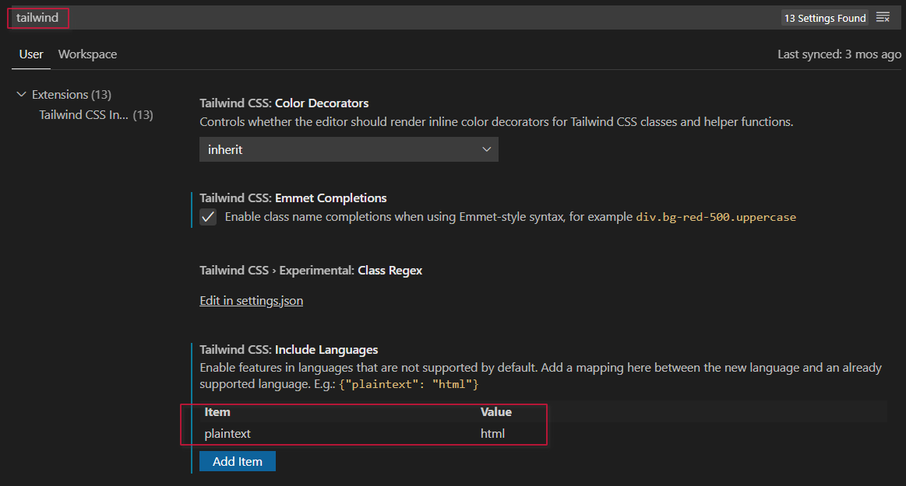
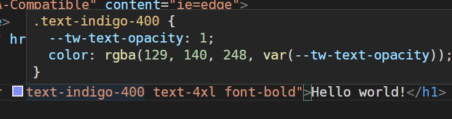
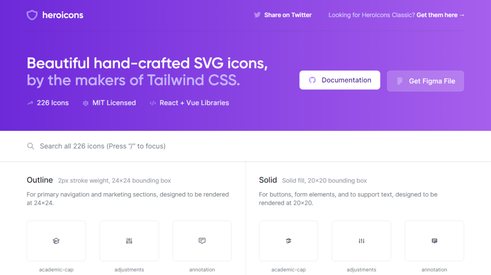
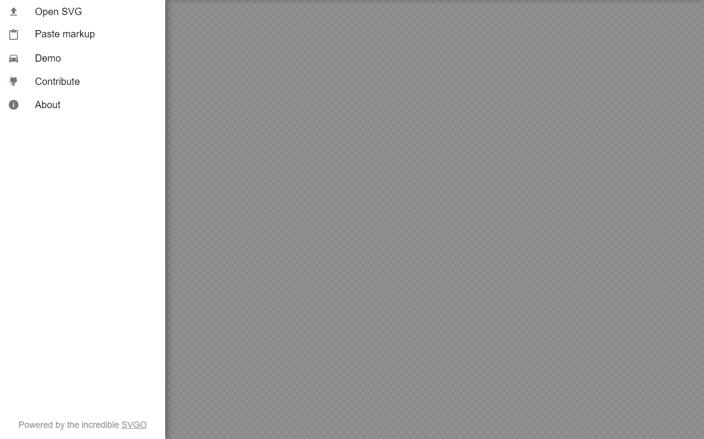
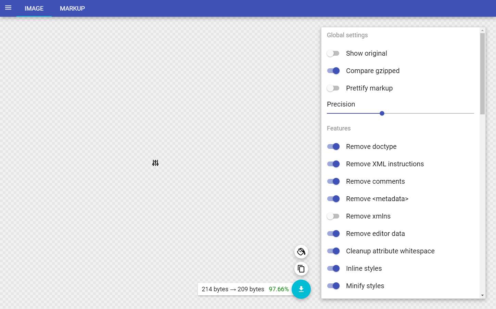
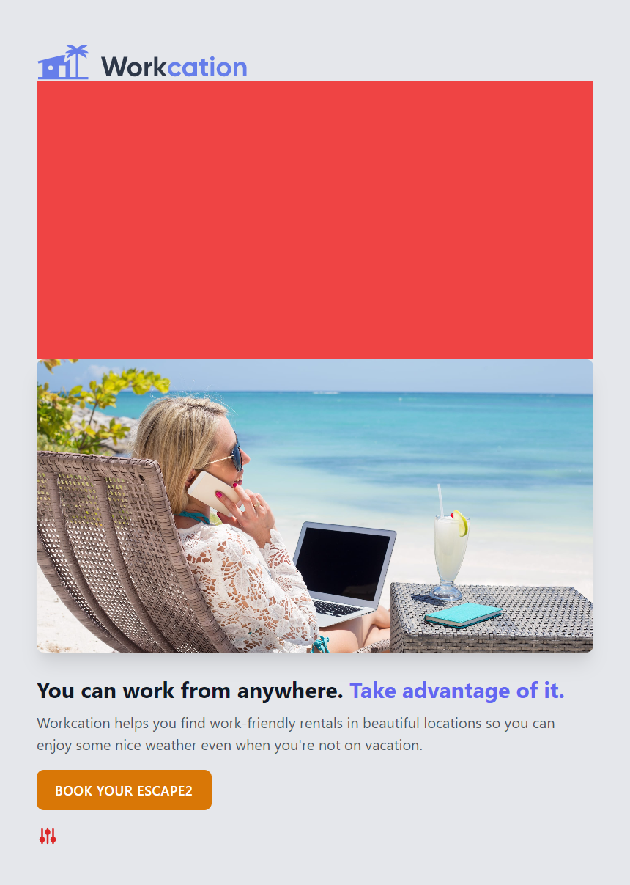

# Tailwind CSS


##  设置Tailwind 和PostCSS

1. 创建新的项目

```shell
mkdir my_tailwind_demo
cd my_tailwind_demo
npm init -y
```

> npm init -y 生成一个缺省的 **package.json** 文件,你可以按照自己的信息修改。

2. 安装tailwind以及相应的库

```shell
$ npm install tailwindcss postcss-cli autoprefixer
...

+ autoprefix@1.0.1
+ postcss-cli@8.3.1
+ tailwindcss@2.0.4
added 63 packages from 74 contributors and updated 2 packages in 26.639s

35 packages are looking for funding
  run `npm fund` for details
```

> 注意：包的名称为**tailwind*css*** 和 **autoprefix*er*** 本人也多次安装的 *tailwind*和*autoprefix*, 造成npx脚本无法执行

我们可以观察 **package.json**中的**devDependencies**属性

```json
{
  "name": "my_tailwind",
  "version": "1.0.0",
  "description": "",
  "main": "index.js",
  "scripts": {
    "test": "echo \"Error: no test specified\" && exit 1"
  },
  "keywords": [],
  "author": "",
  "license": "ISC",
  "dependencies": {
    "autoprefixer": "^10.2.5",
    "postcss-cli": "^8.3.1",
    "tailwindcss": "^2.0.4"
  }
}
```

3. 接着我们通过命令生成默认 **tailwind.config.js** 配置文件

```shell
npx tailwind init

   tailwindcss 2.0.4

   ✅ Created Tailwind config file: tailwind.config.js
```

默认的 tailwind.config.js 也是一个 ES6的模块

```javascript
module.exports = {
  purge: [],
  darkMode: false, // or 'media' or 'class'
  theme: {
    extend: {},
  },
  variants: {
    extend: {},
  },
  plugins: [],
}

```


我们稍后再去定义它

4. 接下来就是编写 PostCSS 配置文件,引用插件

```javascript
module.exports = {
  plugins: [
    require('tailwindcss'),
    require('autoprefixer'),
  ]
}
```

5. 对于 tailwindcss 它有着几种可选样式和扩展，我们可以引用 `base`、`components`以及`utilities`这三种常用样式和扩展

```css
@tailwind base;
@tailwind components;
@tailwind utilities;
```

> 之后可以通过PostCSS 编译所生成的样式观察,你可以通过注释后两行，编译之后只有很简单的五百多行的样式，而加载了组件后可以看到与响应式相关的样式，而全部加载则生成近19万行的样式

6. 到了初始项目设置的最后一步了，就是设置编译CSS的脚本，找到 `package.json`中**scripts**对象属性。

```json
"scripts": {
    "test": "echo \"Error: no test specified\" && exit 1",
    "build:postcss": "postcss css/tailwind.css -o public/build/tailwind.css"
  },
```

7. 运行命令最终生成我们所需要的样式

```shell
npm run build:postcss
```

8. 最后在你的页面中引用样式，下面我提供了一个纯静态的页面模板

```html
<html lang="en">
<head>
  <meta charset="UTF-8">
  <meta name="viewport" content="width=device-width, initial-scale=1.0">
  <meta http-equiv="X-UA-Compatible" content="ie=edge">
  <title>Document</title>
  <link rel="stylesheet" href="./build/tailwind.css">
</head>
<body>
  <h1 class="text-4xl font-bold text-center text-blue-500">Hello world!</h1>
</body>
</html>
```

为了更快捷的编辑，我们可以在 VsCode 中安装 **bradlc.vscode-tailwindcss** 插件。这样编辑时将事半功倍。

**File** -> **Preferences** -> **setting**



重启VsCode后生效




## 实用优先的工作流程


## 响应式布局


##  悬停和焦点的造型与变体

为了突显用户交互效果，`tailwind` 定义了**hover**鼠标悬停的交互响应样式

```html
<div>
<p class="mt-2 text-gray-600">
      Workcation helps you find work-friendly 
      rentals in beautiful locations so you can enjoy some nice weather even when you're not on vacation.
    </p>
    <div class="mt-4">
       <a href="#" class="inline-block px-5 py-3 rounded-lg
      text-white uppercase 
      bg-indigo-500
      sm:text-sm
      hover:bg-indigo-400
      active:bg-yellow-600
      md:active:bg-red-500
       md:tracking-wider font-semibold">Book your escape</a>
    </div>
</div>
```

> **hover** 也可以和响应式布局一同使用，语法为 **md:hover:bg-indigo-600**

除了 **hover** 以外还有 **focus** 、**active** 事件语法一样。

默认**tailwind** 没有对 **active** 事件和 **focus** 事件做响应，可以通过配置文件 *tailwind.config.js* 进行修改

```javascript
module.exports = {
  purge: [],
  darkMode: false, // or 'media' or 'class'
  theme: {
    extend: {},
  },
  variants: {
      backgroundColor: ['responsive', 'dark','hover', 'focus','active'],
  },
  plugins: [],
}
```

>上面的配置中的 **variants.entexd** 对象中定义


## @apply 指令简化页面中的样式代码

**tailwind** 定义了一个**@apply**指令如同 *SASS* 中的 **Mixin **一样可以定义复用型的样式。

首先在之前项目下的的 `css/tailwind.css`中添加自定义的样式

```scss
@tailwind base;
@tailwind components;


.btn {
  @apply inline-block px-5 py-3 rounded-lg
      text-white uppercase 
      bg-indigo-500
      sm:text-sm
      md:tracking-wider font-semibold;
}

.btn:hover {
  @apply bg-indigo-400;
}

.btn:focus{
  @apply outline-none shadow-xl;
}

.btn:active {
  @apply bg-indigo-600;
}

@screen sm{
  .btn {
    @apply bg-yellow-600;
  }
}

/*@media (min-width: 640px){
  .btn {
    @apply bg-yellow-600;
  }
}*/

@tailwind utilities;
```

>注意：**自定义样式要写在 `utilities` 之前**，`tailwind` 编译有一定的次序，后者覆盖前者，为了防止我们自定义的样式会与系统自有的样式冲突。

接下来需要重新编译，为了防止编译出错，建议开启 `watch`模式

```shell
$ npm run build:watch
```

最后在页面中就只需要我们自定义的样式即可

```html
<div class="mt-4">
     <!-- 以前格式的代码如下 //-->
      <!-- <a href="#" class="inline-block px-5 py-3 rounded-lg
      text-white uppercase 
      bg-indigo-500
      sm:text-sm
      hover:bg-indigo-400
      active:bg-yellow-600
      md:active:bg-red-500
       md:tracking-wider font-semibold">Book your escape</a> -->
    <!-- 简化以后的代码如下 //-->
       <a href="#" class="btn">Book your escape2</a>
    </div>
```


## 使用PurgeCSS删除未使用的样式

你可以通过下列命令生成完整的配置文件，其中就具有全部的变量，可以根据其格式添加自定义属性。

```shell
$ npx tailwind init tailwind.config.full.js --full

   tailwindcss 2.0.4

   ✅ Created Tailwind config file: tailwind.config.full.js

```

在其中涵盖几乎所有的样式，这样预处理编译后生成的 **build/tailwind.css** 将会巨大无比，内容近**19万**行的样式定义。这样的结果是很不利于门户级网站大当量PV的访问，为了减少服务器的压力，加快对客户端请求的响应，我们可以通过 [**purgeCSS**](https://www.purgecss.com) 工具对样式进行修剪，去除项目页面中尚未使用到的样式，这样浓缩的精华既可以保证样式的实现，又大大的减少文件的大小。

1. 首先使用 **npm** 安装 **purge-css**

```shell
$ npm install @fullhuman/postcss-purgecss
npm WARN my_tailwind@1.0.0 No description
npm WARN my_tailwind@1.0.0 No repository field.
npm WARN optional SKIPPING OPTIONAL DEPENDENCY: fsevents@2.3.2 (node_modules\fsevents):    
npm WARN notsup SKIPPING OPTIONAL DEPENDENCY: Unsupported platform for fsevents@2.3.2: wanted {"os":"darwin","arch":"any"} (current: {"os":"win32","arch":"x64"})

+ @fullhuman/postcss-purgecss@4.0.3
added 2 packages from 2 contributors and updated 2 packages in 4.439s

21 packages are looking for funding
  run `npm fund` for details
```

2. 接着需要在 postcss.config.js 中启用插件,关于选项配置请查看[purgecss官网文档](https://purgecss.com/configuration.html#options)

```javascript
module.exports = {
  plugins: [
    require('tailwindcss'),
    require('autoprefixer'),
    require('@fullhuman/postcss-purgecss')({
      content: [
        './src/**/*.vue',
        './public/*.html',

      ],
      // defaultExtractor: content => content.match(/[A-Za-z0-9-_:/]+/g) || []
      defaultExtractor: content => content.match(/[\w-/:]+(?<!:)/g) || []
    }),
  ]
}
```

3. 最后再次编译，然后检查一下新生成的 build/tailwind.css 将只有寥寥数百到一千行左右（根据你在项目中引用的样式多少决定）


## 使用SVG图标

SVG图标是一种网页图标新格式，它是通过表述画图标的路线源码方式展示给用户，在浏览器中按比例放大也不会有失真的现象，其文件格式相对保存为特定格式的图片比如PNG的数据大小更加小巧，在国外网站中被大量采用，也积累了大量的优秀的SVG资源。

为了让页面更加美观，tailwind 提供三种可以衔接的图标库，目前推荐给大家使用的为[heroicons](https://tailwindcss.com/resources) 

1. 首先去[官网](https://heroicons.com/)选择你所需要的图标,然后**COPY SVG**

   

   


代码如下，你可以直接将内容复制在HTML页面代码中。

```html
<svg xmlns="http://www.w3.org/2000/svg" class="h-6 w-6" fill="none" viewBox="0 0 24 24" stroke="currentColor">
  <path d="M12 14l9-5-9-5-9 5 9 5z" />
  <path d="M12 14l6.16-3.422a12.083 12.083 0 01.665 6.479A11.952 11.952 0 0012 20.055a11.952 11.952 0 00-6.824-2.998 12.078 12.078 0 01.665-6.479L12 14z" />
<path stroke-linecap="round" stroke-linejoin="round" stroke-width="2" d="M12 14l9-5-9-5-9 5 9 5zm0 0l6.16-3.422a12.083 12.083 0 01.665 6.479A11.952 11.952 0 0012 20.055a11.952 11.952 0 00-6.824-2.998 12.078 12.078 0 01.665-6.479L12 14zm-4 6v-7.5l4-2.222" />
</svg>
```

但是上面的代码是作为单独的SVG文件使用的全部格式，有很多冗余的信息。这里再推荐大家一个github资源

[svgomg](https://jakearchibald.github.io/svgomg/)




选择**Paste makeup** 将之前的SVG代码复制进去，就会出现下面的界面



你可以看到右侧个各种**Remove**,最终去掉各种无用的*metadata*信息的代码才是我们网页中直接复制进去使用的元素，你可以像``

标签元素一样的自由使用它。

```html
<svg xmlns="http://www.w3.org/2000/svg" class="h-6 w-6" fill="none" viewBox="0 0 24 24" stroke="currentColor">
    <path stroke-linecap="round" stroke-linejoin="round" stroke-width="2" d="M12 6V4m0 2a2 2 0 100 4m0-4a2 2 0 110 4m-6 8a2 2 0 100-4m0 4a2 2 0 110-4m0 4v2m0-6V4m6 6v10m6-2a2 2 0 100-4m0 4a2 2 0 110-4m0 4v2m0-6V4"/>
</svg>
```

如果你想修改图标的大小，heroicons 作为 tailwind 的扩展，自然遵循tailwind的样式，所以直接修改上面代码 **h-*6* w-*6*** 为 **h-*24* w-*24***, 你就看到了一个放大4倍的SVG图标

而至于修改图标颜色，则可以通过移除 **fill** 属性来修改它, 依旧采用 **fill-current** 辅以 **text-*xxxx*-*yyy*** 套用字体的颜色

```html
 <div class="mt-4" >
    <svg xmlns="http://www.w3.org/2000/svg" 
         class="h-6 w-6 fill-current text-red-600"  
         viewBox="0 0 24 24" stroke="currentColor">
      <path stroke-linecap="round" stroke-linejoin="round" stroke-width="2" d="M12 6V4m0 2a2 2 0 100 4m0-4a2 2 0 110 4m-6 8a2 2 0 100-4m0 4a2 2 0 110-4m0 4v2m0-6V4m6 6v10m6-2a2 2 0 100-4m0 4a2 2 0 110-4m0 4v2m0-6V4"/>
    /svg>
 </div>
```

> 注意： 如果你通过文档设置，SVG图标没有改变颜色，或者图标变得格外的大，那一定是你忘了重新生成一次 tailwind.css , 因为我们之前生成的样式做了特定的裁剪，新方案找不到你调用的样式则出现异常，切记切记。


##  剪裁和定位图片

在前端设计过程中处理的最多的还是图片，而图片又以格式、大小千奇百怪，如果套用一种模式就有可能出现图片宽高的拉升变形走样。比如下面的代码，高定义为 **h-16**，而宽选择**w-full** 即为100%容器的宽度，此时图片就产生了变形走样。

```html
 
```

tailwind 充分考虑到此类问题，它提供给我们几个 **object-** 样式。

* **object-*contain*** 此时将包含整个图片，而在周边留白

* **object-*cover*** 采用的覆盖模式，默认呈现的是图片细节的中心部分 **object-center**，周边就可能被遮盖。

  * object-**center**
  * object-**top**
  * object-**bottom**
  * object-**left**
  * object-**right**

  你可以根据上面给出的属性附加在 **object-cover** 从而体现出图片中某个方位的细节

```html

```


**另一种**实现的方法：

我们可以将图片**img** 元素换成了 div ，使用 div 的背景图做出上列中相同的效果，这样方便我们在弹性布局中更好的排版。

调用方法是将 **object-cover** 换成 **div** 的 ***bg*-cover** 属性，以此类推

```html
<div class="h-64 bg-cover bg-center rounded-lg shadow-xl" style="background-image: url('./img/beach-work.jpg');"></div>
	<!--    
      //-->
```


## 锁定图片的宽高比

对于div 元素设置inline样式 **padding-*bottom***或者**padding-top**，如果采用的百分比值，那么此值总是基于此元素的宽度，利用此技巧我们可以实现等宽比缩放的功能。

1. 为了更好的说明，让我们在图片前添加一个红色的 **div**

```html
<div style="padding-bottom: 50%;">
</div>   


```




上图可以看到红色部分基于宽度比

2. 接着把图片放入该 div 元素中, tailwind 提供了定义的样式 ***pb-*1/2** ，等同于 padding-bottom

   ```html
   <div class="bg-red-500 pb-1/2" >
       
         
   </div>
   ```

   > 为什么没有生效了？因为这只是你一厢情愿而已，1/2这种计量单位需要在 tailwind 中扩展
   >
   > 参考我们之前生成的tailwind.full.config.js 中,参考格式添加theme.extend.spacing对象新的属性

```javascript
   module.exports = {
     purge: [],
     darkMode: false, // or 'media' or 'class'
     theme: {
       extend: {
         spacing: {
           "1/4" : "25%",
           "1/3": "33.3%",
           "1/2": "50%",
         }
       },
     },
     variants: {
         backgroundColor: ['responsive', 'dark','hover', 'focus','active'],
     },
     plugins: [],
   }
```

   只有这样我们就可以使用自己习惯的样式扩展了。

3. 最后就是将 img 基于 div 的相对论的调整了, 设置图片是基于父级元素 div ，顶端对齐。

```html
 <div class="bg-red-500 pb-1/2 relative rounded-lg shadow-xl ">
    
      
    </div>
```

> 注意：以上调整完毕后，把图片的高度和宽度都设置为 ***h*-full *w*-full** ， 那么就是按照 **div** 缩放变形了，而 div 设置了 padding-bottom或者 padding-top 属性，它本身的高度就是基于宽度等比缩放的，因而影响到其中的子元素，所以我们的图片也就是等比缩放了。 
>
> 如果你的圆角没有出现，再给父级元素 div 添加一个 **overflow-hidden** 超出的部分隐藏属性就完美了


最后出炉的代码：

```html
<div class="pb-1/2 relative rounded-lg shadow-xl overflow-hidden">
    
      
    </div>
```


##  阴影和图层


## 使用Flexbox创建导航条


## 英文释义

* 填充地位类

  **m** ： marge

  **p**： padding

* 方向类

  **t**: 	top

  **r**:	right

  **b**:	buttom

  **l**:	left

  **y**	垂直方向 Y 轴

  **x**:  水平方向 X 轴

* 颜色深浅 从100 - 900

* 常用颜色

  * red
  * gray
  * indigo
  * teal

* 颜色作用在

  * **bg**： background
  * **text**:  text 

* 大小尺寸

  * **h**： height
  * **w**： width
  * **xs**： super small
  * **sm**： small   相当于 *@media (min-width: 640px)* 
  * **md**： medium 相当于 *@media (min-width: 768px)*
  * **lg**： large 相当于*@media (min-width: 1024px)*
  * **xl**： super large *@media (min-width: 1280px)*
  * **2xl**     *@media (min-width: 1536px)*

* 装饰类

  * **rounded**： 圆角效果
  * **shadow**： 阴影

* 排版布局类

  * **center**
  * **left**
  * **right**
  * **space**： space-between 空隙

* 弹性布局

  * **flex-shrink-0** 当父级是flex容器时，我们要确保图像不会缩小，因此我们添加了它 **md**:*flex-shrink-0* 以防止在中型屏幕或更大尺寸的屏幕上缩小。

* 动作响应类

  * **hover** 
  * **active**
  * 


## 与设备终端相关

相同的页面程序为了迎合市场各种电子设备的分辨率大小，可以通过自适应式样式来做适配

在对某种分辨率范畴的样式，可以通过"设备大小:样式"冒号衔接

范例

```html
<div class="py-8 px-8 max-w-sm mx-auto bg-white rounded-xl shadow-md space-y-2 sm:py-4 sm:flex sm:items-center sm:space-y-0 sm:space-x-6">
  
  <div class="text-center space-y-2 sm:text-left">
    <div class="space-y-0.5">
      <p class="text-lg text-black font-semibold">
        Erin Lindford
      </p>
      <p class="text-gray-500 font-medium">
        Product Engineer
      </p>
    </div>
    <button class="px-4 py-1 text-sm text-purple-600 font-semibold rounded-full border border-purple-200 hover:text-white hover:bg-purple-600 hover:border-transparent focus:outline-none focus:ring-2 focus:ring-purple-600 focus:ring-offset-2">Message</button>
  </div>
</div>
```

上面的例子中第二行代码缺省设置为水平方面自动定位  *mx-auto*， 但同时又设置了  *sm:mx-0*, 当使用低分分辨率的设备查看图片时，水平方向对其边框


## purge 修剪不必要的样式

首先要通过 npm 安装 postcss-purgecss

```shell
npm i -D @fullhuman/postcss-purgecss postcss
```


> 注意：如果遇到以下的问题，也是因为 `tailwind CSS`与`vuetify`共存的问题，我们只能用较低的版本 PostCSS 7
>
> postcss css/tailwind.css -o public/build/tailwind.css     
>
> Error: PostCSS plugin postcss-purgecss requires PostCSS 8.
> Migration guide for end-users:
> https://github.com/postcss/postcss/wiki/PostCSS-8-for-end-users
>
> 目前的最新版 4.0+ 只能支持PostCSS >= 8 的版本，解决方法
>
> 

```shell
# 安装 postcss7 较低的版本
npm install tailwindcss@npm:@tailwindcss/postcss7-compat postcss@^7 autoprefixer@^9
# 安装postcss-purgecss 3.0 也是较低版本，兼容 postcss7
npm i -D @fullhuman/postcss-purgecss@3.0.0
```

而启用 PurgeCSS 需要对 PostCSS做响应的配置

postcss.config.js

```javascript
const purgecss = require('@fullhuman/postcss-purgecss')
postcss([
  purgecss({
    content: ['./src/**/*.html']
  })
])
```

由于提取的机制过于呆板，我们可以自定义正则表达式来进行，下面配置是添加了**defaultExtractor**之后的配置

```javascript
module.exports = {
  plugins: [
    require('tailwindcss'),
    require('autoprefixer'),
    require('@fullhuman/postcss-purgecss')({
      content: [
        './src/**/*.vue',
        './public/index.html',
      ],
      defaultExtractor: content => content.match(/[A-Za-z0-9-_:/]+/g) || []
    }),
  ]
}
```


## 常用的设计

​	*rounded-full* ： 相当于border-radius: 9999px; 一般用于裁剪一张图片成圆形，显示人头像

​	*overflow-hidden*

​	*font-semibold*

​	*items-center*

​	*tracking*   *-wide*  *-wider* *-widest*   *-tight*   *-tighter*  *-tightest*: 字母之间的间距的紧凑性

​	*leading*   -tight  -snug： 行间距

​	*truncate*

​	*fill-current* : 用于SVG图标填色，一般和 `text-xxx-yyy`结合使用，使用文本的颜色来填充SVG图标

​	*flex items-center*： 常用于弹性盒子中元素居水平线上下中心对齐

​	*flex items-end*

​	*flex items-baseline*

​	*h-32 w-full object-contain*  ＋ *object-cover*  + *object-center* *-top* *-buttom* *-left* *-right*

​	*bg-cover bg-center*

## 其他资源

[svgomg](https://jakearchibald.github.io/svgomg/)