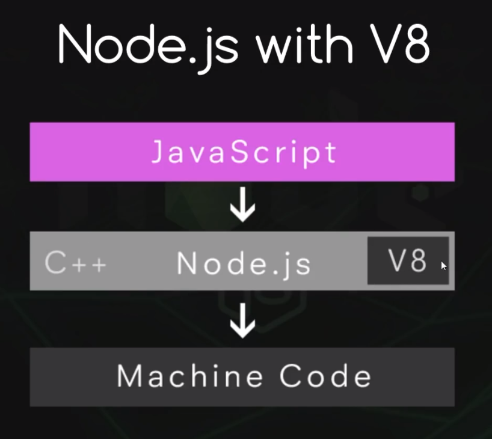

# Webpack 与 NodeJS


## NodeJS入门

NodeJS是一种建立在 Chrome V8引擎的Javascript运行环境。它使用事件驱动，非阻塞模式让其轻量化和高效。NodeJS还支持巨量的开源的包通过 npm 命令管理。

除此外，它还具有以下优点：

* 可以运行在客户端和服务器平台
* 读取，删除以及更新文件
* 非常简单就可以和数据库通信交互

它为什么如此普及？

* 它使用 Javascript 作为编程语言
* 非常快（v8引擎和非阻塞式代码）
* 总多的开源扩展库
* 可以建立实时的服务比如聊天室


### 安装NodeJS

NodeJS 支持常见各种操作系统平台，因此你需要下载对应版本的 NodeJS，[详细下载请浏览官方网站](https://nodejs.org/en/download/) ，这里就不做Windows 开发环境软件安装过程演示了。

安装之后请检查一下 nodeJS 是否能够正常工作

首先检查一下 nodeJS 版本

```shell
C:\Users\yangwawa
λ node -v
v12.18.3
```

接着编写一个最为简单的 Javascript 脚本 **app.js**

```javascript
console.log('Hello world!')
```

然后直接使用 node 命令附加 app.js

```shell
$ node app
Hello world!
```


### chrome V8 引擎

计算机并不懂 Javascript，Javascript 引擎负责将人工编写的代码转成机器码

* nodeJS 本身是由 C++ 语言开发的
* 其核心就是 V8引擎
* V8 引擎负责转换代码成机器码，更多请浏览[google V8介绍](https://developers.google.com/v8/)

\\


### 全局对象

详情请查看[官方文档](https://nodejs.org/api/globals.html)

* __dirname 本程序所处的目录
* __filename 本程序的文件名
* console 控制台调试
* exports 导出
* module  模块的定义
* require()  引用模块
* setInterval(callback, delay,[, ...args])  周而复始定时器
* setTimeout(callback, delay,[, ...args]) 一次性定时器

范例 app.js

```javascript
let time = 0;

let time = 0;

var timer = setInterval(function () {
  time += 2
  if (time > 10) clearInterval(timer)
  console.log(time + ' seconds has passed. ')
} , 2000)
```


### 函数表达式

常见函数编写都有关键字 function 加上函数名附带传递的参数，比如

```javascript
function sayHi() {
  console.log('Hi!')
}

sayHi()
```

这是最简单的函数形态，javascript 还支持其他的函数无法格式，比如匿名函数

```javascript
var sayBye = function () {
  console.log('Bye!')
}

sayBye()
```


### 模块和引用模块

复杂的代码可以将Javascript 程序写成一个一个的文件也称呼为模块。其他程序可以调用它，也称呼为引用。

首先范例中 count.js 内容如下

```javascript
var counter = function(arr){
    return 'There are ' + arr.length + ' elements in the array.' 
}

```

如何让我们编写 app.js 引用了？我们可以通过 require() 函数来实现

```javascript
require('./count');

console.log(counter(['shaun', 'ken', 'ryu']))
```

> 注意：默认引用的为 javascript 脚本，因而不需要附带后缀。

但我们运行代码时,却出现 ReferenceError 报错，counter 没有定义

```shell
E:\ProjectResources\webpack\nodejs-demo>node app
E:\ProjectResources\webpack\nodejs-demo\app.js:30
console.log(counter(['ken', 'yang', 'ryu']));
        ^

ReferenceError: counter is not defined
    at Object.<anonymous> (E:\ProjectResources\webpack\nodejs-demo\app.js:30:9)
    at Module._compile (internal/modules/cjs/loader.js:1137:30)
    at Object.Module._extensions..js (internal/modules/cjs/loader.js:1157:10)
    at Module.load (internal/modules/cjs/loader.js:985:32)
    at Function.Module._load (internal/modules/cjs/loader.js:878:14)
    at Function.executeUserEntryPoint [as runMain] (internal/modules/run_main.js:71:12)
    at internal/main/run_main_module.js:17:47
```

原因在于，nodeJS模块的编写不仅仅是功能函数，还需要模块语法，也就是你需要使用 **module.exports** 将函数或者变量曝露出来，这样其他程序才可以调用，如果没有导出的函数或变量都认定**为私有**。

让我们将 count.js 修正下

```javascript
var counter = function(arr){
    return 'There are ' + arr.length + ' elements in the array.' 
}

module.exports = counter
```

既然导出的时候我们赋予的是单个`counter`函数, 那么引用此模块程序也只能得到单个函数。我们再将 app.js 修改下

```javascript
var counter = require('./count');

console.log(counter(['ken', 'yang', 'ryu']));
```

如果模块中有着**多个函数或者变量**都要导出怎么处理了？

下面我们编写一个 stuff.js 的模块实现：

```javascript
var counter = function (arr) {
  return 'There are ' + arr.length + ' elements in the array.'
}

var adder = function (a, b) {
  return `The sum of the 2 numbers is ${ a + b}.`
}

var pi = 3.14;

module.exports.counter = counter
module.exports.adder = adder
module.exports.pi = pi
```

由上面的代码，我们将 **module.exports** 对象进行扩展，第11,12,13行显示。

同样也可以写成在函数或变量定义时就决定是否导出,

```javascript
module.exports.counter = function (arr) {
  return 'There are ' + arr.length + ' elements in the array.'
}

module.exports.adder = function (a, b) {
  return `The sum of the 2 numbers is ${ a + b}.`
}

module.exports.pi = 3.14;
```

> 注意：不推荐以上的这种方法，因为函数不能在模块中的其他函数互相调用。


由于此时导出的 **module.exports** 不是单个函数，而是**一整个对象**，我们在调用的代码中也要修改

```javascript
var stuff = require('./stuff');

console.log(stuff.counter(['ken', 'yang', 'ryu']));

console.log(stuff.adder(10, 99));
```

> 注意：对比之前的调用代码，我们将整个模块导入后得到的可以看待成一个包（库、模块），打开包取对应的函数。因而在函数前添加了从哪个包（库、模块）名。

在模块导出对应函数和变量时，另外一种写法

```javascript
module.exports = {
    counter : counter,
    adder: adder,
    pi: pi,
}
```

为了代码的简化，ES2015语法中，对象中属性和变量的名字一致时可以偷懒做一个简写

```javascript
module.exports = {
    counter,
    adder,
    pi,
}
```

同时 ES2015 也提供给我们一个对象中提取工具，当我们导入模块时，不需要所有的函数，可以用大括号提值表达式：

```javascript
// var stuff = require('./stuff');
var {  counter } = require('./stuff');
// console.log(stuff.counter(['ken', 'yang', 'ryu']));

console.log(counter(['ken', 'yang', 'ryu']));
// console.log(stuff.adder(10, 99));
```

> 注意：**{ *counter* }** 只从引用的模块中取我们所需要的一个 ***counter*** 函数。弱水三千只取一瓢。


### 事件模块

首先引入**events**模块

```javascript
var events = requrie('events');
```

接着新建一个 EventEmitter 对象

```javascript
var myEmiter = new events.EventEmitter();
```

这样就可以定义 on 事件,以及如何处理事件的回调函数，回调函数同样可以接受参数

```javascript
myEmiiter.on('someEvent',function(mssg){
    console.log(mssg);
})
```

> 注意：事件的名字不拘一格

最后是如何触发事件了

```javascript
myEmitter.emit('someEvent'，'some message pass to callback function of event.')
```

全部代码如下：

```javascript
var events = require('events');
var myEmitter = new events.EventEmitter()

myEmitter.on('someEvent', function (mssg) {
  console.log('received the message:')
  console.log(mssg)
});

setTimeout(function () {
  myEmitter.emit('someEvent', 'some message pass to callback function of event.')
},3000);
```


#### 自定义对象实现事件处理

很多情况下我们需要自定义对象同样具有着事件。这可以通过 **util** 包来实现，它提供了对象继承的功能函数。

下面的范例我们定义了一个人的类函数，让其具有着 **speak** 事件

```javascript
var Person = function(name){
    this.name = name
}
```

首先还是引入 所需要的包

```javascript
var util = require('util');

```

接着就是定义继承关系, **inherits** 的第一个参数是我们定义的对象最为子类，第二个参数就是具有事件处理的 **EventEmitter** 最为父类

```javascript
util.inherits(Person,events.EventEmitter);
```

最后让我们来看看一段完整实现的代码：

```javascript
var events = require('events');
var myEmitter = new events.EventEmitter()

myEmitter.on('someEvent', function (mssg) {
  console.log('received the message:')
  console.log(mssg)
});

setTimeout(function () {
  myEmitter.emit('someEvent', 'some message pass to callback function of event.')
}, 3000)


var Person = function (name) {
  this.name = name
}

var util = require('util');

util.inherits(Person, events.EventEmitter);

var james = new Person('James');
var mary = new Person('Mary');
var ryu = new Person('Ryu');

var people = [james, mary, ryu]
people.forEach(function (person) {
  person.on('speak', function (mssg) {
    console.log(person.name + ' said: ' + mssg)
  })
})

james.emit('speak', 'Hey! Mary! I am James')
mary.emit('speak', 'Nice to meet you! I am Mary')
```

> 注意: 上面的程序运行时，会先出现 James 和 Mary 打招呼的信息，三秒之后才出现定时器的信息，这是因为 nodeJS 代码运行是无阻塞的


到此为止，我们介绍给大家简单的 NodeJS 应用，由于它的商用开源模块数千万计，篇幅原因，大家可以慢慢摸索。 


-------

## Webpack 使用指南

为什么前端项目要使用webpack ？

如下图， 

* Webpack 可以将我们项目的多个资源打包成一个压缩资源，更利于响应网络请求的传输，另一面也较好的保护代码不利于分析抄袭
* 如果在javascript 脚本中引入其他模块，打包过程会自动解决依赖关系
* 可以配合其他预处理加载器，比如 **SCSS-loader**，一起使用。可以实验样式加载
* **JSX** 以及 **ES2015** 语法，将你编写的 javascript 代码转码成浏览器更容易理解的 **vanilla JS**


.png)


### 起步

下面是一个模板，我们可以实现 Javascript 的打包

```html
<!DOCTYPE html>
<html>
  <head>
    <meta charset="utf-8">
    <title>Webpack</title>
  </head>
  <body>
    <div id="body-content"></div>

    <!-- scripts -->
    <script src="mysite.com/script-1.js"></script>
    <script src="mysite.com/script-2.js"></script>
    <script src="mysite.com/script-3.js"></script>
    <script src="mysite.com/script-4.js"></script>
    <script src="mysite.com/script-5.js"></script>

  </body>
</html>
```


webpack 用于编译 JavaScript 模块。一旦完成 [安装](https://webpack.docschina.org/guides/installation)，你就可以通过 webpack [CLI](https://webpack.docschina.org/api/cli) 或 [API](https://webpack.docschina.org/api/node) 与其配合交互。如果你还不熟悉 webpack，请阅读 [核心概念](https://webpack.docschina.org/concepts) 和 [对比](https://webpack.docschina.org/comparison)，了解为什么要使用 webpack，而不是社区中的其他工具。

> Warning
>
> 运行 webpack 5 的 Node.js 最低版本是 10.13.0 (LTS)。


### 基本安装

首先我们创建一个目录，初始化 npm，然后 [在本地安装 webpack](https://webpack.docschina.org/guides/installation#local-installation)，接着安装 [`webpack-cli`](https://github.com/webpack/webpack-cli)（此工具用于在命令行中运行 webpack）：

```bash
mkdir webpack-demo
cd webpack-demo
npm init -y
npm install webpack webpack-cli --save-dev
```

> 提示： webpack-cli 为命令行工具建议安装，之后会使用到
>
> --save-dev 代表保存到项目的开发依赖关系中，详见下面 **devDependencies** 属性，之后打包工程会将依赖关系一并打包。

这将生成了一个项目专用的 **package.json** 文件,内容如下，它描述着与项目相关的版本信息，以及定义了调试脚本所需的指令

```json
{
  "name": "webpack-playlist",
  "version": "1.0.0",
  "description": "",
  "main": "index.js",
  "scripts": {
    "test": "echo \"Error: no test specified\" && exit 1"
  },
  "repository": {
    "type": "git",
    "url": "git+https://github.com/iamshaunjp/webpack-playlist.git"
  },
  "keywords": [],
  "author": "",
  "license": "ISC",
  "bugs": {
    "url": "https://github.com/iamshaunjp/webpack-playlist/issues"
  },
  "homepage": "https://github.com/iamshaunjp/webpack-playlist#readme",
  "devDependencies": {
    "webpack": "^5.31.2",
    "webpack-cli": "^4.6.0"
  }
}
```

> 注意：**main** 属性最为重要，它是整个项目的切入点


现在，我们将创建以下目录结构、文件和内容：

**project**

```shell
  webpack-demo
  |- node_modules
  |- package.json
+ |- index.html
+ |- /src
+   |- index.js
```

> 注意：项目一旦创建，会将很多的 javascript 开发基本库


### 创建一个 bundle

首先，我们稍微调整下目录结构，创建分发代码(`./dist`)文件夹用于存放分发代码，源代码(`./src`)文件夹仍存放源代码。源代码是指用于书写和编辑的代码。分发代码是指在构建过程中，经过最小化和优化后产生的输出结果，最终将在浏览器中加载。调整后目录结构如下：

**project**

```shell
  webpack-demo
  |- package.json
+ |- /dist
+   |- index.html
- |- index.html
  |- /src
    |- element.js
    |- script-1.js
    |- script-2.js
```

> Tip
>
> 你可能会发现，尽管 `index.html` 目前放在 `dist` 目录下，但它是手动创建的。在本指南接下来的章节中，我们会教你如何生成 `index.html` 而非手动编辑它。如此做，便可安全地清空 `dist` 目录并重新生成目录中的所有文件。


### 范例说明

下面我们的范例将实现以下脚本引入逻辑，最终将其打包为一个名为 dist/bundle.js 文件

script-1.js --> script-2.js

​                 |--> element.js   ---> lodash


**src/script-1.js** 这将是我们程序的**切入点**

```javascript
// var message = "Hello world";

var  message  = require('./script-2');
console.log(message)
alert(message);

const { drawDiv } = require('./element')
drawDiv()
```

> 注意： require 语法引用其他模块时省略掉文件`.js`后缀

**src/script-2.js**

```javascript
// var message = "Hello world";

module.exports = "Hello world!!!!";
```

**src/element.js**

```javascript
require('lodash');

function component() {
  const element = document.createElement('div');
  
  element.innerHTML = _.join(['hello', 'webpack'], ' ');
  element.style.backgroundColor = 'red';
  return element
}


function drawDiv() {
  const element = component();
  document.body.appendChild(element);
}

module.exports = {
  drawDiv
}
```

> 要在 element.js` 中打包 `lodash` 依赖，我们需要在本地安装 library：

```bash
npm install --save lodash
```

### webpack.config.js 配置

为了打包这些Javascript脚本到一个文件，我们需要配置下 webpack。

在你的项目目录下生成一个 **webpack.config.js** 文件

```javascript
const { resolve } = require("path");

const dev = Boolean(process.env.WEBPACK_SERVE)

module.exports = {

  // set mode to development or production
  mode:  dev ? 'development': 'production',
  
  // define the entry point
  entry: './src/script-1.js',

  // define the output file
  output: {
    path: resolve(__dirname, 'dist'),
    filename: 'bundle.js'
  }
}
```

### 生成 bundle.js

有了配置文件，我们直接运行 **webpack** 命令就可以看到文件的生成

```shell
$ webpack

asset bundle.js 69.5 KiB [emitted] [compared for emit] [minimized] (name: main) 1 related asset
runtime modules 344 bytes 2 modules
cacheable modules 532 KiB
  ./src/script-1.js 167 bytes [built] [code generated]
  ./src/script-2.js 74 bytes [built] [code generated]
  ./src/element.js 357 bytes [built] [code generated]
  ./node_modules/lodash/lodash.js 531 KiB [built] [code generated]
webpack 5.25.0 compiled successfully in 4334 ms
```


### 引用 bundle.js

最后在页面中我们只需要引用最终打包的 javascript 脚本即可。

**dist/index.html**

```html
<!DOCTYPE html>
<html>
  <head>
    <meta charset="utf-8">
    <title>Webpack</title>
  </head>
  <body>
    <div id="body-content"></div>
    <script src="./dist/bundle.js"></script>
  </body>
</html>
```


### 模块

[ES2015](https://babeljs.io/learn-es2015/) 中的 [`import`](https://developer.mozilla.org/en-US/docs/Web/JavaScript/Reference/Statements/import) 和 [`export`](https://developer.mozilla.org/en-US/docs/Web/JavaScript/Reference/Statements/export) 语句已经被标准化。虽然大多数浏览器还无法支持它们，但是 webpack 却能够提供开箱即用般的支持。

事实上，webpack 在幕后会将代码 “**转译**”，以便旧版本浏览器可以执行。如果你检查 `dist/main.js`，你可以看到 webpack 具体如何实现，这是独创精巧的设计！除了 `import` 和 `export`，webpack 还能够很好地支持多种其他模块语法，更多信息请查看 [模块 API](https://webpack.docschina.org/api/module-methods)。

注意，webpack 不会更改代码中除 `import` 和 `export` 语句以外的部分。如果你在使用其它 [ES2015 特性](http://es6-features.org/)，请确保你在 webpack [loader 系统](https://webpack.docschina.org/concepts/loaders/) 中使用了一个像是 [Babel](https://babel.docschina.org/) 或 [Bublé](https://buble.surge.sh/guide/) 的 [transpiler(转译器)](https://webpack.docschina.org/loaders/#transpiling)。

```shell
npm install babel-core babel-loader babel-preset-es2015 --save-dev
```

> 注意： 因为版本的变化，现在Babel7 的 babel-preset-es2015 已经替换成了[babel-preset-env](https://babeljs.io/docs/en/env/)
>
> 而babel-loader也演变成 babel-loader@7

```shell
npm install babel-core babel-loader@7 babel-preset-env --save-dev
```


请在webpack.config.js 中添加一个module 对象，它将定义了 webpack 中模块的掉用规则。

```javascript
module: {
    rules: [
      {
        test: /\.js$/,
        exclude: /(node_modules)/,
        use: {
        	loader: 'babel-loader',
        	options: {
          		presets: ['env']
        	}
        }
      }
    ]
  }
```

> 注意：目前使用的webpack版本为5，请去官方网站获取 [最新配置](https://webpack.js.org/configuration/)

当再次使用 **webpack** 打包的时候，查看 **bundle.js** 中的代码，你会发现原来 **ES2015** 语法中的 **const** 转换成了 var 


### 使用 CSS-loader

使用 CSS-loader 可以加载我们的应用程序中仅仅需要用到的样式，另外可以模块化管理CSS样式

有两种不同的 loader

* **css-loader** : 它将CSS加载到我们 Javascript 文件中
* **style-loader**：它将加载到我们设计的DOM元素上


#### 安装 CSS loader

如果在使用 css-loader 之前，我们编写的网页内容

```html
<!DOCTYPE html>
<html>
  <head>
    <meta charset="utf-8">
    <title>Webpack</title>
  </head>
  <body>
    <div id="body-content">
      <div class="intro-component">
        <h1>CSS loader</h1>
      </div>
    </div>
    <script src="./dist/bundle.js"></script>
  </body>
</html>
```

> 上述代码调用到一个 intro-component 样式，但在网页中并没有任何定义任何的样式

接着，编写我们的 src/css/intro-component.css 如下:

```css
.intro-component {
  font-family: Arial, Helvetica, sans-serif;
  background-color: maroon;
  color: #fff;
  padding: 20px;
}
```

之后在我们的 javascript 代码导入到此样式文件,如下代码的第四行

```javascript
// var message = "Hello world";

var message = require('./script-2');
require('./css/intro-component.css');
console.log(message)
// alert(message);

const { drawDiv } = require('./element')
drawDiv()
```

此时通过 **webpack** 命令打包将**报错**，虽然你安装了 **style-loader** 和 **css-loader** , 但并没有在规则中设定条件匹配编译它。

要想将我们的样式引入到 **javascript** 中，我们还需要配置 **webpack.config.js** 文件。

在模块module.rules列表中添加新的对象，针对 .css 文件后缀的使用 loader, 详情请参考[style-loader官方配置](https://webpack.js.org/loaders/style-loader/)

```javascript
module:{
	rules: [
		{
        	test: /\.css$/,
        	use: ['style-loader','css-loader'],
		}
	]
}
```


再次通过 **webpack** 命令打包后，CSS样式会通过 **`<style> `**形式注入到网页中，这一点通过客户端浏览器查看源代码看不到，但是可以通过浏览器调试工具 **inspect element** 查看到。


### SASS loader

SASS一种近乎编程式的CSS样式。由于其复用性高，快速成为了前端设计人员必备技能之一。

让我们将 src/css/intro-component.css 改为 intro-component.sass 文件

```scss
$mainColor: #7777bb

.intro-component {
  font-family: Arial, Helvetica, sans-serif;
  background-color: $mainColor;
  color: #fff;
  padding: 20px;
  
  h1 {
  	text-transform: uppercase;
  }
}
```

接着让我们配置编译时的 **webpack.config.js** 配置文件,  添加新的 module.rules列表下的对象，对.sass或者 .scss后缀的文件**依次的**采用loader预处理

```javascript
moudle: {
	rules:[ 
	  {
        test: /\.s[ac]ss$/i,
        use: [
          // Creates `style` nodes from JS strings
          "style-loader",
          // Translates CSS into CommonJS
          "css-loader",
          // Compiles Sass to CSS
          "sass-loader",
        ],
      }
	]
}
```

> 注意：**use** 列表中各种 loader 加载的次序，之所以分成多行编写，是因为它采用堆栈式的加载，首先 **sass-loader** 是将`sass` 格式的样式转换成标准 `css`格式，然后轮到 **css-loader** 将 CSS 转换成 **CommonJS**，最后才是 style-loader 将 **CommonJS 中的字符串**变成 **DOM** 元素的 `**<sytle>**` 注入到页面中。这个书写次序是**由后往前，或者由下至上的**。
>
> 详情请参考官方webpack [SASS-loader](https://webpack.js.org/loaders/sass-loader/)

同样，最后是运行 webpack 再次打包测试环节。


### npm scripts

考虑到用 CLI 这种方式来运行本地的 webpack 副本并不是特别方便，我们可以设置一个快捷方式。调整 *package.json* 文件，添加一个 [npm script](https://docs.npmjs.com/misc/scripts)：

**package.json**

```json
 {
   "name": "webpack-demo",
   "version": "1.0.0",
   "description": "",
   "private": true,
   "scripts": {
   "test": "echo \"Error: no test specified\" && exit 1"
   "build": "webpack"
   },
   "keywords": [],
   "author": "",
   "license": "ISC",
   "devDependencies": {
     "webpack": "^5.4.0",
     "webpack-cli": "^4.2.0"
   },
   "dependencies": {
     "lodash": "^4.17.20"
   }
 }
```

现在，可以使用 `npm run build` 命令，来替代我们之前使用的 `npx` 命令。注意，使用 npm `scripts`，我们可以像使用 `npx` 那样通过模块名引用本地安装的 npm packages。这是大多数基于 npm 的项目遵循的标准，因为它允许所有贡献者使用同一组通用脚本。

现在运行以下命令，然后看看你的脚本别名是否正常运行：

```bash
$ npm run build

...

[webpack-cli] Compilation finished
asset main.js 69.3 KiB [compared for emit] [minimized] (name: main) 1 related asset
runtime modules 1000 bytes 5 modules
cacheable modules 530 KiB
  ./src/index.js 257 bytes [built] [code generated]
  ./node_modules/lodash/lodash.js 530 KiB [built] [code generated]
webpack 5.4.0 compiled successfully in 1940 ms
```

> Tip
>
> 可以通过在 `npm run build` 命令与参数之间添加两个连接符的方式向 webpack 传递自定义参数，例如：`npm run build -- --color`。


### 结论

现在，你已经有了一个基础构建配置，你甚至可以将 HTML 页面也做loader 处理，请参考[官方 webpack 下的各种 loader](https://webpack.js.org/loaders/)。 这篇webpack涉及的为基础知识，如果想深入了解更多的 webpack功能移至下一章节 [`资源管理`](https://webpack.docschina.org/guides/asset-management) 指南，以了解如何通过 webpack 来管理资源，例如 images、fonts。此刻你的项目看起来应该如下：

**project**

```diff
webpack-demo
|- package.json
|- webpack.config.js
|- /dist
  |- main.js
  |- index.html
|- /src
  |- index.js
|- /node_modules
```

###### Tip

如果你使用的是 npm 5+，你可能还会在目录中看到一个 `package-lock.json` 文件。

###### Warning

不要使用 webpack 编译不可信的代码。它可能会在你的计算机，远程服务器或者在你 web 应用程序使用者的浏览器中执行恶意代码。

如果想要了解 webpack 设计思想，你应该看下 [基本概念](https://webpack.docschina.org/concepts) 和 [配置](https://webpack.docschina.org/configuration) 页面。此外，[API](https://webpack.docschina.org/api) 章节可以深入了解 webpack 提供的各种接口。


### 附录

在使用 webpack.config.js 中有一些额外的配置属性值，对调试代码有着辅助作用，特此推荐给大家

* **optimization** 对象中的 minimize 属性，如果将其设置为 false ，那么打包后的 bundle 文件可读性高，没有对其所有的空格做去除，代码显示一行一行常规模式。 

```javascript
{
 optimization: {
 	 minimize: false,
 }
}
```

* **devtool** 对接浏览器 develop tools，此属性可以生成source map 文件，便于开发工程中调试，而在生成环境中建议关闭。

```javascript
{
    devtool: 'source-map'
}
```

这样生成的 bundle.js 文件的最后会添加 `//# sourceMappingURL=bundle.js.map`, 而当你要调试出错的代码时，浏览器会再次请求服务端的源程序格式。

